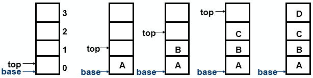
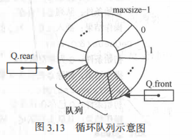

栈与队列 
---------

[toc]

### 为什么要有栈和队列？

我们知道栈和队列其实都是线性表的一种。

可视为什么栈和队列需要单独的提出来，并且加以命名？？？？？？？？？？

命名的作用是：方便记忆讨论和传播。

为什么是如此的重要，以至于这中存储结构要被单独命名。

重要是因为生活中常见，而计算机至少是用来存取数据的。

通常我们对数据的存储都是由所边界的。

我们通常说，这里一堆书，一堆人，一堆垃圾，一行字。

书一堆如果是有序的放在座子上，通常最方便拿到的是第一本，离边界最远的。

人一堆如果说是在火车进站口，我们通常看到的是有序的，因为顺序作为了优先级。

- 栈描述的是：有边界且数据先进后出形式 的数据结构。
- 队列描述的是：数据先进先出形式 的一种数据结构

<div style="background:#ECF8F2; color:#777777; border-left:5px solid #42B983; padding:15px" >他的单独提出，只是为了警醒和剥离出我们现实生活中，处于种种限制条件下出现存储样式，并抽象转化成计算机能够接受的形式</div>

假如说生活中我们人对曲线的感观比直线好，那么我生活中的物体存储就变成曲线，计算机的存储自然也要变。

所以这里需要学习和记住的是这种储存形式，并将其和实际生活中的例子紧密结合。

而为什么要认识它，还有一层原因就是，有这样已经实现好的库，方便调用。

而这些库，就是标注了数据的进出位置，这样就省去了你去写代码标注。也省去了对这个过程的思考。


###  栈

#### 栈的数据结构类类型

```c
ADT Stack {
    数据对象：D＝{ai| ai∈ElemSet, i=1,2,...,n, n≥0 }
    数据关系：R1＝{ <ai-1,ai>| ,ai-1,ai∈D, i=2,...,n }
        约定an端为栈顶，a1端为栈底。
基本操作：
InitStack(&S) 
    操作结果：构造一个空栈 S。
DestroyStack(&S)
    初始条件：栈 S 已存在。
    操作结果：栈 S 被销毁。 
ClearStack(&S)
    初始条件：栈 S 已存在。
    操作结果：将 S 清为空栈。
StackEmpty(S)
    初始条件：栈 S 已存在。
    操作结果：若栈 S 为空栈，则返回TRUE，否则返回FALSE。
    判定栈是否为空栈是栈在应用程序中经常使用的操作，通常以它作为循环结束的条件。  
    StackLength(S)
    初始条件：栈 S 已存在。
    操作结果：返回栈 S 中元素个数，即栈的长度。
GetTop(S, &e)
    初始条件：栈 S 已存在且非空。
    操作结果：用 e 返回S的栈顶元素。
    这是取栈顶元素的操作，只以 e 返回栈顶元素，并不将它从栈中删除。 
Push(&S, e)
    初始条件：栈 S 已存在。
    操作结果：插入元素 e 为新的栈顶元素。
Pop(&S, &e)
    初始条件：栈 S 已存在且非空。
    操作结果：删除 S 的栈顶元素，并用 e 返回其值。
StackTraverse(S, visit( ))
    初始条件：栈 S 已存在且非空，visit( )为元素的访问函数。
    操作结果：从栈底到栈顶依次对S的每个元素调用函数visit( )，
　　　　　　　　一旦visit( )失败，则操作失败。
}
```
---
#### 栈储存数据的图示



---

####1. 定义数据类型的结构

```c
#define STASCK_INIT_SIZE 100 // 分配空间的初始量
#define STACK_INCREMENT 10			//储存空间分配增量
typedef int SElemType;

typedef struct{
	SElemType *base;		//在构造之前和销毁之后，base的值为NUll, 是 是否有数据的一个标志
	SElemType *top;			//栈顶指针
	int stackSize;			// 栈的容量
}SqStack;
```

#### 2.初始化栈

```c
void initStack(SqStack &s){
	//使用base
	s.base = new SElemType(STASCK_INIT_SIZE);
	//s.base = (SElemType *)malloc(STASCK_INIT_SIZE * sizeof(SElemType));
	if (!s.base) exit(OVERFLOW);
	s.top = s.base;
	s.stackSize = STASCK_INIT_SIZE;
}
```

#### 3.销毁栈

```c++
void destoryStack(SqStack &s){
	s.top = NULL; 
	delete[] s.base;
	s.stackSize = 0;
}
```

#### 4.获取头部元素

```c++
SElemType getTop(SqStack s){
	if (s.base != s.top){	//两者相等作为栈空的标志
		return *(s.top-1);
	}
	return 0;
}

```

#### 5.对栈压入元素

```c++
void push(SqStack &s, SElemType e){
	if (s.stackSize < s.top - s.base){
		s.base = (SElemType *)realloc(s.base, (s.stackSize + 1) * sizeof(SElemType));
		if (!s.base) exit(OVERFLOW);
		s.stackSize += 1;
		*s.top = e;
		s.top += 1;
	}
}
```

#### 6.弹出栈顶元素

```c
SElemType pop(SqStack &s){
	if (s.top == s.base){
		exit(OVERFLOW);
	}
	SElemType e;
	e = *--s.top;
	return e;
}
```

####全部代码加测试代码

```c
#include <stdio.h>
#include <iostream>
using namespace std;

#define STASCK_INIT_SIZE 100 // 分配空间的初始量
#define STACK_INCREMENT 10			//储存空间分配增量
typedef int SElemType;

typedef struct{
	SElemType *base;		//在构造之前和销毁之后，base的值为NUll, 是 是否有数据的一个标志
	SElemType *top;			//栈顶指针
	int stackSize;			// 栈的容量
}SqStack;


void initStack(SqStack &s){
	//使用base
	s.base = new SElemType(STASCK_INIT_SIZE);	
	//s.base = (SElemType *)malloc(STASCK_INIT_SIZE * sizeof(SElemType));
	if (!s.base) exit(OVERFLOW);
	s.top = s.base;
	s.stackSize = STASCK_INIT_SIZE;
}

void destoryStack(SqStack &s){
	s.top = NULL; 
	delete[] s.base;
	s.stackSize = 0;
}

SElemType getTop(SqStack s){
	if (s.base != s.top){	//两者相等作为栈空的标志
		return *(s.top-1);
	}
	return 0;
}

void push(SqStack &s, SElemType e){
	if (s.stackSize < s.top - s.base){
		s.base = (SElemType *)realloc(s.base, 2 * s.stackSize * sizeof(SElemType));
		if (!s.base) exit(OVERFLOW);
		s.stackSize *= 2;
	}
	*s.top = e;
	s.top += 1;
}

SElemType pop(SqStack &s){
	if (s.top == s.base){
		exit(OVERFLOW);
	}
	SElemType e;
	e = *--s.top;
	return e;
}

int main(){
	SqStack s;
	initStack(s);
	cout << s.stackSize << endl;
	for (int i = 0; i < 10; i++){
		push(s, i);
	}
	cout << getTop(s);
	cout << pop(s) << endl;
	getchar();
}
```

### 栈例题

- 数制转换

  根据算术，我最先获取的是个位数的数字，但是我们打印要先打印最高位；所以我们要将这一些列数据按顺序存下，然后再从最后一个数字开始打印。栈很方便我们符合我们的描述。

- 括号匹配检验

  需要判断当前字符与后面的字符是否对应。也就是说，也早出现的字符，可能需要越晚比对。

- 行编辑程序

  因为不能随写随存(I/O大)，所以建立缓存，先存储一行，但是输入可能会出错。我们需要做的是将回退的行为也作为数据存入，到时候在行为与数据一起读出。但是我们会发现，我们需要先知道下一步的动作是什么，再决定是否要存储数据。如果没有动作其实直接存储就行了。但动作是后于数据产生的。所以我们发现先产生的数据要被后读出，就很符合栈的结构。

- 迷宫求解

  

- 表达式求值


### 队列

#### 循环队列

你可以想象成一个环，但是实际上计算机存储是块状的，所以通常用取余来获取索引。



