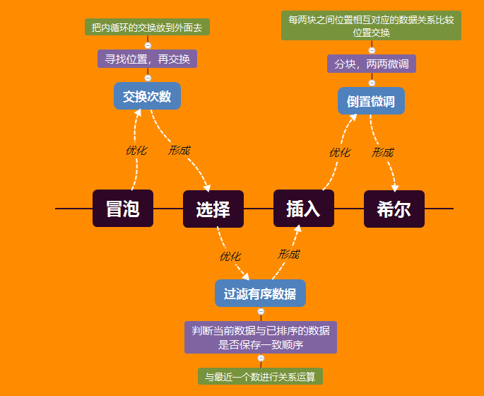

# 初等的排序

[^2019/06/01]:

[](https://www.github.com/kevin-leak)  

**文章介绍结构**

> 算法介绍
>
> 思路
>
> ------现实场景
>
> ------抽象逻辑
>
> 代码
>
> 算法衡量
>
> ------复杂度
>
> ------优缺点 ---> 可改进
>
> 测试代码

[TOC]

来一张图：



冒泡排序是取第一个数为初始值，不断的与后面的数据进行比较，交换得到最大的值放入最后一个位置。

发现交换次数在循环内，可以采用标记需要交换的位置，最后交换，由此选择排序诞生了

但由于选择排序和冒泡排序的时间复杂度和数据本身无关，导致本来是有序的序列需要排序时间还是这么多，

所以插入排序进行了一个对有序序列的一个过滤，如果不是有序就进行冒泡或者插入排序。

继续优化来说，就是当当前序列为倒序的时候，时间复杂度会相当的大，所以希尔排序对倒置的数据进行了相对位置的微调。


## 排序的核心思想

**其实很简单，排序就是比较大小，交换位置就可以，那么问题是如何归位？**

也就是对：**位置 **与 **数据** 之间大小的 **关系操作**


## 排序动画

<https://www.toptal.com/developers/sorting-algorithms>

https://visualgo.net/en/sorting


## 冒泡

### 思路

#### 现实场景

我们站成一列，按从矮到高排序，第一轮，从第一个人开始，和相邻的人比较高矮，高的往后走，进行n轮。

他们心中指保持一种标准就是：**我如果比你矮，我既要在你左边**

#### 抽象逻辑

非常简单的逻辑，就是想这个名字一样，进行冒泡，大的往后走

相邻的数据进行比较，交换位置，进行n轮，当每个人相邻的位置都满足升序或者降序其中一个序列，则停止。

每轮都从第一个开始，比较，每轮排出一个相对较大的。


### 代码实现

注意第二个循环应从0开始

```java
public class BubbleSort {
    // isPositive 选择是否是正序，true为正序
    static void sort(int[] data, boolean isPositive) {
        for (int i = 0; i < data.length; i++) {
            for (int j = 0; j < data.length; j++) {
                if (more(data[i], data[j]) == isPositive)
                    exchange(data, i, j);
            }
        }
    }

    private static void exchange(int[] data, int i, int j) {
        int temp = data[i];
        data[i] = data[j];
        data[j] = temp;
    }

    private static boolean more(Integer x, Integer y) {
        return x - y > 0;
    }

}
```

### 代码衡量

#### 复杂度

- 时间复杂度

  - 可以很容看出，两个循环是：$$n + (n-1) + (n-2) + .... + 3 + 2 + 1;$$

    一个等差数列，$$n(n-1) / 2 = \frac{1}{2}n^2 -\frac{1}{2}n $$ ，也就是 $$O(n^2)$$ 

  - 交换此时数最大是：$$\frac{1}{2}n^2 -\frac{1}{2}n $$ ，最小是： 0，最大的时候，与排序的顺序刚好相反。

- 空间复杂度，如果算上temp，应是O(1)，如果不算应该是0.


#### 优缺点 ---> 可改进

发现不管如何输入，时间复杂度不变，引申出一个问题：有顺序的数据，浪费时间

也就是：输入数据与运行时间无关。

交换次数，我们希望趋近与n

- 如何减少交换次数？
- 如何解决特殊的输入数据情况？


## 选择

相对这样思考，我们进行交换的时候，都是在循环内，是否可以想一个办法能把放到第一个循环？

找到合适的位置的时候，在进行交换，而不用每次进行一次，就进行交换？

选择排序就这个问题进行了改善。

相对于冒泡的交换次数有所改进，将交换次数由 $$(\frac{1}{2}n^2 -\frac{1}{2}n) \  to \ 0$$ 变化到 $$n$$

**选择排序实际是冒泡排序对于交换次数进行了优化，标记插入位置再排序**


### 思路


#### 现实场景

我们站成一列，按从矮到高排序，第一个人出来，找到这个队伍最矮的人与自己换，一次做下去。

心中有一个信念：**合适的高度在合适的位置**

#### 抽象逻辑

重点在假设位置已经具有顺序，找到合适的数据，填入。


### 代码实现

实现思路：两个循环

- 第一个循环，对数据进行遍历，获取初始的归位数据位置的初始化
- 第二个循环，进行遍历比较大小，交换归位数据的位置，记录需要最终要交换的位置 temp
- 最后进行一个初始化


```java
public class SelectionSort {
    // isPositive 选择是否是正序，true为正序
    static void sort(int[] data, boolean isPositive) {
        for (int i = 0; i < data.length; i++) {
            int temp = i;		// 定义一个中介数据，要么是最大要么是最小
            for (int j = i + 1; j < data.length; j++) {
                // 升序找最小赋值给temp，则必须同时为 true
                // 降序找最大赋值给temp，则必须同时为 false
                if (less(data[temp], data[j]) == isPositive)
                    temp = j;
            }
            exchange(data, i, temp);
        }
    }

    private static void exchange(int[] data, int i, int j) {
        int temp = data[i];
        data[i] = data[j];
        data[j] = temp;
    }
    
    private static boolean less(Integer x, Integer y) {
        return x - y < 0;
    }
}
```


### 算法衡量

#### 复杂度

也就是 $$ n * n = n^2 $$ 则 $$ O(n^2)$$

最差需要交换 n次，最好可以交换 0次


#### 优缺点 ---> 可改进

可以发现不管输入数据是怎么样的，他的时间复杂度都不变，也就是  **运行时间 与 输入无关**

那么就出现了一个问题：**如果是一个已经有顺序的数据，就是多余的时间的花费**。

一个对输入数据类型不敏感的缺点出来了


**如何规避，这种有顺序的的特殊情况？**


## 插入排序

对选择排序中存在，如果当前序列是有序的，消耗的时间也是一样的。

将这种情况缩短复杂度为$$O(n)$$；

**插入排序就是规避有序的数据再排列再进行选择排序**


### 思路

就是有序的东西就不再逐个遍历比较，重要的是怎么可以做到？

而**到底是哪个操作增加了复杂度？**

```java
...
// 是这里不应该进入循环
for (int j = i + 1; j < data.length; j++) {
    if (less(data[temp], data[j]) == isPositive)
        temp = j;
}
...
```

这个有序是指，当前这个数与前面的数据保持有序状态，那么只需要做一个拦截操作，判断当前位置的数据是否与前面的数据保持有序。

**如何判断有序？**

可以假设是升序排列，且当前位置数据与前面数据保持有序，那么当前位置的数据就一定大于前面的位置

如果不是则无序。


#### 现实场景

我们站成一列，按从矮到高排序，以前面的人为标准

当前这个人看一下，前面一个人与自己的高矮关系，决定是否与他们这些人换位置

重最近的依次看。


#### 抽象逻辑

进行选择排序，过滤有序数据

冒泡排序，过滤有序。


### 代码

```java
class InsertionSort {

    // 选择是否是正序，true为正序
    static void sort(int[] data, boolean isPositive) {
        for (int i = 1; i < data.length; i++) {
            // 1. 升序，当前位置比前一个小，需要内排序，为true，则同为true
            // 2. 降序，当前位置比前一个大，需要内排序，为false，则同为false
            // 3. 如果符合进行冒泡
            for (int j = i; j > 0 && isFilter(data, isPositive, j); j--) {
                exchange(data, j, j - 1);
            }

        }
    }

    // j 是当前位置，这函数使用来处理升序与降序的，同时过滤已经排序要的情况
    private static boolean isFilter(int[] data, boolean isPositive, int j) {
        return more(data[j - 1], data[j]) == isPositive;
    }

    private static void exchange(int[] data, int i, int j) {
        int temp = data[i];
        data[i] = data[j];
        data[j] = temp;
    }

    private static boolean more(Integer x, Integer y) {
        return x - y > 0;
    }
}
```

#### 再优化

这里注意一下，我们进行交换的时候用的是冒泡的方式

可以用选择的方式进行

内循环用选择排序

虽然不能对时间复杂度进行优化，但可以优化运行时间，即是访问储存的速度。

```java
class InsertionSort {

    // 选择是否是正序，true为正序
    static void sort(int[] data, boolean isPositive) {
        for (int i = 1; i < data.length; i++) {
            int temp = data[i];
            int j = i;
            for (; j > 0 && isFilter(data, isPositive, j, temp); j--) {
                data[j] = data[j-1];
            }
            data[j] = temp;
        }
    }

    // 这里添加了一个参数
    private static boolean isFilter(int[] data, boolean isPositive, int j, int temp) {
        return more(data[j-1], temp) == isPositive;
    }
    // 省略的看原始的函数
    ...
}
```

相对于直接交换来说，少了一半交换操作。


### 算法衡量

#### 复杂度

- 时间复杂度

  复杂度也是比较好算的，第二循环不进入就为最小，最大为第二次循环要循环到最后。

  复杂度为：$$n$$ ~ $$ \frac{1}{2}n^2 -\frac{1}{2}n $$  --> $$O(n^2)$$

  交换次数：$$0$$ ~  $$ \frac{1}{2}n^2 -\frac{1}{2}n $$ 

- 没有空间复杂度


#### 优缺点 ---> 可改进

优点就是改善了选择排序中，避免了有序序列再排序的状态。

**哪里可以改进呢？？？**

看一下第一个循环是必须的，无论你怎么操作都是必须的。

再看一下第二循环的操作，我们是做了一个过滤，有序的不再排序

**是否可以再做一次过滤？**

这个问题，要回到，**那种情况时间复杂度最大？**

假设为升序，当前的数为前面序列中最小的数的时候，复杂度最大，也就是本来数据为降序的时候。

**需要优化倒置数据跨度大的问题**


## 希尔排序

希尔排序是对插入排序的改善

**哪里多花了时间？**

倒置的数据跨度太大

**希尔排序就是调整导致情况，再实现插入排序**


### 思路

既然倒置的数据跨度太大，我们是否可以提前知道这些数据，让他们放在前面？

可不可以分块组合，貌似不行，如果分块中数据有交叉怎么办？

有一个想法，既然数据是无序的，那我们也可以**随机的去取一个数进行排列**是吧。

但**怎么取对于新能有优化，而且还需要取到所有数据**

可以对每一块数据中的数据进行相对位置的调整，最后再进行一次整个的插入排序

当然应该从后往前进行相对位置的调整，问题是如何设置分块。


#### 现实场景

没有找到，等待补充。

#### 抽象逻辑

对数据进行分块，每块数据两两进行微调，最后进行插入排序。

微调是每两块数据中的数据间隔块的长度的微调，就是第一块的一个数，与第二块的一个数进行比较大小，调整相对位置。

### 代码

这个代码建立了一个内排序`innerSort()`

前面进行了倒置的调整，这里其实并没有调整，这里只是做了一个分块

```java
int h = 1;
while (h < data.length / 3) h = 3 * h + 1;
while (h >= 1) {
    ...
    h = h / 3;
}
```

为什么要用：`h = 3 * h + 1`

这样形成的是一个递增数列：1、4、13、40 ..... ，要求 h必须是从 1开始取的。

可以很清楚的知道当 h = 1 的时候，其实就是插入排序

```java
for (int i = h; i < data.length; i++) {
    for (int j = i; j >= h && isFilter(data, isPositive, j, h); j -= h) {
        exchange(data, j, j - h);
    }
}
```

**那么当h不是1的时候，他是如何进行倒置的微调？**

先说一下，其实h的作用是，标识当前的要进行微调的起始位置

假设数据长度是16，且按升序排列

**按照 h = 3 * h + 1 来说，其实就是将数据分成 4块，两块两块之间进行一个微调，最后插入排序**

- 当h = 13 的时候

  也就是，第四块与第一块的数据进行升序的相对位置的调整。

- 当 h = 4 的时候

  就是 第二块与第一块微调 ，第三块与第二块微调，第四块与第三块微调

- 当 h = 1的时候

  插入排序

微调的过程：就是每块的第一个之间相互比较，进行升序的相对位置的替换，这样就减少了倒置的情况。

**为什么是 3？**

书上说是因为，大量的实验的统计的结果。

**为什么是从最后一块开始微调？**

很简单，微调的原因是插入排序进行内循环的次数过多，也就是如果倒置的现象出现在最后边时间复杂度越大

所以从后面开始。


**全部代码**

```java
public class ShellSort {

    // 选择是否是正序，true为正序
    static void sort(int[] data, boolean isPositive) {
        int h = 1;
        while (h < data.length / 3) h = 3 * h + 1;
        while (h >= 1) {
            innerSort(data, isPositive, h);
            h = h / 3;
        }
    }

    // h是标识当前的要进行微调的起始位置
    private static void innerSort(int[] data, boolean isPositive, int h) {
        for (int i = h; i < data.length; i++) {
            for (int j = i; j >= h && isFilter(data, isPositive, j, h); j -= h) {
                exchange(data, j, j - h);
            }
        }
    }

    // j 是当前位置，这函数使用来处理升序与降序的，同时过滤已经排序要的情况
    private static boolean isFilter(int[] data, boolean isPositive, int j, int h) {
        return more(data[j - h], data[j]) == isPositive;
    }

    private static void exchange(int[] data, int i, int j) {
        int temp = data[i];
        data[i] = data[j];
        data[j] = temp;
    }

    private static boolean more(Integer x, Integer y) {
        return x - y > 0;
    }

}
```


### 算法衡量

#### 复杂度

计算h花的的时间是：$$O(logn)$$

而第一次循环，加上innerSort里面的第一层循环，则一定要花掉  $$O(nlogn)$$ 

我们假设一个极限的情况，就是微调并没有起作用，那么**时间复杂度**就是：$$O(n^2)$$ 

交换次数是： $$0$$ - $$O(n^2)$$ 

**辅助存储**是：O(1)

#### 优缺点 ---> 可改进

递增序列选取的间隔，选取那个好，不可控

需要解决，但这个算法有一个重要的思想，就是分块微调。


## 测试代码

```java
public class Main {
    public static void main(String[] args) {
        Scanner scanner = new Scanner(System.in);
        while (scanner.hasNext()) {
            String s = scanner.nextLine();
            String[] s1 = s.split("\\s+");
            int[] data = new int[s1.length];
            for (int i = 0; i < s1.length; i++)
                data[i] = Integer.parseInt(s1[i]);
            Bubble.sort(data, false);
            Selection.sort(data, true);
            Insertion.sort(data, true);
            Shell.sort(data, false);
            for (int i = 0; i < s1.length; i++)
                System.out.print(data[i] + " ");
        }
    }
}
```


### 转载须知

> 本站文章除注明转载外，均为本站原创或编译。
>
> 转载时，应注明来源、作者及[原文链接](<https://github.com/kevin-leak/note/blob/master/Algorithm%20and%20data%20structure/1.%20sort/1.%20Elementary%20Sorts.md>)。