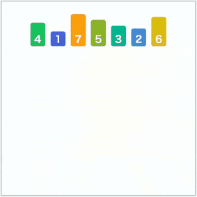

# 归并排序

[TOC]


先给一张图，非常形象。




## 为什么他会比选择排序快 ?

回想一下，按升序进行的选择排序是一开始选定一个初始值，再进行一个循环进行比较。

然后得到一个合适当前位置的排位的大小的数据。

也就是每次操作是一个等差数列：1，2，3，4，........，n-1，n

**所以归并排序是在哪减少了操作？？**
应该是内循环减少了比较的次数。

**如何做到的？**

看上的图初始数据是：4、1、7、5、3、2、6.

可以清楚的知道，如果要用选择排序，需要经过7次才能把1的位置确定下来

但归并排序只需要3次，是不是很神奇。

我自己把这个归结为**关系的扩大和传递**

假如一个有序的序列要与另外一个有序的序列进行一个合并，进行一个升序排列。

只需要当前两个数进行一个比较就行了，就可以排出位置。

举个例子，这里先写出第一个数，后面的一系列数用字母代替

第一个队列：1 A

第二个队列：2 C

如果是无序的队列，要排出最小的那个数，是需要4个数两两比较确定，也就是比较3次。

但因为有序，所以可知：1 < A , 2 < C，又因为 1 < 2 ，则**1 < C**

所以有：1 [2，A，C]，减少了 1和c比较

之所减少了 1和c比较，是**因为 2的关系扩大了**，2 和 C有了一个关系绑定，传递。

归并排序就是利用这样的思想：

将数据分成两组，两组进行内部排序，

第一组排序后： A Z Y

第二组排序后：D K U

利用这两组的顺序关系：如果 A < D，那么A就是第一个，不用与 K U比。

将大问题化小，小问题直接比较，关系不复杂，当相对关系建立，就利用团体的关系进行传递比较。


## 思想

分治的思想，就是利用团体的关系，减少内部操作。


## 代码

### 自顶向下——递归

递归重要的就是把递归函数本身当做一步来做。

- 给出停止边界，就是当它分到只有一个的时候
- 确定分块的中间值
- 递归调用左边排序，递归调用右边排序
- 合并，合并采用的是一个辅助数组，一定要先确认一套标准，不然遍历就会乱掉，尽量不要改变初始的参数值，如果觉得开销大，后面再改，一定要有这个流程顺序，不要想一下到位。

```java
class MergeSort {

    private static int[] help;

    public static void sort(int[] data) {
        if (data == null || data.length < 2) {
            return;
        }

        help = new int[data.length];
        innerSort(data, 0, data.length - 1);
    }

    /**
     * @param data  数据
     * @param left  数组的左边位置
     * @param right 数组的右边位置
     */
    private static void innerSort(int[] data, int left, int right) {

        if (right <= left) {
            return;
        }
        int mid = left + ((right - left) >> 1);
        innerSort(data, left, mid);
        innerSort(data, mid + 1, right);
        merge(data, left, mid, right);
    }

    private static void merge(int[] data, int left, int mid, int right) {

        // 连个已经排好序的数据：data[left] ~ data[mid]，data[mid+1] ~ data[right]

        // 先复制到一个辅助数组中去
        for (int i = left; i <= right; i++) {
            help[i] = data[i];
        }

        // 进行辅助数组中的数据比较，在data中进行一个填充
        // 定义两个在help里面的变量指针。
        int j = mid + 1;
        int i = left;
        // 定义一个循环，选中每一个data中的位置，用来赋值
        for (int k = left; k <= right; k++) {
            if (j > right) data[k] = help[i++]; // 右边没有需要比较的数了
            else if (i > mid) data[k] = help[j++]; // 左边没有需要比较的数了
            else // 比较赋值
                data[k] = (help[i] < help[j]) ? help[i++] : help[j++];
        }
    }
}
```

### 自低向下——循环

- 确定分块大小，为2的次方数
- 再循环选择没两块，定好左边界，中间，右边界
- 调用merge方法。

```java
class MergeSort {

    private static int[] help;

    public static void sort(int[] data) {
        if (data == null || data.length < 2) {
            return;
        }

        help = new int[data.length];
        int N = data.length;
        // 用来选定块状的大小
        for (int size = 1; size < N; size += size) {
            // 每两块中进行比较排序，每次循环跨越两块。
            for (int left = 0; left < N - size; left += size + size) {
                // 需要注意的是，可能右边的不足size，所以要取N-1；
                merge(data, left, left + size - 1, 
                      Math.min(left + size + size - 1, N - 1));
            }
        }
    }
    // merge 方法与上面的不变。
    ...
}
```


## 算法衡量

### 复杂度

这个时间复杂度怎么算

mater 公式：$$T(N) = a*T(N/b) + O(N^d)$$ 

写出N的递归变化公式：

$$T(n) = 2T(n/2) + O(n)$$

a = 2；b = 2；d = 1;

log(b,a) = d；所以时间复杂度：$$N*d*log(N) = N*log(N)$$ 

空间复杂度是：$$O(n)$$


### 优缺点 ---> 可改进

对于空间复杂度很明显：

- 辅助内存很大
- 访问存储次数多

对于时间复杂度，哪里还可以改进？？

好像没有，$$O(nlogn)$$ 已经试最大的了。

考虑一下常数项，就是交换的次数问题，发现很多次交换是在循环里面

这里应该可以优化。

书上说还有一个优化点就是：其实有很多情况其实可以不用比较也可以有序（堆排序）