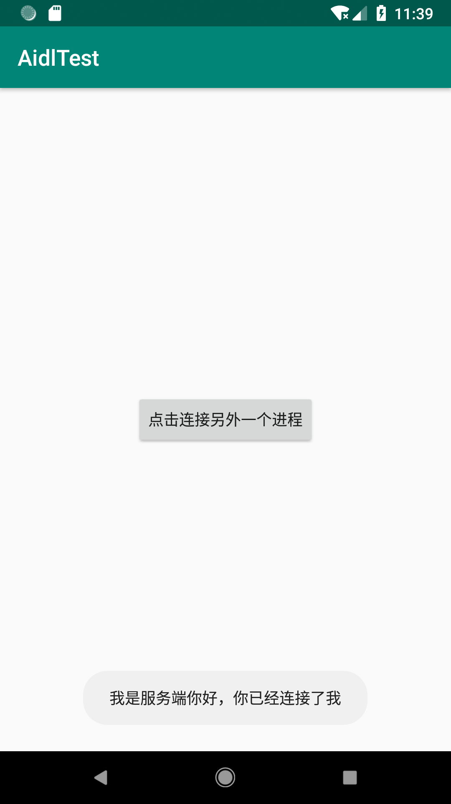

# Binder 通信

[TOC]


Binder，用来对进程之间的通信。
这个比较好理解，常见的应用就调用手机的支付。

这里我们用service来研究


## 环境搭建

### 工具准备

android studio

### 项目实现

#### 项目效果

点击按钮”点击链接另外一个进程“，另外一个app的service 作出回应，将”我是服务器，你已经连接了我“作为结果返回



#### server端

先看一下目录结构图，MainActivity， 不用管


- 首先通过Android 的快捷建立，建立一个aidl，这个会自动分包**IHello.aidl**，再make一下

  ```java
  // IHello.aidl
  package com.example.kevinleak.aidlserver;
  
  // Declare any non-default types here with import statements
  
  interface IHello {
      String say();
  }
  ```

- HelloService中的代码如下：

  ```java
  public class HelloService extends Service {
      public HelloService() {
      }
  
      //这个handler是继承自IHello.stub类
      public final IHello.Stub mBinder = new IHello.Stub(){
          @Override
          public String say() throws RemoteException {
              return "我是服务端，你已经连接了我";
          }
      };
  
      @Override
      public IBinder onBind(Intent intent) {
          return mBinder;
      }
  }
  ```

  

#### client端

看一下结构图：


aidl 是打开server项目的目录，在找到客户端的对应的位置，将整个aidl文件复制过去，这样就能够保持包名不变，然后make一下

BInderClientActivity中的代码：

```java
public class BinderClientActivity extends AppCompatActivity {


    public BinderServiceConnection connection = new BinderServiceConnection();
    private IHello iHello;

    @Override
    protected void onCreate(Bundle savedInstanceState) {
        super.onCreate(savedInstanceState);
        setContentView(R.layout.activity_binder_client);

        Button btnClike = findViewById(R.id.btn_click);

        remoteService();

        btnClike.setOnClickListener(new View.OnClickListener() {
            @Override
            public void onClick(View v) {
                try {
                    Toast.makeText(BinderClientActivity.this, iHello.say(),
                                   Toast.LENGTH_LONG).show();
                } catch (RemoteException e) {
                    e.printStackTrace();
                }
            }
        });

    }
    
     private void remoteService() {
        final Intent intent = new Intent();
        intent.setAction("com.example.kevinleak.aidlserver.HelloService");
         // 注意这里，如果是隐式Intent，必须指定包名，不然在5.0以上会报错
        intent.setPackage("com.example.kevinleak.aidlserver");

        bindService(intent, connection, Context.BIND_AUTO_CREATE);
    }

    class BinderServiceConnection implements ServiceConnection {

        @Override
        public void onServiceConnected(ComponentName name, IBinder service) {
            iHello = IHello.Stub.asInterface(service);
        }

        @Override
        public void onServiceDisconnected(ComponentName name) {
        }
    }
}

```


## aidl源码分析

主要分析三个问题：

- IHello.aidl生成的文件是用来干嘛的？？
- IHello.Stub()：用来干什么，做什么事
- IHello.Stub.asInterface()：这个是用来干嘛的？

1. 先看一下IHello的结构图

   

   看一下有三层结构

   - 最开始那层，有自己定义接口方法
   - 一个Stub内部类，继承Binder，这个类服务端一般会用
   - 一个Proxy代理类，这个类用来客户端，用来对服务端进行操作。

   根据我们一开始写的代码，可以粗略的这样看：

   

   服务器端，通过实例化**IHelloStub**抽象类，实现要通信的**Say()**方法，并将实例化的对象作为**Binder**在service中的OnBind方法进行一个返回。

   客户端，通过实现**ServiceConnection**接口，获取BInder，通过`IHello.Stub.asInterface(service);`方法获取服务器代理对象**Proxy**

   通过Intent连接服务器

   Proxy代理调用Say来与服务器进行通信，say---> binder.transact() ===> binder.onTransact ---> service.say() --> 回调。

   

2. 实际上，Binder这边与Service通信比较复杂

   - 客户端只是持有了服务端的一个代理对象，协助Binder驱动完成快进程通信

   - 我们设置的服务端会在servicemanager里面注册，客户端请求服务端，调用方法，实质是调用代理的方法

     代理方法被调用，Binder驱动就会去serviceManager里面查找是否有个方法， 再调用服务端的方法，在将数据通过代理返回给客户端。

   

   


## 总结与分析


来形容一下这个过程：

**aidl通信**

小明发现一个商机，发现能在别的地方买到便宜的书，所以小明开始做起了的代理(**Porxy**),

他同时邀请了他兄弟小王(**Binder**)，他有车(**Binder Driver**)，又能联系到厂家(**service**)

厂家拿出了书单(**aidl**)，小明就把这些书单拿到客户(**client**)这边去，说你要书的话就告诉我

小明收到消息，通知小王并把订单给他，厂家包装(**Parcelable**)了一下书给到小王，小王开车找到小明，小明再找客户，客户解开包装。


**安全机制**

小明后面发现不对，容易送错包裹，就加了一个安全机制(**Permission**)


**service查询与管理**

后面订购的越来越多，厂家满足不了了需求，小王就联系了更多的厂家(**service**)，找了小红做厂家管理(**ServiceManager**)，交所有要卖书的去他那里注册，统一管理厂家。同时设置了不同的厂家代理给客户服务。


**Binder池**

后面出现越来越多的快厂家订购，发给代理代理也很懵逼，我认识这本书，所以代理叫装了个app，你要什么查什么，我叫老王去拿。小王想想这还不得累死他，所以招了一伙小弟(**Binder Pool**)，来了订单，就叫他们去取车发给代理。


**多线程**

小弟们也要生活，不一定都在送书，所以是错开时间来的，同时也能加快送书(Thread)，但客户也不能等，所以就放在邮箱中，要的时候去取。


## 进程间的通信


进程间的通信其实是由很多种，

- 比如我们常用的Bundle，这个就是支持我们四大组件之间的通信
- 以及最容易想到的，文件，sharePreference，但他实时性不高
- 后面就是我们的四大组件ContentProvide，大部分是用来对数据的crud操作
- 还有就是借助网络sorket通信，但它实现细节有点繁琐，不支持远程调用
- 还有就是Messager，他是支持实时通信，不能很好的处理低并发
- 最后就是aidl了，实现稍微有点复杂，需要处理好线程同步。

