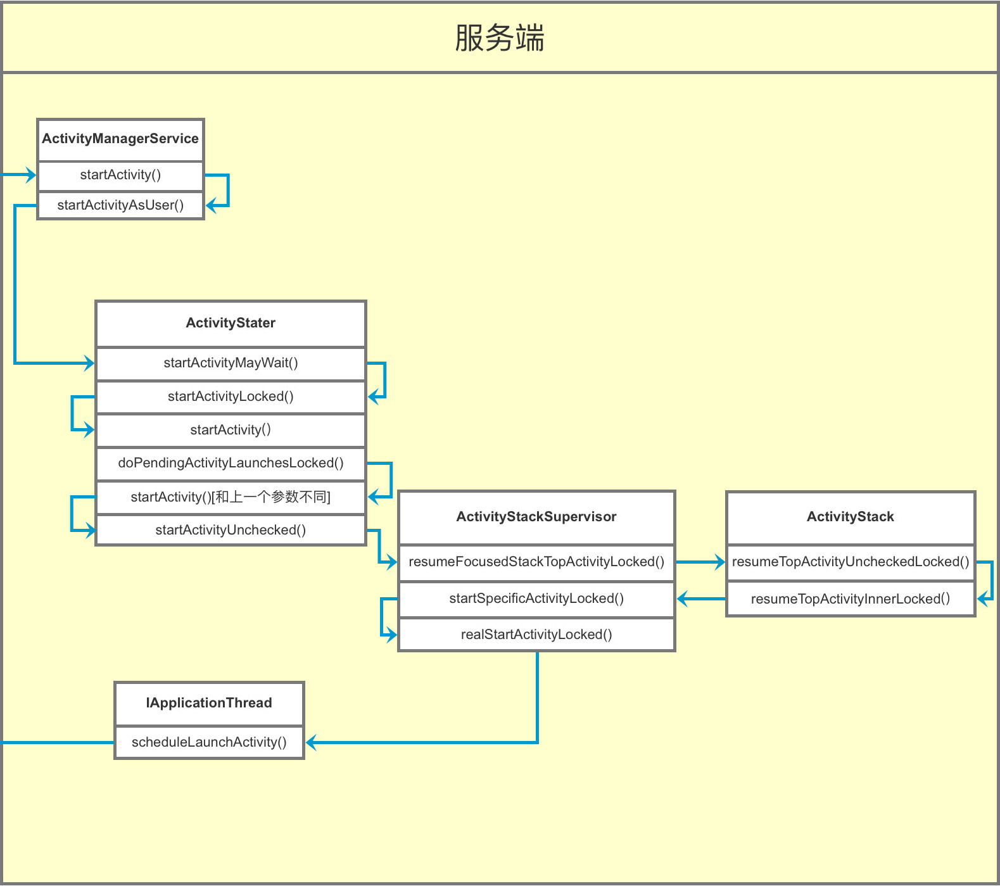
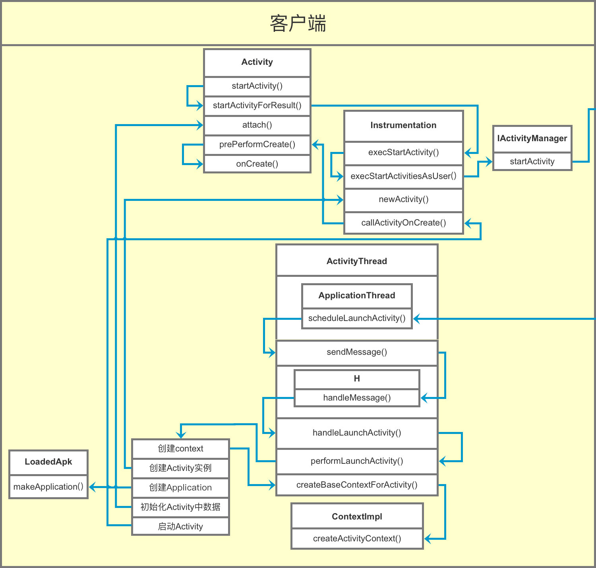
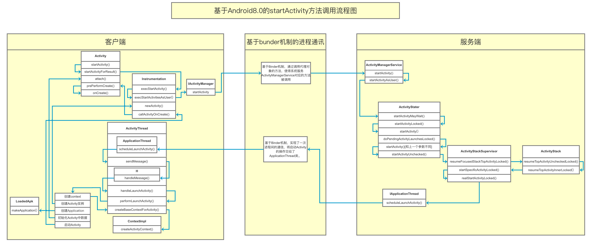

# 分析activity的启动过程

[TOC]

## 实验环境

- Android版本：28

- 代码

  ```java
  Intent intent = new Intent(this, SecondActivity.class);
  startActivity(intent);
  ```


## 源码分析

### 客户端开始

1. 在**MainActivity**中查看`startActivity(intent);` 最终走下去会发现，走了这个方法

   ```java
   public void startActivityForResult(@RequiresPermission Intent intent, int requestCode,
                                      @Nullable Bundle options) {
       if (mParent == null) {
           options = transferSpringboardActivityOptions(options);
           // 注意一下这里------execStartActivity
           Instrumentation.ActivityResult ar =
               mInstrumentation.execStartActivity(
               this, mMainThread.getApplicationThread(), mToken, this,
               intent, requestCode, options);
           if (ar != null) {
               mMainThread.sendActivityResult(
                   mToken, mEmbeddedID, requestCode, ar.getResultCode(),
                   ar.getResultData());
           }
           if (requestCode >= 0) {
             
               mStartedActivity = true;
           }
   
           cancelInputsAndStartExitTransition(options);
        
       } else {
           if (options != null) {
               mParent.startActivityFromChild(this, intent, requestCode, options);
           } else {
               mParent.startActivityFromChild(this, intent, requestCode);
           }
       }
   }
   
   ```

2. 在**Instrumentation**中查看一下execStartActivity方法

   ```java
   public ActivityResult execStartActivity(
       ...
       // 注意这里，根据名字我们应该可以搜一下，是否有ActivityManagerService，发现有
       // 这里猜测应该是获取了ActivityManagerService
       int result = ActivityManager.getService()
       .startActivity(whoThread, who.getBasePackageName(), intent,
                      intent.resolveTypeIfNeeded(who.getContentResolver()),
                      token, target != null ? target.mEmbeddedID : null,
                      requestCode, 0, null, options);
   
   }
   ```

3. 查看`ActivityManager.getService().startActivity()`

   ActivityManager中先查看`getService()`

   ```java
   public static IActivityManager getService() {
       return IActivityManagerSingleton.get();
   }
   
   private static final Singleton<IActivityManager> IActivityManagerSingleton =
       new Singleton<IActivityManager>() {
       @Override
       ...
   };
   ```

   再查看一下Singleton的get方法

   ```java
   // 这不就是单例锁吗
   public final T get() {
       synchronized (this) {
           if (mInstance == null) {
               // 调用了create
               mInstance = create();
           }
           return mInstance;
       }
   }
   ```

   看到

   ```java
   protected IActivityManager create() {
       // 注意这里发现应该是AIDL通信
       // 获取了ActivityManagerService 中的binder
       final IBinder b = ServiceManager.getService(Context.ACTIVITY_SERVICE);
       // 这一步应该是通过服务器中的binder对象获取IActivityManager.Stub的类
       final IActivityManager am = IActivityManager.Stub.asInterface(b);
       return am;
   }
   ```


### 服务端开始

1. 查看一下**ActivityManagerService**中的**startActivity**，追踪回调到

   ```java
   // 这里验证发现，使得ActivityManagerService extends IActivityManager.Stub
   // 所以返回的应该是ActivityManagerService对象
   public class ActivityManagerService extends IActivityManager.Stub
           implements Watchdog.Monitor, BatteryStatsImpl.BatteryCallback {
           
       public final int startActivityAsUser(IApplicationThread caller, 
       		String callingPackage,
              Intent intent, String resolvedType, IBinder resultTo, 
              String resultWho, int requestCode,int startFlags, 
              ProfilerInfo profilerInfo, Bundle bOptions, 
               int userId, boolean validateIncomingUser) {
           ....
           // TODO: Switch to user app stacks here.
           return mActivityStartController.obtainStarter(intent, "startActivityAsUser")
               ...
               .execute();
   
       }
   }
   ```

   看到这里`mActivityStartController.obtainStarter`，发现点击方法里面去，没有办法追踪

   猜测应该是获取了ActivityStart类，查一下发现是：`ActivityStarter.class`

2. 查看ActivityStarter中的execute();方法

   ```java
   // 这里返回的是结果
   int execute() {
           try {
               if (mRequest.mayWait) {
                   // 这里追踪下去，发现还是会调用下面的方法，文章不做赘述
                   return startActivityMayWait(...);
               } else {
                   return startActivity(...);
               }
           } finally {
               onExecutionComplete();
           }
       }
   ```

3. 查看**ActivityStarter**中的startActivity

   ```java
   private int startActivity(..) {
       // 这里发现又调用了一个复写的方法
       mLastStartActivityResult = startActivity(...);
   
       if (outActivity != null) {
           // mLastStartActivityRecord[0] is set in the call to startActivity above.
           outActivity[0] = mLastStartActivityRecord[0];
       }
       // 注意这里返回了结果
       return getExternalResult(mLastStartActivityResult);
   }
   ```

4. 一直追踪下去，发现还是有复写的方法，这里这里搞出一个最后的方法

   ```java
   private int startActivity(final ActivityRecord r, ActivityRecord sourceRecord,
               IVoiceInteractionSession voiceSession, IVoiceInteractor voiceInteractor,
               int startFlags, boolean doResume, ActivityOptions options, 
                askRecord inTask,ActivityRecord[] outActivity) {
       
       int result = START_CANCELED;
       try {
           mService.mWindowManager.deferSurfaceLayout();
           // 看到这里应该就是开启activity的方法
           result = startActivityUnchecked(r, sourceRecord, 
                                           voiceSession, voiceInteractor,
                                           startFlags, doResume, options, 
                                           inTask, outActivity);
       } finally {
           final ActivityStack stack = mStartActivity.getStack();
           if (!ActivityManager.isStartResultSuccessful(result) && stack != null) {
               stack.
                   finishActivityLocked(mStartActivity, RESULT_CANCELED,
                       null /* intentResultData */, "startActivity", true /* oomAdj */);
           }
           mService.mWindowManager.continueSurfaceLayout();
       }
   
       postStartActivityProcessing(r, result, mTargetStack);
       return result;
   }
   ```

5. 在ActivityStarter 中查看`startActivityUnchecked`

   ```java
   private int startActivityUnchecked(final ActivityRecord r, 
           ActivityRecord sourceRecord,IVoiceInteractionSession voiceSession,
           IVoiceInteractor voiceInteractor,int startFlags, boolean doResume,
           ActivityOptions options, TaskRecord inTask, ActivityRecord[] outActivity) {
       // 设置初始的状态，检测条件
       ...
       // 处理activity 栈的代码
       ...
       ...
       // 处理四种启动模式的问题
       ...
       // If the target stack was not previously focusable (previous top running activity
       // on that stack was not visible) then any prior calls to move the stack to the
       // will not update the focused stack.  If starting the new activity now allows the
       // task stack to be focusable, then ensure that we now update the focused stack
       // accordingly.
       // 后面一句大概是：如果现在启动新活动允许任务堆栈可聚焦，那么请确保我们现在相应地更新聚焦堆栈。
       if (mTargetStack.isFocusable() && !mSupervisor.isFocusedStack(mTargetStack)) {
          mTargetStack.moveToFront("startActivityUnchecked");
       }
       // 进入查看这个方法
       mSupervisor.resumeFocusedStackTopActivityLocked(mTargetStack, mStartActivity,
                                                       mOptions);
       ...
       return START_SUCCESS;
   }
   ```

6. 在ActivityStackSupervisor 中查看 resumeFocusedStackTopActivityLocked方法

   ```java
   boolean resumeFocusedStackTopActivityLocked(
       ActivityStack targetStack, ActivityRecord target, ActivityOptions targetOptions) {
       // 是否准备好获取新的焦点
       if (!readyToResume()) {
           return false;
       }
   
       if (targetStack != null && isFocusedStack(targetStack)) {
           // 注意这里
           return targetStack.resumeTopActivityUncheckedLocked(target, targetOptions);
       }
       ...
       return false;
   }
   ```

7. 进入 **ActivityStack** 查看resumeTopActivityUncheckedLocked方法

  ```java
  boolean resumeTopActivityUncheckedLocked(ActivityRecord prev, ActivityOptions options) {
      if (mStackSupervisor.inResumeTopActivity) {
          // Don't even start recursing.
          return false;
      }
  
      boolean result = false;
      try {
          // Protect against recursion.
          mStackSupervisor.inResumeTopActivity = true;
          result = resumeTopActivityInnerLocked(prev, options);
          // 当当前的actvity处于
          if (next == null || !next.canTurnScreenOn()) {
              checkReadyForSleep();
          }
      } finally {
          mStackSupervisor.inResumeTopActivity = false;
      }
  
      return result;
  }
  ```

  继续查看 inResumeTopActivity

  ```java
  @GuardedBy("mService")
  private boolean resumeTopActivityInnerLocked(ActivityRecord prev, ActivityOptions options) {
      ... //看到注释
          // Whoops, need to restart this activity!
          if (!next.hasBeenLaunched) {
              next.hasBeenLaunched = true;
          } else {
              if (SHOW_APP_STARTING_PREVIEW) {
                  next.showStartingWindow(null /* prev */, false /* newTask */,
                                          false /* taskSwich */);
              }
              if (DEBUG_SWITCH) Slog.v(TAG_SWITCH, "Restarting: " + next);
          }
          if (DEBUG_STATES) 
              Slog.d(TAG_STATES, "resumeTopActivityLocked: Restarting " + next);
          mStackSupervisor.startSpecificActivityLocked(next, true, true);
      ...
      return true;
  }
  
  ```

8. 在ActivityStackSupervisor中查看startSpecificActivityLocked

  ```java
  void startSpecificActivityLocked(ActivityRecord r,boolean andResume, 
                                   boolean checkConfig) {
      // Is this activity's application already running?
      ProcessRecord app = mService.getProcessRecordLocked(r.processName,
                                                          r.info.applicationInfo.uid, true);
      getLaunchTimeTracker().setLaunchTime(r);
      // 处理异常情况
      ...
          // 注意这个方法
           realStartActivityLocked(r, app, andResume, checkConfig);
      ...
      mService.startProcessLocked(r.processName, r.info.applicationInfo, true, 0,
                                  "activity", r.intent.getComponent(), 
                                  false, false, true);
  }
  ```

  继续查看realStartActivityLocked

  ```java
  final boolean realStartActivityLocked(ActivityRecord r, ProcessRecord app,
                                        boolean andResume, boolean checkConfig) {
      ...
          // Schedule transaction.
          mService.getLifecycleManager().scheduleTransaction(clientTransaction);
      ...
  }
  ```

  往深处找

9. 在ClientLifecycleManager查看scheduleTransaction方法

  ```java
  void scheduleTransaction(ClientTransaction transaction) throws RemoteException {
      final IApplicationThread client = transaction.getClient();
      transaction.schedule();
      if (!(client instanceof Binder)) {
          // If client is not an instance of Binder - it's a remote call and at this point it is
          // safe to recycle the object. All objects used for local calls will be recycled after
          // the transaction is executed on client in ActivityThread.
          transaction.recycle();
      }
  }
  ```

  了解两个东西client是binder。而且是IApplicationThread的子类

10. 预计是通过binder 进行进程间通信，连接到另外一个app的ApplicationThread类，这里需要了解的是这个类在Activitythread里面

这里给出一张图



### 服务端结束与客户端收尾

具体的就不跟着深究，先看一张图：



查看一下

```java
/**  Core implementation of activity launch. */
private Activity performLaunchActivity(ActivityClientRecord r, Intent customIntent) {
    // 组件信息初始化
    ...
    // 创建 Context
    ContextImpl appContext = createBaseContextForActivity(r);
    Activity activity = null;
    try {
        // 类加载新的Activity
        java.lang.ClassLoader cl = appContext.getClassLoader();
        activity = mInstrumentation.newActivity(
            cl, component.getClassName(), r.intent);
        StrictMode.incrementExpectedActivityCount(activity.getClass());
        r.intent.setExtrasClassLoader(cl);
        r.intent.prepareToEnterProcess();
        if (r.state != null) {
            r.state.setClassLoader(cl);
        }
    }

    try {
        Application app = r.packageInfo.makeApplication(false, mInstrumentation);

        if (activity != null) {
            // 参数配置，例如横竖屏
            ...
            Window window = null;
            if (r.mPendingRemoveWindow != null && r.mPreserveWindow) {
                window = r.mPendingRemoveWindow;
                r.mPendingRemoveWindow = null;
                r.mPendingRemoveWindowManager = null;
            }
            appContext.setOuterContext(activity);
            // 注意这个方法
            activity.attach(appContext, this, getInstrumentation(), r.token,
                            r.ident, app, r.intent, r.activityInfo, title, r.parent,
                            r.embeddedID, r.lastNonConfigurationInstances, config,
                            r.referrer, r.voiceInteractor, window, r.configCallback);

            ...
            if (r.isPersistable()) {
                // 此刻onCreate发生调度
                mInstrumentation.callActivityOnCreate(activity, r.state, r.persistentState);
            } else {
                mInstrumentation.callActivityOnCreate(activity, r.state);
            }
            ...
        }
        ...
    } 
    ...

    return activity;
}

```

到此结束

## 奉上一张图



