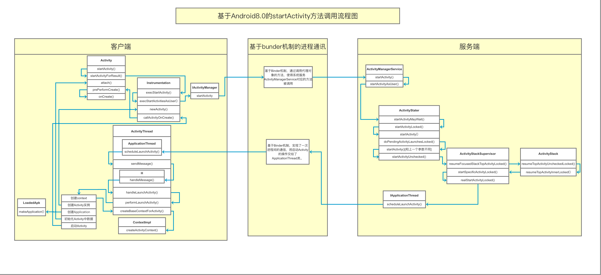

# 分析activity的启动过程

[TOC]

## 实验环境

- Android版本：28

- 代码

  ```java
  Intent intent = new Intent(this, SecondActivity.class);
  startActivity(intent);
  ```


## 源码分析

1. 查看`startActivity(intent);` 最终走下去会发现，走了这个方法

   ```java
   public void startActivityForResult(@RequiresPermission Intent intent, int requestCode,
                                      @Nullable Bundle options) {
       if (mParent == null) {
           options = transferSpringboardActivityOptions(options);
           // 注意一下这里------execStartActivity
           Instrumentation.ActivityResult ar =
               mInstrumentation.execStartActivity(
               this, mMainThread.getApplicationThread(), mToken, this,
               intent, requestCode, options);
           if (ar != null) {
               mMainThread.sendActivityResult(
                   mToken, mEmbeddedID, requestCode, ar.getResultCode(),
                   ar.getResultData());
           }
           if (requestCode >= 0) {
             
               mStartedActivity = true;
           }
   
           cancelInputsAndStartExitTransition(options);
        
       } else {
           if (options != null) {
               mParent.startActivityFromChild(this, intent, requestCode, options);
           } else {
               mParent.startActivityFromChild(this, intent, requestCode);
           }
       }
   }
   
   ```

2. 在Instrumentation.class中查看一下execStartActivity方法

   ```java
   public ActivityResult execStartActivity(
       ...
       // 注意这里，根据名字我们应该可以搜一下，是否有ActivityManagerService，发现有
       // 这里猜测应该是获取了ActivityManagerService
       int result = ActivityManager.getService()
       .startActivity(whoThread, who.getBasePackageName(), intent,
                      intent.resolveTypeIfNeeded(who.getContentResolver()),
                      token, target != null ? target.mEmbeddedID : null,
                      requestCode, 0, null, options);
   
   }
   ```

3. 查看`ActivityManager.getService().startActivity()`

   先查看`getService()`

   ```java
   public static IActivityManager getService() {
       return IActivityManagerSingleton.get();
   }
   
   private static final Singleton<IActivityManager> IActivityManagerSingleton =
       new Singleton<IActivityManager>() {
       @Override
       ...
   };
   ```

   再查看一下Singleton的get方法

   ```java
   // 这不就是单例锁吗
   public final T get() {
       synchronized (this) {
           if (mInstance == null) {
               // 调用了create
               mInstance = create();
           }
           return mInstance;
       }
   }
   ```

   看到

   ```java
   protected IActivityManager create() {
       // 注意这里发现应该是AIDL通信
       // 获取了ActivityManagerService 中的binder
       final IBinder b = ServiceManager.getService(Context.ACTIVITY_SERVICE);
       // 这一步应该是通过服务器中的binder对象获取IActivityManager.Stub的类
       final IActivityManager am = IActivityManager.Stub.asInterface(b);
       return am;
   }
   ```

   

4. 查看一下**ActivityManagerService**中的**startActivity**，追踪回调到

   ```java
   // 这里验证发现，使得ActivityManagerService extends IActivityManager.Stub
   // 所以返回的应该是ActivityManagerService对象
   public class ActivityManagerService extends IActivityManager.Stub
           implements Watchdog.Monitor, BatteryStatsImpl.BatteryCallback {
           
       public final int startActivityAsUser(IApplicationThread caller, 
       		String callingPackage,
              Intent intent, String resolvedType, IBinder resultTo, 
              String resultWho, int requestCode,int startFlags, 
              ProfilerInfo profilerInfo, Bundle bOptions, 
               int userId, boolean validateIncomingUser) {
           ....
           // TODO: Switch to user app stacks here.
           return mActivityStartController.obtainStarter(intent, "startActivityAsUser")
               ...
               .execute();
   
       }
   }
   ```

   看到这里`mActivityStartController.obtainStarter`，发现点击方法里面去，没有办法追踪

   猜测应该是获取了ActivityStart类，查一下发现是：`ActivityStarter.class`

5. 查看ActivityStarter中的execute();方法

   ```java
   // 这里返回的是结果
   int execute() {
           try {
               if (mRequest.mayWait) {
                   // 这里追踪下去，发现还是会调用下面的方法，文章不做赘述
                   return startActivityMayWait(...);
               } else {
                   return startActivity(...);
               }
           } finally {
               onExecutionComplete();
           }
       }
   ```

6. 查看ActivityStarter中的startActivity

   ```java
   private int startActivity(..) {
       // 这里发现又调用了一个复写的方法
       mLastStartActivityResult = startActivity(...);
   
       if (outActivity != null) {
           // mLastStartActivityRecord[0] is set in the call to startActivity above.
           outActivity[0] = mLastStartActivityRecord[0];
       }
       // 注意这里返回了结果
       return getExternalResult(mLastStartActivityResult);
   }
   ```

7. 一直追踪下去，发现还是有复写的方法，这里这里搞出一个最后的方法

   ```java
   private int startActivity(final ActivityRecord r, ActivityRecord sourceRecord,
               IVoiceInteractionSession voiceSession, IVoiceInteractor voiceInteractor,
               int startFlags, boolean doResume, ActivityOptions options, 
                askRecord inTask,ActivityRecord[] outActivity) {
       
       int result = START_CANCELED;
       try {
           mService.mWindowManager.deferSurfaceLayout();
           // 看到这里应该就是开启activity的方法
           result = startActivityUnchecked(r, sourceRecord, 
                                           voiceSession, voiceInteractor,
                                           startFlags, doResume, options, 
                                           inTask, outActivity);
       } finally {
           final ActivityStack stack = mStartActivity.getStack();
           if (!ActivityManager.isStartResultSuccessful(result) && stack != null) {
               stack.
                   finishActivityLocked(mStartActivity, RESULT_CANCELED,
                       null /* intentResultData */, "startActivity", true /* oomAdj */);
           }
           mService.mWindowManager.continueSurfaceLayout();
       }
   
       postStartActivityProcessing(r, result, mTargetStack);
       return result;
   }
   ```

8. 在ActivityStarter 中查看`startActivityUnchecked`

   ```java
   private int startActivityUnchecked(final ActivityRecord r, 
           ActivityRecord sourceRecord,IVoiceInteractionSession voiceSession,
           IVoiceInteractor voiceInteractor,int startFlags, boolean doResume,
           ActivityOptions options, TaskRecord inTask, ActivityRecord[] outActivity) {
       // 设置初始的状态，检测条件
       ...
       // 处理activity 栈的代码
       ...
       ...
       // 处理四种启动模式的问题
       ...
     
       return START_SUCCESS;
   }
   ```

9. 


## 奉上一张大佬图



