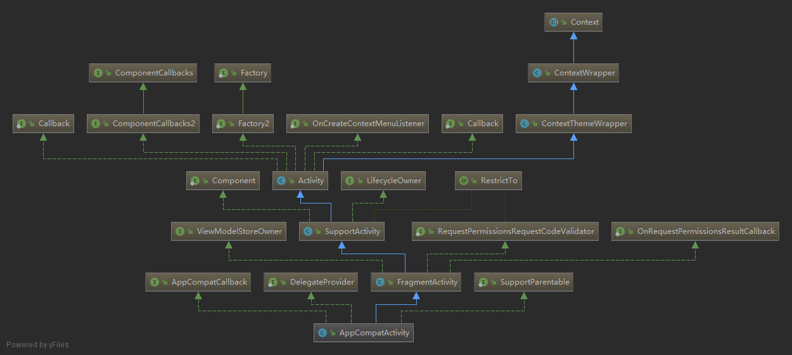
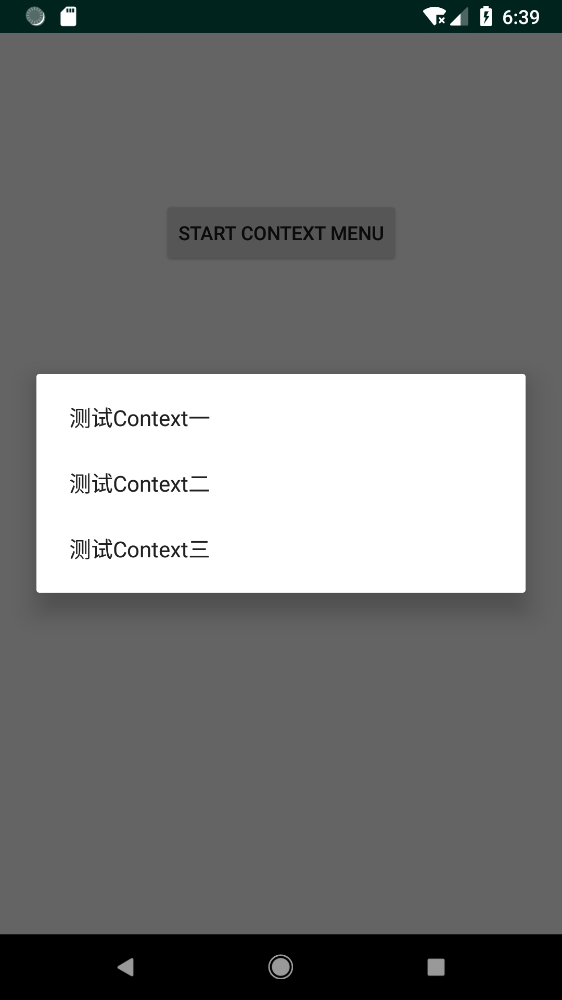

# 继承关系

[TOC]


[activity的介绍](https://developer.android.google.cn/reference/android/app/Activity)

先上一张层级图



### 注意一下继承关系

继承了`ContextThemeWrapper` 

实现了

```java
implements LayoutInflater.Factory2,
Window.Callback,
KeyEvent.Callback,
View.OnCreateContextMenuListener,
ComponentCallbacks2
```


**从这些继承关系可以看出，activity 具有的表现特征 ：**

主题控制，将xml转化为java能力， 窗口控制，指针控制，建立context menu， 控制组件


#### ContextThemeWrappe

A context wrapper that allows you to modify or replace the theme of the wrapped context.

一个目录指针包装的类， 允许我们去修改和替换当前环境下的主题。

##### 拥有的动作方法

- [getResources](https://developer.android.google.cn/reference/android/view/ContextThemeWrapper.html#getResources())()
- [getTheme](https://developer.android.google.cn/reference/android/view/ContextThemeWrapper.html#getTheme())()
- [setTheme](https://developer.android.google.cn/reference/android/view/ContextThemeWrapper.html#setTheme(int))(int resid)
- [getAssets](https://developer.android.google.cn/reference/android/view/ContextThemeWrapper.html#getAssets())()
- [applyOverrideConfiguration](https://developer.android.google.cn/reference/android/view/ContextThemeWrapper.html#applyOverrideConfiguration(android.content.res.Configuration))([Configuration](https://developer.android.google.cn/reference/android/content/res/Configuration.html) overrideConfiguration)
- [getSystemService](https://developer.android.google.cn/reference/android/view/ContextThemeWrapper.html#getSystemService(java.lang.String))([String](https://developer.android.google.cn/reference/java/lang/String.html) name)

**我们styles.xml，中自定义主题的时候，就是这个类的实例功能在起作用**


### LayoutInflater.Factory2

[工厂模式介绍](..\pattern\factory.md)

继承于`LayoutInflater.Factory`

**LayoutInflater.Factory** 定义了一个抽象方法

```java
abstract void onCreateView(String name, Context context, AttributeSet attrs){}
```

继续追溯到

**[LayoutInflater](https://developer.android.google.cn/reference/android/view/LayoutInflater)**

父类是Object； 是一个抽象方法，功能有子类实现，负责实现将布局文件转化为java对象

Instantiates a layout XML file into its corresponding `View` objects. It is never used directly. Instead, use`Activity.getLayoutInflater()` or `Context.getSystemService(Class)` to retrieve a standard LayoutInflater instance that is already hooked up to the current context and correctly configured for the device you are running on.

封装各种处理解析xml的方法，通过factory 拿到手


##### 构造方法

构造LayoutInflater 需要与当前的上下情景挂钩

```java
//Create a new LayoutInflater instance associated with a particular Context.
LayoutInflater(Context context)

/*Create a new LayoutInflater instance that is a copy of an existing LayoutInflater, optionally with its Context changed.*/
LayoutInflater(LayoutInflater original, Context newContext)

```


##### 常见方法

- [createView](https://developer.android.google.cn/reference/android/view/LayoutInflater.html#createView(java.lang.String,%20java.lang.String,%20android.util.AttributeSet))([String](https://developer.android.google.cn/reference/java/lang/String.html) name, [String](https://developer.android.google.cn/reference/java/lang/String.html) prefix, [AttributeSet](https://developer.android.google.cn/reference/android/util/AttributeSet.html) attrs)

- [getContext](https://developer.android.google.cn/reference/android/view/LayoutInflater.html#getContext())()： 构造方法建立的时候提供

- [inflate](https://developer.android.google.cn/reference/android/view/LayoutInflater.html#inflate(int,%20android.view.ViewGroup,%20boolean))(int resource, [ViewGroup](https://developer.android.google.cn/reference/android/view/ViewGroup.html) root, boolean attachToRoot)：

  重写各种参数，用来将xml 布局文件，parser 为 java view 对象


##### Window.Callback

API from a Window back to its caller. This allows the client to intercept key dispatching, panels and menus, etc

窗口回调接口


### KeyEvent.Callback

https://developer.android.google.cn/reference/android/view/KeyEvent.Callback.html

处理指针问题

拥有的方法

- onKeyDown
- onKeyLongPress
- onKeyMutiple：连续发生交互事件
- onKeyUp


#### View.OnCreateContextMenuListener

一个目录菜单的回调

实现

效果图



1. <a herf="#ContextMenuTestActivity">ContextMenuTestActivity</a>
2. <a herf="#activity_context_menu_test">activity_context_menu_test</a>
3. <a herf="#context_test">context_test</a>


<a id="ContextMenuTestActivity">ContextMenuTestActivity</a>

```java
public class ContextMenuTestActivity extends Activity {

    private View startButton;

    @Override
    protected void onCreate(@Nullable Bundle savedInstanceState) {
        super.onCreate(savedInstanceState);

        setContentView(R.layout.activity_context_menu_test);
        startButton = findViewById(R.id.btn_start);

        // 给button 设置注册context menu
        registerForContextMenu(startButton);

        startButton.setOnClickListener(new View.OnClickListener() {
            @Override
            public void onClick(View v) {
                v.showContextMenu(); // 点击展示context menu
            }
        });

    }

    @Override
    public void onCreateContextMenu(ContextMenu menu, View v, ContextMenu.ContextMenuInfo menuInfo) {
        getMenuInflater().inflate(R.menu.context_test, menu);
        super.onCreateContextMenu(menu, v, menuInfo);
    }

    @Override
    public boolean onContextItemSelected(MenuItem item) {
        return super.onContextItemSelected(item);
    }
}

```

<a id="activity_context_menu_test">activity_context_menu_test</a>

```xml
<?xml version="1.0" encoding="utf-8"?>
<android.support.constraint.ConstraintLayout
    xmlns:android="http://schemas.android.com/apk/res/android"
    xmlns:app="http://schemas.android.com/apk/res-auto"
    xmlns:tools="http://schemas.android.com/tools"
    android:layout_width="match_parent"
    android:layout_height="match_parent">


    <Button
        android:id="@+id/btn_start"
        android:layout_width="wrap_content"
        android:layout_height="wrap_content"
        android:text="start context menu"
        app:layout_constraintBottom_toBottomOf="parent"
        app:layout_constraintEnd_toEndOf="parent"
        app:layout_constraintHorizontal_bias="0.5"
        app:layout_constraintStart_toStartOf="parent"
        app:layout_constraintTop_toTopOf="parent"
        app:layout_constraintVertical_bias="0.2" />

</android.support.constraint.ConstraintLayout>
```

<a id="context_test">context_test</a>

```xml
<?xml version="1.0" encoding="utf-8"?>
<menu  xmlns:android="http://schemas.android.com/apk/res/android" >
    <item android:id="@+id/text1" android:title="测试Context一"/>
    <item android:id="@+id/text2" android:title="测试Context二"/>
    <item android:id="@+id/text3" android:title="测试Context三"/>
</menu>
```


