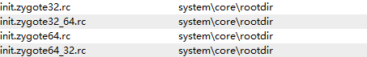
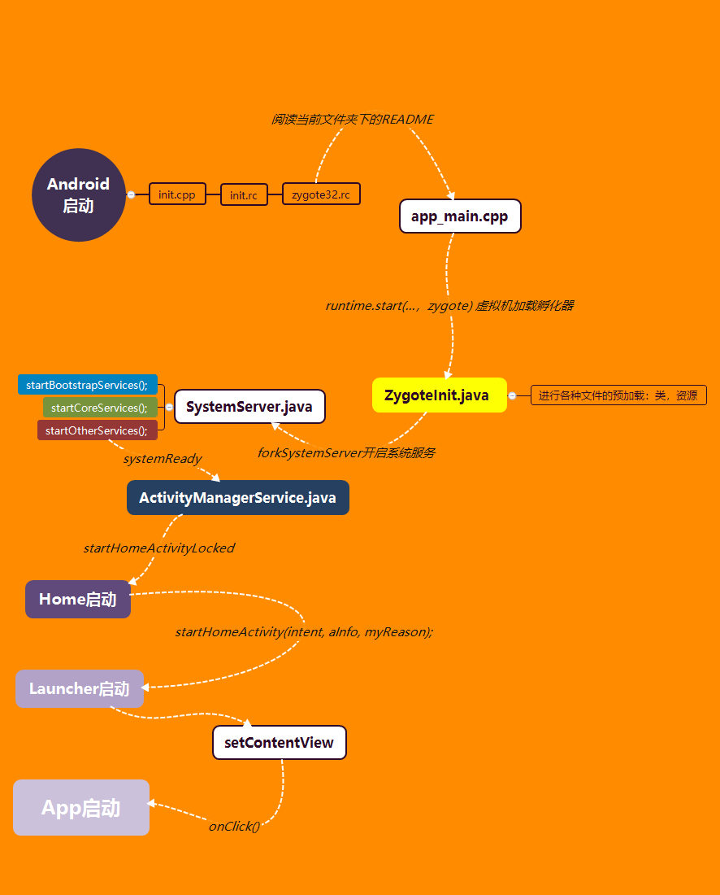

# android 的启动机制

[TOC]


## 环境搭建

### 工具准备

Source light ，everything，android studio

### 源码导入

Source light 按照网上的步骤导入就行了

- 安装与破解：https://blog.csdn.net/ytx2014214081/article/details/79963870
- 原码导入：https://blog.csdn.net/mylinchi/article/details/78459373

这篇文章导入的是`android-8.0.0_r1`原码


## 源码分析

这个应该从哪开始？？？？

先看一下android的系统层级


分了四大块：

- Linux kerne：linux核心层
- libraries：一些代码库，以及**runtime**，主要是c、c++，可以简单的看成为**native**
- framework：java写的基础代码
- application：应用

这应该这样看，从系统开始启动开始。

**搜一下system中的init**

### Linux启动

文件：`android-8.0.0_r1\system\core\init`

查看一下Main函数，Main函数是程序的主线程，一开始就会创建，这里不深究

1. 根据注释慢慢看：

   ```cpp
   int main(int argc, char** argv) {
       ...
       // 获取我们需要在initramdisk中放在一起的基本文件系统设置
       mount("tmpfs", "/dev", "tmpfs", MS_NOSUID, "mode=0755");
       mkdir("/dev/pts", 0755);
       mkdir("/dev/socket", 0755);
       ...
       // 既然tmpfs安装在/ dev上我们有/ dev / kmsg，我们实际上可以
       // talk to the outside world...（向世界对话了）
       InitKernelLogging(argv);
       ...
       Parser& parser = Parser::GetInstance();
       // 加载了三种解析器：service，action，import，也就是时说，当前文件只有这三类内容
       parser.AddSectionParser("service",std::make_unique<ServiceParser>());
       parser.AddSectionParser("on", std::make_unique<ActionParser>());
       parser.AddSectionParser("import", std::make_unique<ImportParser>());
       // 获取到文件，搜了一下发现没有？？
       std::string bootscript = GetProperty("ro.boot.init_rc", "");
       if (bootscript.empty()) {
           // 先看到这里，发现是在解析配置文件
           // 这里应该是换了一个文件解析
           parser.ParseConfig("/init.rc");
           ...
       } else {
          ...
       }
       ...
       return 0;
   }
   
   ```

2. 查看一下：`init.rc`，找system 下的：`android-8.0.0_r1\system\core\rootdir`

   一大堆看不懂，这怎么看？？，嘿嘿看这个：**android-8.0.0_r1\system\core\init\README.md**

   ```shell
   # It is recommended to put unnecessary data/ initialization from post-fs-data
   # to start-zygote in device's init.rc to unblock zygote start.
   # 指的是不用重复使用，而导致不必要的数据
   on zygote-start && property:ro.crypto.state=unencrypted
       # A/B update verifier that marks a successful boot.
       exec_start update_verifier_nonencrypted
       start netd
       start zygote
       start zygote_secondary
   ```

   解释一下：

   - on zygote-start：指的是zygote 开始的命令序列
   - property:ro.crypto.state=unencrypted：指的是命令的触发器
   - exec_start：启动给定服务的服务并停止处理其他init命令，直到他返回
   - start：Start a service running if it is not already running，开启

3. 查看zygote的初始化文件，发现有多个，随便选一个

   

   ```shell
   service zygote /system/bin/app_process -Xzygote /system/bin --zygote --start-system-server
       class main
       priority -20
       user root
       group root readproc
       socket zygote stream 660 root system
       onrestart write /sys/android_power/request_state wake
       onrestart write /sys/power/state on
       onrestart restart audioserver
       onrestart restart cameraserver
       onrestart restart media
       onrestart restart netd
       onrestart restart wificond
       writepid /dev/cpuset/foreground/tasks
   ```

   解释一下：

   - service zygote：服务是init启动和（可选）重启的程序，这个指的是启动 zygote 服务
   - /system/bin/app_process32 + 参数：服务启动的路径
   - class：指定服务类名

4. 查看一下`/system/bin/app_process`，中的app_main.cpp，中的Main方法

   ```cpp
   int main(int argc, char* const argv[])
   {
       ...
       // Parse runtime arguments.  Stop at first unrecognized option.
       bool zygote = false;
       bool startSystemServer = false;
       bool application = false;
       String8 niceName;
       String8 className;
       ...
       if (zygote) {
           runtime.start("com.android.internal.os.ZygoteInit", args, zygote);
       } else if (className) {
           runtime.start("com.android.internal.os.RuntimeInit", args, zygote);
       } else {
           //处理错误
           fprintf(stderr, "Error: no class name or --zygote supplied.\n");
           app_usage();
           LOG_ALWAYS_FATAL("app_process: no class name or --zygote supplied.");
       }
   }
   
   ```

5. 这里发现他调用用了：runtime，用source light 查看，进入AndroidRuntime.cpp

   ```cpp
   void AndroidRuntime::start(const char* className, 
                              const Vector<String8>& options, bool zygote){
       ...
       // android根路径设置
       ...
       /* start the virtual machine */
       JniInvocation jni_invocation;
       jni_invocation.Init(NULL);
       JNIEnv* env;
       if (startVm(&mJavaVM, &env, zygote) != 0) {
           return;
       }
       onVmCreated(env);
       // 通过对className的处理，进行虚拟机的启动
        /*
        * Register android functions.
        */
       ...
       /*
        * We want to call main() with a String array with arguments in it.
        * At present we have two arguments, the class name and an option string.
        * Create an array to hold them.
        */
         ...
           /*
        * Start VM.  This thread becomes the main thread of the VM, and will
        * not return until the VM exits.
        */
         ...
   }
   ```

6. 这里就不管虚拟机是怎么处理的，可以知道的是zygote被加载到了Dalvik虚拟机中开始运行

   查看一下`com.android.internal.os.ZygoteInit`

   `ZygoteInit.java` **从他怎打log这里找，看核心语句**

   ```java
   public static void main(String argv[]) {
               // zygote进程的服务器套接字类。
       ZygoteServer zygoteServer = new ZygoteServer();
       ...
       final Runnable caller;
       try {
          // bootTimingsTraceLog的设置
           ...
           bootTimingsTraceLog.traceBegin("ZygoteInit");
           RuntimeInit.enableDdms();
           //根据参数修改 enableLazyPreload
           zygoteServer.registerServerSocketFromEnv(socketName);
           if (!enableLazyPreload) {
               // 控制打log，这里是关键到了
               ...
               // 注释说，这个是
               preload(bootTimingsTraceLog);
               // 结束日志打印
           } else {
               Zygote.resetNicePriority();
           }
          	// gc 虚拟机的设置
           if (startSystemServer) {
               // 注意这里，调用了系统的服务，传入了zygoteServer
               Runnable r = forkSystemServer(abiList, socketName, zygoteServer);
               if (r != null) {
                   r.run();
                   return;
               }
           }
   
       }// 后续的关闭一些服务，的处理
       ...
   }
   ```

7. 查看一下这个方法：`preload(bootTimingsTraceLog);`

   `ZygoteInit.java` 好多日志打印的语句，这里直接省略

   ```java
   static void preload(TimingsTraceLog bootTimingsTraceLog) {
       // 和下面一起，是vm的操作，为加载下面的东西做的基础
       beginIcuCachePinning();
       // 预加载类、资源文件、等等一些其他的文件
       preloadClasses();
       preloadResources();
       nativePreloadAppProcessHALs();
       preloadOpenGL();
       preloadSharedLibraries();
       preloadTextResources();
       WebViewFactory.prepareWebViewInZygote();
       
       endIcuCachePinning();
   }
   ```

8. `ZygoteInit.java`：再查看一下`forkSystemServer(abiList, socketName, zygoteServer);`

   ```java
   private static Runnable forkSystemServer(String abiList, String socketName,
       ...
     	// 设置硬件启动的参数
       ...
       try {
           // 参数配置 ZygoteConnection，Zygote
            /* Hardcoded command line to start the system server */
           String args[] = {
               "--setuid=1000",
               "--setgid=1000",
               "--setgroups=1001,1002,1003,1004,1005,1006,1007,1008,1009,1010,1018,1021,1023,1024,1032,1065,3001,3002,3003,3006,3007,3009,3010",
               "--capabilities=" + capabilities + "," + capabilities,
               "--nice-name=system_server",
               "--runtime-args",
               "--target-sdk-version=" + VMRuntime.SDK_VERSION_CUR_DEVELOPMENT,
               // 注意看这里，开启的是这个服务
               "com.android.server.SystemServer",
           };
           // 请求开启一个进程
           ...
       } catch (IllegalArgumentException ex) {
           throw new RuntimeException(ex);
       }
   
       /* For child process */
       ...
   
       return null;
   }
   ```

9. 继续查看：`SystemServer.java` 查看他做了什么

   这个类很重要，是android启动时要做的事情，一个个看

   ```java
   public static void main(String[] args) {
       new SystemServer().run();
   }
   
   private void run() {
       try {
           // Prepare the main looper thread (this thread).
           android.os.Process.setThreadPriority(
               android.os.Process.THREAD_PRIORITY_FOREGROUND);
           android.os.Process.setCanSelfBackground(false);
           Looper.prepareMainLooper();
           Looper.getMainLooper().setSlowLogThresholdMs(
               SLOW_DISPATCH_THRESHOLD_MS, SLOW_DELIVERY_THRESHOLD_MS);
   
           //加载动态链接库
           System.loadLibrary("android_servers");
   
           // Check whether we failed to shut down last time we tried.
           // This call may not return.
           performPendingShutdown();
   
           // Initialize the system context.
           createSystemContext();
   
           // Create the system service manager.
           mSystemServiceManager = new SystemServiceManager(mSystemContext);
           mSystemServiceManager.setStartInfo(mRuntimeRestart,
                                              mRuntimeStartElapsedTime,、
                                              mRuntimeStartUptime);
           LocalServices.addService(SystemServiceManager.class, mSystemServiceManager);
           // Prepare the thread pool for init tasks that can be parallelized
           SystemServerInitThreadPool.get();
       } finally {
           traceEnd();  // InitBeforeStartServices
       }
   
       // Start services.
       try {
           traceBeginAndSlog("StartServices");
           startBootstrapServices();
           startCoreServices();
           startOtherServices();
           SystemServerInitThreadPool.shutdown();
       } catch (Throwable ex) {
           Slog.e("System", "******************************************");
           Slog.e("System", "************ Failure starting system services", ex);
           throw ex;
       } finally {
           traceEnd();
       }
   
       StrictMode.initVmDefaults(null);
       ...
   
       // Loop forever.
       Looper.loop();
       throw new RuntimeException("Main thread loop unexpectedly exited");
   }
   ```

10. 我们看这个方法`startBootstrapServices();` 开启启动服务

  ```java
  private void startBootstrapServices() {
      // 初始配置
      ...
      // Activity manager runs the show.
      mActivityManagerService = mSystemServiceManager
          .startService(ActivityManagerService.Lifecycle.class)
          .getService();
      mActivityManagerService.setSystemServiceManager(mSystemServiceManager);
      mActivityManagerService.setInstaller(installer);
  }
  
  ```

### ActivityManagerService——AMS

1. 查看这个类`ActivityManagerService.Lifecycle.class`的`start()` 方法：

   发现并没有我们有关启动的方法，那么回去，查看一下初始化的方法

   ```java
   // Note: This method is invoked on the main thread but may need to attach various
   // handlers to other threads.  So take care to be explicit about the looper.
   public ActivityManagerService(Context systemContext) {
       ...
       mTrackingAssociations = "1"
           .equals(SystemProperties.get("debug.track-associations"));
       // 点进去，发现这里是对activity的初始化的设置
       mTempConfig.setToDefaults();
       mTempConfig.setLocales(LocaleList.getDefault());
       mConfigurationSeq = mTempConfig.seq = 1;
       /** Run all ActivityStacks through this */
       mStackSupervisor = createStackSupervisor();
       // 设置初始参数 mTempConfig
       mStackSupervisor.onConfigurationChanged(mTempConfig);
       mKeyguardController = mStackSupervisor.mKeyguardController;
        /**
        * Packages that the user has asked to have run in screen size
        * compatibility mode instead of filling the screen.
        */
       mCompatModePackages = new CompatModePackages(this, systemDir, mHandler);
       mIntentFirewall = new IntentFirewall(new IntentFirewallInterface(), mHandler);
       mTaskChangeNotificationController =
           new TaskChangeNotificationController(this, mStackSupervisor, mHandler);
       // 任务栈开启
       mActivityStarter = new ActivityStarter(this, mStackSupervisor);
       mRecentTasks = new RecentTasks(this, mStackSupervisor);
       ...
   }
   
   ```

2. 发现并没有任何操作关于启动的，我们回到**Linux启动**的第9步，查看`startOtherServices();`

   ```java
   // 看到注释
   // We now tell the activity manager it is okay to run third party
   // code.  It will call back into us once it has gotten to the state
   // where third party code can really run (but before it has actually
   // started launching the initial applications), for us to complete our
   // initialization.
   mActivityManagerService.systemReady(() -> {
       ...
   }, BOOT_TIMINGS_TRACE_LOG);
   ```

3. 查看`ActivityManagerService.class`做了什么

   ```java
   public void systemReady(final Runnable goingCallback, BootTimingsTraceLog traceLog) {
       traceLog.traceBegin("PhaseActivityManagerReady");
       ...
       synchronized (this) {
          ...
           // to handle home activity in this case.
           if (UserManager.isSplitSystemUser() &&
                   Settings.Secure.getInt(mContext.getContentResolver(),
                        Settings.Secure.USER_SETUP_COMPLETE, 0) != 0) {
               //这里建立了一个activity，点开查看发现这是用来占位的
               // 比如说你开机的时候，一些图标没有加载的时候，就显示的是这个节目
               ComponentName cName = new ComponentName(mContext,
                                                       SystemUserHomeActivity.class);
               try {
                   AppGlobals.getPackageManager().setComponentEnabledSetting(cName,
                           PackageManager.COMPONENT_ENABLED_STATE_ENABLED, 0,
                           UserHandle.USER_SYSTEM);
               } catch (RemoteException e) {
                   throw e.rethrowAsRuntimeException();
               }
           }
           //发现这里启动了HomeActivityLocked：锁屏界面
           startHomeActivityLocked(currentUserId, "systemReady");
          }
      }
   }
   
   ```

4. `ActivityManagerService.java继续查看：`startHomeActivityLocked(currentUserId, "systemReady");`

   ```java
   boolean startHomeActivityLocked(int userId, String reason) {
       // 这里的获取了一个跳转意图，一般我们跳转可以通过包名，类名来跳 
       Intent intent = getHomeIntent();
       ...
       // 这里进行了开启，但开启的什么还是要再intent里面找
       mActivityStartController.startHomeActivity(intent, aInfo, myReason);
       ...
       return true;
   }
   ```

5. `ActivityManagerService.java`继续查看getHomeIntent();

   ```java
   Intent getHomeIntent() {
       // 查看mTopAction：android.intent.action.MAIN
       Intent intent = new Intent(mTopAction, 
                                  mTopData != null ? Uri.parse(mTopData) : null);
       intent.setComponent(mTopComponent);
       intent.addFlags(Intent.FLAG_DEBUG_TRIAGED_MISSING);
       if (mFactoryTest != FactoryTest.FACTORY_TEST_LOW_LEVEL) {
           // 查看CATEGORY_HOME：android.intent.category.HOME
           intent.addCategory(Intent.CATEGORY_HOME);
       }
       return intent;
   }
   ```

   找到配置文件中：`android.intent.category.HOME`与 `android.intent.action.MAIN`两个属性的`activity`

   这里怎么查看？？？应该在清单文件里面，搜了一下`AndroidManifest.xml`，发现非常多，找那个？？

   这样想：**桌面这种东西应该和相机、蓝牙一样被集成到基础的包中，是系统自带的软件**

   用everything 搜一下Camera，首先排除hardwork(硬件)、framework

   看到这个：

   

   有个app，应该是这个了

### Launcher

进去Camera目录里面查看到：Launcher2，路径：`android-8.0.0_r1\packages\apps\Launcher2`

点击进去发现到了我们搜索的`AndroidManifest.xml`点击查看一下，看是否满足我们设置的要求

```xml
<activity
          android:name="com.android.launcher2.Launcher"
          android:launchMode="singleTask"
          android:clearTaskOnLaunch="true"
          android:stateNotNeeded="true"
          android:resumeWhilePausing="true"
          android:theme="@style/Theme"
          android:windowSoftInputMode="adjustPan"
          android:screenOrientation="nosensor">
    <intent-filter>
        <action android:name="android.intent.action.MAIN" />
        <category android:name="android.intent.category.HOME" />
        <category android:name="android.intent.category.DEFAULT" />
        <category android:name="android.intent.category.MONKEY"/>
    </intent-filter>
</activity>

```

1. 应该就是这个了，看名字也是；查看那一下`Launcher.java`，

   这里要找我们点击图标的时候开启一个activity的过程，先看布局文件

   ```xml
   
   <!-- The workspace contains 5 screens of cells -->
   <com.android.launcher2.Workspace
        android:id="@+id/workspace"
        android:layout_width="match_parent"
        android:layout_height="match_parent"
        android:paddingStart="@dimen/workspace_left_padding"
        android:paddingEnd="@dimen/workspace_right_padding"
        android:paddingTop="@dimen/workspace_top_padding"
        android:paddingBottom="@dimen/workspace_bottom_padding"
        launcher:defaultScreen="2"
        launcher:cellCountX="@integer/cell_count_x"
        launcher:cellCountY="@integer/cell_count_y"
        launcher:pageSpacing="@dimen/workspace_page_spacing"
        launcher:scrollIndicatorPaddingLeft="@dimen/workspace_divider_padding_left"
   	launcher:scrollIndicatorPaddingRight="@dimen/workspace_divider_padding_right">
       <include android:id="@+id/cell1" layout="@layout/workspace_screen" />
       <include android:id="@+id/cell2" layout="@layout/workspace_screen" />
       <include android:id="@+id/cell3" layout="@layout/workspace_screen" />
       <include android:id="@+id/cell4" layout="@layout/workspace_screen" />
       <include android:id="@+id/cell5" layout="@layout/workspace_screen" />
   </com.android.launcher2.Workspace>
   ```

   仔细看看发现这是啥？？这应该就是我们在home页滑动的页面是吧？？

   workspace_screen 这个就是我们每个home装shortcut的布局

   点击查看就一个view CellLayout。

2. 在`Launcher.java`中搜一下CellLayout，发现只是将shortcut装载了，先看一下应该是Lanucher实现了点击事件

   ```java
   /**
   * Launches the intent referred by the clicked shortcut.
   *
   * @param v The view representing the clicked shortcut.
    */
   public void onClick(View v) {
       ...
       if (tag instanceof ShortcutInfo) {
           // Open shortcut
           final Intent intent = ((ShortcutInfo) tag).intent;
           int[] pos = new int[2];
           v.getLocationOnScreen(pos);
           intent.setSourceBounds(new Rect(pos[0], pos[1],
                                           pos[0] + v.getWidth(), 
                                           pos[1] + v.getHeight()));
           // 这里启动了activity
           boolean success = startActivitySafely(v, intent, tag);
   
           if (success && v instanceof BubbleTextView) {
               mWaitingForResume = (BubbleTextView) v;
               mWaitingForResume.setStayPressed(true);
           }
       } else if (tag instanceof FolderInfo) {
           //这里应该是桌面的文件夹
           if (v instanceof FolderIcon) {
               FolderIcon fi = (FolderIcon) v;
               handleFolderClick(fi);
           }
       } else if (v == mAllAppsButton) {
           // 这里显示应该是所有的文件夹，应该是Google模拟器的中间那个键
           if (isAllAppsVisible()) {
               showWorkspace(true);
           } else {
               onClickAllAppsButton(v);
           }
       }
   }
   ```

3. 在Launcher中查看`startActivitySafely()，`只是做了简单的错误处理

   ```java
   boolean startActivitySafely(View v, Intent intent, Object tag) {
       boolean success = false;
       try {
           success = startActivity(v, intent, tag);
       } catch (ActivityNotFoundException e) {
           Toast.makeText(this, R.string.activity_not_found, Toast.LENGTH_SHORT).show();
           Log.e(TAG, "Unable to launch. tag=" + tag + " intent=" + intent, e);
       }
       return success;
   }
   ```

4. 继续往下看`startActivity(v, intent, tag);`

   ```java
   boolean startActivity(View v, Intent intent, Object tag) {
       ...
       // 开启APP的前期工作
       launcherApps.startMainActivity(intent.getComponent(), user,
                                      intent.getSourceBounds(),
                                      opts.toBundle());
       // 各种情况的处理
       ...
       return false;
   }
   ```

   

### startMainActivity

```java
/**
 * Starts a Main activity in the specified profile.
 *
 * @param component The ComponentName of the activity to launch
 * @param user The UserHandle of the profile
 * @param sourceBounds The Rect containing the source bounds of the clicked icon
 * @param opts Options to pass to startActivity
 */
public void startMainActivity(ComponentName component, UserHandle user, Rect sourceBounds,
                              Bundle opts) {
    logErrorForInvalidProfileAccess(user);
    if (DEBUG) {
        Log.i(TAG, "StartMainActivity " + component + " " + user.getIdentifier());
    }
    try {
        mService.startActivityAsUser(mContext.getIApplicationThread(),
                                     mContext.getPackageName(),
                                     component, sourceBounds, opts, user);
    } catch (RemoteException re) {
        throw re.rethrowFromSystemServer();
    }
}
```

到这里应该就启动了一个MainActivity了，只要怎么启动的，应该是靠这里component的信息，启动的

与装载shortcut的时候有关，这里就不深究。


## 总结分析流程——可以分析流程




