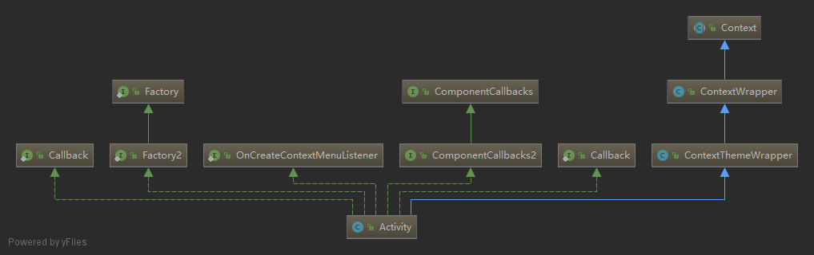
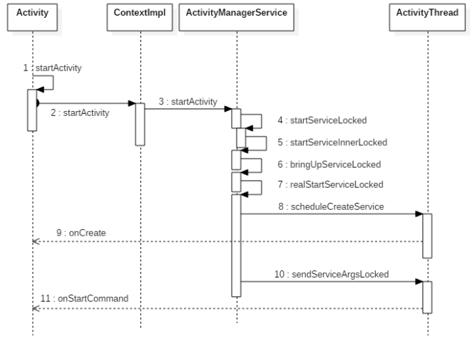
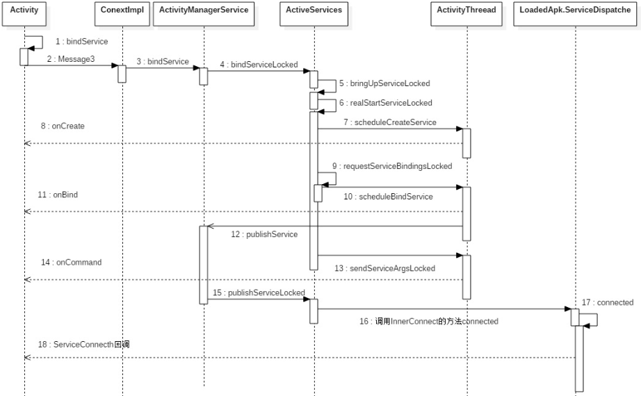

# Service 的启动过程

[TOC]

## 实验环境

- Android sdk：28

- 代码

  ### Intent代码

  ```java
  Intent intent = new Intent(this, TestService.class);
  startService(intent);
  ```

  ### bind代码

  ```java
  TestServiceConnection connection = new TestServiceConnection();
  Intent intent = new Intent(this, TestService.class);
  bindService(intent, connection, BIND_AUTO_CREATE);
  
  ...
  class TestServiceConnection implements ServiceConnection {
  
      @Override
      public void onServiceConnected(ComponentName name, IBinder service) {
  
      }
  
      @Override
      public void onServiceDisconnected(ComponentName name) {
  
      }
  }
  ```

  


## 源码分析

### Intent的方式启动

1. 查看`startService(intent);`

   ```java
   // 定义了成员变量，但不知道哪里有赋值
   Context mBase;
   @Override
   public ComponentName startService(Intent service) {
       return mBase.startService(service);
   }
   // 何时调用的？？？
   protected void attachBaseContext(Context base) {
       if (mBase != null) {
           throw new IllegalStateException("Base context already set");
       }
       mBase = base;
   }
   ```

   `startService(intent);` 方法应是activity自带的方法，但点进去查的时候，发现他跳到ContextWrapper类里面了。

   观察activity的继承

   

   这里发现的确是继承了，那么应该可以找到base的赋值

   搜一下 `base =` 发现搜不到，观察一下

   发现了attachBaseContext被修改，点击看是哪被调用，发现在Attach里面调用了

   ```java
   final void attach(...) {
       // 这里调用了
       attachBaseContext(context);
       ...
   }
   ```

   这个Activity 中的attach 什么时候被调用的呢？？？

   这里就不深究，可以看[activity 的启动分析](../activity/0. activtiyHowToWork.md)

   这里直接说是被**ActivityThread**创建的时候调用的

   在ActivityThread中搜一下attach看一下代码

   ```java
   /**  Core implementation of activity launch. */
   private Activity performLaunchActivity(ActivityClientRecord r, Intent customIntent) {
       ...
       // 这里发现Base应该就是ContextImpl 的子类了
   	ContextImpl appContext = createBaseContextForActivity(r);
       ...
       activity = mInstrumentation.newActivity(
                       cl, component.getClassName(), r.intent);
       ...
       // 这里调用了onAttach
       activity.attach(appContext, this, getInstrumentation(), r.token,
                           r.ident, app, r.intent, r.activityInfo, title, r.parent,
                           r.embeddedID, r.lastNonConfigurationInstances, config,
                           r.referrer, r.voiceInteractor, window, r.configCallback);
       return activity;
   }
   ```

2. 在`ContextImpl.java`中查看一下startService

   ```java
   private ComponentName startServiceCommon(Intent service, boolean requireForeground,
                                            UserHandle user) {
       try {
           validateServiceIntent(service);
           service.prepareToLeaveProcess(this);
           // 注意看这里启动了
           ComponentName cn = ActivityManager.getService().startService(
               mMainThread.getApplicationThread(), service, service.resolveTypeIfNeeded(
                   getContentResolver()), requireForeground,
               getOpPackageName(), user.getIdentifier());
           ...
           return cn;
       } catch (RemoteException e) {
           throw e.rethrowFromSystemServer();
       }
   }
   ```

   ActivityManager.getService()这里应该是获取了ActivityManagerService

   查看`ActivityManager.getService().startActivity()`

   先查看`getService()`

   ```java
   public static IActivityManager getService() {
       return IActivityManagerSingleton.get();
   }
   
   private static final Singleton<IActivityManager> IActivityManagerSingleton =
       new Singleton<IActivityManager>() {
       @Override
       ...
   };
   ```

   再查看一下Singleton的get方法

   ```java
   // 这不就是单例锁吗
   public final T get() {
       synchronized (this) {
           if (mInstance == null) {
               // 调用了create
               mInstance = create();
           }
           return mInstance;
       }
   }
   ```

   看到

   ```java
   protected IActivityManager create() {
       // 注意这里发现应该是AIDL通信
       // 获取了ActivityManagerService 中的binder
       final IBinder b = ServiceManager.getService(Context.ACTIVITY_SERVICE);
       // 这一步应该是通过服务器中的binder对象获取IActivityManager.Stub的类
       final IActivityManager am = IActivityManager.Stub.asInterface(b);
       return am;
   }
   ```

   就分析到这里

3. 接着看AMS中的startService方法

   ```java
   @Override
   public ComponentName startService(IApplicationThread caller, Intent service,
                                     String resolvedType, boolean requireForeground, String callingPackage, int userId)
       throws TransactionTooLargeException {
      // 这里加了同步锁
       synchronized(this) {
           final int callingPid = Binder.getCallingPid();
           final int callingUid = Binder.getCallingUid();
           final long origId = Binder.clearCallingIdentity();
           ComponentName res;
           try {
               // 注意这里，启动了锁
               res = mServices
                   .startServiceLocked(caller, service,resolvedType, 
                                       callingPid, callingUid,requireForeground,
                                       callingPackage, userId);
           } finally {
               Binder.restoreCallingIdentity(origId);
           }
           return res;
       }
   }
   ```

4. 继续查看`ActiveServices.java`中的startServiceLocked的方法

   ```java
   ComponentName startServiceLocked(IApplicationThread caller, Intent service, 
                                    String resolvedType,int callingPid, int callingUid, 
                             boolean fgRequired, String callingPackage, final int userId){
       ...
        // 
        ServiceLookupResult res =
               retrieveServiceLocked(service, resolvedType, callingPackage,
                       callingPid, callingUid, userId, true, callerFg, false, false);
       
       
       ...
       // 这个r应该是记录了service的一些信息，下面会用到
       ServiceRecord r = res.record;
       // 这是一个map
       final ServiceMap smap = getServiceMapLocked(r.userId);
       boolean addToStarting = false;
       // 做了一系列的操作，callerFg是boolean
       ComponentName cmp = startServiceInnerLocked(smap, service, r, 
                                                   callerFg,addToStarting);
   	return cmp;
   }
   
   ```

   这里注意一下**ServiceRecord**记录了service的一些信息，下面会用到

5. `ActiveServices.java`继续查看startServiceInnerLocked

   ```java
   ComponentName startServiceInnerLocked(ServiceMap smap, Intent service, 
                                         ServiceRecord r,boolean callerFg, boolean addToStarting) throws TransactionTooLargeException {
   	ServiceState stracker = r.getTracker();
       ...
       // 这里我们只需要跟踪一下 Intent service 就可以了
       // 发现了这个方法
       String error = bringUpServiceLocked(r, service.getFlags(), callerFg, false, false);
       ...
       return r.name;
   }
   ```

6. `ActiveServices.java`继续查看bringUpServiceLocked

   ```java
   private String bringUpServiceLocked(ServiceRecord r, int intentFlags, 
                                       boolean execInFg,boolean whileRestarting, 
                                       boolean permissionsReviewRequired)
       throws TransactionTooLargeException {
       // 前面都是 处理前提条件
       ...
       // 看到下面这句话，就知道快到启动的时候了-------
       // Service is now being launched, its package can't be stopped.处理包问题
       ...
       realStartServiceLocked(r, app, execInFg);
   	....
       return null;
   }
   ```

7. 查看realStartServiceLocked()

   ```java
   private final void realStartServiceLocked(ServiceRecord r,
                                             ProcessRecord app, boolean execInFg) 
       throws RemoteException {
       ...
       // 这里设置被创建为false
       boolean created = false;
       try {
           ...
           mAm.notifyPackageUse(r.serviceInfo.packageName,
                                PackageManager.NOTIFY_PACKAGE_USE_SERVICE);
           app.forceProcessStateUpTo(ActivityManager.PROCESS_STATE_SERVICE);
           // 这里使用了app的线程，调度并创建了Service
           // 利用的是binder通信方式
           app.thread.scheduleCreateService(r, r.serviceInfo,
                    mAm.compatibilityInfoForPackageLocked(r.serviceInfo.applicationInfo),
                       app.repProcState);
           // 这里只是为创建成功
           created = true;
       } catch (DeadObjectException e) {
           Slog.w(TAG, "Application dead when creating service " + r);
           mAm.appDiedLocked(app);
           throw e;
       } finally {
           ...
       }
       ...
       // 注意一下这里，后面会继续分析
       sendServiceArgsLocked(r, execInFg, true);
       ...
   }
   ```

   **app.thread.scheduleCreateService**这里是用的app的线程调度生成Service，使用的Binder通信

   不好查，实现类是哪个呢？？

   搜一下**AppThread**发现找不到？？被隐藏？还是在内部类

   猜想，，我们是在activity中启动的service，会不会在ActivityThread中，因为先启动activity，也就是说主线程是activity的主线程

   

8. 查看scheduleCreateService方法

   ```java
   public final void scheduleCreateService(IBinder token,
                                           ServiceInfo info, CompatibilityInfo
                                           compatInfo, int processState) {
       updateProcessState(processState, false);
       CreateServiceData s = new CreateServiceData();
       s.token = token;
       s.info = info;
       s.compatInfo = compatInfo;
       // 这里利用的是handler发送消息
       sendMessage(H.CREATE_SERVICE, s);
   }
   ```

9. 查看handler实例中的handlerMessage方法

   ```java
   public void handleMessage(Message msg) {
       ...
       switch (msg.what) {
               ...
               case CREATE_SERVICE:
                       handleCreateService((CreateServiceData)msg.obj);
                       break;
              ...
       }
       ...
   }
   ```

   继续往下看

   ```java
   private void handleCreateService(CreateServiceData data) {
       LoadedApk packageInfo = getPackageInfoNoCheck(
           data.info.applicationInfo, data.compatInfo);
       Service service = null;
       try {
           // 利用类加载器创建了
           java.lang.ClassLoader cl = packageInfo.getClassLoader();
           service = packageInfo.getAppFactory()
               .instantiateService(cl, data.info.name, data.intent);
       }...
       try {
           // 创建了一个上下文，这个上下文和activity是同一个
           ContextImpl context = ContextImpl.createAppContext(this, packageInfo);
           context.setOuterContext(service);
   
           Application app = packageInfo.makeApplication(false, mInstrumentation);
           service.attach(context, this, data.info.name, data.token, app,
                          ActivityManager.getService());
           // 调用了创建的生命周期
           service.onCreate();
           // 用map淳拉起来起来
           mServices.put(data.token, service);
           try {
               ActivityManager.getService().serviceDoneExecuting(
                   data.token, SERVICE_DONE_EXECUTING_ANON, 0, 0);
           } ...
       }...
   }
   ```

   `ContextImpl context = ContextImpl.createAppContext(this, packageInfo);`

   创建了一个上下文，这个上下文和activity是同一个，这里不具体说，可以点进去看

   详细可以看[context的分析](../2. contextWork.md)

10. 回到第7步`ActiveServices.java中sendServiceArgsLocked(r, execInFg, true);`

   ```java
   private final void sendServiceArgsLocked(ServiceRecord r, boolean execInFg,
                                            boolean oomAdjusted) throws TransactionTooLargeException {
       ...
       //看到这里，发现了又是调用了 ActivityThread
       r.app.thread.scheduleServiceArgs(r, slice);
       ...
   }
   ```

   进入ActivityThread.java 中查找scheduleServiceArgs方法

   ```java
   public final void scheduleServiceArgs(IBinder token, ParceledListSlice args) {
       List<ServiceStartArgs> list = args.getList();
   
       for (int i = 0; i < list.size(); i++) {
           ServiceStartArgs ssa = list.get(i);
           ServiceArgsData s = new ServiceArgsData();
           s.token = token;
           s.taskRemoved = ssa.taskRemoved;
           s.startId = ssa.startId;
           s.flags = ssa.flags;
           s.args = ssa.args;
   
           sendMessage(H.SERVICE_ARGS, s);
       }
   }
   
   private void handleServiceArgs(ServiceArgsData data) {
       Service s = mServices.get(data.token);
       if (s != null) {
           try {
               if (data.args != null) {
                   data.args.setExtrasClassLoader(s.getClassLoader());
                   data.args.prepareToEnterProcess();
               }
               int res;
               if (!data.taskRemoved) {
                   // 这里调用了service的onStartCommand
                   res = s.onStartCommand(data.args, data.flags, data.startId);
               } else {
                   s.onTaskRemoved(data.args);
                   res = Service.START_TASK_REMOVED_COMPLETE;
               }
               ...
           } ...
       }
   }
   ```

#### Intent方式流程总结



采用intent的方式启动service，我们直接根据startActivity来追踪源码，点击去发现到了ContextWrapper，

但我们知道这是Activity内部的方法，应该是一个继承的结构导致的，最后追踪到ContextIml类中，他是在activity创建的时候就会初始化，并通过Attach方法来设置。

进入到ContextImpl查看代码，发现通过Binder的通信模式，获取到AMS，由他开启一个activity

最后一系列调度，获取到主线程也就是ActivityThread这个类，利用线程通信Handler传递消息，做了这么几件事

1. 利用他在子线程中采用类加载器，动态创建Service，同时创建了Context类对象，与Activity是同一个，与此同时回调，service.onCreate；并将service中用map维护起来
2. 将创建时候的信息，回调到service，用来onStartCommand，service是上面这一步的map中获取。


### Bind方式启动

1. 开始追踪，从**bindService();**开始，同样应该在ContextImpl.java中查找

   ```java
   @Override
   public boolean bindService(Intent service, ServiceConnection conn,
                              int flags) {
       warnIfCallingFromSystemProcess();
       return bindServiceCommon(service, conn, flags, 
                                mMainThread.getHandler(), getUser());
   }
   ```

2. `ContextImpl.java`中查找bindServiceCommon

   ```java
   private boolean bindServiceCommon(Intent service, ServiceConnection conn, 
                                     int flags, Handler handler, UserHandle user) {
       // Keep this in sync with DevicePolicyManager.bindDeviceAdminServiceAsUser.
       IServiceConnection sd;
       ...
       try {
           ...
           service.prepareToLeaveProcess(this);
           int res = ActivityManager.getService().bindService(
               mMainThread.getApplicationThread(), getActivityToken(), service,
               service.resolveTypeIfNeeded(getContentResolver()),
               sd, flags, getOpPackageName(), user.getIdentifier());
           ...
       }...
   }
   ```

3. 查AMS中的bindService方法

   ```java
   public int bindService(IApplicationThread caller, IBinder token, Intent service,
                          String resolvedType, IServiceConnection connection, 
                          int flags, String callingPackage,
                          int userId) throws TransactionTooLargeException {
       
       enforceNotIsolatedCaller("bindService");
      ...
       synchronized(this) {
           return mServices.bindServiceLocked(caller, token, service,
                                              resolvedType, connection, 
                                              flags, callingPackage, userId);
       }
   }
   ```

4. 继续查看`ActiveServices.java` 中的bindServiceLocked

   ```java
   int bindServiceLocked(IApplicationThread caller, IBinder token, Intent service,
                         String resolvedType, final IServiceConnection connection, 
                         int flags,String callingPackage, final int userId) 
       throws TransactionTooLargeException {
       // 看到这里就可以发现就在不远处了
       // If permissions need a review before any of the app components can run,
       // we schedule binding to the service but do not start its process, then
       // we launch a review activity to which is passed a callback to invoke
       // when done to start the bound service's process to completing the binding.
       RemoteCallback callback = new RemoteCallback(
           new RemoteCallback.OnResultListener() {
               @Override
               public void onResult(Bundle result) {
                   // 这里加了同步锁
                   synchronized(mAm) {
                       ...
                       if (...) {
                           try {
                               // 注意这一句
                               bringUpServiceLocked(serviceRecord,
                                                    serviceIntent.getFlags(),
                                                    callerFg, false, false);
                           } ...
                       } else {
                           unbindServiceLocked(connection);
                       }
                   }
               }
           });
       ...
       return 1;
   }
   ```

5. 发现了`bringUpServiceLocked` ---> `realStartServiceLocked` 

   ```java
       private final void realStartServiceLocked(ServiceRecord r,
               ProcessRecord app, boolean execInFg) throws RemoteException {
           ...
           boolean created = false;
           try {
               i
               mAm.notifyPackageUse(r.serviceInfo.packageName,
                                    PackageManager.NOTIFY_PACKAGE_USE_SERVICE);
               app.forceProcessStateUpTo(ActivityManager.PROCESS_STATE_SERVICE);
               // 这里进行了一个创建了一个service，与intent启动的一样
               app.thread.scheduleCreateService(r, r.serviceInfo,
                       mAm.compatibilityInfoForPackageLocked(
                           r.serviceInfo.applicationInfo),
                       app.repProcState);
               r.postNotification();
               created = true;
           } 
           ...
           // 这里请求bind
           requestServiceBindingsLocked(r, execInFg);
           updateServiceClientActivitiesLocked(app, null, true);
           ...
           // 发送参数，调用onCommand();
           sendServiceArgsLocked(r, execInFg, true);
   
       }
   ```

6. 追踪**requestServiceBindingsLocked**

   ```java
   private final boolean 
   requestServiceBindingLocked(ServiceRecord r, IntentBindRecord i,
                               boolean execInFg, boolean rebind) throws 
       TransactionTooLargeException {
       ...
       if ((!i.requested || rebind) && i.apps.size() > 0) {
           try {
               bumpServiceExecutingLocked(r, execInFg, "bind");
               r.app.forceProcessStateUpTo(ActivityManager.PROCESS_STATE_SERVICE);
               // 注意这里
               r.app.thread.scheduleBindService(r, i.intent.getIntent(), rebind,
                                                r.app.repProcState);
               if (!rebind) {
                   i.requested = true;
               }
               i.hasBound = true;
               i.doRebind = false;
           } ...
       }
       return true;
   }
   ```

7. 在ActivityThread中寻找**scheduleBindService**

   ```java
   public final void scheduleBindService(IBinder token, Intent intent,
                                         boolean rebind, int processState) {
       updateProcessState(processState, false);
       BindServiceData s = new BindServiceData();
       s.token = token;
       s.intent = intent;
       s.rebind = rebind;
   
       if (DEBUG_SERVICE)
           Slog.v(TAG, "scheduleBindService token=" + token + " intent=" + intent + " uid="
                  + Binder.getCallingUid() + " pid=" + Binder.getCallingPid());
       sendMessage(H.BIND_SERVICE, s);
   }
   ```

   找到handler处理bind的逻辑方法

   ```java
       private void handleBindService(BindServiceData data) {
           Service s = mServices.get(data.token);
           if (s != null) {
               try {
                   data.intent.setExtrasClassLoader(s.getClassLoader());
                   data.intent.prepareToEnterProcess();
                   try {
                       // 对于重复bind做了一个限制
                       if (!data.rebind) {
                           IBinder binder = s.onBind(data.intent);
                           ActivityManager.getService().publishService(
                                   data.token, data.intent, binder);
                       } else {
                           s.onRebind(data.intent);
                           ActivityManager.getService().serviceDoneExecuting(
                                   data.token, SERVICE_DONE_EXECUTING_ANON, 0, 0);
                       }
                       ensureJitEnabled();
                   } ...
               }...
           }
       }
   ```

8. 在AMS中查看那**publishService**

   ```java
   public void publishService(IBinder token, Intent intent, IBinder service) {
       // Refuse possible leaked file descriptors
       if (intent != null && intent.hasFileDescriptors() == true) {
           throw new IllegalArgumentException("File descriptors passed in Intent");
       }
   
       synchronized(this) {
           if (!(token instanceof ServiceRecord)) {
               throw new IllegalArgumentException("Invalid service token");
           }
           // 注意这里
           mServices.publishServiceLocked((ServiceRecord)token, intent, service);
       }
   }
   ```

9. 查看ActiveServices.java中的**publishServiceLocked**

   ```java
   void publishServiceLocked(ServiceRecord r, Intent intent, IBinder service) {
       final long origId = Binder.clearCallingIdentity();
       try {
           if (r != null) {
               if (b != null && !b.received) {
                   ...
                   for (int conni=r.connections.size()-1; conni>=0; conni--) {
                       ArrayList<ConnectionRecord> clist = r.connections.valueAt(conni);
                       for (int i=0; i<clist.size(); i++) {
                           ConnectionRecord c = clist.get(i);
                           try {
                               // 注意这里
                               c.conn.connected(r.name, service, false);
                           }...
                       }
                   }
               }
               serviceDoneExecutingLocked(r, mDestroyingServices.contains(r), false);
           }
       } finally {
           Binder.restoreCallingIdentity(origId);
       }
   }
   ```

   `c.conn.connected(r.name, service, false);`中 conn是**IServiceConnection**类型，应该是一个Bind通信

10. `IServiceConnection.Stub`的实现者在**LoadedApk**中

   ```java
   static final class ServiceDispatcher {
      ...
   
       private static class InnerConnection extends IServiceConnection.Stub {
           final WeakReference<LoadedApk.ServiceDispatcher> mDispatcher;
   
           InnerConnection(LoadedApk.ServiceDispatcher sd) {
               mDispatcher = new WeakReference<LoadedApk.ServiceDispatcher>(sd);
           }
   
           // 看到这里
           public void connected(ComponentName name, IBinder service, boolean dead)
               throws RemoteException {
               // 用的是外部类的方法
               LoadedApk.ServiceDispatcher sd = mDispatcher.get();
               if (sd != null) {
                   sd.connected(name, service, dead);
               }
           }
       }
   
       ...
   }
   ```

   可以看到ServiceDispatcher中有个内部类，InnerConnection 是实现了IServiceConnection.Stub

11. 在LoadAPk.ServiceDispatcher.class 中查看connected()

    ```java
    public void connected(ComponentName name, IBinder service, boolean dead) {
        if (mActivityThread != null) {
            // 拿到activity的线程，进行回调
            mActivityThread.post(new RunConnection(name, service, 0, dead));
        } else {
            doConnected(name, service, dead);
        }
    }
    ```

    继续往下分析可以看到，我们应该设置的**TestServiceConnection**被回调。

#### Bind方式启动总结



打

## Service总结

经过分析，发现有什么特性？？？


