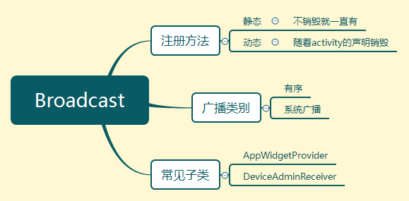

# Broadcast 基础

[TOC]




#### 简介


##### 专业描述

采用[发布订阅的模式](..\pattern\push_subscribe.md)

用来不同软件和软件与系统之间传递消息，不可滥用不然会造成软件运行慢。


##### 生活情境

有点像

信箱(recevier)，一个公司(application)，订阅(register)了之后就发过来，在邮递员(intent)根据他的表格(AndroidManifest.xml) 进行筛选(intent-filter)，对于不需要进行审阅修饰的信息，就无序(normal broadcast)发送，否则设定权限(priority)，进行消息拦截处理。那么说道者一个邮件的发送与订阅说完了，对于一个公司而言，广播分为外部和内部，则我们需要对其中一个进行一个修饰限定，我们在公司内部设立了一个广播的管理者(localManager)

如果我们需要一个内部的广播，我们需要一个管理者对这些广播处理([LocalBroadcastManager](https://developer.android.google.cn/reference/android/support/v4/content/LocalBroadcastManager.html))


#### 广播的类别

由于一个软件中会有不同的广播，接收消息的方式在时间上就可以有差别

- **无序广播**(noramal broadcast)：广播异步发送，每个广播接收器都会收到消息。

- **有序广播**(oder broadcast)：同步的，可以设定接收消息的 **优先级** 

  - 在 intent-filter 里面设置优先级数

  ```xml
  <intent-filter android:prioriry="100">
  </intent-filter>
  ```

  - 对广播进行拦截

    ```java
    abortBroadcast();
    ```

有序广播相对来说，会比较有效率，但也无法截获消息


#### 使用


##### 广播行为查询

可以在这个文件中查询，相关的action

`Android\Sdk\platforms\android-24\data\broadcast_actions.txt`


##### 动态 (监听网络变化)

AndroidManifest.xml

```xml
 <uses-permission android:name="android.permission.ACCESS_NETWORK_STATE" />
```

java 文件

```java
private NetBroadcast netBroadcast;

    @Override
    protected void onCreate(Bundle savedInstanceState) {
        super.onCreate(savedInstanceState);
        setContentView(R.layout.activity_main);

        // 实现广播订阅
        IntentFilter intentFilter = new IntentFilter();
        intentFilter.addAction("android.net.conn.CONNECTIVITY_CHANGE");
        netBroadcast = new NetBroadcast();
        registerReceiver(netBroadcast, intentFilter);
    }


    class NetBroadcast extends BroadcastReceiver{
        @Override
        public void onReceive(Context context, Intent intent) {
            //通过名字获取到系统级别的服务
            //https://developer.android.google.cn/reference/android/content/Context.html#getSystemService(java.lang.String)
            ConnectivityManager connectivityManager = (ConnectivityManager) 					getSystemService(Context.CONNECTIVITY_SERVICE);
            NetworkInfo networkInfo = connectivityManager.getActiveNetworkInfo();
            if (networkInfo != null && networkInfo.isAvailable()){
                Toast.makeText(context, "正常开启网络！！", Toast.LENGTH_SHORT).show();
            }else {
                Toast.makeText(context, "没有网络！！！！", Toast.LENGTH_SHORT).show();
            }
        }
    }

    @Override
    protected void onDestroy() {
        super.onDestroy();

        unregisterReceiver(netBroadcast);
    }
```


##### 静态 （开机自启）

AndroidManifest.xml 订阅广播

```xml
<uses-permission android:name="android.permission.RECEIVE_BOOT_COMPLETED" />

<application
             android:allowBackup="true"
             android:icon="@mipmap/ic_launcher"
             android:label="@string/app_name"
             android:roundIcon="@mipmap/ic_launcher_round"
             android:supportsRtl="true"
             android:theme="@style/AppTheme"
             tools:ignore="GoogleAppIndexingWarning">
    <activity android:name=".MainActivity">
        <intent-filter>
            <action android:name="android.intent.action.MAIN" />
            <category android:name="android.intent.category.LAUNCHER" />
        </intent-filter>
    </activity>
    <receiver
              android:name=".BootBroadcastReceiver"
              android:enabled="true"
              android:exported="true">
        <intent-filter>
            <action android:name="android.intent.action.BOOT_COMPLETED" />
        </intent-filter>
    </receiver>
</application>
```


java 文件

```java
public class BootBroadcastReceiver extends BroadcastReceiver {
    @Override
    public void onReceive(Context context, Intent intent) {
        Toast.makeText(context, "开机广播", Toast.LENGTH_SHORT).show();
        Intent i = new Intent(context, MainActivity.class);
        i.setFlags(Intent.FLAG_ACTIVITY_NEW_TASK);
        context.startActivity(i);
    }
}
```


#### 自定义广播


##### 全局广播

java  文件

```java
Button btnSend = findViewById(R.id.btn_kk);

btnSend.setOnClickListener(new View.OnClickListener() {
	@Override
	public void onClick(View v) {
        // 不断发送消息，如收到系统网络的切换，那么是系统在发送广播
		Intent intent = new Intent("com.example.fragmentlab.CustomizeBroadcast");
		sendBroadcast(intent);
	}
});
```

AndroidManifest.xml

```xml
<application>
	    <receiver
            android:name=".CustomizeBroadcast"
            android:enabled="true"
            android:exported="true">
            <intent-filter>
                <!--name里面的内容是自定义的-->
                <action android:name="com.example.fragmentlab.CustomizeBroadcast"/>
            </intent-filter>
        </receiver>
</application>
```


启动方式的区别——todo
--------------------


##### 本地广播

**LocalBroadcastManager**在activtiy中获取对象

```java
LocalBroadcastManager manager= LocalBroadcastManager.getInstance(this);
```

广播分为这么几个部分

- 发送

  ```java
  manager.sendIntent(Intent);
  ```

- 订阅

  ```java
  manager.registerReceiver(BroadcastRecevier, IntentFilter);
  ```

- 接收

- 注销

  ```java
  manager.unRegisterReceiver()
  ```


#### 广播过滤


#### 版本问题

[android 版本迭代导致 发送广播到摸个应用 会发生变化](https://developer.android.google.cn/guide/components/broadcasts#java)


#### 应用实例