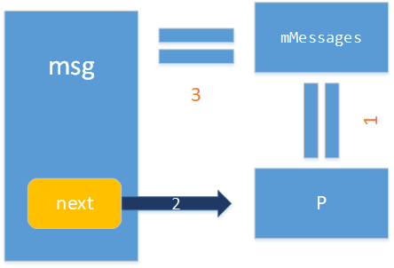
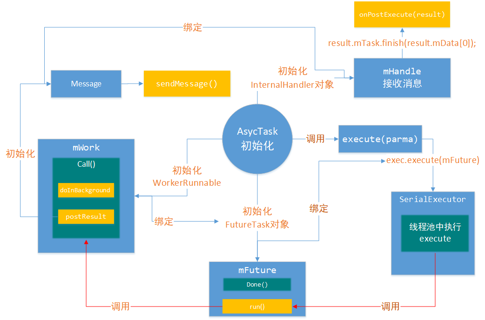

#  android 的消息机制

[TOC]

### 环境搭建

#### 工具准备

android studio

#### 项目实现

##### 项目效果


##### 代码

```java
public class MainActivity extends AppCompatActivity {

    public String TAG = MainActivity.class.getName();

    private Button btnClick;
    
    // handler的声明
    @SuppressLint("HandlerLeak")
    Handler handler = new Handler() {
        @Override
        public void handleMessage(Message msg) {
            super.handleMessage(msg);
            int key = msg.arg1;
            String info = (String) msg.obj;
            Log.e(TAG, "handleMessage: " + key);
            switch (key) {
                case 0:
                    // 修改
                    btnClick.setText(info);
                    break;
                default:
                    btnClick.setText("click me");
            }
        }
    };

    @Override
    protected void onCreate(Bundle savedInstanceState) {
        super.onCreate(savedInstanceState);
        setContentView(R.layout.activity_main);
        btnClick = findViewById(R.id.btn_click);

        btnClick.setOnClickListener(new View.OnClickListener() {
            @Override
            public void onClick(View v) {
                // 开启一个子线程
                new Thread(new Runnable() {
                    @Override
                    public void run() {
                        // 用线程传递消息
                        Message message = Message.obtain();
                        message.arg1 = 0;
                        message.obj = "here is 0";
                        handler.sendMessage(message);
                    }
                }).start();
            }
        });
    }


}
```


### handler源码分析

1. 先从 `handler.sendMessage(message);`这一步开始

   点击先追踪到这里，先看看

   ```java
   // msg 使我们建立的对象，delayMillis是指的是延迟时间
   public final boolean sendMessageDelayed(Message msg, long delayMillis)
   {
       if (delayMillis < 0) {
           delayMillis = 0;
       }
       // 一点一点的往下包装
       // SystemClock.uptimeMillis() 当前系统的时钟
       return sendMessageAtTime(msg, SystemClock.uptimeMillis() + delayMillis);
   }
   ```

2. 继续往下看，一直追踪到这里

   ```java
   public boolean sendMessageAtTime(Message msg, long uptimeMillis) {
       // 拿到我的队列，这个队列是哪里的???
       // 先不管，先往下分析
       MessageQueue queue = mQueue;
       if (queue == null) {
           RuntimeException e = new RuntimeException(
               this + " sendMessageAtTime() called with no mQueue");
           Log.w("Looper", e.getMessage(), e);
           return false;
       }
       return enqueueMessage(queue, msg, uptimeMillis);
   }
   private boolean enqueueMessage(MessageQueue queue, Message msg, long uptimeMillis) {
       // 这个this 指的什么？？，应该是我们创建的handler
       msg.target = this;
       if (mAsynchronous) {
           msg.setAsynchronous(true);
       }
       // 加入MessageQueue 队列进行排序
       return queue.enqueueMessage(msg, uptimeMillis);
   }
   ```

3. 继续往下走，在`MessageQueue.class` 中查看`enqueueMessage`

   ```java
   boolean enqueueMessage(Message msg, long when) {
       ...
       synchronized (this) {
          // 对消息进行了处理
           ...
           // 这里这个操作？？哪里来的mMessage？先不管往下看
           Message p = mMessages;
           // 当前时间小于第一条信息的时间
           if (p == null || when == 0 || when < p.when) {
               // New head, wake up the event queue if blocked.
               msg.next = p;
               // 这里一波操作，说明mMessages是最新的消息，一个回旋指。。
               mMessages = msg;
           } else {
              ...
               Message prev;
           // 这个是什么操作？？？
               for (;;) {
                   prev = p 
                   p = p.next;
                   // 当前时间小于此时信息的时间
                   if (p == null || when < p.when) {
                       break;
                   }
                   if (needWake && p.isAsynchronous()) {
                       needWake = false;
                   }
               }
               msg.next = p; // invariant: p == prev.next
               prev.next = msg;
           ...
   
           // We can assume mPtr != 0 because mQuitting is false.
           if (needWake) {
               nativeWake(mPtr);
           }
       }
       return true;
   }
   ```

   - 
   - for循环的操作应该是一个链表的操作，将msg加到链表中，单最后一个指针为空的时候退出或者当前时间小于此时的msg，这里应该是做了一个**时间加权排序**

4. 到这里，Message的添加就完成了，是什么时候反馈消息的？？？什么时候做接收的？？

   回过头来看一下mQueue哪里来的？

   在`handle.java`中找一下`mQueue =` 

   ```java
   // 在构造方法中找到了，诶这个构造方法我们没有用啊
   // 项目中点击我我们设置的构造方法，发现还是会回到这里
   public Handler(Callback callback, boolean async) {
       ...
       mLooper = Looper.myLooper();
       ...
       // 发现是Looper里面的东西
       mQueue = mLooper.mQueue;
       ...
   }
   ```

5. `Looper.java`继续追踪一下`Looper.myLooper();`

   ```java
   // sThreadLocal.get() will return null unless you've called prepare().
   static final ThreadLocal<Looper> sThreadLocal = new ThreadLocal<Looper>();
   // 返回与当前线程关联的Looper对象
   // 应该就是主线程，因为我们是在主线程创建的
   public static @Nullable Looper myLooper() {
       // 这里发现这个looper里面管理一个装载looper的ThreadLocal类型的map                       
       return sThreadLocal.get();
   }
   ```

6. `Looper.java中sThreadLocal.get();`那么主线程是在什么时候创建的呢?？这样我们做了有什么用？？？

   先查一下：`sThreadLocal.set`

   ```java
   private static void prepare(boolean quitAllowed) {
       if (sThreadLocal.get() != null) {
           throw new RuntimeException("Only one Looper may be created per thread");
       }
       sThreadLocal.set(new Looper(quitAllowed));
   }
   ```

7. `Looper.java`中继续查看是谁调用了`prepare(boolean quitAllowed)`

   ```java
   // 这里应该是创建了一个主线程
   public static void prepareMainLooper() {
       prepare(false);
       synchronized (Looper.class) {
           if (sMainLooper != null) {
               throw new IllegalStateException("The main Looper has already been prepared.");
           }
           sMainLooper = myLooper();
       }
   }
   ```

8. 点击查询prepareMainLooper()谁调用了，发现是SystemServer.java 系统服务调用了

   `SystemServer.java` 这个是android系统的启动类，如果要详细了解看[app启动流程](1. applicationStart.md)

   ```java
   private void run() {
   	...
       // Prepare the main looper thread (this thread).
       android.os.Process.setThreadPriority(
           android.os.Process.THREAD_PRIORITY_FOREGROUND);
       android.os.Process.setCanSelfBackground(false);
       // 这里设置了主线程，说明之前sMainLooper已经被创建
       Looper.prepareMainLooper();
       Looper.getMainLooper().setSlowLogThresholdMs(
           SLOW_DISPATCH_THRESHOLD_MS, SLOW_DELIVERY_THRESHOLD_MS);
      ...
       // Initialize the system context.
       // 这里追踪下去，你会发现ActivityThread被创建
       createSystemContext();
       ...
       // Loop forever.
       Looper.loop();
       throw new RuntimeException("Main thread loop unexpectedly exited");
   }
   ```

9. 到上面已经理清楚了， 线程被Looper所维护，而Handle维护着`MessageQueue`消息队列和`Looper`。

   我们进入 `Looper.loop();`看一下里面做了什么

   ```java
   /**
   * Run the message queue in this thread. Be sure to call
   * {@link #quit()} to end the loop.
   */
   public static void loop() {
       final Looper me = myLooper(); // 获取到当前的looper
       final MessageQueue queue = me.mQueue;	// 当前looper的消息队列
       for (;;) {
           Message msg = queue.next(); // might block
           if (msg == null) {
               // No message indicates that the message queue is quitting.
               return;
           }
           try {
               msg.target.dispatchMessage(msg);
               dispatchEnd = needEndTime ? SystemClock.uptimeMillis() : 0;
           } finally {
           msg.recycleUnchecked();
       }
   }
   ```

   这个循环做了一件事，就是不断的把消息分配`msg.target.dispatchMessage(msg);`

   这里target是什么？？？回去看第3步，是handler

   

10. 看一下`msg.target.dispatchMessage(msg);`也就是handler.java 的dispatchMessage方法。

   ```java
   /**
   * Handle system messages here.
   */
   public void dispatchMessage(Message msg) {
       if (msg.callback != null) {
           handleCallback(msg);
       } else {
           if (mCallback != null) {
               if (mCallback.handleMessage(msg)) {
                   return;
               }
           }
           handleMessage(msg);
       }
   }
   ```

   这里出现了三种回调方式，这里也是代表着我们配合handler可以采用不同的方式实现消息回调

   **本项目中是使用的是第3种，重写了父类的方法**

   -  handleCallback(msg)：设置回调对象

     ```java
     private static void handleCallback(Message message) {
         message.callback.run();
     }
     ```

   - mCallback.handleMessage(msg)： 实现回调接口

     ```java
     public interface Callback {
         public boolean handleMessage(Message msg);
     }
     ```

   - handleMessage(msg)：复写父类方法

     ```java
     /**
     * Subclasses must implement this to receive messages.
     */
     public void handleMessage(Message msg) {
     }
     ```

     


### handler的使用


### 总结


- 在Handler类中维护了两个东西，一个是消息队列，另外一个是ThreadLocal，这个是由map构成的，用来绑定当前线程与looper

- 我们创建了一个handler对象用来发消息，肯定要有消息接收的地方，也就是说我们要设置一个消息回调的地方，有三种方法，看前面的内容。

- 我们要把消息发给对应的接收消息的地方，这里我们首先消息与handle的绑定
- 同时我们拿到我们开始创建handler的线程的looper ，这里要说的是，一开始handler被创建的时候，当前的线程已经绑定looper，这样我们就可以拿到msg，并将消息分发。


## AyscTask

### 环境搭建

#### 工具准备

android studio

#### 项目实现

##### 项目效果

点击加载图片

<video controls="controls" width="150px;">
    <source src="picture/asycTask.webm" type="video/webm">
</video>

##### 代码

- MainActivity

  ```java
  public class MainActivity extends AppCompatActivity {
  
      public String TAG = MainActivity.class.getName();
  
      private Button btnClick;
  
      private String url = "https://ss0.bdstatic.com/5aV1bjqh_Q23odCf/static/superman/img/logo_top_86d58ae1.png";
      private ImageView loadImage;
  
  
      @Override
      protected void onCreate(Bundle savedInstanceState) {
          super.onCreate(savedInstanceState);
          setContentView(R.layout.activity_main);
          btnClick = findViewById(R.id.btn_click);
          loadImage = findViewById(R.id.iv_load_image);
          btnClick.setOnClickListener(new View.OnClickListener() {
              @Override
              public void onClick(View v) {
                  new LoadImageTask().execute(url);
              }
          });
      }
  
  
      class LoadImageTask extends AsyncTask<String,Void,Bitmap>{
  
          @Override
          protected Bitmap doInBackground(String... params) {
              //获取传进来的参数
              String url = params[0];
              Bitmap bitmap = null;
              URLConnection connection ;
              InputStream is ;
              try {
                  connection = new URL(url).openConnection();
                  is = connection.getInputStream();
                  BufferedInputStream bis = new BufferedInputStream(is);
                  //通过decodeStream方法解析输入流
                  bitmap = BitmapFactory.decodeStream(bis);
                  is.close();
                  bis.close();
              } catch (IOException e) {
                  e.printStackTrace();
              }
              return bitmap;
          }
  
  
          @Override
          protected void onPostExecute(Bitmap bitmap) {
              super.onPostExecute(bitmap);
  
              loadImage.setImageBitmap(bitmap);
          }
      }
  
  }
  ```

- 联网声明

  ```xml
  <uses-permission android:name="android.permission.INTERNET"/>
  ```

  

### AyscTast源码分析

1. 从这句`new LoadImageTask().execute(url);`开始分析吧

   ```java
   private final WorkerRunnable<Params, Result> mWorker;
   private final FutureTask<Result> mFuture;
   // 注意一下volatile易变的
   private static volatile Executor sDefaultExecutor = SERIAL_EXECUTOR;
   public static final Executor SERIAL_EXECUTOR = new SerialExecutor();
   //内部类
   private static abstract class WorkerRunnable<Params, Result> implements
       Callable<Result> {
       Params[] mParams;
   }
   
   @MainThread
   public final AsyncTask<Params, Progress, Result> 
   	executeOnExecutor(Executor exec, Params... params) {
   	// 处理状态问题
      ...
      // 设置当前状态为运行时
       mStatus = Status.RUNNING;
       onPreExecute();
       // 下面会用到==初始化下面会提到，先不管
       mWorker.mParams = params;
       exec.execute(mFuture);
       return this;
   }
   ```

   解释两个

   - mWorker：WorkerRunnable的对象，装载了子线程执行的参数，有call()回调方法
   - exec：是sDefaultExecutor，是Executor的对象

2. 向下追踪查看一下exec得构建

   ```java
   public static final Executor SERIAL_EXECUTOR = new SerialExecutor();
   private static class SerialExecutor implements Executor {
       // 在这里建立了mTasks
       final ArrayDeque<Runnable> mTasks = new ArrayDeque<Runnable>();
       Runnable mActive;
   
       public synchronized void execute(final Runnable r) {
           // 这个操作是往mTasks队列中加入了一个runnable
           mTasks.offer(new Runnable() {
               public void run() {
                   try {
                       // 这里开启了mFuture的run方法，也就是线程，但并没有调用
                       r.run();
                   } finally {
                       scheduleNext();
                   }
               }
           });
           if (mActive == null) {
               scheduleNext();
           }
       }
   
       protected synchronized void scheduleNext() {
           // 注意这里进行了赋值，获取了mTasks的一个runnable对象
           if ((mActive = mTasks.poll()) != null) {
               // 这里应该是在线程池中拿出了存活的一个线程进行了执行
               THREAD_POOL_EXECUTOR.execute(mActive);
           }
       }
   }
   ```

   可以看出，`exec.execute(mFuture);`是我们想要执行的东西再子线程执行了。

   而这个mFuture应该是一个Runnable对象

   

3. 这里先查看一下mFuture，发现他是一个FutureTask的对象，在我们建立AsyncTask对象的时候初始化了

   ```java
   private final FutureTask<Result> mFuture;
   public AsyncTask(@Nullable Looper callbackLooper) {
       // handler 初始化了
       mHandler = callbackLooper == null || callbackLooper == Looper.getMainLooper()
           ? getMainHandler()
           : new Handler(callbackLooper);
       // 发现实例化了mWorker，复写了回调方法
       mWorker = new WorkerRunnable<Params, Result>() {
           public Result call() throws Exception {
               // 这个方法是用来判定这个call方法是否被调用，用来进行错误处理
               mTaskInvoked.set(true);
               Result result = null;
               try {
                   Process.setThreadPriority(Process.THREAD_PRIORITY_BACKGROUND);
                   //noinspection unchecked
                   //==================================注意这里
                   result = doInBackground(mParams);
                   Binder.flushPendingCommands();
               } catch (Throwable tr) {
                   mCancelled.set(true);
                   throw tr;
               } finally {
                   //==================================注意这里
                   postResult(result);
               }
               return result;
           }
       };
       // mFuture 与 mWorker相互绑定
       mFuture = new FutureTask<Result>(mWorker) {
           @Override
           protected void done() {
               try {
                   // 这里是判断mwork 里面的call是否被调用，用做错误处理
                   postResultIfNotInvoked(get());
               } catch (InterruptedException e) {
                   android.util.Log.w(LOG_TAG, e);
               } catch (ExecutionException e) {
                   throw new RuntimeException("An error occurred while executing
                                              doInBackground()",
                                              e.getCause());
               } catch (CancellationException e) {
                   postResultIfNotInvoked(null);
               }
           }
       };
   }
   ```

   再看一下这里是如何建立的Handler，应该有接收消息的方法

   ```java
   private static Handler getMainHandler() {
       synchronized (AsyncTask.class) {
           if (sHandler == null) {
               // 发现建立了一个内部类，同时通过Looper传入了一个主线程
               sHandler = new InternalHandler(Looper.getMainLooper());
           }
           return sHandler;
       }
   }
   private static class InternalHandler extends Handler {
       public InternalHandler(Looper looper) {
           super(looper);
       }
   
       @SuppressWarnings({"unchecked", "RawUseOfParameterizedType"})
       @Override
       public void handleMessage(Message msg) {
           AsyncTaskResult<?> result = (AsyncTaskResult<?>) msg.obj;
           switch (msg.what) {
               case MESSAGE_POST_RESULT:
                   // 这里看一下，这里就是进行了我们对消息的回调主线程的方法
                   result.mTask.finish(result.mData[0]);
                   break;
               case MESSAGE_POST_PROGRESS:
                   // 更新进度
                   result.mTask.onProgressUpdate(result.mData);
                   break;
           }
       }
   }
   
   ```

   

4. 我们再点进去查询一下FutureTask.java 的构造方法，mWorker作为一个回调与mFuture相互绑定

   ```java
   public FutureTask(Callable<V> callable) {
       if (callable == null)
           throw new NullPointerException();
       // 也就是时候，这callable就是上面我们建立的mwork
       this.callable = callable;
       this.state = NEW;       // ensure visibility of callable
   }
   ```

5. 接着查看：`FutureTask.java`中的run()；这个在`exec.execute(mFuture);`执行了，也就是第2步

   ```java
   public void run() {
      ....
       try {
           // 进行了一个赋值，这个callable注意了，这个就是我们的 mWork
           Callable<V> c = callable;
           if (c != null && state == NEW) {
               V result;
               boolean ran;
               try {
                   // 这里进行了一个回调
                   result = c.call();
                   ran = true;
               } ....
               // 如果已经
               if (ran)
                   // 这里做了一个存储，上一步分析有个get
                   // 这里追踪下去，可以看到调用了FutureTask的done方法 ，这里就不做深究。
                   // 用来通知当前方法已经被调用，处理一下后续的线程处理
                   set(result);
           }
       }...
   }
   ```

   而我们注意到mwork初始化的时候，就复写了run方法：

   运行了两个关键方法：

   - result = doInBackground(mParams)：这个也就是我们复写方法，也就是需要在子线程执行的方法

   - postResult(result)：注意这里还是子线程之间的传递

     ```java
     private Result postResult(Result result) {
         @SuppressWarnings("unchecked")
         // 这里获得的getHandler()就是我们创建AsyncTask时候创建的
         Message message = getHandler()
             .obtainMessage(MESSAGE_POST_RESULT,
                            new AsyncTaskResult<Result>(this, result));
         // 把dobackground完成后的返回结果进行一个发送
         message.sendToTarget();
         return result;
     }
     
     public void sendToTarget() {
         // 拿到主线程的handler，发送消息，前面InternalHandler接收做处理
         target.sendMessage(this);
     }
     
     ```

   

## AyscTast源码总结




AsycTask分两大块来介绍

AsycTask，是处理一个处理任务的一个类。

他肯定需要具有：处理事务，反馈结果，展示进度的作用

那么AsycTask类根据我们的需求设置了三个主要的方法：

- 在子线程中处理逻辑的方法，取名为dobackground
- 处理执行完的返回结果，取名为：onPostExecute;
- 还有一个给出了当前任务执行的进度：onProgressUpdate。

而他作为一个耗时的处理类，肯定底层是基于handler。

而AsycTask对handle做了一些优化，大概是分了这么几块

- 执行任务逻辑和数据模块打包成一个WorkRunnable类
- 对handle再进行一次封装，实现消息的接收与反馈的功能，也就是我们的InnerHandle类
- 将错误处理与子线程逻辑调用封装成：FutureTask类，进行统一处理
- 将我们线程要执行的内容丢到线程池中统一去处理，实现复用与时间调度，这里封装的SerialExecutor

**这里是实现的是：任务、消息通知、子线程的运行解耦**

最后说一下，就是由于我们需要传入的参数与，反馈的数据，都不确定，所以AsycTask类用了泛型


