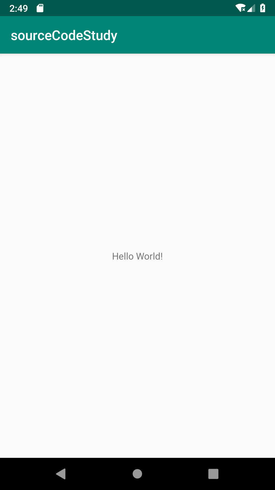
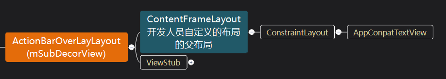
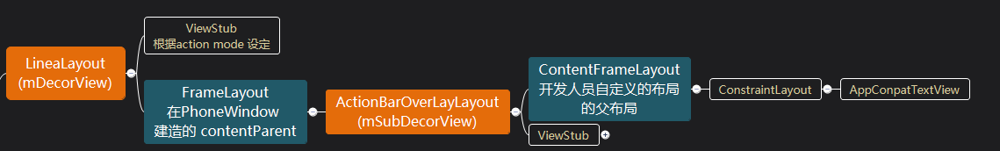
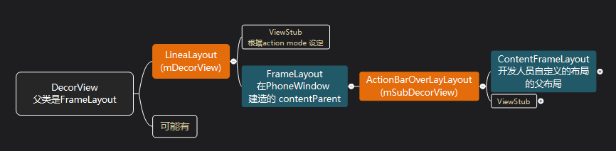
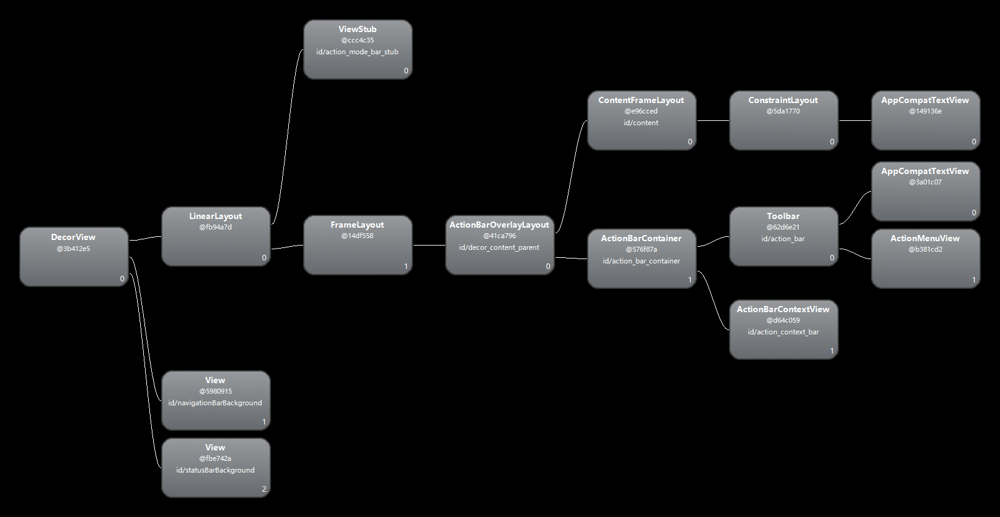
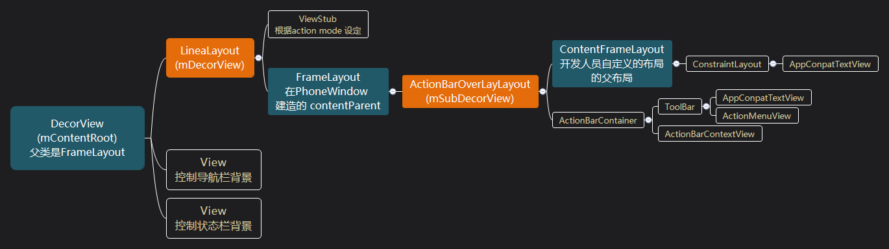
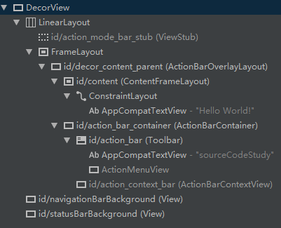
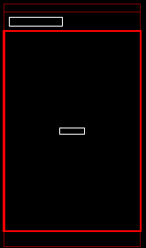
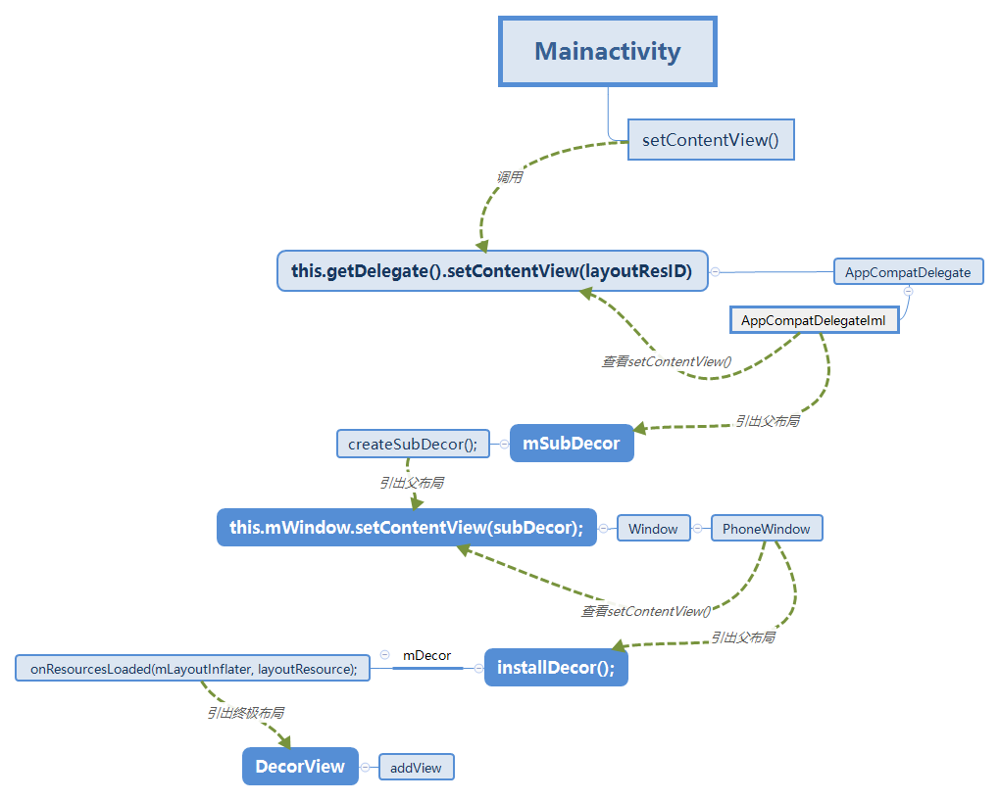
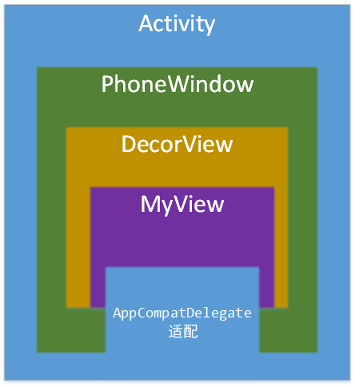

# View的加载机制——源码剖析

[^2019/3/2]: 

[TOC]

## 使用工具

Android studio，Android Device Monitor，Source light

## 环境搭建

- `compileSdkVersion 28`

- 由于android studio 高级版本再图形化界面找不到Android Device Monitor选项卡

  - 进入android studio 中的`settings---> appearance ---> system settings --> Android SDK` 

    复制SDK路径，贴一下我的路径：`C:\Users\KevinLeak\AppData\Local\Android\Sdk`

    复制路径进入SDK目录找：`tools\monitor.bat` 点击可进入

  - 如果发现没有这个东西，需要在`settings---> appearance ---> system settings --> Android SDK`  的 `SDK tools` 勾选 `Android SDK tools`

- android 的项目建立：

  由于新版本的android studio 的 Android Device Monitor 视图层级浏览有问题(这里就不贴错误了)，贴一个stackflow的解决方案

  - 建立一个普通不需要修改的项目，并导入maven包

    ```groovy
    allprojects {
        repositories {
            google()
            jcenter()
            maven { url "https://jitpack.io" }
        }
    }
    ```

  - 添加权限，不要忘记了极其重要

    ```xml
     <uses-permission android:name="android.permission.INTERNET" />
    ```

  - 贴一下`MainActivity.class`

    ```java
    public class MainActivity extends AppCompatActivity {
        @Override
        protected void onCreate(Bundle savedInstanceState) {
            super.onCreate(savedInstanceState);
            setContentView(R.layout.activity_main);
            ViewServer.get(this).addWindow(this);
        }
        @Override
        protected void onResume() {
            super.onResume();
            ViewServer.get(this).setFocusedWindow(this);
        }
        @Override
        protected void onDestroy() {
            super.onDestroy();
            ViewServer.get(this).removeWindow(this);
        }
    }
    ```

    Android 虚拟机运行效果

    

    

## 源码分析

> **后面回顾的那一节，画了一张追踪图，如果看文章发现自己忘了在哪，看一下路线图**

一开始在`MainActivity.class` 中设置我们自定义的view

```
setContentView(R.layout.activity_main);
```

可以知道视图结构是：


1. `AppCompatActivity.class`: 通过activity 中`setContentView`方法进入查看源码

   > Compat： 可适配的

   ```java
   public void setContentView(@LayoutRes int layoutResID) {
           this.getDelegate().setContentView(layoutResID);
   }
   ```

2. `AppCompatActivity.class`:点击`getDelegate`方法，查看到底是哪个类进行了设置`contentView`

   > `Delegate` ：代表

   ```java
     @NonNull
       public AppCompatDelegate getDelegate() {
           if (this.mDelegate == null) {
               // 发现他使用了其他类方法
               this.mDelegate = AppCompatDelegate.create(this, this);
           }
           return this.mDelegate;
       }
   ```

3. `AppCompatDelegate.classs`: 再进入`AppCompateDelegate`的建造方法

   > `AppCompatDelegate`：APP 适配的代表

   这个很奇怪在android studio和 Source light 看到的不一样，后来发现android 是android studio 打开的时候class文件

   ```java
   // android studio
   public static AppCompatDelegate create(Activity activity, AppCompatCallback callback) {
       // AppCompatDelegateImpl 是 AppCompatDelegate的内部类
       // 这里注意下传入了一个window 参数，那么window从哪里来？？？先撇开
       // 但由 getwindow 可以看出，window 是属于activity的
       return new AppCompatDelegateImpl(activity, activity.getWindow(), callback);
   }
   ```

4. 发现是`AppCompateDelegateIml`的实现类，进入这个实现类，查找`setContentView`方法

   ```java
   AppCompatDelegateImpl(Context context, Window window, AppCompatCallback callback) {
       this.mContext = context;
       // 实现绑定
       this.mWindow = window;
       this.mAppCompatCallback = callback;
       this.mOriginalWindowCallback = this.mWindow.getCallback();
       ...
       }
   }
   public void setContentView(int resId) {
       // 注意这里，下面会提到
       this.ensureSubDecor();
       // 从某个view里面获取了一个子view
       // 搜一下R文件 发现是 public static final int content = 16908290;
       // 到后面会发现，其实content就是父级的 content view。
       ViewGroup contentParent = (ViewGroup)this.mSubDecor.findViewById(16908290);
       contentParent.removeAllViews();
       // 将我们的资源文件转化为view,添加到 contentParent 中
       LayoutInflater.from(this.mContext).inflate(resId, contentParent);
       this.mOriginalWindowCallback.onContentChanged();
   }
   ```

5. 在`AppCompateDelegateIml.class`中查 `mSubDecor` 是什么时候初始的

   ```java
   private void ensureSubDecor() {
           if (!this.mSubDecorInstalled) {
               // 这里留一个问题，这个方法是什么时候调用的？？？
               // 发现这里调用本地方法进行初始化子布局
               this.mSubDecor = this.createSubDecor();
               // 回头一看原来是上面这一步，setContentView 就已经初始化了。
               .....
               }
           }
   }
   ```

6. 在`AppCompateDelegateIml.class`中查看`createSubDecor()`方法，可以发现它返回了`subDecor` 

   ```java
   // 发现对 subDecor 在不同的情况下进行了赋值
   ....
   // 没有头标栏
   if (!this.mWindowNoTitle) {
       //是否悬浮
        if (this.mIsFloating) {
   		subDecor = (ViewGroup)inflater
   					.inflate(layout.abc_dialog_title_material, (ViewGroup)null);
        // 是否存在 action bar
        }else if (this.mHasActionBar) {
            subDecor = (ViewGroup)LayoutInflater
   					.from((Context)themedContext)
       				.inflate(layout.abc_screen_toolbar, (ViewGroup)null);
        }
   } else {
      	// 是否覆盖view
       if (this.mOverlayActionMode) {
           subDecor = (ViewGroup)inflater
                 .inflate(layout.abc_screen_simple_overlay_action_mode,(ViewGroup)null);
       }else {
           subDecor = (ViewGroup)inflater
    					.inflate(layout.abc_screen_simple, (ViewGroup)null);
       }
   }
   ```

   发现布局文件中他们都用共同的xml项，而且类型是`ContentFrameLayout` 继承于`FrameLayout extend ViewGroup` 

   ```xml
   
   <merge xmlns:android="http://schemas.android.com/apk/res/android">
       <android.support.v7.widget.ContentFrameLayout
               android:id="@id/action_bar_activity_content"
               android:layout_width="match_parent"
               android:layout_height="match_parent"
               android:foregroundGravity="fill_horizontal|top"
               android:foreground="?android:attr/windowContentOverlay" />
   </merge>
   ```

   这时还无法确定那个是我们在activity 中 `setContentView()`的父布局，猜测是这个，必须把`16908290`这个整明白，我们在当前方法继续往下看

   ```java
   // 这里需要注意一下，两个contentView，一个是 subDecor 的，一个是 mWindow的，且id为 16908290
   ContentFrameLayout contentView = (ContentFrameLayout) subDecor
           .findViewById(id.action_bar_activity_content);
   // 说明subDecor 上还有 默认的view
   // 点开查看，发现window 不属于view，在方法里面调用了getDecorView().findViewById(id);
   ViewGroup windowContentView = (ViewGroup) this.mWindow.findViewById(16908290);
   if (windowContentView != null) {
       // 将 windowContentView 的view 全部添加到 contentView里面
       while(windowContentView.getChildCount() > 0) {
           View child = windowContentView.getChildAt(0);
           windowContentView.removeViewAt(0);
           contentView.addView(child);
       }
       // 重新设置windowContentView 的id
       windowContentView.setId(-1);
        // 重新设置了id，在上面第四部(ViewGroup)this.mSubDecor.findViewById(16908290);
       // 可以知道setContentView是 ContentFrameLayout 类的对象，也就是上面那个xml
       contentView.setId(16908290);
       ....
   }
   ```

   这里我可以大概明天是这样的一个设置，ViewStub 应该是其他一些头标栏的设置

   

7. 继续往下看，这样我查出来了`contentView` 的父布局是 `subDecor`，那 `subDecor` 的父布局是哪个，继续往下看

   ```java
   // 发现此时 Window 设置了 一个ContentView， 
   this.mWindow.setContentView(subDecor);
   ```

8. 开始跟踪 `mWindow` 对象的 构造方法

   ```java
   // 发现是这里的Window是一个抽象类，我们这里查找一下Window，发现有一个子类PhoneWindow
   this.mWindow.setContentView(subDecor);
   ```

   进入`PhoneWindow.class`

   ```java
   @Override
   public void setContentView(View view) {
        setContentView(view, new ViewGroup.LayoutParams(MATCH_PARENT, MATCH_PARENT));
   }
   
   @Override
   public void setContentView(View view, ViewGroup.LayoutParams params) {
       ...
       if (mContentParent == null) {
           // 发现此时，初始化父布局了
           installDecor();
       } else if (!hasFeature(FEATURE_CONTENT_TRANSITIONS)) {
           mContentParent.removeAllViews();
       }
       ....
   
   }
   ```

9. `PhoneWindow.class` 中查看`installDecor();` 初始化布局

   ```java
    private void installDecor() {
           mForceDecorInstall = false;
           if (mDecor == null) {
               // 建立一个DecorView
               mDecor = generateDecor(-1);
               ....
           } else {
               //与当前的window 相互绑定，因为Window 不是view 所以使用了绑定
               mDecor.setWindow(this);
           }
           if (mContentParent == null) {
               // 这是Windows里面的子类，也就是我们在第6步中的第三小步
               /* ViewGroup windowContentView = (ViewGroup) 											this.mWindow.findViewById(16908290);
               */
               // 说明 mContentParent 是 DecorView的一个子类
               mContentParent = generateLayout(mDecor);
               ...
           }
           ...
   }
   ```

10. 在 `PhoneWindow.class`   中查看 `generateDecor(-1);`

  ```java
  protected DecorView generateDecor(int featureId) {
      ...
      // 发现建立了一个DecorView
      return new DecorView(context, featureId, this, getAttributes());
  }
  
  // 查看如果通过这个方法获取 mContentParent
  protected ViewGroup generateLayout(DecorView decor) {
      // Apply data from current theme.
      ...
      // 初始化window 的布局
      int layoutResource;
      int features = getLocalFeatures();
      // 根据不同的feature 赋予了不同的layoutResource
      ...
      // 这里猜测是这个，因为名字是最简单，也就是我们随便建立一个项目时候，可以通过thme验证
      layoutResource = R.layout.screen_simple;
      ...
      // 给顶级view DecorView 添加子view，用布局文件添加
      mDecor.onResourcesLoaded(mLayoutInflater, layoutResource);
      ...
      /* ID_ANDROID_CONTENT 为
          public static final int ID_ANDROID_CONTENT =com.android.internal.R.id.content;
      */
      // 这里findViewById调用的本地方法，实质是在mDecor里面找
      ViewGroup contentParent = (ViewGroup) findViewById(ID_ANDROID_CONTENT);
      return contentParent;
  }
  ```

  在`layoutResource`可以发现一个共同的资源文件

  ```xml
  <!--通过id.content可以发现，这里就是 window 的 contentParent--> 
  <FrameLayout android:id="@android:id/content"
          android:layout_width="match_parent" 
          android:layout_height="0dip"
          android:layout_weight="1"
          android:foregroundGravity="fill_horizontal|top"
          android:foreground="?android:attr/windowContentOverlay" />
  ```

  到这里就屡清楚了`PhoneWindow.class` 的view

  

11. 在`DecorView.class`中查看构造方法与`onResourcesLoaded`资源加载

    ```java
    // 发现 DecorView 是 帧布局
    public class DecorView extends FrameLayout implements 
        RootViewSurfaceTaker, WindowCallbacks {
        ...
         DecorView(Context context, int featureId, PhoneWindow window,
                    WindowManager.LayoutParams params) {
            super(context);
            mFeatureId = featureId;
            // 设置window  与window 相互绑定
            setWindow(window);
        }
        
        // window 中decor对象那布局加载的方法
        void onResourcesLoaded(LayoutInflater inflater, int layoutResource) {
           ...
            // 最开始的布局，说明我们window 不是最后一层，最后一层应该是mDecorCaptionView
            mDecorCaptionView = createDecorCaptionView(inflater);
             // 转化当前资源文件为view
            final View root = inflater.inflate(layoutResource, null);
            if (mDecorCaptionView != null) {
                if (mDecorCaptionView.getParent() == null) {
                    // 将我们设置的mDecorCaptionView添加到DecorView
                    addView(mDecorCaptionView,
                            new ViewGroup.LayoutParams(MATCH_PARENT, MATCH_PARENT));
                }
                // 将PhoneWindow中的 mDecorView 添加到mDecorCaptionView
                mDecorCaptionView.addView(root,
                        new ViewGroup.MarginLayoutParams(MATCH_PARENT, MATCH_PARENT));
            } else {
    
                // 或者将 PhoneWindow中的 mDecorView 直接添加
                addView(root, 0, new ViewGroup.LayoutParams(MATCH_PARENT, MATCH_PARENT));
            }
            // 根content
            mContentRoot = (ViewGroup) root;
            ...
        }
    }
    ```

12. 本项目 `DecorView.class` 走的是哪个方法呢？是直接添加还是? 查看

    ```java
     private DecorCaptionView createDecorCaptionView(LayoutInflater inflater) {
        DecorCaptionView decorCaptionView = null;
        for (int i = getChildCount() - 1; i >= 0 && decorCaptionView == null; i--) {
            View view = getChildAt(i);
            if (view instanceof DecorCaptionView) {
                // The decor was most likely saved from a relaunch - so reuse it.
               /* 这里进行了赋值，但并不是我们想要的，
                此刻还找不出PhoneWindow中mDecorView 的父布局
                */
                decorCaptionView = (DecorCaptionView) view;
                removeViewAt(i);
            }
        }
         ...
        if (!mWindow.isFloating() && isApplication && StackId.hasWindowDecor(mStackId)) {
            if (decorCaptionView == null) {
                // 对 decorCaptionView 进行了填充
                decorCaptionView = inflateDecorCaptionView(inflater);
            }
            // 这里对window 与 decorCaptionView 进行了绑定
            decorCaptionView.setPhoneWindow(mWindow, true /*showDecor*/);
        } else {
            decorCaptionView = null;
        }
         ...
        // 需要辨别 decorCaptionView 是否为空？？？？？
        return decorCaptionView;
    }
    ```

13. 判别 `decorCaptionView` 是否为空？？？？？

    ```java
    @Override
    public boolean isFloating() {
        // 在PhoneWindow 里面搜收
        return mIsFloating;
    }
    protected ViewGroup generateLayout(DecorView decor) {
        // Apply data from current theme.
    
        TypedArray a = getWindowStyle();
        ...
        // 这个就有的找了，可以很明显的知道，我们应该可以在activity 里面设置theme的属性
        // 试一试发现 <item name="android:windowIsFloating">true</item>
        // 因为这里默认为false，则配置文件里面应该也是false
        mIsFloating = a.getBoolean(R.styleable.Window_windowIsFloating, false);
    }
    ```

14. 我们通过activity的theme追踪，最后在 他的parent theme

    ```xml
    <style name="Theme.Holo.Light" parent="Theme.Light">
        ...
        <!--544行-->
        <item name="windowIsFloating">false</item>
        ...
    </style>
    ```

15. 说明走的是PhoneWindow 里面走的是这个方法

    ```java
    // 将 PhoneWindow中的 mDecorView 直接添加 当前 DecorView 对象的实例
    addView(root, 0, new ViewGroup.LayoutParams(MATCH_PARENT, MATCH_PARENT));
    ```

    到这里可以捋一下，大概是这么个样子，DecorView 应该就是顶级试图了

    


## Monitor 分析验证

### tree View

打开 monitor 选中当前的项目，就可以看见tree view 视图



由于软件产生的看不清，我自己用思维导图画了一张



### 平面层级图

第一张图可以在 android tudio  ： `Tools--> Layout Inspector` 里面查看

第二张图可以在 monitor 的 layout View 中看到



## 回顾

### 源码追踪路线 (**可以先看这里**)




### Activity、AppCompatDelegate、Window、DecorView 的关系

我们看上面原码分析的第三步

```java
public static AppCompatDelegate create(Activity activity, AppCompatCallback callback) {
    // 这里注意下传入了一个window 参数，那么window从哪里来？？？先撇开
    // 但由 getwindow 可以看出，window 是属于activity的
    return new AppCompatDelegateImpl(activity, activity.getWindow(), callback);
}
```

那开始找吧！！

按照我们上的加载机制，产生机制：  Activity， PhoneWindow，DecorView, AppCompatDelegate

根据上面的分析他们肯定是绑定的机制

`MainActivity extends AppCompatActivity`， 没找到Window 产生的地方

则找其父类

在顶级Activity 中找到了

```java
 // ------------------ Internal API ------------------
// 这里应该是被内核调用，attach是连接的意思
final void attach(Context context, ActivityThread aThread,
                  Instrumentation instr, IBinder token, int ident,
                  Application application, Intent intent, ActivityInfo info,
                  CharSequence title, Activity parent, String id,
                  NonConfigurationInstances lastNonConfigurationInstances,
                  Configuration config, String referrer, IVoiceInteractor，				
                  voiceInteractor,Window window, 
                  ActivityConfigCallback activityConfigCallback) {
    ...
    // 发现这里产生了window
    // 且这里的window 是 activity的一个属性
    mWindow = new PhoneWindow(this, window, activityConfigCallback);
    ...
}
```

 那么我们接着往下看，执行完这一步，构造了什么

```java
public PhoneWindow(Context context, Window preservedWindow,
                   ActivityConfigCallback activityConfigCallback) {
    ...
    if (preservedWindow != null) {
        // 进入获取的查看
        mDecor = (DecorView) preservedWindow.getDecorView();
        ....
    }
}
@Override
public final View getDecorView() {
    if (mDecor == null || mForceDecorInstall) {
        //这里又进入了
        installDecor();
    }
    return mDecor;
}
// 这里进入上面原码追踪的第9步
private void installDecor() {
    mForceDecorInstall = false;
    if (mDecor == null) {
        // 建立一个DecorView
        mDecor = generateDecor(-1);
        ....
    } ...
}
protected DecorView generateDecor(int featureId) {
    ...
    // 发现建立了一个DecorView
    return new DecorView(context, featureId, this, getAttributes());
}
```

这里我们就可以看得出`PhoneWindow` 在初始化的时候建立顶级`View`

DecorView 是 Phone 的属性。

等到后面MainActivity 创建的时候，看上面开始原码追踪可以看出

 所以得到创建时间：**Activity ---> PhoneWindow ---> DecorView ---> AppCompatDelegate**


## 总结

总结给一张层级图



1. **Activity** 与内核建立连接，运行attach方法，生成**PhoneWindow**对象，并作为activity属性，两者相互绑定。
2. 在生成PhoneWindow时建造顶级View:**DecorView**并且作为PhoneWindow 的一个属性，与DecorView对象相互绑定
3. Activity 调用onCreate(）触发setContentView()，生成**AppCompatDelegateIml**对象
4. AppCompatDelegateIml调用当前的setContentView方法，初始**mSubDecorView**，成为他的一个属性
5. 调用将mSubDecorView添加到PhoneWindow的**contentView**方法
6. 初始PhoneWindow 里面的**mDecorView**，同时添加到DecorView中
7. 回调mSubDecorView添加成功，再将**MyView** 添加到 mSubDecorView 的 contentView中