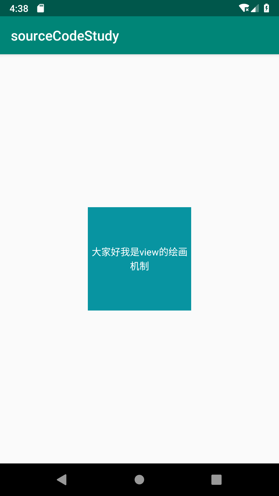
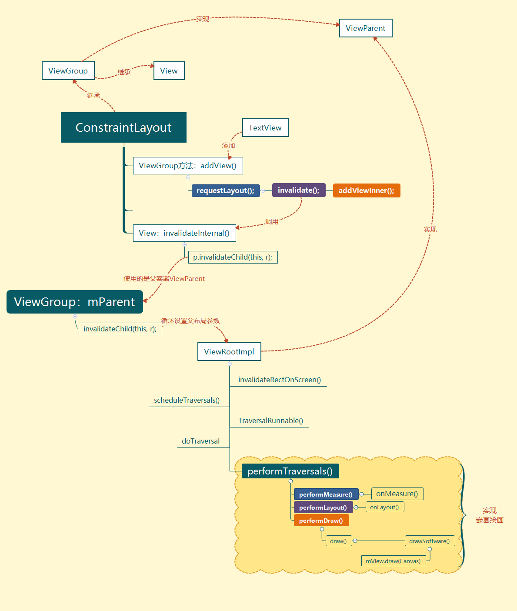

# View 的绘画机制

[TOC]


参考：[自定义View心法——View工作流程](https://www.jianshu.com/p/af266ff378c6) 


## 使用工具

Android studio，Android Device Monitor，Source light

## 环境搭建

`compileSdkVersion 28`

主要是展示一下Mainactivity 的代码，就是在布局中加一个TextView

随便搭建一下，这里不是重点

**界面效果**



**activity_main.xml**

```xml
<?xml version="1.0" encoding="utf-8"?>
<android.support.constraint.ConstraintLayout xmlns:android="http://schemas.android.com/apk/res/android"
    xmlns:app="http://schemas.android.com/apk/res-auto"
    xmlns:tools="http://schemas.android.com/tools"
    android:layout_width="match_parent"
    android:layout_height="match_parent"
    android:id="@+id/cl_container"
    tools:context=".MainActivity">

</android.support.constraint.ConstraintLayout>
```

**MainActivity.class**

```java
TextView textView = new TextView(this);
ConstraintLayout layout = findViewById(R.id.cl_container);
// 属性配置
textView.setText("大家好我是view的绘画机制");
textView.setTextColor(Color.WHITE);
textView.setBackgroundColor(Color.parseColor("#0894A1"));
// 自定义id，放在values中的ids.xml 文件
textView.setId(R.id.tv_view);
textView.setGravity(Gravity.CENTER);
textView.setTextAlignment(View.TEXT_ALIGNMENT_CENTER);
// 添加到父类中												========重点==========
layout.addView(textView);
textView.setLayoutParams(new ConstraintLayout.LayoutParams(400,400));


// 设置text view居中
ConstraintSet constraintSet = new ConstraintSet();
// 将父布局所有的布置clone过来，以防父类有多个view，以及其他的布局属性
constraintSet.clone(layout);
constraintSet.setVerticalBias(textView.getId(), 0.5f);
constraintSet.addToHorizontalChainRTL(textView.getId(), 
              ConstraintSet.PARENT_ID,ConstraintSet.PARENT_ID);
constraintSet.setHorizontalBias(textView.getId(), 0.5f);
constraintSet.addToVerticalChain(textView.getId(),
               ConstraintSet.PARENT_ID,ConstraintSet.PARENT_ID);
// 应用
constraintSet.applyTo(layout);
```

**ids.xml** 

```xml
<?xml version="1.0" encoding="utf-8"?>
<resources>
    <item name="tv_view" type="id"/>
</resources>
```


## 源码分析

动态化建立view，添加view，我们经常见，但他是如何展现到屏幕上的呢？？？？？】

回顾上面的代码：

```java
// 能作出改变的一般，就这两个方法
TextView textView = new TextView(this);
...
layout.addView(textView);
```

- 查看一下`new TextView(this);`源码发现全是获取style对view的属性进行赋值
- 查看`layout.addView(textView);

### addView()

1. `layout`最终调用的了这个方法，ViewGroup里面查看

   ```java
   public void addView(View child, int index, LayoutParams params) {
       ...
       /* addViewInner() will call child.requestLayout() when setting the new
           LayoutParams therefore, we call requestLayout() on ourselves before, so that
           the child's request will be blocked at our level
       */
       // 刷新布局
       requestLayout();
       // 废除当前布局
       invalidate(true);
       // 添加布局
       addViewInner(child, index, params, false);
   }
   ```

2. 先查看`addViewInner()`方法，看名字应该是这个做了添加，是不是也在里面做了会画？？？

   ```java
   private void addViewInner(View child, int index, LayoutParams params,
               boolean preventRequestLayout) {
   
       //异常排查，比如当前子view 是由父类的。
       ...
       // 加入child移动监听
       ...
       // 对child参数进行设置
        ...   
       // 用数组装起来  
       addInArray(child, index);
   
       // tell our children
       // 设置当前子view的父布局是哪个，这里后面会用到----
       if (preventRequestLayout) {
           child.assignParent(this);
       } else {
           child.mParent = this;
       }
       
       // 添加之后的各种状态设置与监听
       ...
       dispatchViewAdded(child);
       ...
   }
   ```

3. 发现并没有对布局得处理，只是在child的参数、状态、以及与父布局的关系进行了处理，

   那么我们看一下 `invalidate(true);`

   ```java
   /**
    * This is where the invalidate() work actually happens. A full invalidate()
    * causes the drawing cache to be invalidated, but this function can be
    * called with invalidateCache set to false to skip that invalidation step
    * for cases that do not need it (for example, a component that remains at
    * the same dimensions with the same content).
    *
    * @param invalidateCache Whether the drawing cache for this view should be
    *            invalidated as well. This is usually true for a full
    *            invalidate, but may be set to false if the View's contents or
    *            dimensions have not changed.
    * @hide
    */
   public void invalidate(boolean invalidateCache) {
       invalidateInternal(0, 0, mRight - mLeft, mBottom - mTop, invalidateCache, true);
   }
   ```

   这里看到了draw，看到了缓存，应该就是这里了

4. 继续往下看

   ```java
   void invalidateInternal(int l, int t, int r, int b, boolean invalidateCache,
                           boolean fullInvalidate) {
       // 重新废止以防是别的方法进来的
       if (mGhostView != null) {
           mGhostView.invalidate(true);
           return;
       }
   
      	....
           // Propagate the damage rectangle to the parent view.
           final AttachInfo ai = mAttachInfo;
       	// mParent 这个那里来的？？？？
       	final ViewParent p = mParent;
           if (p != null && ai != null && l < r && t < b) {
               final Rect damage = ai.mTmpInvalRect;
               damage.set(l, t, r, b);
               // 这里掉用了这方法？？？
               p.invalidateChild(this, damage);
          }
       ...
   }
   ```

5. 搜一下 `mParent =` 

   ```java
   // 这个什么时候调用的？？？，一定是在父类的view是吧
   // 这里注意下，不小心走进了误区，这里应该是ConstraintLayout的父布局
   // 而不是我们要添加的TextView的父布局。
   void assignParent(ViewParent parent) {
       // 注意这里传过来的 ViewParent，他可能不是View，有的View实现了他
       if (mParent == null) {
           mParent = parent;
       } else if (parent == null) {
           mParent = null;
       } else {
           throw new RuntimeException("view " + this + " being added, but"
                                      + " it already has a parent");
       }
   }
   ```

6. 但我们可以这样想，ConstraintLayout的绑定父布局的操作和Text操作绑定父布局是一样的

   回去Group中搜一下

   ```java
   private void addViewInner(View child, int index, LayoutParams params,
               boolean preventRequestLayout) {
       // tell our children
       // 5060 设置当前子view的父布局是哪个，这里后面会用到----
       // 这就是我们的第2步
       if (preventRequestLayout) {
           child.assignParent(this);
       } else {
           // 这个mParent应该就是本项目中的 ConstraintLayout
           child.mParent = this;
       }
   }
   ```

   但有个问题是？最初始的View是如何做到的？继续往下看，后面会说道

7. 好都这里，应该理清了，先不管ConstraintLayout这边的绘画，回到第4步 `p.invalidateChild(this, damage);`

   这个invalidateChild，**应该是ViewGoup调用的，也就是ConstraintLayout的父亲**，查看一下

   ```java
   public final void invalidateChild(View child, final Rect dirty) {
       ...
       // 注意这里当前view也是一个 ViewParent 的实现者
       ViewParent parent = this;
       if (attachInfo != null) {
          ...
          // 获取child的配置信息
          final int[] location = attachInfo.mInvalidateChildLocation;
               location[CHILD_LEFT_INDEX] = child.mLeft;
               location[CHILD_TOP_INDEX] = child.mTop;
           ...
           do {
               ....
               if (drawAnimation) {
                   if (view != null) {
                       view.mPrivateFlags |= PFLAG_DRAW_ANIMATION;
                   } else if (parent instanceof ViewRootImpl) {
                       // 这里可以发现，当前的view可以是 ViewRootImpl
                       ((ViewRootImpl) parent).mIsAnimating = true;
                   }
               }
               ...
               // 不断的对父类的信息进行修改
               parent = parent.invalidateChildInParent(location, dirty);
               ...
              // 循环到最后一个view。
           } while (parent != null);
       }
   }
   ```

   ViewRootImpl这个类是用来干嘛的？？，看了一下这个类，继承于ViewParent，ViewGrop也是继承于ViewParent，但这不能证明最后我们获取的parent他会是ViewRootImpl的子类，

   说明一个问题：最开始那个view(DecorView)，的父布局是ViewRootImpl的对象，但是在那或设定的呢？

   看一下别人的文章

   <https://www.jianshu.com/p/90173fc5745b>

   总结一下文章：当activity获取到焦点的时候，PhoneWindows与DecorView相互绑定

   PhoneWindw -->WindowManagerIml的addView方法 --> WindowManagerGlobal的addView方法

   注意在这个方法里面建立了ViewRootImpl对象，同时这个对象调用了addView方法

   这方法里面调用了：**view.assignParent(this);**

   这里就圆满的说明了，DecorView的父亲是一个ViewRootImpl。

8. 先查一下ViewGroup是否有`invalidateChildInParent(location, dirty);` 

   ```java
   /**This implementation returns null if this ViewGroup does not have a parent,
   */
    public ViewParent invalidateChildInParent(final int[] location, final Rect dirty) {
        if ((mPrivateFlags & (PFLAG_DRAWN | PFLAG_DRAWING_CACHE_VALID)) != 0) {
            // 这个成员变量，发现在ViewParent找不到，ViewGroup也找不到
            // 发现在 View中实现的，
            //在assignParent();中赋值的，而这个肯定是父布局赋予他的，在addview()第五步
            retrun mParent;
        }
        // 当没有父布局的时候，他才会放回null
        return null;
    }
   ```

   同时发现并没有绘画里面， 那么我们查看一下`ViewRootImpl` 中是否有？？`ViewRootImpl .class` 查看

   ```java
   @Override
   public ViewParent invalidateChildInParent(int[] location, Rect dirty) {
       // 检查线程
       checkThread();
       ...
       // 重新绘制屏幕
       invalidateRectOnScreen(dirty);
       return null;
   }
   ```

9. 继续往下看`invalidateRectOnScreen(dirty);`

   ```java
   private void invalidateRectOnScreen(Rect dirty) {
       
       if (!mWillDrawSoon && (intersected || mIsAnimating)) {
           scheduleTraversals();
       }
   }
   ```

10. 继续看 `scheduleTraversals();`

  ```java
  void scheduleTraversals() {
      if (!mTraversalScheduled) {
          mTraversalScheduled = true;
          // 注意这里是有了线程的变化吗???,利用handler 传递消息
          // 记不记得，不能再主线程更新UI
          mTraversalBarrier = mHandler.getLooper().getQueue().postSyncBarrier();
          // 这里进行了线程的消息传递,-----注意这里----
          mChoreographer.postCallback(
              Choreographer.CALLBACK_TRAVERSAL, mTraversalRunnable, null);
          if (!mUnbufferedInputDispatch) {
              scheduleConsumeBatchedInput();
          }
          //通知渲染器帧待定
          notifyRendererOfFramePending();
          // 将画笔进行锁定
          pokeDrawLockIfNeeded();
      }
  }
  ```

  mTraversalRunnable应该是进行绘画的重点了---

  ```java
  final TraversalRunnable mTraversalRunnable = new TraversalRunnable();
  ```

11. 查看`new TraversalRunnable();`

    ```java
    final class TraversalRunnable implements Runnable {
        @Override
        public void run() {
            // 遍历
            doTraversal();
        }
    }
    void doTraversal() {
        if (mTraversalScheduled) {
            ...
            // 执行遍历
            performTraversals();
            ...
        }
    }
    ```

### performTraversals()

`ViewRootImpl.class` 查看

1. 查看 `performTraversals();`发现一大堆代码，根据注释一个个看吧

   翻译一下绘画，根据这个单词搜，发现这个`performDraw();`，根据我们写view是不是还有其他的perform方法，搜`perform`

   ```java
   private void performTraversals() {
       ...
       // lp 是window的参数，注意一下，后面会提到
      	childWidthMeasureSpec = getRootMeasureSpec(baseSize, lp.width);
       childHeightMeasureSpec = getRootMeasureSpec(desiredWindowHeight, lp.height);
       // 1454
       performMeasure(childWidthMeasureSpec, childHeightMeasureSpec);
       // 2320, mWidth，mHeight 经过测量并处理得到的参数， 
       performLayout(lp, mWidth, mHeight);
       // 2485
       performDraw();
       ....
   }
   ```


#### performMeasure

1. 查看一下 三个方法，一一看一下

   ```java
   private void performMeasure(int childWidthMeasureSpec, int childHeightMeasureSpec) {
       // 开始追踪测量
       Trace.traceBegin(Trace.TRACE_TAG_VIEW, "measure");
       try {
           // 这个MView是？？？？
           mView.measure(childWidthMeasureSpec, childHeightMeasureSpec);
       } finally {
           // 结束测量
           Trace.traceEnd(Trace.TRACE_TAG_VIEW);
       }
   }
   ```

   搜一下`mView =` 

   ```java
   /**
   * We have one child，这个应该就是指的顶级view了
   */
   public void setView(View view, WindowManager.LayoutParams attrs, View panelParentView) {
       synchronized (this) {
           if (mView == null) {
               mView = view;
               ...
           }
           ...
       }
   }
   ```

   还记得 addView()的 第7步吗？？通过循环，一步一步设置父布局的布局参数，mView 就是顶级view

   也就是说，mView相当于这个项目的`ConstraintLayout`

   那么他应该是先对父布局设置布局参数，再一步步的对子view进行一个测量，绘制。

   那么mView.measure(); 调用自身的view，我们查看一下，看是怎么做的

2. `mView.measure(childWidthMeasureSpec, childHeightMeasureSpec);` 查看一下，在View.java 中

   ```java
   public final void measure(int widthMeasureSpec, int heightMeasureSpec) {
       if (forceLayout || needsLayout) {
           // first clears the measured dimension flag
          ...
           if (cacheIndex < 0 || sIgnoreMeasureCache) {
               // measure ourselves, this should set the measured dimension flag back
               
               // 这里出现了一个onMeasure 是不是有点眼熟？？？
               // d点击查看一下
               onMeasure(widthMeasureSpec, heightMeasureSpec);
               ...
           } else {
              ...
           }
           ...
       }
   }
   
   // 注释的大概意思是，可以被子类继承改变
   protected void onMeasure(int widthMeasureSpec, int heightMeasureSpec) {
       // 设置测量的宽和高
       setMeasuredDimension(
           getDefaultSize(getSuggestedMinimumWidth(),widthMeasureSpec),
           getDefaultSize(getSuggestedMinimumHeight(),heightMeasureSpec)
       );
   }
   ```

3. 查看一下TextView，的确可以找到onMeasure方法

   到这里了，我们还要深究一下，widthMeasureSpec怎么来的？？？

   回到`performTraversals()`, `ViewRootImpl.class`中

   ```java
   // lp 是window的参数，注意一下，后面会提到
   childWidthMeasureSpec = getRootMeasureSpec(baseSize, lp.width);
   childHeightMeasureSpec = getRootMeasureSpec(desiredWindowHeight, lp.height);
   ```

   查看一下`getRootMeasureSpec(baseSize, lp.width);`

   ```java
   public static final int UNSPECIFIED = 0 << MODE_SHIFT;
   public static final int EXACTLY     = 1 << MODE_SHIFT;
   public static final int AT_MOST     = 2 << MODE_SHIFT;
   
   private static int getRootMeasureSpec(int windowSize, int rootDimension) {
       int measureSpec;
       switch (rootDimension) {
           case ViewGroup.LayoutParams.MATCH_PARENT:
               // Window can't resize. Force root view to be windowSize.
               measureSpec = MeasureSpec.makeMeasureSpec(windowSize,
                                                         MeasureSpec.EXACTLY);
               break;
           case ViewGroup.LayoutParams.WRAP_CONTENT:
               // Window can resize. Set max size for root view.
               measureSpec = MeasureSpec.makeMeasureSpec(windowSize,
                                                         MeasureSpec.AT_MOST);
               break;
           default:
               // Window wants to be an exact size. Force root view to be that size.
               measureSpec = MeasureSpec.makeMeasureSpec(rootDimension,
                                                         MeasureSpec.EXACTLY);
               break;
       }
       return measureSpec;
   }
   ```

4. 查看一下`MeasureSpec.class`

   ```java
   /*MeasureSpecs are implemented as ints to reduce object allocation. This class
   * is provided to pack and unpack the &lt;size, mode&gt; tuple into the int.
   */
   public static class MeasureSpec {
       
       private static final int MODE_SHIFT = 30;
       // 16进制 左移 30位： 0x3 = 11 << 30
       private static final int MODE_MASK  = 0x3 << MODE_SHIFT;
      
       public static int makeMeasureSpec(@IntRange(...)int size, 
                                         @MeasureSpecMode int mode) {
           /**
        	* Use the old (broken) way of building MeasureSpecs.
        	* 用以前的方法构建，这个应该是兼容的问题 API level 17 and lower
        	*/
           if (sUseBrokenMakeMeasureSpec) {
               // 两者相加
               return size + mode;
           } else {
               // 看属性的注释
               return (size & ~MODE_MASK) | (mode & MODE_MASK);
           }
       }
   }
   ```

   发现，我们将大小和mode转化为一个整形的值，一个32位的整形，最高两位为mode，后面为size

   mode有三种

   - EXACTLY：精确的
   - AT_MOST：最大值
   - UNSPECIFIED：要多大给多大

#### performLayout()

1. `performMeasure();`算是处理完了，接着看performLayout()

   ```java
   // 代码比较多，还会比较难找的，可以根据trace一个找
   private void performLayout(WindowManager.LayoutParams lp, int desiredWindowWidth,
                              int desiredWindowHeight) {
       ...
       // host 就是 mView
       final View host = mView;
       if (host == null) {
           return;
       }
       // 开启追踪
       Trace.traceBegin(Trace.TRACE_TAG_VIEW, "layout");
       try {
           ...
           // 点开观察
           host.layout(0, 0, host.getMeasuredWidth(), host.getMeasuredHeight());
           ...
       } finally {
           ...结束追踪
           Trace.traceEnd(Trace.TRACE_TAG_VIEW);
       }
       ...
   }
   ```

2. 在View中查看layout()

   ```java
    public void layout(int l, int t, int r, int b) {
        // 实现布局
        ...
            // 点进去看
            /* Called from layout when this view should
            * assign a size and position to each of its children.
           */
            onLayout(changed, l, t, r, b);
        ...
   
   }
   ```

   

3.  当前view也可能是ViewGroup，也就是本项目的`ConstraintLayout`，查看一下ViewGourp中的layout

   ```java
   @Override
   public final void layout(int l, int t, int r, int b) {
       if (!mSuppressLayout && (mTransition == null || !mTransition.isChangingLayout())){
           if (mTransition != null) {
               mTransition.layoutChange(this);
           }
           // 调用父类，也就是View的设置
           super.layout(l, t, r, b);
       } else {
           // record the fact that we noop'd it; request layout when transition finishes
           mLayoutCalledWhileSuppressed = true;
       }
   }
   
   // 发现onLayout必须实现
   @Override
   protected abstract void onLayout(boolean changed,
                                    int l, int t, int r, int b);
   ```

   发现onLayout必须实现，也就是说对于不同的ViewGroup要有不同布局的实现，而且是必须实现

   也就是说，先实现TextView 添加进去后，对参数进行设定，在设置自身的布局

#### performDraw()

1. 可以开始对绘制的流程的追踪了

   ```java
   // 代码比较多，还会比较难找的，可以根据trace一个找，就快一点
   private void performDraw() {
       ...
       // 开始追踪
       Trace.traceBegin(Trace.TRACE_TAG_VIEW, "draw");
       try {
           // 这里注意一下，调用本地方法draw，先撇开
           boolean canUseAsync = draw(fullRedrawNeeded);
           if (usingAsyncReport && !canUseAsync) {
               mAttachInfo.mThreadedRenderer.setFrameCompleteCallback(null);
               usingAsyncReport = false;
           }
       } finally {
           mIsDrawing = false;
           // 结束追踪
           Trace.traceEnd(Trace.TRACE_TAG_VIEW);
       }
       ...
   }
   
   private void draw(boolean fullRedrawNeeded) {
           ...
           //一个个看，发现发现调用这个方法，
           // 绘制软件
          if (!drawSoftware(surface, mAttachInfo, xOffset, yOffset,
                            scalingRequired,dirty)) {
                   return;
          }
       ..
   
   }
   ```

2. 查看这个方法`drawSoftware()`

   ```java
   private boolean drawSoftware(Surface surface, AttachInfo attachInfo, 
                                int xoff, int yoff,boolean scalingRequired, Rect dirty) {
   
       // 使用软件渲染器绘图。
       final Canvas canvas;
       //对canvas 进行设置
       ...
       ...
       // 调用当前view自身的绘制方法
      	mView.draw(canvas);
       return true;
   }
   ```

3. 继续查看

   ```java
   public void draw(Canvas canvas) {
       ...
       // 1. 画背景
      	drawBackground(canvas);
       // 2. 如有必要，保存画布的图层以准备褪色
       ...
       // 3. draw content
       onDraw(canvas)
       // 4. draw children
       dispatchDraw(canvas);
       
       // 5. Overlay is part of the content and draws beneath Foreground
       if (mOverlay != null && !mOverlay.isEmpty()) {
           mOverlay.getOverlayView().dispatchDraw(canvas);
       }
   
       // Step 6, draw decorations (foreground, scrollbars)
       onDrawForeground(canvas);
   
       // Step 7, draw the default focus highlight
       drawDefaultFocusHighlight(canvas);
       return;
   }
   ```


## 绘画路线




大概明白了应该怎么走，但是有一个问题就是，从视图的加载到这里的绘画，我们做的是看他是一个怎么的加载流程，并没有仔细去研究他是如何进行操作的，如何设计的，以至于，到现在自定义一个view还没有一个概念


总结
----

当你添加一个view的时候，父级的view会不断的寻找根view（因为有的事wrap所以父类的宽高不确定，所以要往上递归寻找父类，先定父类），在这个过程中，通过子view设置的参数来获取到父类应该设置的参数。

到根布局的时候，使用ViewRootImpl 调用三个方法形成自身的测量，这是有顺序的。

- performMeasure
- performLayout
- performDraw


**形象的流程**：

这个很好理解了，比如实习生面试通过了一个公司，你个人的信息上传到部门，部门给子公司，子公司给总公司。

总公司人事说可以我们有子公司现在可以容纳这个人，子公司人事发现自己这方面的人，然后等待个人的确认自己是否适合这个职位。

总公司发现的确下面是缺人的，就开始一级一级的安排，这人到哪个子公司去，哪个部门，哪个位置。

然后总公司发放公司的制服，子公司根据自己的需要进行修改，等等到最后个人自己的一个选择。


## ViewGroup与View的绘画关系

从view的加载机制中可以清楚的知道，我们的view是一层套一层的，最开始的那一层就是一个group，

实际上的绘画，其实就是ViewGroup和View之间的绘画。

需要注意的是：

> ```java
> ViewGroup extends View implements ViewParent, ViewManager
> ```

要是你，你怎么设计view的这一实现过程

首先ViewGroup 是view的一种，肯定是有继承关系。

我们可以想象到的，可以操作的对象有: View，ViewGroup，Canvas，Paint

要实现的功能是：画图，层级关系，动态添加view，事件机制

**那么如何实现呢？？？？？**

如何让它递归下去画子view，又给子view自定义的余地

继续分析下去，要画一个view，

- 需要知道自己有多少的纸张
- 知道自己的大小，由自己决定，还是你的子类决定。
- 以及如何摆放，摆放会由自己摆放还是他人。


如果是动态的加入view，需要知道

- 你加入的位置
- 重新画布局，重新摆放，这一些如何处理？？？？


