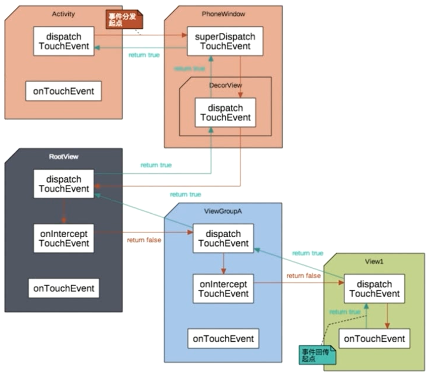
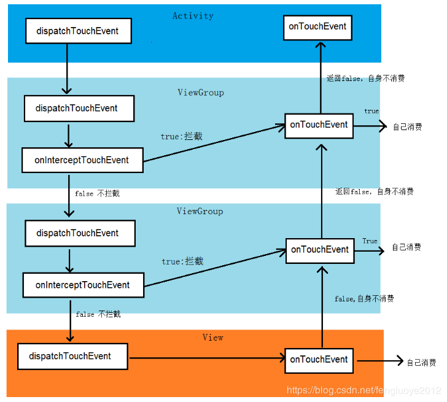

View的事件处理机制
==================

[TOC]

视频总结
--------

为什么会有事件分发机制？？

Android是树形结构，view有重叠，需要对事件进行分发到需要处理的view中

主要是三个方法：分发、拦截、处理

- DispatchTouchEvent()
- onInterceptTouchEvent()
- onTouchEvent()

采用的是责任链模式，看一下图

形象说明
--------

其实是这么个流程，公司里面每个部门都有一个前台，客户走到前台去提需求，前台就询问部门负责人是否可以直接处理，部门负责人表示这种事情先给下面的小弟，小弟可以处理就让小迪那里去，这样递归问道最小的小弟，

小弟可以做出处理，就直接反馈给客户，如果不能再往上执行。

具体逻辑分析
------------

https://blog.csdn.net/fengluoye2012/article/details/83782042

要点总结：

- 触摸事件有一个down，多个move，一个up组成；

- 事件的传递是从Activity开始的，Activity -->PhoneWindow–>DectorView–>ViewGroup–>View；主要操作在ViewGroup和View中；

- ViewGroup类主要调用：

  `dispatchTouchEvent()–>onInterceptTouchEnent()–>dispatchTransformedTouchEvent()；`ViewGroup不直接调用onTouchEvent()方法；

- 如果当前的View不具有ViewGroup的属性的话，`dispatchTouchEvent()–>onTouchEnent()`

