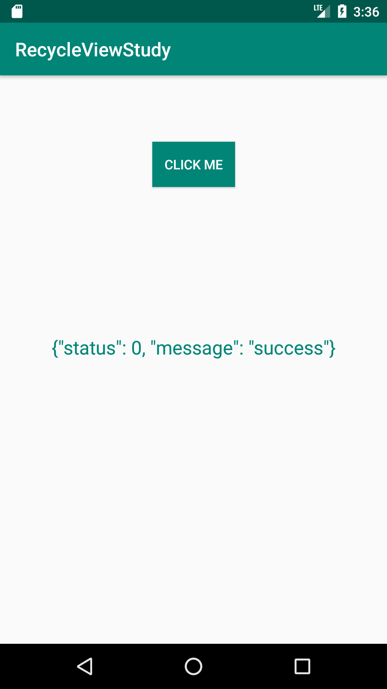

# OKHttp

[TOC]


## 环境搭建

### 工具准备

android studio，pytharm 

### 项目实现

#### 项目效果




### 服务器

Python + django

建立一个app：`Python manager.py startapp okStudy;`

|   Django   | 2.1.7  |
| :--------: | :----: |
|    pip     | 10.0.1 |
|    pytz    | 2018.9 |
| setuptools | 39.1.0 |

- settings的设置：把中间件的拦截器关掉

  ```
  'django.middleware.csrf.CsrfViewMiddleware',
  ```

- 添加一个URL

  ```python
  urlpatterns = [
      path('admin/', admin.site.urls),
      path('ok_http_test', views.ok_test),
  ]
  ```

- 视图代码

  ```python
  # Create your views here.
  def ok_test(request):
      ok = {"status": 0, "message": "success"}
      return HttpResponse(json.dumps(ok, ensure_ascii=False))
  ```

- 服务器启动：

  ```
  python manager.py runserver 0.0.0.0:8000
  ```

  查询当前主机的ip地址是：192.168.136.105


### 客户端

- mainactivity

  ```java
  public class MainActivity extends AppCompatActivity {
  
      private Button btnOk;
      private OkHttpClient client;
      private Request request;
      private TextView tvContent;
  
      @Override
      protected void onCreate(Bundle savedInstanceState) {
          super.onCreate(savedInstanceState);
          setContentView(R.layout.activity_main);
          // 设置okhttp的请求参数
          setOkHttp();
  
          btnOk = findViewById(R.id.btn_Ok);
          tvContent = findViewById(R.id.tv_content);
  
          btnOk.setOnClickListener(v -> client.newCall(request).enqueue(new Callback() {
              @Override
              public void onFailure(okhttp3.Call call, IOException e) {
              }
              @Override
              public void onResponse(okhttp3.Call call, Response response) 
              throws IOException {
                  // 在主线程中修改UI
                  MainActivity.this.runOnUiThread(new Runnable() {
                      @Override
                      public void run() {
                          try {
                              tvContent.setText(response.body().string());
                          } catch (IOException e) {
                              e.printStackTrace();
                          }
                      }
                  });
              }
          }));
      }
  
      private void setOkHttp() {
          client = new OkHttpClient();
          //创建一个Request
          request = new Request.Builder()
                  .url("http://192.168.136.105:8000/ok_http_test")
                  .build();
      }
  }
  
  ```

- 清单文件

  ```xml
  <uses-permission android:name="android.permission.INTERNET"/>
  ```

- grade配置

  ```groovy
  implementation 'com.squareup.okhttp3:okhttp:3.14.0'
  implementation 'com.squareup.okio:okio:1.17.2'
  ```

  


## 源码分析

从上面的代码可以看出，okhttp建立连接获取后台资源分为三步

- 创建客户端

  ```java
  client = new OkHttpClient();
  ```

- 建立request对象

  ```java
  request = new Request.Builder()
                  .url("")
                  .build();
  ```

- 开启连接，数据回调

  ```java
  client.newCall(request).enqueue(new Callback(){...});
  ```


1. 先从client.newCall(request).enqueue(new Callback(){...});这一步开始分析

   ```
   
   ```

   

2. 


## 总结


## Okhttp的使用


流程：


使用：

```java
OkHttpClient client = new OkHttpClient();
//创建一个Request
final Request request = new Request.Builder()
    .url("https://ss0.bdstatic.com/5aV1bjqh_Q23odCf" +
         "/static/superman/img/logo_top_86d58ae1.png")
    .build();
//同步
new Thread(new Rununable(){
        try {
        client.newCall(request).execute();
    } catch (IOException e) {
        e.printStackTrace();
    }
}).start();
// 异步
client.newCall(request).enqueue(new Callback() {
    @Override
    public void onFailure(Request request, IOException e) {

    }

    @Override
    public void onResponse(Response response) throws IOException {
    }
});
```

OKhttp创建一个client的全局对象

利用builder模式创建request

client创建一个call对象，将request传入

- call可以采用同步execut
- 异步请求：enqueue


点击`client.newCall(request).execute();`查看一下

okkhttp内部加载了很多拦截器，这个在项目李一个用来自定义token

retrofit  内部还是使用了okhttp，只是利用动态代理的模式来获取我们定义的接口

拿到接口方法，加载数据。


glide，利用with方法来实现与view的声明周期绑定，来实现动态加载。