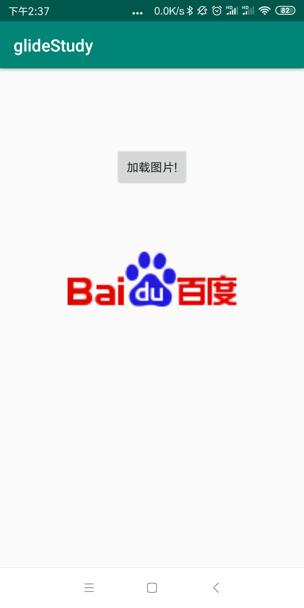

# gilde

[TOC]


## 环境搭建

### 工具准备

android studio

#### 版本导入

```java
implementation 'com.github.bumptech.glide:glide:4.5.0'
annotationProcessor 'com.github.bumptech.glide:compiler:4.5.0'
```

### 项目实现

#### 项目效果

点击加载图片按钮，下面显示图片。



### 代码

- **MainActivity**

  ```java
  public class MainActivity extends AppCompatActivity {
  
      private Button btnLoadImage;
      private ImageView ivImage;
      private String urlString
              = "https://ss0.bdstatic.com/5aV1bjqh_Q23odCf/static/superman/img/logo_top_86d58ae1.png";
  
      @Override
      protected void onCreate(Bundle savedInstanceState) {
          super.onCreate(savedInstanceState);
          setContentView(R.layout.activity_main);
          // 获取view对象
          btnLoadImage = findViewById(R.id.btn_load_Image);
          ivImage = findViewById(R.id.iv_picture);
          
          btnLoadImage.setOnClickListener(new View.OnClickListener() {
              @Override
              public void onClick(View v) {
                  Glide.with(MainActivity.this)
                          .load(urlString)
                          .into(ivImage);
              }
          });
  
      }
  }
  
  ```

- manifest文件

  ```
  <uses-permission android:name="android.permission.INTERNET" />
  ```


## 源码分析

大概可以看出，Glide其实分了三部分：

- with：绑定生命周期
- load：加载图片资源
- into：将资源显示


1. 先看with的源码

   ```java
   // 发现这里返回了一个请求管理的对象
   public static RequestManager with(@NonNull FragmentActivity activity) {
       return getRetriever(activity).get(activity);
   }
   // 后续发现with被重写了很多次，最终都是要回到activity的
   ```

   这里一步应该是做了对生命周期的设定，以及返回了一个请求管理对象，先看一下他怎么做。

2. 先看一下`getRetriever(activity)`

   ```java
   private static RequestManagerRetriever getRetriever(@Nullable Context context) {
       // 错误处理
       ...
       // 这里看一下返回的是 请求管理器检索器，Retriever猎犬
       return Glide.get(context).getRequestManagerRetriever();
   }
   @NonNull
   public static Glide get(@NonNull Context context) {
       // 这里是重校验锁，实现单例
       if (glide == null) {
           synchronized (Glide.class) {
               if (glide == null) {
                   checkAndInitializeGlide(context);
               }
           }
       }
       return glide;
   }
   ```

   可以看到`getRequestManagerRetriever();` 只是将RequestManagerRetriever做了一个返回，并没有干其他事情，初始应在Glider里面初始化了。

3. 看一下`checkAndInitializeGlide(context);` 一直往下追溯，能查到这个初始化的方法。

   ```java
   private static void initializeGlide(@NonNull Context context, 
                                       @NonNull GlideBuilder builder) {
       // 这里构建了 一个工厂
       RequestManagerRetriever.RequestManagerFactory factory =
           annotationGeneratedModule != null
           ? annotationGeneratedModule.getRequestManagerFactory() : null;
       // 构建器里面设置了
       builder.setRequestManagerFactory(factory);
       ....
       // 这里应该就是组装的所在了
       Glide glide = builder.build(applicationContext);
       ....
       Glide.glide = glide;
   }
   ```

4.  继续往下看 `builder.build(applicationContext);`看一下做了什么，进入到了`GlideBuilder.class`

   把他的成员变量都构造了一遍。

   ```java
   
   @NonNull
   public Glide build(@NonNull Context context) {
       ...
       // 看到这里被建立了
       // 这里你要看，这里初始化将factory传入进去了，注意一下下面要用到
       RequestManagerRetriever requestManagerRetriever =
           new RequestManagerRetriever(requestManagerFactory);
   
       return new Glide(
           context,
           engine,
           memoryCache,
           bitmapPool,
           arrayPool,
           requestManagerRetriever,
           connectivityMonitorFactory,
           logLevel,
           defaultRequestOptions.lock(),
           defaultTransitionOptions);
   }
   ```

   可以看出，这里对于Glide的构造使用了**重校验锁单例**与**build模式**

   

5.  在这里我们回到Glide类中的`getRetriever(activity).get(activity);`查看get(activity)

   ```java
   @NonNull
   public RequestManager get(@NonNull FragmentActivity activity) {
       // 对当前线程进行判断，采用不同的处理
       if (Util.isOnBackgroundThread()) {
           return get(activity.getApplicationContext());
       } else {
           assertNotDestroyed(activity);
           // 我们暂且只看主线程的操作==============
           FragmentManager fm = activity.getSupportFragmentManager();
           return supportFragmentGet(activity, fm, null /*parentHint*/);
       }
   }
   ```

   注意下，这里获取了一个FragmentManager，这个是用来干嘛的？？？

6. 在`RequestManagerRetriever`类中继续看`supportFragmentGet();`

   ```java
   private RequestManager supportFragmentGet(@NonNull Context context, @NonNull
            FragmentManager fm, @Nullable Fragment parentHint) {
       // 这获取了一个Fragment
       SupportRequestManagerFragment current = 
           getSupportRequestManagerFragment(fm, parentHint);
       // 这里一路下来，应该可以知道他取不到
       RequestManager requestManager = current.getRequestManager();
       if (requestManager == null) {
           // TODO(b/27524013): Factor out this Glide.get() call.
           Glide glide = Glide.get(context);
           // 这里一步步构建，这个factory应该就是我们在建立glider的时候构建的了
           requestManager =
               // 这里还需注意，current.getGlideLifecycle(),这个是用来干嘛？？
               factory.build(glide, current.getGlideLifecycle(),
                             current.getRequestManagerTreeNode(), context);
           // 相互绑定，这应该是为下一次获取的时候，不用重新建立
           // 因为在同一个地方我们可能多张图片
           current.setRequestManager(requestManager);
       }
       return requestManager;
   }
   
     @VisibleForTesting
     final Map<FragmentManager, SupportRequestManagerFragment>
     				pendingSupportRequestManagerFragments = new HashMap<>();
   
   SupportRequestManagerFragment getSupportRequestManagerFragment(
       @NonNull final FragmentManager fm, @Nullable Fragment parentHint) {
       if (current == null) {
           current = pendingSupportRequestManagerFragments.get(fm);
           if (current == null) {
               // 这里可以看出current是一个fragment
               current = new SupportRequestManagerFragment();
               current.setParentFragmentHint(parentHint);
               // 这里仔细看，会发现这里的对current进行了存储
               pendingSupportRequestManagerFragments.put(fm, current);
               // 种类发现，对fragment进行了提交
               fm.beginTransaction().add(current,FRAGMENT_TAG).commitAllowingStateLoss();
               handler.obtainMessage(ID_REMOVE_SUPPORT_FRAGMENT_MANAGER,
                                     fm).sendToTarget();
           }
       }
       return current;
   }
   ```

7. `current.getGlideLifecycle(),`查看一下

   ```java
   // 发现来自于这个Lifecycle接口，方法体都被省略了
   class ActivityFragmentLifecycle implements Lifecycle {
       public void addListener(LifecycleListener listener);
   
       @Override
       public void removeListener(LifecycleListener listener);
   
       void onStart();
   
       void onStop(); 
   
       void onDestroy();
   }
   ```

   这里可以看出，我们这个ActivityFragmentLifecycle类应该是跟踪设置activityfragment的生命周期。

8. 回去分析load，点击进入`RequestManager.class`

   ```java
   // 这里先注意下返回值，应该是我们后面调用into需要用到的
   public RequestBuilder<Drawable> load(@Nullable String string) {
       return asDrawable().load(string);
   }
   ```

9. 查看一下asDrawable()，看名字感觉应该是对string转化为drawable文件。

   ```java
   // 最终发现进入了 RequestBuilder 类里面的构造方法
   protected RequestBuilder(Glide glide, RequestManager requestManager,
                            Class<TranscodeType> transcodeClass, Context context) {
       this.glide = glide;
       this.requestManager = requestManager;
       this.transcodeClass = transcodeClass;
       this.defaultRequestOptions = requestManager.getDefaultRequestOptions();
       this.context = context;
       this.transitionOptions =
           requestManager.getDefaultTransitionOptions(transcodeClass);
       this.requestOptions = defaultRequestOptions;
       this.glideContext = glide.getGlideCo、ntext();
   }
   ```

10. 先不管，再看一下`load(string);`，最终追溯到这里

    ```java
    @NonNull
    private RequestBuilder<TranscodeType> loadGeneric(@Nullable Object model) {
        this.model = model;
        isModelSet = true;
        return this;
    }
    ```

11. 发现两个方法都没有做什么，我们回去看一下into方法

    ```java
    public ViewTarget<ImageView, TranscodeType> into(@NonNull ImageView view) {
        // 进行出图片样式的适配
        ...
        return into(
            glideContext.buildImageViewTarget(view, transcodeClass),
            /*targetListener=*/ null,
            requestOptions);
    }
    ```

    这里看一下buildImageViewTarget，这里可以看出，将view转化为ImageViewTarget

    查看一下ImageViewTarget

    ```
    
    ```

    

12. 

## 总结

glide分为三部分，一是绑定当前的context，一个是加载网络转化为bitmap， 最后是将加载的bitmap设置到view里面

glide是一个双重检验锁实现的单例，他有一个非常巧妙的地方，设置了RequestManagerRetriever将view与fragment的周期相互绑定，这个是用map进行了存储，方便下一次使用他这个类的时候复用。同时生成了一个RequestManager管理类，RequestManager实现了LifecycleListener，这样实现实现了动态加载的监听。

他这样做就有个好处，这样就不会浪费资源，就好比说如果加载数据到一半的时候，当前的activity销毁的，这时候我们就可以停止。

而这个只是管理类的与fragment相互绑定，还缺一个我们要设置的view的控制，glide就这个view封装成了一个TargetView，实现了Target的方法，用来回调。

总体来说，看了这个源码有三点收获，一个是fragment周期、view的分装、单例


