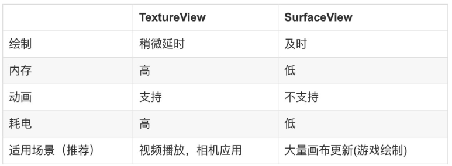

Cmera
=====

[toc]

静态申请权限
------------

相机本身的权限，以及存储读取的权限

```xml
<uses-permission android:name="android.permission.CAMERA" />
<uses-feature android:name="android.hardware.camera" />
<uses-feature android:name="android.hardware.camera.autofocus" />
<uses-permission android:name="android.permission.WRITE_EXTERNAL_STORAGE" />
<uses-permission android:name="android.permission.READ_EXTERNAL_STORAGE"/>
```


流程
----

怎么个开发流程？？？

首先要明白有哪些对象：

1. 展示每一帧图像的VIew？

   SurfaceView、 TextureView、GlSurfaceView  

2. 数据来源那个类？


### 展示图像View

#### SurfaceView

继承自View,拥有View的大部分属性，但是由于holder的存在，不能设置透明度。

 优点：可以在一个独立的线程中进行绘制，不会影响主线程，使用双缓冲机制，播放视频时画面更流畅

 缺点：surface的显示不受View属性的控制，不能将其放在ViewGroup中，SurfaceView不能嵌套使用。

#### GLSurfaceView

GlSurfaceView继承自SurfaceView类，专门用来显示OpenGL渲染的，简单理解可以显示视频，图像及3D场景这些的。

#### TextureView

同样继承自View，必须在开启硬件加速的设备中使用（保守估计目前百分之九十的Android设备都开启了），TextureView通过setSurfaceTextureListener的回调在子线程中进行更新UI.

 优点：支持动画效果。

 缺点：在5.0之前在主线程渲染，在5.0之后在单独线程渲染。



实战思考：我们需要预览相机怎么做？surfaceview？OpenGl ES？我来GLSurfaceView做一次，你们就复习下其他几种。思考ui绘制性能等问题。


