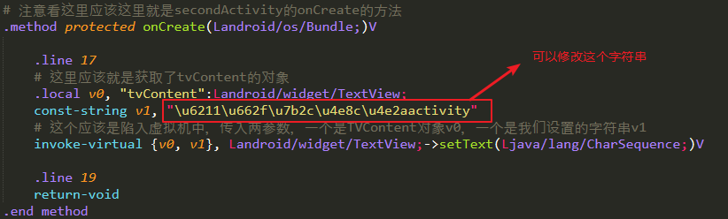

# android Killer 

[TOC]

>  这篇文章针对有Android基础的人来写的，对于一些文件夹的意义，就不在赘述


## 实验环境

### 实验工具

Android studio + android Killer + android tools

**Android killer 是windows的工具**。


### 实验效果

点击MainActivity的button，跳到SecondActivity

<video  width="200px;">
	<source src="../images/android_killer_first_app.webm" type='video/webm; codecs="vp8.0, vorbis"'>
</video>


#### 实验代码


- ```java
  public class MainActivity extends AppCompatActivity  {
  
      @Override
      protected void onCreate(Bundle savedInstanceState) {
          super.onCreate(savedInstanceState);
          setContentView(R.layout.activity_main);
  
      }
  
      public void changeActivity(View view) {
          Intent intent = new Intent(this, SecondActivity.class);
          startActivity(intent);
      }
  }
  ```

- `SecondActivity.java`，非常普通，没有做任何操作

  ```java
  public class SecondActivity extends AppCompatActivity {
  
      @Override
      protected void onCreate(Bundle savedInstanceState) {
          super.onCreate(savedInstanceState);
          setContentView(R.layout.activity_second);
  
          TextView tvContent = findViewById(R.id.tv_content);
  
          tvContent.setText("我是第二个activity");
  
      }
  }
  ```

- main_activity.xml

  ```xml
  <?xml version="1.0" encoding="utf-8"?>
  <android.support.constraint.ConstraintLayout xmlns:android="http://schemas.android.com/apk/res/android"
      xmlns:app="http://schemas.android.com/apk/res-auto"
      xmlns:tools="http://schemas.android.com/tools"
      android:layout_width="match_parent"
      android:layout_height="match_parent"
      tools:context=".MainActivity">
  
      <Button
          android:layout_width="wrap_content"
          android:layout_height="wrap_content"
          android:text="点击跳转"
          android:textColor="@color/colorPrimary"
          android:textSize="18sp"
          app:layout_constraintBottom_toBottomOf="parent"
          app:layout_constraintEnd_toEndOf="parent"
          app:layout_constraintStart_toStartOf="parent"
          app:layout_constraintTop_toTopOf="parent"
          android:onClick="changeActivity"/>
  
  </android.support.constraint.ConstraintLayout>
  ```

- second_activity.xml

  ```xml
  <?xml version="1.0" encoding="utf-8"?>
  <android.support.constraint.ConstraintLayout xmlns:android="http://schemas.android.com/apk/res/android"
      xmlns:app="http://schemas.android.com/apk/res-auto"
      xmlns:tools="http://schemas.android.com/tools"
      android:layout_width="match_parent"
      android:layout_height="match_parent"
      tools:context=".SecondActivity">
  
  
      <TextView
          android:id="@+id/tv_content"
          android:layout_width="wrap_content"
          android:layout_height="wrap_content"
          app:layout_constraintBottom_toBottomOf="parent"
          app:layout_constraintEnd_toEndOf="parent"
          app:layout_constraintStart_toStartOf="parent"
          app:layout_constraintTop_toTopOf="parent" />
  
  </android.support.constraint.ConstraintLayout>
  ```

  

### 工具下载

附上所有工具下载：<https://down.52pojie.cn/Tools/Android_Tools/>

<a href="https://www.pd521.com/thread-1531-1-1.html" >android killer </a>

<a href="https://bitbucket.org/iBotPeaches/apktool/downloads/" >android tools </a>


## 小分析

利用Android studio `build --> build bundle --> Build APK`

先直接把app拖进Android killer 里面，或者利用文件打开它就行了

### 分析窗口


### 修改代码

先不进行源码分析，打开activity发现一大堆代码看不懂，我们进行一个小操作，就是在SecondActivity.java 中修改一下TextView的内容

先查看`SeconActivity.smali`文件，找到onCreate()方法，因为我们是在这里设置的字符串



发现一个问题？？如何修改字符串，发现这个字符串的编码有问题？？并不是我们需要的UTF-8

那么他是什么字符串，如何判断？？？

- \u：代表unicode编码，是一个字符；
- 0x：代表十六进制，实际上就是一个整数；
- \x：UTF-8编码的数据

**下面开始修改的操作**

1. 复制：`\u6211\u662f\u7b2c\u4e8c\u4e2aactivity`
2. 打开Android killer 里面的 工具--> 编码转换
3. 选择编码到文本，复制到文本框可以，转换后得到：`我是第二个activity`
4. 我们对代码进行修改：`你的软件被黑了，嘿嘿！！`转换为Unicode编码，替代原来的编码。
5. 打开 Android选项卡，选择对应的Android设置，先选择**编译** ，再选择**卸载**(不然无法实现)，点击**安装**，可以看到我们修改的效果，SecondActivitybei修改了。


## Android kill 连接模拟器

执行下面几步，两者都要配置环境变量，文件夹在bin目录下。

1. nox_adb.exe connect 127.0.0.1:62001
2. adb connect 127.0.0.1:62001


