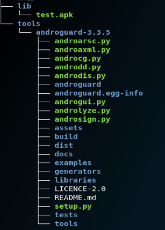

# Androguard的使用

[TOC]

Android应用程序分析主要有静态Fenix和动态分析两种，

常见的静态分析工具是Apktool、dex2jar及Androguard有dex、odex、arsc等文件的分析处理功能，他是基于Python写的，将Apk文件中的dex文件中的类、方法等映射为Python对象，简单来说，androguard提供了apl文件的方向编程，恶意软件检测和权威评估，还有程序的可视化。


## Androguard的安装

这里就不对下载源进行处理，直接按照Androguard

- 进入这个网址下载https://github.com/androguard/androguard/releases

  在主目录建立文件夹：**tools**，在里面解压安装包

- 安装androguard的python依赖库

  0. 安装cmake命令：`apt-get install cmake`
  1. 安装python包管理器（easy_install）：`apt-get install python-setuptools`
  2. 安装python包管理器（pip，这个查找包安装包比较方便些，直接使用easy_install也是可以的）：`easy_install pip`
  3. 安装networkx库（apkviewer依赖这个库）：`pip install -v networkx`
  4. 安装IPython库（androlyze依赖这个库）：`pip install -v IPython`
  5. 安装pydot库（androdd依赖这个库）：`pip install -v pydot`
  6. 安装PySide库（androgui依赖这个库，安装时间很长需要耐心等待，安装这个需要cmake所以上面先安装了cmake）：`pip install -v PySide`

- 在androguard2.0的目录里面执行`./setup.py install`完成安装 发现权限不够，我们将setup.py 的操作权限提高：`chmod 755 setup.py`


**linux的软件**


## Apk的分析

- apk的来源，自己写的一个Android项目<https://github.com/kevin-leak/canberecycle>，下载后编译生成一个debug文件，修改名字为test.apk，进行操作。

  将生成的文件移到**lib**目录下，安装tree：`apt-get install tree`，使用：`tree -L 3`

  看一层级为3的下文件结构

  

- 执行androaxml.py文件，传入路径参数，输出文件到`../../lib/test.xml`

  ```shell
  cd tools/androguard-3.3.5
  ./androaxml.py -i ../../lib/test.apk -o ../../lib/test.xml
  ```

- 利用命令查看test.xml

  ```shell
  cat ../../lib/test.xml
  ```

  这里你会发现读取了Adroidminfiest.xml

- 查看日志

  ```
  ./androaapkinfo.py -i ../../lib/test.apk -o ../../lib/test.xml
  ```

  


