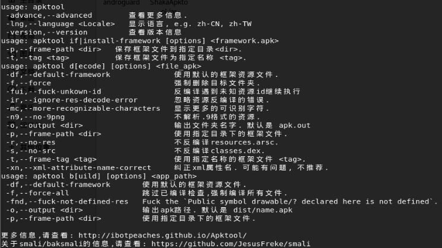

# shaka apk tool

[TOC]

## 工具安装

jar包的下载：

https://down.52pojie.cn/?query=shaka

源码地址：<https://github.com/rover12421/ShakaApktool>

因为是jar包，在kali和window中都可以用。


## 基本命令查看

```java
java -jar ShakaApkTool
```




## 软件破解

发现，又Android studio 3.0多的版本，都不能直接反编译，debug的时候应该加了密码。


