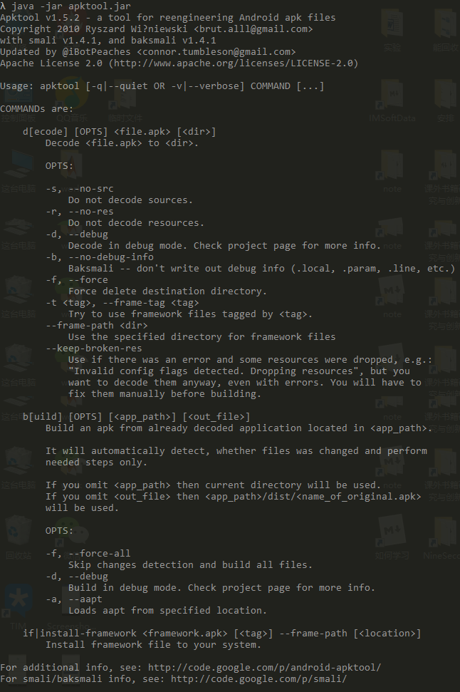

# ApkTool的使用

[TOC]

## 下载与安装

下载地址：https://ibotpeaches.github.io/Apktool/

因为是jar包直接使用，linux 和windows都可以用。

下载smailidea插件：<https://bitbucket.org/JesusFreke/smali/downloads/>，并安装好


## 基本命令查看

```java
java -jar apktool.jar
```




## 调试apk基本操作

1. 对apk进行反编译：

   ```java
   java -jar apktool.jar d -d stick_snow.apk huaxue
   ```

2. 修改`Android.minfest.xm`l， 在application节点中添加android:debugable="true"

   ```xml
   <application android:debuggable="true" 
                android:icon="@drawable/app_icon" 
                android:label="@string/app_name"
                tools:ignore="GoogleAppIndexingWarning">
   </application>
   ```

3. 导入到Android studio中

   添加debug等待的smali代码

   ```smail
   invoke-static{}, Landroid/os/Debug;->waitForDebugger()V
   ```

4. 编译打包

   ```java
   java -jar apktool.bat b -f sticksnow sticksnow.apk
   ```

5. 对apk进行签名

   ```java
   java -jar signapk.jar testkey.x509.pem sticksnow.apk sticksnowsign.apk
   ```

6. 利用adb命令，安装apk

   ```shell
   adb install stick_snow.apk
   ```

7. 设置远程调试：Edit Configuration --> + --> remote --> host：localhost，post 8700

8. 打开monitor，选中要调试的app

9. 设置断点，点击调试。

     


## ApkTool源码分析


## 遇到的问题

- 他妈的，命令和视频的不匹配，要及看一看说明

- 在调试的时候，注意虚拟机与adb操作时候的连接

  这个问题采取的是重启连接。

- 如果遇到两个模拟器

  ```shell
  # 查看模拟器名字
  adb devices
  # emulator-5554 是模拟器的编号
  adb -s emulator-5554 shell
  # Windows下，如果已经offline，但却说没有，使用下面的命令。
  adb kill-server
  taskkill /f /im adb.exe
  ```


