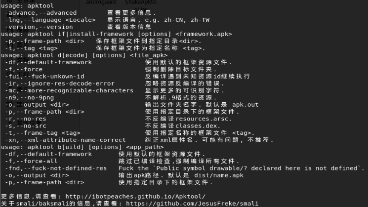

# shaka apk tool

[TOC]

## 工具安装

jar包的下载：

https://down.52pojie.cn/?query=shaka

因为是jar包，在kali和window中都可以用。


## 基本命令查看

```java
java -jar ShakaApkTool
```




## 软件破解

发现，又Android studio 3.0多的版本，都不能直接反编译，debug的时候应该加了密码。

1. 先进行反编译

   ```java
   java  -jar ShakaApkTool.jar d -df stick_snow.apk -o sticksnow
   ```

2. 编译打包指令

   ```java
   java  -jar ShakaApkTool.jar b sticksnow -o sticksnow.apk
   ```

3. 修改`Android.minfest.xm`l， 在application节点中添加android:debugable="true"

   ```xml
   <application android:debuggable="true" 
                android:icon="@drawable/app_icon" 
                android:label="@string/app_name"
                tools:ignore="GoogleAppIndexingWarning">
   </application>
   ```

4. 导入到Android studio中

   添加debug等待的smali代码

   ```smail
   invoke-static{}, Landroid/os/Debug;->waitForDebugger()V
   ```

5. 编译打包

   ```java
   java -jar apktool.bat b -f sticksnow sticksnow.apk
   ```

6. 利用adb命令，安装apk

   ```shell
   adb shell am start -D -n packageName/Activityname
   ```

7. 设置远程调试：Edit Configuration --> + --> remote --> host：localhost，post 8700

8. 打开monitor，选中要调试的app

9. 设置断点，点击调试。


## shaka apk tool 源码分析

