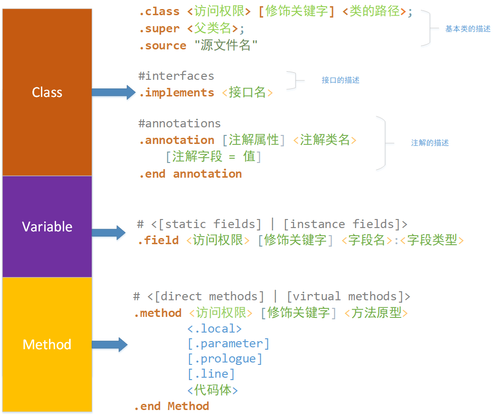
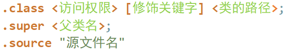
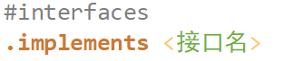
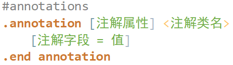
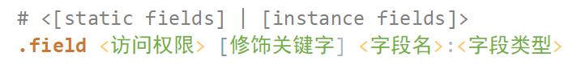
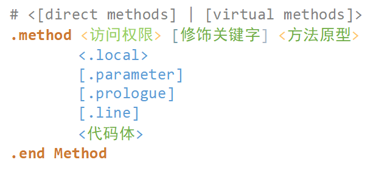

# Smail 代码解析

[TOC]

## 如何学习与记忆


我个人的理解，对于smail代码的学习，应该从java本身来说

- java的分类就是：类 --> 对象 -->  变量、方法

- 还有对编程中执行的结构：顺序结构，循环结构，条件结构。
- 在加一些比较特殊的：内部类，监听器，注解，自动生成的类。

最主要就是要搞清楚，这些东西的表现格式，还有本身smail文本的格式。

则分模块讲。


## 类结构

### 上一张总体图



### 类的结构解释

- 基本类

  

  类的结构还是比较好理解

  ```java
  .class <访问权限> [修饰关键字] <类的路径>;
  .super <父类名>;
  .source "源文件名"
  ```

  举一个例子

  ```java
  .class public Lcom/unity3d/player/UnityPlayerProxyActivity;
  .super Landroid/app/Activity;
  .souce "UnityPlayerProxyActivity"
  ```

  需要注意的是.source可能不存在。

- 接口，省略吧，就那样

  

- 注解，这要多加注意

  

  - 注解在类中：".annotation" 指令会直接定义在smali文件中。

  - 方法与字段：

    源码：

    ```java
    @ com.droider.anno MyAnnoField(info = "Hello my friend")
    public String sayWhat
    ```

    smail代码

    ```java
    #instace fields
    .field public sayWhat:Ljava/lang/Sting;
    	.annotation runtime Lcom/droider/anno/MyAnnoField;
    		info = "hello my friend"
    	.end annotation
    .end field
    ```


### 字段的解释



不用解释直接看图吧，给一个例子

```java
# instance fields
.field protected mUnityPlayer:Lcom/unity3d/player/UnityPlayer;
```


### 方法结构解释



名词解释：

- **direct methods** 和 **virtual methods** ：修饰不同的方法，应该是一个是自己自身的，一个是继承来的。
- **.local**：用来指定有多少局部变量
- **.parameter**：用来指明参数，一个参数一条，他可能是没有，在开头就用小括号直接指明了
- **.prologue**：用来指明开始的代码的位置，可能因为混淆使得看不见这个指令
- **.line**：指定了再源代码中的行号，同样由于混淆的原因会消失


## 执行结构


