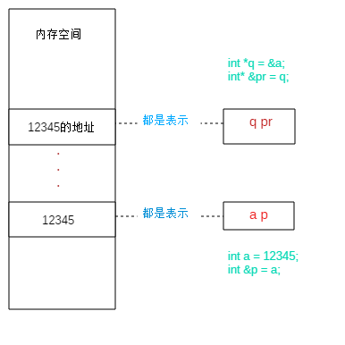

C++
===

**思考**：

- c++有哪些需要学？
- c 与 c++ 相同却不同意义的部分
- c++兼容问题
- c++ 新增的部分
- 哪些应该了解，哪些应该熟悉，哪些应该掌握？

**新增的意义？**

对象的新增：封装、继承、多态

时间、内存、数据三者之间的关系

电信号，和眼睛所以看的


指针与引用的区别
----------------

实验代码

```c++
int a = 12345;
cout << "a value is :" << a << "\ta address is :" << &a << endl;
int &p = a;
cout << "a value is :" << p << "\tp address is : " << &p << endl;
int *q = &a;
cout << "q value is :" << q << "\tq address is : " << &q << endl;
int* &pr = q;
cout << "pr value is :" << pr << "\tpr address is : " << &pr << endl;
```

输出信息

```
a value is : 12345      a address is :0x61ff04
a value is : 12345      p address is : 0x61ff04
q value is : 0x61ff04   p address is : 0x61ff00
pr value is : 0x61ff04  p address is : 0x61ff00
```

发现：

- 值变量的引用，引用的值和地址都与值变量一样
- 指针变量的引用，引用的值和地址都与值变量一样

再看在传值方面有什么区别

```c++
void test(int &i) {
    i++;
}
void test(int *i) {
    (*i)++;
}
int main() {
    int k = 0;
    int &p = k;
    test(k);
    cout << k << endl;
    test(p);
    cout << k << endl;
    test(&k);
    cout << k << endl;
    return 0;
}
```

输出：1

可以发现传引用可以改变1，但他不能直接改变地址了。相对来说对地址进行了保护。

### 总结

引用就是一个别名，有点类似于宏定义，一个变量名字的取代而已，函数传引用可以改变原来的值。

不能直接操作地址




命名空间
--------

常见的就是：标准的输入输出

```c++
using namespace std;// using namespace就如字面意思使用的一是
```

命名空间的作用是为了简化来自于其他源文件函数调用的前缀。

因为简化，就会涉及到重名冲突与嵌套的问题：如果重名就写全路径

注意的是命名空间自身还可以嵌套。

```c++
namespace NameSpaceB{
    int age = 0;
    namespace NameSpaceC
    {
        struct Teacher
        {
            char name[10];
            int age;
        };
    }
}
```


函数
----

### 内联函数

**内联函数inline：**引入内联函数的目的是为了解决程序中函数调用的效率问题，这么说吧，程序在编译器编译的时候，编译器将程序中出现的内联函数的调用表达式用内联函数的函数体进行替换，而对于其他的函数，都是在运行时候才被替代。这其实就是个空间代价换时间的i节省。所以内联函数一般都是1-5行的小函数。在使用内联函数时要留神：

- 1.在内联函数内不允许使用循环语句和开关语句；
- 2.内联函数的定义必须出现在内联函数第一次调用之前；
- 3.类结构中所在的类说明内部定义的函数是内联函数。


内存模型
--------

- 没有继承关系时：成员变量和成员函数会分开存储，成员变量存储在栈、堆、全局数据区，而成员函数存储在代码区；
- 有继承关系时：派生类的内存模型可以看成是基类成员变量和新增成员变量的总和，而所有成员函数仍然存储在代码区，由所有对象共享；

基类的成员变量排在前面，派生类的排在后面； c++中类的内存大小和函数无关，只和成员变量有关系


类与访问控制
------------

### 理解

一个类的建立，必然存在：构造与释放，访问控制，继承

目的就是：代码的复用与多态。

### 继承

什么可以继承？[C++ 继承](https://www.runoob.com/cplusplus/cpp-inheritance.html) 

```
class derived-class: access-specifier base-class
```

其中，访问修饰符 access-specifier 是 **public、protected** 或 **private** 其中的一个，base-class 是之前定义过的某个类的名称。如果未使用访问修饰符 access-specifier，则默认为 private。

#### 环状继承

解决：

```c++
class D{......};
class B: virtual public D{......};
class A: virtual public D{......};
class C: public B, public A{.....};
```

#### 函数调用

```
基类构造函数的调用顺序和它们在派生类构造函数中出现的顺序无关，而是和声明派生类时基类出现的顺序相同
在派生类的构造函数中调用基类的构造函数；派生类构造函数中只能调用直接基类的构造函数，不能调用间接基类的；通过派生类创建对象时必须要调用基类的构造函数，这是语法规定.
```

### 访问控制

- 关键字中的规定：public/private/protected（与类纵向和横向的规定有交叉）
- 类纵向(继承)访问规定
- 类横向访问控制（跨类、跨文件、跨包）：friend

派生类可以访问基类中所有的非私有成员。因此基类成员如果不想被派生类的成员函数访问，则应在基类中声明为 private。

我们可以根据访问权限总结出不同的访问类型，如下所示：

| 访问     | public | protected | private |
| :------- | :----- | :-------- | :------ |
| 同一个类 | yes    | yes       | yes     |
| 派生类   | yes    | yes       | no      |
| 外部的类 | yes    | no        | no      |

一个派生类继承了所有的基类方法，但下列情况除外：

- 基类的构造函数、析构函数和拷贝构造函数。
- 基类的重载运算符。
- 基类的友元函数。

```
  1) public继承方式
   基类中所有 public 成员在派生类中为 public 属性；
   基类中所有 protected 成员在派生类中为 protected 属性；
   基类中所有 private 成员在派生类中不能使用。

   2) protected继承方式
   基类中的所有 public 成员在派生类中为 protected 属性；
   基类中的所有 protected 成员在派生类中为 protected 属性；
   基类中的所有 private 成员在派生类中不能使用。

   3) private继承方式
   基类中的所有 public 成员在派生类中均为 private 属性；
   基类中的所有 protected 成员在派生类中均为 private 属性；
   基类中的所有 private 成员在派生类中不能使用。
```


### 代码

**样板代码** 

```c++
#ifndef CPP_FUNC_PERSON_H
#define CPP_FUNC_PERSON_H
#include <iostream>
using namespace std;
class Person {
    static int person_class;
    // 这里默认为private
public:
    string name;
    // [explicit规定不能自动转换](https://blog.csdn.net/vict_wang/article/details/81673722)
    explicit Person(string name);// 构造函数，如果没有，则为默认构造Person()
    virtual ~Person();                   // 析构函数，释放内存空间,一般为虚函数
    Person(const Person &p);    // 拷贝构造函数，浅拷贝，数值拷贝
    void set_name(string name);
    //友元关系不能传递
    //友元关系是单向的
    //友元关系不能被继承
    friend void to_see(Person &p); // 友元函数，不是成员函数
    friend class Policemen;       // 友元是为了打破private，protected的限制而存在，不可被继承
private:
    int sex;
    string mystery = "it is my personal mystery";
protected:
    string id;
};
// 友元类的是实现
class Policemen {
public:
    static void see_id(Person &p) {
        cout << "policemen check person id : " << p.id << endl;
    }
};

#endif //CPP_FUNC_PERSON_H
```

**实现**

```c++
#include "Person.h"
#include <iostream>
using namespace std;
void Person::set_name(string name) {
    this->name = std::move(name);
}
Person::Person(string name) {
    this->name = std::move(name);
    this->id = "838u2r30-ie55qs99ir-6666666";
    this->sex = 0;
    cout << "I am birth" << "my id is : " << this->id << endl;
}
Person::~Person() {
    cout << "I wil be destroyed" << " my id is : " << this->id << endl;
    this->name = "";
    this->id = "";
    this->sex = 0;
}
Person::Person(const Person &p) {
    this->name = p.name;
    this->sex = p.sex;
    this->id = "838u2r30-ie55qs99ir-9999999";
    cout << "I am copy done" << " my id is : " << this->id << endl;
}
void to_see(Person &p) {
    cout << "friend see mystery" << p.mystery << endl;
}
```

**测试**

```c++
int main() {
    // Person p(); 报错
    Person p("kevin");
    Person per = p; // 调用拷贝构造函数
    Person* k = new Person("ll");
    cout << k->name << endl;
    cout << p.name << endl;
    cout << p.name << endl;
    Policemen::see_id(p);
    return 0;
}
```


### 多态——虚函数

**多态**：程序运行时，父类指针可以根据具体指向的子类对象，来执行不同的函数，表现为多态。

- 当类中存在虚函数时，编译器会在类中自动生成一个虚函数表 Virtual table
- 虚函数表是一个存储类成员函数指针的数据结构
- 虚函数表由编译器自动生成和维护
- virtual 修饰的成员函数会被编译器放入虚函数表中 （知道就可以 安卓不需要研究太深入）
- 存在虚函数时，编译器会为对象自动生成一个指向虚函数表的指针（通常称之为 vptr 指针）


**virtual虚函数**
虚函数对于多态具有决定性的作用，有虚函数才能构成多态，这节我们来重点说一下虚函数的注意事项：

- 只需要在虚函数的声明处加上 virtual 关键字，函数定义处不加
- 可以只将基类中的函数声明为虚函数，当派生类中出现参数列表相同的同名函数时，自动成为虚函数
- 当在基类中定义了虚函数时，如果派生类没有定义新的函数来override此函数，那么将使用基类的虚函数
- 构造函数不能是虚函数；对于基类的构造函数，它仅仅是在派生类构造函数中被调用，这种机制不同于继承；也就是说，派生类不继承基类的构造函数，将构造函数声明为虚函数没有什么意义
- 析构函数有必要声明为虚函数

**纯虚函数可以理解为抽象类，如果要实例化，必须实现虚函数**

```c++
//纯虚函数和抽象类  包含纯虚函数的类称为抽象类（Abstract Class）；
//之所以说它抽象，是因为它无法实例化，也就是无法创建对象；
//抽象类通常是作为基类，让派生类去实现纯虚函数；派生类必须实现纯虚函数才能被实例化
//virtual float area() const = 0;
class Line {
public:
    Line(float len);
    virtual ~Line() {}
    virtual float area() const = 0;
    virtual float volume() const = 0;
protected:
    float m_len;
};
Line::Line(float len) : m_len(len) {}
class Rectangle : public Line {
public:
    Rectangle(float len, float width);
    virtual float area() const override;
protected:
    float m_width;
};
Rectangle::Rectangle(float len, float width) : Line(len), m_width(width) {}
float Rectangle::area() const { return m_len * m_width; }
```


**总结：**

<div style="background:#ECF8F2; color:#777777; border-left:5px solid #42B983; padding:15px" >
    当通过指针访问类的成员函数时：<br/>
如果该函数是非虚函数，那么编译器会根据指针的类型找到该函数；也就是说，指针是哪个类的类型就调用哪个类的函数；<br/>
如果该函数是虚函数，并且派生类有同名的函数override它，那么编译器会根据指针的指向找到该函数；<br/>
也就是说，指针指向的对象属于哪个类就调用哪个类的函数，这就是多态；
</div>


模板——泛型编程
--------------

为什么要有泛型编程 C++是一门强类型语言，所以无法做到像动态语言（python javascript）那样子，编写一段通用的逻辑，可以把任意类型的变量传进去处理。泛型编程弥补了这个缺点，通过把通用逻辑设计为模板，摆脱了类型的限制，提供了继承机制以外的另一种抽象机制，极大地提升了代码的可重用性。

> 注意：模板定义本身不参与编译，而是编译器根据模板的用户使用模板时提供的类型参数生成代码，再进行编译，这一过程被称为模板实例化。用户提供不同的类型参数，就会实例化出不同的代码。

[函数模板](https://blog.csdn.net/lezardfu/article/details/56852043) 

```c++
template<typename T>
int compare(const T& left, const T& right) {
    if (left < right) {
        return -1; 
    }
    if (right < left) {
        return 1; 
    }
    return 0;
}
compare<int>(1, 2); //使用模板函数
```

**模板类**

```c++
class Printer {
public:
    template<typename T>
    void print(const T& t) {
        cout << t <<endl;
    }
};
Printer p;
p.print<const char*>("abc"); //打印abc

```

**模版类**

```c++
template<class T，class B> 定义一个模板类
```

为类定义一种模式。使得类中的某些数据成员、默写成员函数的參数、某些成员函数的返回值，能够取随意类型

常见的 容器比如 向量 vector \<int> 或 vector \<string> 就是模板类


其他关键字的认识
----------------

变量主要就是：数据类型、数据存储周期、数据访问控制


### Static关键字？C++怎么操作？

静态属性在C++中一定要初始化，必须写int Student::age = 23；静态方法不能操作非静态成员。静态可以直接通过类名来操作。非静态可以操作静态。

### 对象的大小？

1. 对象的大小与结构体计算方式一致 

2. static 静态变量和方法没有计算到类的大小里面

3. C++类对象计算需要考虑成员变量大小，内存对齐、是否有虚函数、是否有虚继承等。

4. 类对象大小没有因为增加了静态成员而变化。因为静态成员是属于类成员共有的，不单独属于任何一个对象，对静态成员的存储不会选择在某个对象空间，而是存在于堆当中，因此不会对对象的大小造成影响。

Const:修饰类的函数 void test() const{} 主要是来修饰this指针不能被修改

Typedef：类型替换 typedef unsigned int u_int;  tt = 266;


### 操作符重载

**定义与测试**

```c++
#include "FunctionOverloading.h"
#include <cstdio>

using namespace std;

void FunctionOverloading::print() const {
    printf("%g + %g\n", m_real, m_imag);
}

FunctionOverloading FunctionOverloading::operator+(const FunctionOverloading &A) const {
    return FunctionOverloading(m_real + A.m_real, m_imag + A.m_imag);
}

int main() {
    FunctionOverloading A(1.24, 5.7), B(4, 3.14), C;
    C = A + B;
    C.print();
    return 0;
}
```

**类加载**

```c++
class FunctionOverloading {
public:
    //FunctionOverloading(double real ,double imag);
    FunctionOverloading(double real = 0.0, double imag = 0.0) : m_real(real), m_imag(imag) {}

    void print() const;
//    JpegDecoder& operator=(const JpegDecoder &); // assign disabled
    FunctionOverloading operator+(const FunctionOverloading &A) const;

private:
    double m_real;
    double m_imag;
};
```

