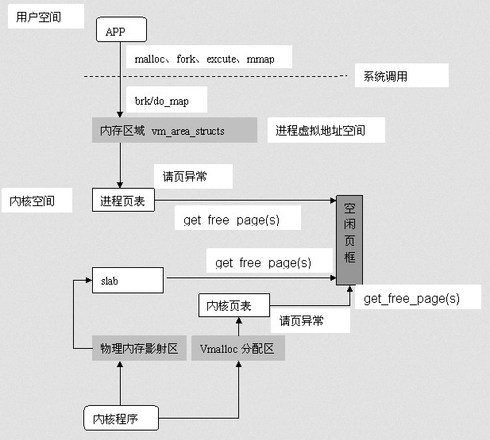

# 数据类型与内存分布

[TOC]

这里只做补充，与java进行一个对比的一个笔记。

认识区别

任何做实验？

我们平时应该怎么写。


// todo， 完成思维逻辑的图。


## 基础数据类型

这里做两部分的书写，一个是java的字节数，一个是c语言的字节数的比较

### java

<table>
    <tr >
        <td> boolean</td>
        <td> 这个试编译环境而定 </td>
    </tr>
    <tr>
        <td> byte </td>
        <td> 1字节</td>
    </tr>
    <tr>
        <td> short </td>
        <td> 2字节 </td>
    </tr>
    <tr>
        <td> char </td>
        <td> 2字节 </td>
    </tr>
    <tr>
        <td> int </td>
        <td> 4字节 </td>
    </tr>
    <tr>
        <td> long </td>
        <td> 8字节</td>
    </tr>
    <tr>
        <td> float </td>
        <td> 4字节</td>
    </tr>
    <tr>
        <td> double </td>
        <td> 8字节 </td>
    </tr>
</table>
### C中

#### 整形

注意一下占位符，无符号整形是u，其他无符号 在原有的基础上加u即可。

| 整型           | 字节 | 取值范围                        | 占位 |
| :------------- | ---- | ------------------------------- | ---- |
| int            | 4    | -2,147,483,648 到 2,147,483,647 | %d   |
| unsigned int   | 4    | 0 到 4,294,967,295              | %u   |
| short          | 2    | -32,768 到 32,767               | %hd  |
| unsigned short | 2    | 0 到 65,535                     | %hu  |
| long           | 4    | -2,147,483,648 到 2,147,483,647 | %ld  |
| unsigned long  | 4    | 0 到 4,294,967,295              | %lu  |
| char           | 1    | -128 到 127                     | %c   |
| unsigned char  | 1    | 0 到 255                        | %c   |

#### 浮点型

| 浮点型      | 字节 | 精度     | 占位 |
| ----------- | ---- | -------- | ---- |
| float       | 4    | 6位小数  | %f   |
| double      | 8    | 15位小数 | %lf  |
| long double | 8    | 19位小数 | %Lf  |


#### 编码格式化 

```c
8进制 			%o
16进制			小写： %x    大写：%X
(0x)+16进制前面 	%#x 
```


### 区别

#### 实验

```c
printf("%d\n", sizeof(int));
printf("%d\n", sizeof(long));
printf("%d\n", sizeof(long int));
printf("%d\n", sizeof(long long));
printf("%d\n", sizeof(long long int));
```

**运行结果：**

>4
>4
>4
>8
>8

说明，c语言中：`long long int = long long`，而在字节数中 `long int = long = int`

**为什么long int 会等于int**

long和int在早期16位电脑时候 int 2字节，long 4字节，而计算机发展到现在，一般32、64下，long和int一样。和java类比的话，java的long就是 long long 8字节


[这里贴一篇博客](<https://blog.csdn.net/chienchia/article/details/27101709>)

```c
先简要概述以下内置类型的发展，如有疏漏，还请指正。C语言开始时只有char(8位)和int(16位)两种，后来随着发展又加入了short(16位)和long(32位)，此时，int可以是16位或者32位，依赖于平台和后续的兼容性。再后来当64位出现时，long long(64位)又被添加进来，为了进行规范，对较小的一些类型的范围就有了一些调整，逐渐稳定为int32位，long可以有多种定义，可以是32位，也可以是64位。

   C++标准上只是说long至少要和int一样大，所有整数类型实现时要满足如下规范：

   sizeof(char)  ==  1

   sizeof(char)  <=  sizeof(short)

   sizeof(short)  <=  sizeof(int) 

   sizeof(int)  <=  sizeof(long)

   sizeof(long)  <=  sizeof(long long)

```


#### 总结一下

- c语言中：`long long int = long long`，而在字节数中 `long int = long = int`
- java没有无符号型
- java：long 为c中的long long ,看字节数就知道了。
- c99 才有bool
- 规定 int至少和short一样长，long至少和int一样长、
- c语言中char和java的byte都为1字节，而java中的char和short一样是2字节


### 需要怎么做？

把区别记住，

在我们实际编程中使用重定以的语句来规避，不同的电脑的带来的不同

如：   除了char和long long，其余的类型范围较灵活，都是平台相关的，与实现相关。如果要实现平台独立的话，在windows平台上，就有`__intn可以使用，n代表位数。__int8   __int16   __int32   __int64。`


### 类型转换

这个分为，显示转换和隐式转换，隐式转换为编译器执行。

这里讲一下强制类型转化

```c
float k = 9.0f;
int i = 2;
int sum = (int) (k / i);
```

这里说一句：转化为int的时候数据会发生丢失。

只有往上转型的时候才能获取到正确的数据。


### 类型定义

就是`typedef`关键字的利用

```c
typedef int Bool
typedef int Color
```

类型定义的意义在哪？？

可以使得基本数据类型更有意义，使得代码更容易维护。

也可以使用宏定义

```c
#define int Bool
```

但他不是类型转换，要解决可移植性的问题，尽量使用`typedef` 


## 内存分配

### 提出问题

每次遇到内存分配的问题，都会说道栈和堆，如何理解他们？？

当然这里的理解并不是从数据结构的角度来说，而是回答下面几个问题

- 栈和堆内存由谁生成？由谁管理？
- 栈和堆是不是每一个进程都有一个栈和堆，还是怎么样？？？
- 栈内存和堆在内存条中，相对于其他进程地址是不是共享的，还是怎么样？
- 为什么要有栈和堆？？，存在这样的分配方式是为了解决什么问题？
- 为什么要限制栈的大小，是否可以改变，栈的大小应该根据什么来设置?
- 在操作系统中，内存的分配是段页式？这里又跑出了一个栈堆，什么关系？？

### 实验现象

先做实验看现象

#### 查看系统设置的stack大小

查询一下Linux中栈的大小：


对于一个c语言程序来说，栈分配通常用来存放函数，也就是每一个栈帧都是一个函数，这样在分配内存的时候，就可以利用栈的先进后出的特性对函数的生命周期进行一个维护。

#### 代码中栈区在哪里？

那验证是否在函数内内存属于栈分配。

```c
int count = 0;

void ret() {
    printf("%%d\n", count);
    ret();
}

int main() {
    ret();
    return 0;
}
```

>windows 下输出信息在 ：64909停止了
>
>Ubuntu下是：523764停止了

说明不同的操作系统有不同的栈区大小，而且可以知道的是，栈区存放的是函数内容。

#### 一个线程开辟一个栈？

可以这样实验，结合我们之前在使用递归做实验的时候。

实验思路：利用两个线程，分别进行一个递归调用，如果产生的数据与上面的实验的数据进行对比，如果两者的加起来的比 64909大，说明是有两个栈。

```c
#include <stdio.h>
#include <unistd.h>
#include <stdlib.h>

struct data {
    char name;
    int count;
} a, b;

void innerRun(struct data *p) {
    printf("%c = %d\n", (*p).name, (*p).count++);
    innerRun(p);
}

void run(struct data *lpVoid) {
    innerRun(lpVoid);
}

int main() {
    a.name = 'a';
    a.count = 0;
    b.name = 'b';
    b.count = 0;
    _beginthread((void (*)(void *)) run, 0, &a);
    _beginthread((void (*)(void *)) run, 0, &b);
    // 这里一定要注意，如果主线程挂了，子线程也会挂，所以要停止。
    system("pause");
    return 0;
}
```

实验结果：

>a = 64909
>
>b = 49573

多次实验发现，两个线程中栈递归产生的数都接近 64909，说明有两个栈。

### 栈区大小是否可修改？

**windows下的修改**

main.c 为c语言文件，hh为输出的文件，`-Wl,--stack=3145728` 这个设置栈区大小，设置的3m

在本机64位的操作系统下，设置为2m时与没有设置一样的大小。

```shell
gcc main.c -o hh -g -Wl,--stack=3145728
```

>输出最大的数为：97616

可以发现明显比 63909 的递归的程度深。

**Linux下的修改**

```
ulimit -s 10240
```

再进行编译就可以了


**从windows 修改栈区中可以看出，事件上修改的栈区的大小是gcc的参数，也就是编译器的参数，说明栈是由编译器控制和生成。**


### 在堆上开辟空间


#### 开辟比内存条大的堆空间

```c
int main() {
	// 每次申请32g的内存
    while (1)
        malloc(sizeof(int) * 1024 * 1024 * 1024 * 8);
    return 0;
}
```

发现这样并没有崩溃。内存空间占用恒定在25%，2G的样子.

说明有被回收，但不是说自己回收吗？？？，看来还受到操作系统的控制。

#### 栈区申请堆空间

因为栈中存放的是函数中的数据，我们在函数内动态申请一下，因为为windows是2m，我们就在函数中申请3m，看是否会爆栈。

```c
void ret() {

    int i = 1;
    while (i <= 3){
        printf("函数内动态申请内存为：%dm\n", i++);
        malloc(1 * 1024 * 1024 );
        
    }
}

int main() {
    ret();
    return 0;
}
```

输出结果：

>函数内动态申请内存为：1m
>函数内动态申请内存为：2m
>函数内动态申请内存为：3m

通过malloc申请内存空间和代码位置没有关系，他获取的就是堆这里的空间。

#### 动态开辟普通变量

```c
int *temp;
//开辟一个int 4字节大小的空间
temp = (int *)malloc(sizeof(int));
*temp = 10;
printf("%d", *temp);
// 释放内存。
free(temp);
// 测试是否清空
printf("%d\n", *temp);
```

> 输出结果
>
> 10
> 10033600

#### 动态开辟数组

```c
int *arr;
int size = 10;
// 申请长度为10的一维数组
arr = (int *)malloc(sizeof(int) * size);
for (int i = 0; i < size; i++){
    arr[i] = i;
    printf("%d\n", arr[i]);
}
```

#### 统一初始化

用来初始化数组的

```
memset(arr, c, 20);
```

函数的功能是：将指针变量 s 所指向的前 n 字节的内存单元用一个“整数” c 替换，注意 c 是 int 型。arr 是 void* 型的指针变量，所以它可以为任何类型的数据进行初始化。


#### 各类申请队空间

**calloc**
	申请内存并将初始化内存数据为NULL.

​	 ` int *pn = (int*)calloc(10, sizeof(int));`

**realloc**

​	 对malloc申请的内存进行大小的调整.

```c
char *a = (char*)malloc(10);
realloc(a,20);
```

特别的：
**alloca**
	在栈申请内存,因此无需释放.
`int *p = (int *)alloca(sizeof(int) * 10);`


### 程序在内存的分布

#### 程序的加载过程

```
c语言源码	-->  预处理器 	--> 扩展代码 	--> 编译器 	---> 汇编语言
汇编		 -->  目标代码 	 --> link 		--> 可执行代码 	--> loader --> 执行
```


有几个过程需要注明：

贴两片英文文章：

- [How does a C program executes?](<https://www.geeksforgeeks.org/how-does-a-c-program-executes/>) 
-  [Flow of C Program](<https://www.javatpoint.com/flow-of-c-program>) 

1. Preprocessor：预处理程序包括头文件，展开宏；有点代码包含好几个操作，预处理器负责将预处理器指令转换成它们各自的值。
2. Compiler：编译器将编译程序，检查错误并生成目标文件(此目标文件包含汇编代码）
3. Linker：将各个目标文件中的各段代码进行绝对地址定位，生成跟特定平台相关的可执行文件，当然，最后还可以用objcopy生成纯二进制码，也就是去掉了文件格式信息。（生成.exe文件）
4. Loader：将可执行程序加载到内存中


#### 运行时内存分布

我这里强调一句，我们肉眼观察到的代码，在我们就是一串字符，其实在实际中表现为**电信号以及物质的状态**

比如说磁盘，我们存储的信息表现为磁性的状态的组合，而我们敲击的“字”，其实就是显示屏物质的组好变化。

我们说打字，其实是通过敲击改变了点电信号，而改变了显示屏的物质，通过光放射到我们眼中形成**映像**。

所以我们的c，汇编，都是一串我们脑子抽象出来的代码，来代表物理的状态。


##### 操作系统内存分配策略

一段程序的运行就是，物理物质的运动，我们用电信号来表示内存，进行地址的划分。

为了最大化的利用内存的空间，防止碎片化，我们采取了**段页式进行地址的划分**。

而要执行多道的程序，在内存不够大的情况下，我们有**并行的设计方法以及虚拟内存**。

并行其实是在我们感知不到的时间片中切换，虚拟内存也是在不影响软件运行操作的情况下不断的切换内存空间。

两个都产生一个我们体验中的错觉，程序同时运行于内存增大。


##### 面临一个问题

在程序运行中，我们如何让一个程序没有使用的内存尽快被空出？？

也就是对于一个进程来说我们应该如何配合操作系统，划分内存空间？

而对于开发者来说，就是尽量的减少对内存的考虑，集中精力在开发中。

栈和堆就是一个非常好的数据结构。

有些比如函数，执行了就不会在用，局部变量就是如此，完了就不会再用。

而静态变量不一样，要长期存在。

这里就是我们编译器会做的一件事了，将函数内的内存添加了释放空间的命令。

而这种结构就是栈结构，先进后出。


##### 开辟一个内存空间实际是开辟什么？

这一块百度找不到，我按照我自己的思考来说，从操作系统这一块来说。

当我们运行一个软件，通常是发生了点击事件，其实就是中断，我们同敲击鼠标来传递电信号，此时CPU就会产生一个操作，读取磁盘中的代码，也就是获取物理设备的状态信息，加载到内存中，进行一个运算。

而我们写的代码中有动态获取的内存，其实就是执行了一条指令，命令cpu，获取内存中模块地址。

就是这么一个感性进程运行的过程。

我们再深入malloc以及联合段页式和虚拟内存进行研究，这里贴几篇博客：

- [linux内核栈与用户栈](https://blog.csdn.net/ysbj123/article/details/52037916) 
- [Linux下PCB(进程控制块)、内核栈和用户空间栈关系](https://blog.csdn.net/mm_hh/article/details/70056519) 
- [linux内存管理--进程在内存中的分布](https://blog.csdn.net/yusiguyuan/article/details/12041317) 
- [Linux 内核：进程内核栈、用户栈](Linux 内核：进程内核栈、用户栈) 

本来这里是要自己看一下，Linux这方面的源码，更清楚，这里等着以后补一下。

这个源码应该在进程调度这一块，进程的创建，会建立一个栈区。

这里直接的总结一下：

###### 开辟流程图

先贴图，看一下一个进程申请空间的流程，写的很不错。




栈是相对线程的，堆是相对于进程的。

堆分为内核和用户态，如果说我们没有对程序进行运行，那么代码就是那样，由编译器完成编译后形成一个栈结构。**当进行运行的时候，陷入内核栈。具体是怎么陷入的？**

- 用户态 --> 内核态：

  先把用户态堆栈的地址保存在内核栈之中，后设置堆栈指针寄存器的内容为内核栈的地址。

- 内核态 --> 用户态 ：

  在内核态之行的最后将保存在内核栈里面的用户栈的地址恢复到堆栈指针寄存器即可，此时内核栈区被清空。

**陷入内核栈时，如何知道内核栈的地址呢？**
进程由用户栈到内核栈转换时，进程的内核栈总是空的。每次从用户态陷入内核时，得到的内核栈都是空的，所以在进程陷入内核时，直接把内核栈顶地址给堆栈指针寄存器即可

**而栈顶指针来自于哪里？？？**

相对于已经在运行的进程来说，栈顶指针是固定的，一开始虚拟映射分配的。

**内核栈是进程共享的吗？**

所有进程的内核栈都在内核空间(3G+)，每个进程都有自己单独的内核栈，它们共享的是内核地址空间（在内核态时可以使用内核接口）。由于进程数量很多，所以这也是内核栈比较小的原因，看源码说内核栈是8kb，实际上分配两个连续的物理页面。


##### 栈区和堆在内存

现在看一下图中的分配：


进程分配内存主要由两个系统调用完成：**brk和mmap** 。

1. brk是将_edata(指带堆位置的指针)往高地址推；
2. mmap 找一块空闲的虚拟内存。

通过glibc (C标准库)中提供的malloc函数完成内存申请

malloc小于128k的内存，使用brk分配内存，将_edata往高地址推,大于128k则使用mmap


### 总结stack与heap的区别

先贴两篇文章：

- [What’s the difference between a stack and a heap?](<https://www.programmerinterview.com/data-structures/difference-between-stack-and-heap/>) 
- [Stack and Heap 堆和栈的区别](https://www.cnblogs.com/grandyang/p/4933011.html) 
- [C语言堆栈入门——堆和栈的区别](https://www.cnblogs.com/jycboy/p/5178129.html) 


先整理一下，上面文章写的东西：

- 函数内的变量以及函数本身的信息申请在栈中，而在windows中栈区为2m，Linux为4m，大于这个的内存空间要在堆中申请。

- 堆是面对进程的，由操作系统和开发人员回收；栈是面对线程的，由编译器控制栈区大小。

- 有用户栈和内核栈之分，内核栈一般是8kb，在程序运行中陷入内核将用户栈转化为内核栈进行运行；因为2m比8kb大使用了虚拟内存；而内存本身是由段页式划分的，8kb就是两页。

- 每一个进程都有自己的栈结构，一旦分配，就会固定栈顶位置。

- 由于进程的大小不一，所以会限定栈区的大小，至于为什么选择这个大小，应该是粒度问题适合调度。

- c辟一个空间，实际上是对页面的获取。

- 栈：只要栈的剩余空间大于所申请空间，系统将为程序提供内存，否则将报异常提示栈溢出。

  堆：首先应该知道操作系统有一个记录空闲内存地址的链表，当系统收到程序的申请时，会遍历该链表，寻找第一个空间大于所申请空间的堆。


区别：

- 栈由编译器处理空间分配和释放，堆是由操作系统和开发人员
- 栈存取开辟快，堆相对较慢，容易产生内存碎片
- 栈大小受限于操作系统和编译器，堆的大小受限于计算机系统中有效的虚拟内存。
- 堆：一般是在堆的头部用一个字节存放堆的大小。堆中的具体内容有程序员安排

