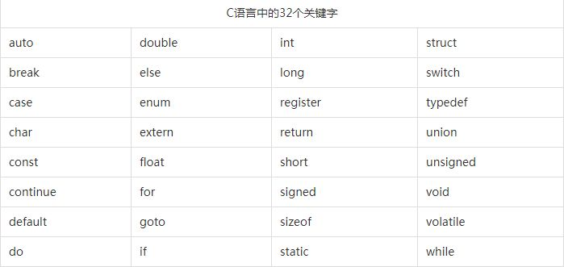

# 结构体其他关键字

[TOC]

先看一下还有那些关键字没有接触的：




数据：union、enum、struct

有关存储：register、extern、static、auto


## struct

结构体

为什么要有结构体？

很多情况下，我使用的数据，相互直接是由关联的，在自然结构体就诞生了。

### 结构体的声明与初始化

第一种方式

```c
struct SqList {
    int *base;
    int length;
} kevin; // kevin 为变量
struct SqList leak; // leak 为变量，必须带上struct
```

第二种方式

```c
typedef struct  {
    int *base;
    int length;
} SqList;
SqList leak;
```


### 字节对齐

#### 实验

打印一下结构体的内存空间的大小

```c
struct Person{
    int age;
    short sex;
}

// 使用
int main() {
	printf("%d", sizeof(struct Person));
    return 0;
}
```

运行结果：8

本来是：int 4 字节，short 2 字节， 出现的是8字节，多2字节。说明要向int看起，补齐

在做一个实验：

```c
struct Person{
    int age;
    short sex;
    short height
}

// 使用
int main() {
	printf("%d", sizeof(struct Person));
    return 0;
}
```

运行结果还是8，说明两个short之间进行了补齐。

第三个实验：两个short类型的数据定义分开来。

```c
struct Person{
    short height
    int age;
    short sex;
}

// 使用
int main() {
	printf("%d", sizeof(struct Person));
    return 0;
}
```

运行结果为12

因为声明的位置不同，而导致内存字节对齐的增加。

#### 对齐方式指定

```c
// 在编译的时候指定以2个字节对齐
#pragma pack(2)
struct Person{
    short height
    int age;
    short sex;
}

// 使用
int main() {
	printf("%d", sizeof(struct Person));
    return 0;
}
```

取消对齐是：`#pargma pack()`

#### 结论

结构体中如果各个类型的字节数不等的话，会出现字节补齐的现象，各个数据类型的定义的位置会影响补齐的大小，对齐方式可以修改。

至于为什么这么做，应该是增加访存效率，分配一块区域。


## 存储类型

对于一个变量而言有三个性质：存储周期，作用域，链接数(程序变量的共享范围)。

一个变量的修饰分为 存储类型、类型限定符、类型说明符

存储类型涉及到存储周期问题，限定符就两个(const、volatile）

贴一片文章：[c语言关键字存储类型讲解(auto,extern,static,register,const)](<https://blog.csdn.net/as480133937/article/details/88539716>) 

写的很详细，可以先看这篇文章。

<table>
    <tr>
        <td style="text-align:center"><a href="#td1"> extren  </a></td>
        <td style="text-align:center"><a href="#td2"> static </a></td>
        <td style="text-align:center"><a href="#td3"> auto </a></td>
        <td style="text-align:center"><a href="#td4"> register </a></td>
    </tr>
</table>
<a id="td1"> extren</a> 

外部变量，用来跨文件引用变量。

```c
// 头文件中，不可以重复定义。
extren int k;

// 实用函数中
k = 0;
```

如果两个头文件中都定义了外部变量，则会出错。

<a id="td2"> static</a> 

修饰的变量随着文件的借书而结束，并不是整个程序。

1. **static全局变量与普通的全局变量有什么区别 ?**

```
这两者在存储方式上并无不同。
全局变量(外部变量)的说明之前再冠以static 就构成了静态的全局变量。
全局变量本身就是静态存储方式， 静态全局变量当然也是静态存储方式。 


这两者的区别在于 非静态全局变量的作用域是整个源程序 ， 当一个源程序由多个源文件组成时，非静态的全局变量在各个源文件中都是有效的。 而静态全局变量则限制了其作用域， 即只在定义该变量的源文件内有效， 在同一源程序的其它源文件中不能使用它。由于静态全局变量的作用域局限于一个源文件内，只能为该源文件内的函数公用，因此可以避免在其它源文件中引起错误。
static全局变量只初使化一次，防止在其他文件单元中被引用; 　
```

2.  **static局部变量和普通局部变量有什么区别 ？**

```
把局部变量改变为静态变量后是改变了它的存储方式即改变了它的生存期。把全局变量改变为静态变量后是改变了它的作用域，限制了它的使用范围。 

static局部变量只被初始化一次，下一次依据上一次结果值； 
```

3.  **static函数与普通函数有什么区别？**

```
　　 static函数与普通函数作用域不同,仅在本文件。只在当前源文件中使用的函数应该说明为内部函数(static修饰的函数)，内部函数应该在当前源文件中说明和定义。对于可在当前源文件以外使用的函数，应该在一个头文件中说明，要使用这些函数的源文件要包含这个头文件.
```

<a id="td3"> auto</a>

被修饰变量自动回收，只对块状代码修饰有效，不常用局部变量就是隐藏的修饰。

<a id="td4"> register  </a>

放在寄存器中，我还么没有感受到他的作用。

