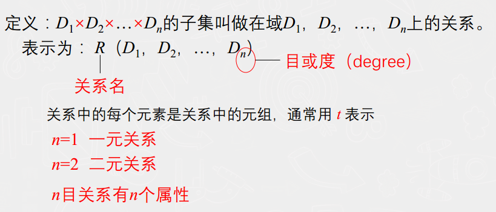

# 关系型数据库


解说：在数据库中要区分型和值。关系数据库中，关系模式就是型(存储方式)，关系就是值


[TOC]

## 1.关系（relation）

由关系表衍生出来的关系

- ### 基本关系：基本关系是实际存在的表

- 查询表：查询是查询对应的结果表

- 视图表：由基本表或者 其他视图导出的表，是虚表


#### 表中描述

描述一系列数据的关系，

比如：

- 人的属性关系			集合成一张		个人信息表

  ```sql
  ---属性名为列（Dn），个体为行（dn）
  ```

- 老师和学生的关系		集合成一张		老师学生表


#### 数理定义




##### 描述表头与表名的关系：

- R：在表中表示为		表名
- n：在表中表示为		列的个数（一个表的属性个数）


## 2. 关系模式（relation schema）

在数据库中要区分型和值。关系数据库中，关系模式就是型，关系就是值，

我个人的理解是，记忆东西，信息相互关联，但信息的总体表现为model。

就是型和值的概念。


可以形式化地表示为：

R（U， D， DOM， F）

| R    | 关系名                     |
| ---- | -------------------------- |
| U    | 组成该关系的属性名集合     |
| D    | U中属性所来自的域          |
| DOM  | 属性向域的映象集合         |
| F    | 属性间数据的依赖关系的集合 |


## 	关系术语介绍

- domain：一组具有数据的**集合**
- cartesian product：**在某一领域的运算**
- relation：关系


### 域（domain）

在表中表示数据作用的范围

比如：

- 年龄字段 限定为 整数域
- 性别字段 限定为 {“男”，“女”}


笛卡尔积（cartesian product）


- **Dn**：在表中表示          **一列**
- **dn**：在表中表示           **一行**
- **元组**：在表中表示        **取表中n组成的数据**


### 码

- candidate key：某一属性组能够唯一的标示一个元组，而其子集不能
- primary key：一个关系中有多个候选码，选定一个作为主码
- primary attribute：候选码的诸属性
- non-key attribute：不包含任何候选码的属性
- all-key：所有属性都是候选码


## 3. 关系的完整性（NULL的描述）


- **实体**完整性：**主键不可以为空**，如果关系表中有一个属性（attribute） 被定义为主键，也就时某一列（Dn) 被设置为 primary key,

  那么他不可以为空值

- **参照**完整性：参照的表不可以拥有参照被没有的值，也就是**外键的值必须存在**

  ```
  foreign key (参照字段) references ReferTableName(被参照的字段)
  ```


- f：外键,，foreign key
- R：参照关系，reference relation
- S：被参照关系，target relation
- 自定义：用户自己设置NOT_NULL


## 4. 关系操作

- 查询操作：`选择、投影、连接、除、并、差、交、笛卡尔积`
-  数据更新：`插入、删除、修改` 


## 关系代数--- 关系操作的基础

- 行：`并、差、交、笛卡尔积`
- 行和列 ：`选择、投影、连接、除`


### 行操作

目数相同的情况下，即为Dn 中的n相同

|    运算符    |                    公式                     |            含义             |
| :----------: | :-----------------------------------------: | :-------------------------: |
|  U（union)   |          R∪S = { t \| t∈ R ∨ t∈S }          |         两张表向连          |
| - (excepti)  |          R -S = { t \| t∈R ∧ t∉S }          |        两张表求差集         |
|      ∩       | R∩S = { t \| t ∈ R ∧ t ∈S } R∩S = R –(R-S） |       求两张表的交集        |
| 笛卡儿积 R*S |                       | 表示元组（t）之间的相乘（d) |


#### 笛卡尔积 (详细解释)


运算效果图


### 代数式子意思

- 
  - R：关系，也是表名
  - t：元组，一行数据或者多行数据的 集合
  - t[Ai] ：元组t中相应于属性Ai的一个分量 ，也就是表中的一个值


- 
  $$
  A, \ \ t[A], \ \ \overline{A}
  $$

  - A：表示为表中这一列的所有值数据集合，也叫属性列或者属性组
  - t[A]：表示多行或者一行数据拥有 A列数据的集合，也叫分量集合
  - A̅ ：表示为去掉K列后剩余的数据集合


- 

  - R为n目关系， S为m目关系。
  - tr ∈R， ts∈S， 称为元组的连接。
  - 是一个n + m列的元组，前n个分量为R中的一个n元组，后m个分量为S中的一个m元组 

- 
  $$
  Z_x \quad R(X, Z)	\quad Zx =\{t[Z]|t\in R, t[X]=x \}
  $$
  表示为：在一个有用两个属性列 X, Z 的关系表R中

  多行或者一行数据 的元组 t 中 ，拥有 属性列X 中 属性值 且与 x 相等 ， Z 属性的数据的集合。

  **形象的说，就是由 X=x 映射到 Z 的 集合， 称之为 Zx**


### 行和列


#### 选择（selection、restriction）

$$
\sigma_F = \{\ t | t \in R \land F(t) = 'ture' \ \} \ \ \ \  \ F=X_1 \theta X_2
$$

θ：是比较运算符

> ​	>	>=	=<	>	=	<>


#### 投影（projection)

$$
\Pi_A(R) = \{\  t[A] \ | \  t \in R\ \}
$$

投影就是		选出数据元组t中,	 A 属性列的数据 的集合

就是 以行为x轴，列为y轴，t[A] 即为 y=A 时候 在x的投影，也就是x具有y的属性集合


#### 连接（join)


- 内连接（目数相等）

  和B：分别为R和S上  **度数相等**  且  **可比的属性组**
  θ：比较运算符

  - 等值连接
  - 自然连接
  - 一般的连接

- 外连接（目数不相等）

  把悬浮元组（多出来的数据行）也保存在结果关系中

  而在其他属性上填空值(Null)，就叫做 外连接 

  **叫啥就保留那边的浮动，如果没有注明那那种，就全都保存**

  - 左外连接
  - 右外连接


##### 等值连接


取出相等的数据行

##### 自然连接


去除相等的数据行，再进行连接


##### 一般的连接


##### 左外连接

只保留左边关系R中的悬浮元组 

##### 右外连接

只保留左边关系R中的悬浮元组 


#### 除（division）

$$
R \div S= \{\ t_r[X] \ | \ t_r \in R \land \Pi_Y(S) \subseteq Y_x  \} \quad  x = t_r[X]
$$

表示：**元组在 X 上的 \ 分量值x 的象集$${}Y_x$$ 包含S在Y上 投影的集合**

- X 泛指 R 的某一列
- Y 指的是 R 和 S 共有的列
- $${}x = t_r[X]$$ 其中 x 指的是 数据行中 在X 列中的 属性值
- $${} t_r[X] $$ R 里面的任意列 在 X 上的属性值集合
- $${} \Pi_y(S) $$ 指的是 R 和 X 共有地 Y，在 S 上的投影
- $$ {} Y_x$$：x在R中的象集


- 投影 和 象集 是两个相对的东西

- 投影是 由x获取 y，象集是 由y获取x。
- 象集和投影之间的转换，来进行等值比较。

如下图。


## 关系数据语言

- 关系代数
- 关系演算
- **SQL**：struct query language


