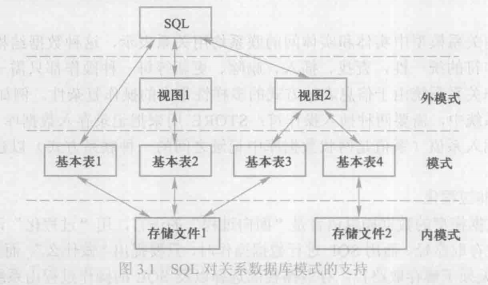

# SQl 数据定义


[TOC]

## 介绍

sql 与模式的对应关系




一个关系数据库管理系统的实例，可以建立多个数据库，一个数据库可以有多个模式，一个模式可以包括多个表、视图、索引等数据对象。


## 表中参见对象操作

- 模式：schema
- 表：table
- 索引：index
- 视图：view


除了视图属于数据操作的一种方式以外，其他的都是属于数据库的数据

这几种的对象操作的关键字：

```mysql
create；
drop;
alter;
```


## 1. 模式


### 创建

```sql
create schema <name> authorization <userName> 
[ <Table statement > | <View  statement> | <Authorization statement>] ;
```

三个可选字段：

- table statement：表的定义
- view  statement：视图的定义
- authorization statement：授权

如果没有指定 schema name 那么 就是 username


例：给 lkk  用户创建一个 test 模式，模式中创建一张  tab1 的表

```sql
create schema test authorizaion lkk create table tab1(name char(20));
```


### 删除

```sql
drop schema <name> <cascade | restrict>;
```

- cascade：联动，联动 删除模式下的 所有对象
- restrict：限制，限制 只在模式 没有对象 时删除


## 2. 表


### 创建

```sql
create table <name> (
    <column name> <entity type> [integral column constraint]
    [, <column name> <entity type> [integral column constraint] ]
    ...
    [, <column name> <entity type> [integral column constraint] ]
    [, table constraint]
)
```


例：创建一张 student 表， 字段 name， age，sex，dept.

```sql
create table student(
    Sno char(9) primary key,
    Sname char(20) unique,
    Sage char(2),	/*不提倡用枚举类型，数据库迁移麻烦*/
    Sdept char(20),
    Scourse char(4),
    foregin key (Scourse) references Courese(Cno)	/*外键 Scourse 参考Course的 Cno字段*/
)
```

references ：参考的意思

创建一张 student 与 course 的关联表，注意一下primary key 的写法

```sql
create table SC(
    Sno char(9),
    Cno char(4),
    grade smallint,
    primary key (Sno, Cno),
    foreign key (Sno) references Student(Sno),
    foreign key (Cno) references Course(Cno)
)
```


### 删除

```sql
drop table <table name> [restrict | cascade];
```


### 修改

 增加：关键词 alter , add

```sql
--添加一列
alter table <table name> 
add [column] <column name> <entity type> [entity constriant] ;

--添加一个外键
alter table <table name> add [table constraint];
```

- entity constriant：字段自身的约束，比如不能为NULL，primary key
- table constraint: 表级的约束，如外键。


删除：关键字：alter，drop

```sql
-- 删除一列
alter table <table name>
drop column <column name> [cascade | restrict]

-- 删除外键
alter table <table name> drop [table constraint] [casecade | restrict];
```


修改列数据类型：alter

```sql
alter table <table name>
alter column <column name> <entity type>;
```

例：将student 表中 的 Sage 字段由 原来的类型修改为 int

```sql
alter table student 
alter column Sage int;
```


## 表与模式

每一张表都属于某一个模式，一个模式可以包含多个基本表，这里概念有点模糊，与mysql对不上，Oracle一个数据库只能有一种模式。


mysql  中的命令是

```mysql
create database name;
use name;
create table table_name (name char(8));
```

所以在创建表的时候，我们我一般不自己手动设定模式什么


## 3. 视图

- 插入数据是针对视图的 列进行的，而不是基本表的所有列不能使用了`DISTINCT,GROUP BY,HAVING`语句的视图中插入数据
- 对于多个基本表组成的视图，插入、修改数据只能在一个基本表上
- 视图中的列是常数或者几个字符串列值的和，插入和修改不允许，但删除可以。


### 定义

```sql
create VIEW
<视图名> [(<列名> [,<列名>]…)]
as <子查询>
[WITH CHECK OPTION];
```


### 更新

```sql
update <view name> .......
insert into <view name> .....
```


### 删除

```sql
delete view <view name>
```


### 查看视图

```sql
EXEC sp_helptext <view name>;
```


## 4. 索引

数据库索引有很多种类型，常见的索引：

> 索引属性，指的是我们给table所设定的属性，元组指的是数据行

- 顺序文件上的索引：针对指定  属性值  升序或降序存储关系， 在该属性值上建立一个顺序索引文件

  ​				有该文件的 属性值 和 相对应的元组指针组成。

- B+树的索引：将索引组织成 B+树的形式，B+ 树 的叶节点为属性值和相对应的元组指针

  ​			具有动态平衡的优点。

- 散列（hash）索引：是建立若干个桶，将 索引属性 按照其散列函数值映射到 相应的桶中，

  ​				桶中存放索引属性值和相对应的指针，查找速度快

- 位图索引：用位向量记录索引属性中可能出现的值，每一个向量对应一个可能出现的值


索引是关系数据库管理系统内部实现的技术，属于内模式的范畴

- 需要一定的储存空间
- 当表更新时，索引要进行相应的维护，会增加负担


### 创建

```sql
create [unique] [cluster] index <index namne> 
on <table name> (<column name> [<order>] [,<column name> [<order>]]);
```

- unique：只能建立唯一的索引
- cluster：表明要建立的是聚簇索引
- order
  - ASC：升序，默认值
  - DESC：降序


### 删除

```sql
drop index <index name>
```


### 修改

```sql
alter index <olde name>  rename to <new name>
```


# 数据库字典

关系型数据库管理系统内部的一组系统表，记录了数据库中所有定义的信，包括关系模式定义、视图定义、索引定义、完整性约束定义、各类用户对数据库的操作权限、统计信等。

用来全局处理是数据库各种事务。


## 数据类型

一字节 8 比特，即为 1byte = 8bit

### 整数


| type | content |
| :------: | :----------------------------------------------------------: |
| int      | **主键列常 设置此类型**。 每个数值占用 **4字节** |
| smallint | 每个数值占用 **2 字节** |
| tinyint  | 每个数值占用 **1 字节** |
| bigint   | 每个数值占用 **8 字节** |
| bit      | 只为0或1，其他数也是1， **常用来表示真假、 男女等二值选择。** |


### 浮点数


| type | content |
| :----------: | :----------------------------------------------------------: |
| decimal(p,s) | 限定当前数据的位数<br/>p：有效位数 ，**最大38位** <br/>s：最大小数位数，默认为0 |
| numeric(p,s) | numeric 和 decimal 是功能相同的<br/> 同是用来保存精度**可变的**浮点型数据。 |
| float        | 浮点型， 它是一种近似数值类型， float(n)可储存**1-53的可变 精度**浮点数值<br/>内存大小取决于精度n |
| money        | **货币型**， 能存储从-9220 亿到 9220 亿之间的数据， 精确到 小数点后四位<br/>每个数值占用 **8 字节** |


### 日期

| type | content |
| :-----------: | :----------------------------------------------------------: |
| datetime      | 储存有效日期范围是1753/1/1~9999/12/31， 可精准到3.33 毫秒<br/> 每个数值占用 8 字节 |
| smalldatetime | 储存有效日期范围是1900/1/1~2079/6/6， 精确到分钟<br/>每个数值占用 4 字节 |


### 图片（二进制数据）

| type | content |
| :---- | :----------------------------------------------------------: |
| image | 虽然类型名为image， 但是并不意味着只能保存图片二 进制数据， 实际上它可以保存任何二进制数据。 |


### 字符串

varchar ：variable char 可以变化的字符串

nchar：national char 国际的字符串

|    |                                 |
| ----------- | ------------------------------------------------------------ |
| char(m)     | **固定长度**字符串， 长度为 m。                              |
| nchar(m)    | 国际化固定长度字符串， 长度为 m。                            |
| varchar(m)  | 和**可变长度**字符串 8,000 之间的数值 ， 最大长度为 。 m， 且必须是一个介于 1 |
| nvarchar(m) | 国际化可变长度字符串， 最大长度为m， 且必须是一个 介于 1 和 4,000 之间的数值。 |
| text   | 可变长度字符串， 最大长度为 231 - 1个字节。 |
| ntext | 国际化可变长度字符串， 最大长度为 230 - 1个字符 |