# sql 数据操作

[TOC]


## 查询

### 单表


#### 若干列

```sql
select  <target expression> [, <target expression>] from table_name;
```


##### 所有列

```sql
select * from Student;
```

##### 表达式

获取学生是哪年出生的，2018是今年的时间

```sql
select 2018-Sage from student;
```


##### 添加一列

目标表达式可以是，一个固定的字符串

```sql
select 'Year of Birth', 2018-Sage from student;
```

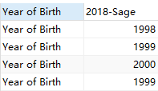

##### 别名

给数据列设置别名

```sql
select 2018-Sage:Birthday from student;
```

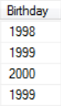

#### 若干元组

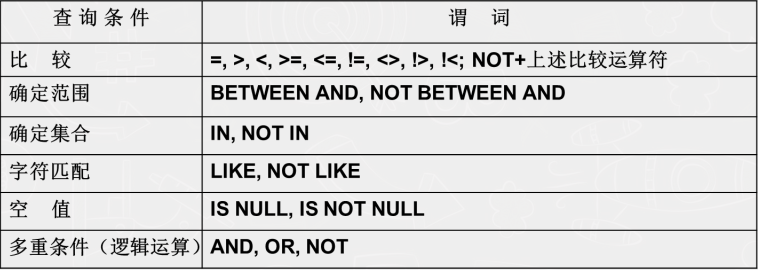


```sql
select [all | distinct] <target expression> [, <target expression>] 
from table_name
where <conditional expression>;
```


##### distinct（行数据不重复）

简单的来说，就是对所选列，进行去重作用

```sql
select distinct Sno from sc;
```

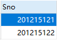


##### where

<table>
    <tr>
        <td><a href="#td1"> 比较大小 </a></td>
        <td><a href="#td2"> between </a></td>
        <td><a href="#td3"> in </a></td>
    </tr>
    <tr>
         <td><a href="#td4"> like </a></td>
        <td><a href="#td5"> is null (is not null) </a></td>
        <td><a href="#td6"> and  or not </a></td>
    </tr>
</table>


- <a id="td1"> 比较大小 </a>

  ```sql
  < > =  >= <= != <> !> !<
  ```

- <a id="td2">between  </a>

  ```sql
  where <column name> between <value> and <value>;
  where <column name> not between <value> and <value>
  ```

  列子

  ```sql
  select * from student where Sage between 20 and 30;
  ```

- <a id="td3">in  </a>

  **用来处理，已知元组范围**。

  列：

  ```sql
  select * from student where Sdept in ("CS", "MA", "IS")
  ```

- <a id="td4"> like</a>

  **用来处理模糊查询**

  - string match：要匹配的字符串
  - escape character：转义字符，这里可以任意一个字符，不一定要  `\`

  ```sql
  not  like '<string match>' [escape'<escape character>']
  ```

  **通配符**

  - **%** ：任意长度的字符串

    ```sql
    select * from student where Sname like '李%';
    select * from student where Sname like '%李';
    select * from student where Sname like '%李%';
    select Cno , Ccredit from course where Cname like '操%统' ;
    ```

  - **_** ：匹配单个字符

    ```sql
    select * from student where Sname like '李_';
    select * from student where Sname like '_李_';
    select * from student where Sname like '李__';
    select Cno , Ccredit from course where Cname like '操作_统' ;
    ```

  例：

  ```sql
  select Cno , Credit from Course where Cname like 'DB\_Design' escape'\' ;
  -- 发现不行，原因\ 会干扰''
  ```

  ```mysql
  -- mysql 实验， 在课程表中将 "操作系统" 修改为 "操作_统"
  select Cno , Ccredit from course where Cname like '操作\_统' ESCAPE '\\' ;
  -- 或者
  select Cno , Ccredit from course where Cname like '操作/_统' ESCAPE '/' ;
  ```

- <a id="td5">is  </a>

**用来判断是否是空值**

```sql
select Sno from sc where Grade is null;
```


- <a id="td6"> and</a> ( $${} \lor $$ )

**用来处理多重条件查询**

```sql
select Sname from student where Sdept='sc' and Sage>8;
```


#### order by

两个可选项：`ASC 或者 DESC`

注意一下 ，放置的位置

```sql
select Sno,Grade from sc
where Cno='3'
order by Grade desc;
```


#### 聚集

- 遇到null，跳过
- 只能用于 select 和 having 内


##### 具体函数

- conut 

  ```sql
  count(*);
  count([distinct | all] <column name>)
  ```

  例子：

  ```sql
  -- 查询学生总人数
  select count(*) from student;
  -- 查询选修了课程的学生人数
  select count(distinct Sno) from sc;
  ```


后面的参数都是

```sql
([distinct | all] <column name>)
```

- sum：求和
- avg：取平均
- max：取最大
- min：取最小


#### group by

两个关键词

- goup by
- having：条件语句

例：

```sql
select Sno, Avg(Grade) 
from sc
group by Sno
having avg(Grade)>=80;
```

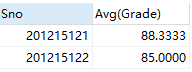


### 连接


#### 等值连接

```sql
select student.*, sc.*
from student, sc
where student.Sno = sc.sno;
```

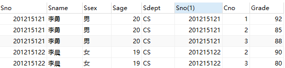

发现：Sno 重名

更改

```sql
select student.Sno, Sname, Ssex, Sdept, Cno, Grade
from student, sc
where student.Sno = sc.sno;
```


#### 自身连接

需要对表进行重新命名

```sql
select first.Cno, second.Cpno
from Course first, Course second
where first.Cpno=second.Cno;
```


#### 外连接

关键语句

```sql
from left join <table name>
on <condition statement》
```

例子：

```sql
SELECT Student.Sno,Sname,Ssex,Sage,Sdept,Cno,Grade
FROM Student LEFT JOIN SC ON
(Student.Sno=SC.Sno);
```


#### 多表连接

```sql

```


### 嵌套

- 相关子查询：依赖父类的默写条件
- 不相关子查询


#### in ( ${} \subset $ )

```sql
SELECT Sno, Sname, Sdept
FROM Student
WHERE Sdept IN
(SELECT Sdept FROM Student WHERE Sname= '李晨');
```


#### 运算符

```sql
SELECT Sno, Cno
FROM SC x
WHERE Grade >=(SELECT AVG(Grade)
FROM SC y
WHERE y.Sno=x.Sno);
```

注意看 x


#### any 或者 all （ ${} \forall$ ）

any 就是任意一个，这样我们就不用写循环比较，而且也没有

```sql
-- 查询非计算机科学系中比计算机科学系任意一个学生年龄小的学生姓名和年龄
SELECT Sname,Sage
FROM Student
WHERE Sage < ANY (SELECT Sage FROM Student WHERE Sdept= 'CS')
	  AND Sdept <> 'CS'; /*父查询块中的条件 */
```

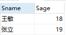

#### exists    ( ${} \exists $ )  

```sql
-- 查询所有选修了1号课程的学生姓名。
SELECT Sname
FROM Student
WHERE EXISTS(SELECT *
FROM SC
WHERE Sno=Student.Sno AND Cno= '1');
```

对于exits 查询返回值是true或则false，一般子查询用的都是select *

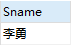


### 集合

多个 select 结果后做的操作

- union
- intersect
- except

例子：

```sql
select * from student where Sdept='CS'
union
select * from student where Sage<=19;
```

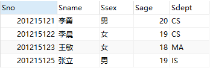

### 派生

关键字：as

```sql
-- 找出每个学生超过他自己选修课程平均成绩的课程号
SELECT Sno, Cno
FROM SC, 
(SELECT Sno, Avg(Grade) FROM SC GROUP BY Sno) AS Avg_sc(avg_sno,avg_grade)
WHERE SC.Sno = Avg_sc.avg_sno and SC.Grade >=Avg_sc.avg_grade;
```

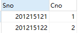

`、SELECT Sno, Avg(Grade) FROM SCGROUP BY Sno) AS Avg_sc(avg_sno,avg_grade)`


这句生成了 一张 **Avg_sc** 以 **avg_sno** 和 **avg_grade** **两列的** 表


## 数据更新


### 插入数据

```sql
INSERT INTO <table name> [(<属性列1>[,<属性列2 >…)] VALUES (<常量1> [,<常量2>]… );
                   
INSERT INTO <表名> [(<属性列1> [,<属性列2>… )] 子查询;
```


### 修改数据

```sql
UPDATE <表名>
SET <列名>=<表达式>[,<列名>=<表达式>]…
[WHERE <条件>];
```


### 删除数据

```sql
DELETE FROM <表名>
[WHERE <条件>];
```


# 本博客用的列子表


## 图片


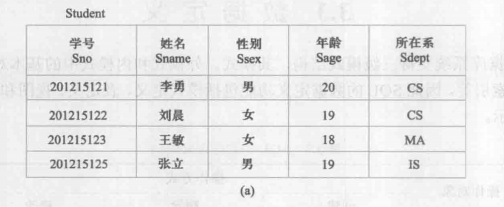

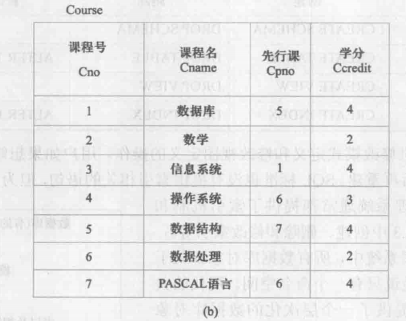

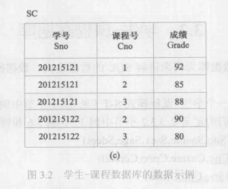


## 代码

mysql 代码

```mysql
--- 创建学生表
create table student(
	Sno int not null auto_increment primary key,
	Sname char(10),
	Ssex enum('男', '女'),
	Sage tinyint,
	Sdept varchar(10)
);

--- 创建课程表
create table Course(
	Cno int  not null auto_increment primary key,
	Cname varchar(10) not null,
	Cpno tinyint,
	Ccredit tinyint
);

--- 创建课程成绩表
create table SC(
	Sno int not null,
	Cno int not null,
	Grade tinyint,
	constraint fk_student foreign key (Sno) references student(Sno),
	constraint fk_course foreign key (Cno) references Course(Cno)
);

--- 插入数据

	--- student插入数据
	insert into student (Sno, Sname, Ssex, Sage, Sdept) values (201215121, '李勇', '男', 	20, 'CS');
	insert into student (Sname, Ssex, Sage, Sdept)
	values ('李晨', '女', 19, 'CS'),('王敏', '女', 18, 'MA'),('张立', '男', 19, 'IS');
	
	--- course插入数据
	insert into Course (Cname, Cpno, Ccredit) 
	values ('数据库', 5, 4),
		   ('数学', null, 2),
		   ('信息系统', 1, 4),
		   ('操作系统', 6, 3),
		   ('数据结构', 7, 4),
		   ('数据处理', null, 2),
		   ('PASCAL语言', 6, 4);
	
	--- SC插入数据
	insert into SC(Sno, Cno, Grade) values ('201215121', 1, 92);
	insert into SC(Sno, Cno, Grade) values ('201215121', 2, 85);
	insert into SC(Sno, Cno, Grade) values ('201215121', 3, 88),('201215122', 2, 90);
	insert into SC(Sno, Cno, Grade) values ('201215122', 3, 80);

```


