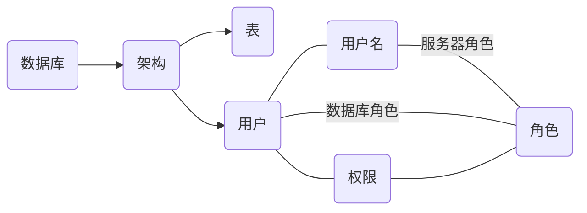

#   sql sercurity

[TOC]




## 登入用户设置


### 建立用户

```sql
create login <login_name> {WITH <option_list>}
```


例：

```sql
CREATE LOGIN login1 WITH PASSWORD=‘login1’
```


### 删除用户

```sql
drop login <login_name>
```


### 修改用户

```sql
alter login <login name> disable
-- 修改密码
alter login <login_name> with password=‘xxgc1’
-- 修改名字
alter login <login_name> with name=xxgc1
```


## 数据库用户


```sql
create user <user_name>
[
{ FOR | FROM } login <login name>
]
[ WITH <limited_options_list> [ ,... ] ]
```


例：

```sql
create user <username> for login <login name>
WITH DEFAULT_SCHEMA=stu
```


## 角色


```SQL
CREATE ROLE <role name> AUTHORIZATION <user name>
CREATE ROLE <role name> AUTHORIZATION <role name>
sp_addrolemember ‘role1’, ‘xxgc1’
```


## 权限

- grant（准许）

  ```sql
  grant creat table TO user1[WITH GRANT OPTION]
  grant SELECT， DELETE ON Student TO user1
  ```

- revoke（撤回）

  角色回收

  ```sql
  REVOKE SELECT ON Student FROM user1
  ```

- deny

  ```sql
  DENY DELETE ON Student TO user1 
  ```


## 断言


```sql
create
```


## 触发器


