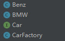

# 工厂模式


[TOC]


怎么说呢，我的理解是根据 **客户** 的 **需求** 来完成一件**产品**。

三个对象：客户，需求，产品

如果有这三者关系的就可以用上工厂模式，其中需求很简单，不需要关注产品的建造


## 简单工厂模式

> 通过一个关键字来确定要构建的产品

以汽车制造工厂为例

建立车的标准，以及各种车款

: 

用户只根据品牌来买车：

CarFactoty.class

```java
package com.company.factoryPattern.simpleFactory;

public class CarFactory {

    /**
     * 奔驰
     */
    public static String BENZ = "com.company.factoryPattern.simpleFactory.Benz";

    /**
     * 奔驰
     */
    public static String BMW = "com.company.factoryPattern.simpleFactory.BMW";

    /**
     * @param type 传入要获取的车的名字
     * @return
     */
    public static Car getCar(String type) {

        try {
            Class car = Class.forName(type);
            return (Car) car.newInstance();
        } catch (InstantiationException | 
                 IllegalAccessException | ClassNotFoundException e) {
            e.printStackTrace();
        }
        return null;
    }

}

```


## 抽象工厂模式


