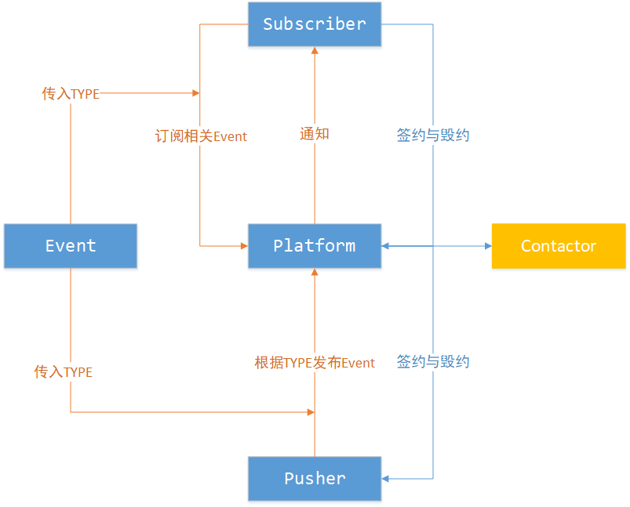

设计模式
========

[toc]


## 原理与实例

监听者模式、观察者与订阅者模式的出现，就是为了解决一个问题：

<span style="background-color: #C6E2FF; padding:0px 3px; margin:2px; border-radius:3px ">当出现某种现象的时候，**及时** 且 **主动** 的做某件事</span>

### 实例

- ICU留院观察，发生异常，进行治疗
- 订阅高山青草奶，每天到固定的盒子取奶
- 《窃听风云》，实时监控，记录信息

### 分析

先看有哪些对象：

- 第一个实例：事件源(自动表现观察的信息)，观察者，处置对象
- 第二个实例：事件，推动事件对象，中转平台(约定或通知)，订阅对象
- 第三个实例：被监控对象，监控对象，处置对象

抽象的再看一下这个三个案例：

全部分开来就是：<span style="background-color: #FFD39B; padding:0px 3px; margin:2px; border-radius:3px ">事件，操作事件对象，存储通知平台，被通知对象</span> 

再来看着三个词：

- 监控

  最突出的用例就是Button，产生动作的时候就要采取行动，具有很强的时效性，一般不会存储

  事件由操作者本身产生，通知采取直接回调，监听者只有一个。

- 观察：

  留院观察，不会对数据进行存储

  事件由操作者本身产生，观察者有多个

- 发布-订阅：

  就是有一个中转平台


### 总结

在百度百科上看到的是：观察者又称发布订阅，而在CSDN上有多博客，说有区别

同时还有两个形容词：松耦合，紧耦合，指的是发布者与订阅者的管理度

但都不重要，总体来说就是发布订阅的模型，只是有些中间的对象没有，或者说合并了而已，也就是耦合的程度。

但关键是，在什么情况下，用"监控/观察/发布订阅"这三个词，以及对应的模型？

**看耦合程度选择使用**


## 代码分析

### 关系图



上面的每一个类都是一个接口，利用default定义了协议模板。

我的理解是这样：

三个角色：Platform/Pusher/Subscriber，都需要签约。

这个抽象为Contractor的属性，然后要求每个角色具有这样的能力，也就是基础这个Contractor

实现：发起方自己先签，签完查看对方是否签，没有则通知他签，不签则废掉回退，如果签则再次询问对方是否签

push --> platform--> subsrcbier

pusher就是在platform中加入Event ，存储起来

subscriber就是根据Event类型加入到platform中，用相关Event到达，则回调通知。

其实主要是搞清楚，<span style="background-color: #F9B6E5; padding:0px 3px; margin:2px; border-radius:3px ">数据和流程</span> 上面的流程，下面具体说一下数据。


Platform：实现消息筛选转发通知的效果

<table>
    <tr>
        <td> Pusher.class </td>
        <td> Event </td>
        <td> 多对多，多种类型的pusher发布多种类型的event</td>
    </tr>
    <tr>
        <td> Event.class </td>
        <td> Subscriber </td>
        <td> 多种event，有多种subscriber订阅 </td>
    </tr>
</table>

Contractor：Platform、Pusher、Subscriber三个角色都要继承于它，有默认的签署和毁约方式。

<table>
    <tr>
        <td> string  </td>
        <td> 四种类型：</br>
            platform.hashcode() + "#" + subscriber.hashcode();</br>
            platform.hashcode() + "#" + pusher.hashcode();</br>
            subscriber.hashcode() + "#" + platform.hashcode();</br>
 			pusher.hashcode() + "#" + platform.hashcode();
        </td>
    </tr>
</table>

Pusher：发布event，并记录绑定平台

<table>
    <tr>
        <td> Pusher  </td>
        <td> Platform </td>
        <td> Event </td>
        <td> 不同的pusher在不同的平台发布不同的event </td>
    </tr>
</table>

Subscriber：订阅event，并记录绑定平台

<table>
    <tr>
        <td> Subscriber  </td>
        <td> Platform </td>
        <td> Event </td>
        <td> 不同的subscriber在不同的平台订阅不同的event </td>
    </tr>
</table>


### 样例代码

#### Contractor

```java
public interface Contractor {
    Set<String> contractor = new HashSet<>();

    default boolean sign(Contractor tor) {
        String thisToOther = this.hashCode() + "#" + tor.hashCode();
        contractor.add(thisToOther);
        if (!(!tor.isSign(this) && tor.sign(this))){
            contractor.remove(thisToOther);
            return false;
        }
        return true;
    }

    default boolean ruin(Contractor tor) {
        String thisToOther = this.hashCode() + "#" + tor.hashCode();
        contractor.remove(thisToOther);
        if (!(tor.isSign(this) && tor.ruin(this))) {
            contractor.add(thisToOther);
        }
        return true;
    }

    default boolean isSign(Contractor tor) {
        return contractor.contains(this.hashCode() + "#" + tor.hashCode());
    }

    default Class<? extends Contractor> type() {
        return this.getClass();
    }
}
```

#### Event

```java
public interface Event {}
```

#### Platform

```java
public interface Platform extends Contractor {


    // 存储这种类型的pusher，发布了哪些event， pusher.class --> event
    Map<Class<?wextends Pusher>, Set<Event>> pubEvent = new HashMap<>();
    // 存储这种类型的event，有哪些订阅者，event.class --> subscriber
    Map<Class<? extends Event>, Set<Subscriber>> eventTypeSub = new HashMap<>();

    default <E extends Event> void addSub(Subscriber subscriber, Class<E>... eventType) {
        if (!subscriber.isSign(this))
            subscriber.sign(this);
        System.out.println("here to log add subscriber in platform !!!");
        for (Class<E> type : eventType) {
            if (eventTypeSub.containsKey(type)) {
                Set<Subscriber> set = eventTypeSub.get(subscriber.type());
                set.add(subscriber);
            } else {
                Set<Subscriber> set = new HashSet<>();
                set.add(subscriber);
                eventTypeSub.put(type, set);
            }
        }

    }

    default <E extends Event> void addEvent(Class<? extends Pusher> pushType, 
                                            E... event) {
        if (pubEvent.containsKey(pushType)) {
            Collections.addAll(pubEvent.get(pushType), event);
        } else {
            HashSet<Event> eHashSet = new HashSet<>();
            Collections.addAll(eHashSet, event);
            pubEvent.put(pushType, eHashSet);
        }
        Class<? extends Event> type = event[0].getClass();
        Set<Subscriber> subs = eventTypeSub.get(type);
        if (subs != null) {
            for (Subscriber subscriber : subs) {
                if (subscriber instanceof NotifyListener) {
                    NotifyListener listener = (NotifyListener) subscriber;
                    if (subscriber.isRequire(this, event))
                        listener.eventArrivals(event);
                }
            }
        }
    }

    interface NotifyListener {
        <E extends Event> void eventArrivals(E... event);
    }

}
```

#### Pusher

```java
public interface Pusher extends Contractor {

    Map<Pusher, Map<Platform, Set<? extends Event>>> pubPlatEvent = new HashMap<>();

    default <E extends Event> void push(Platform platform, Class<E>... eventType) {
        if (!this.isSign(platform))
            this.sign(platform);

        HashMap<Platform, Set<? extends Event>> platformEvent = new HashMap<>();

        Set<E> events;
        if (pubPlatEvent.containsKey(platform)) {
            events = (Set<E>) pubPlatEvent.get(platform);
        } else {
            events = new HashSet<>();
        }
        try {
            Set<E> set = new HashSet<>();
            for (Class<E> type : eventType) {
                Class<E> event = (Class<E>) Class.forName(type.getName());
                E e = event.newInstance();
                set.add(custom(e));
            }
            platform.addEvent(this.type(), set.toArray(new Event[]{}));
            events.addAll(set);
            platformEvent.put(platform, events);
            pubPlatEvent.put(this, platformEvent);
        } catch (ClassNotFoundException | IllegalAccessException 
                 | InstantiationException e) {
            e.printStackTrace();
        }

    }

    default <E extends Event> E custom(E e) {
        // if (e instanceof PushEvent) change
        return e;
    }


    @Override
    default Class<? extends Pusher> type() {
        return this.getClass();
    }

}
```

#### Subscriber

```java
public interface Subscriber extends Contractor {

    Map<Subscriber, Map<Platform, Set<Class<? extends Event>>>> subPlatEvent =
        															new HashMap<>();
    default <E extends Event> void subscribe(Platform platform, Class<E>... eventType) {
        if (!this.isSign(platform))
            this.sign(platform);
        if (subPlatEvent.containsKey(this)) {
            Map<Platform, Set<Class<? extends Event>>> 
                platformSetMap = subPlatEvent.get(this);
            Collections.addAll(platformSetMap.get(platform), eventType);
        } else {
            HashSet<Class<? extends Event>> eTypes = new HashSet<>();
            eTypes.addAll(Arrays.asList(eventType));
            Map<Platform, Set<Class<? extends Event>>> platformEvent = new HashMap<>();
            platformEvent.put(platform, eTypes);
            subPlatEvent.put(this, platformEvent);
        }
        platform.addSub(this, eventType);
    }

    @Override
    default Class<? extends Subscriber> type() {
        return this.getClass();
    }

    <E extends Event> boolean isRequire(Platform platform, E... event);

}
```

### 测试代码

Course

```java
public class Course implements Event, LeakPusher.PushEvent {
    public String name = "course";
    @Override
    public String getName() {
        return name;
    }
    @Override
    public void setName(String name) {
        this.name = name;
    }
}

```

EventPlatform

```java
public class EventPlatform implements Platform {
    static {
        eventPlatform = new EventPlatform();
    }
    static EventPlatform getInstance() {
        return eventPlatform;
    }
    private static EventPlatform eventPlatform;

}
```

KevinSubscriber

```java
public class KevinSubscriber implements Subscriber, Platform.NotifyListener {

    @Override
    public <E extends Event> void eventArrivals(E... event) {
        System.out.println("event arrivals !!!");
    }

    @Override
    public <E extends Event> boolean isRequire(Platform platform, E... event) {
        return true;
    }

}
```

LeakPusher

```java
public class LeakPusher implements Pusher {
    @Override
    public <E extends Event> E custom(E e) {
        if (e instanceof PushEvent) {
            PushEvent ee = (PushEvent) e;
            e = (E) ee;
        }
        return e;
    }
    interface PushEvent extends Event {
        String getName();
        void setName(String name);
    }
}
```

Main

```java
public class Main {
    public static void main(String[] args){
        KevinSubscriber kevinSubscriber = new KevinSubscriber();
        kevinSubscriber.sign(EventPlatform.getInstance());
        kevinSubscriber.subscribe(EventPlatform.getInstance(), Course.class);
        LeakPusher leakPusher = new LeakPusher();
        leakPusher.push(EventPlatform.getInstance(), Course.class);
        EventPlatform.getInstance().ruin(leakPusher);
    }
}
```


总结
----

总结就是问自己几个问题：

写签约的过程，特别慢？

```
自我描述：写了很久，才发现好多是重复的代码，发现三个角色都具有重复的动作

```

不能理解，怎么就达到了通知效果？

```
自我描述：以为，对象有死活之分

```

后面才明白原来就是数据存储与流程描述

```

```

发现开发就是在对数据和流程的描述

那么算法和数据结构到底是什么？

```

```

问什么我会发现的这么慢？

还需要在哪方面去加强？

写这个东西很久，却依旧有动力

写这个要考虑很多琐碎的需要考虑，如何更准确？

关键是如何组织

这也许只是起点，你突然明白了一个东西， 