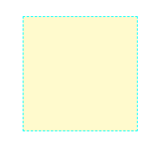
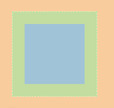
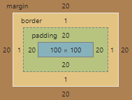

# 盒模型

[TOC]

盒模型：每一个标签都是一个盒子，可以自行的设置他的宽高

## 问题

- 如果设置了宽再设置padding或者是border，盒子肉眼可见的宽度是否是增加了？
- 子盒子设置padding和margin是否对父标签有影响？


## padding和border与宽度的关系

### 实验现象

这里实验的是padding和border与宽度的关系



### 代码逻辑

```html
<!--cssy样式-->
<style type="text/css">
    .box{
        width: 100px;
        height: 100px;
        background: lemonchiffon;
        border: 1px dashed cyan;
        padding: 20px;
        margin: 20px;
    }
</style>

<!--html框架-->
<div class="box">
</div>
```

### 分析结果

用Google自带的开发分析一下结果：

 


可以明显看出，我们设置的宽高没有包括padding和border.

黄色的区域就是：padding + width;

也就是说，**padding和border的大小本身会扩充盒子的视觉大小**


## margin是否对父标签有影响？

这里实验的是：margin导致父类移动的问题(其实应该归结为margin折叠问题)

[这里先贴一片文章](http://www.w3school.com.cn/css/css_margin_collapsing.asp) ，里面有各种发生折叠的情况(外边距不相等的折叠情况)

> **毗邻标签会出现这种情况，但我们这里以父标签和子标签来确立，其他的类似**


### 代码逻辑

body 部分设置了颜色

```html
<!--cssy样式-->
<style type="text/css">
    *{
        margin: 0;
        padding: 0;
    }
    body{
        background-color: burlywood;
    }
    .box{
        width: 100px;
        height: 100px;
        background-color: lemonchiffon;
    }
    .inner_box{
        margin-top: 20px;
        width: 50px;
        height: 50px;
        background-color: bisque;
    }
</style>
<!--html框架-->
<div class="box">
    <div class="inner_box"></div>
</div>
```

### 分析结果

发现因为子标签设置了margin，导致父标签发生了移动，这里称作 **外边距折叠 (Collapsing margins)**


#### 为何会出现这种现象？

官网对外边距折叠的描述：[Collapsing margins](https://www.w3.org/TR/CSS22/box.html#collapsing-margins) ，有详细的描述

所有**毗邻**的两个或更多盒元素的margin将会合并为一个margin共享。

毗邻的定义为：同级或者嵌套的盒元素，并且它们之间没有非空内容、Padding或Border分隔。

我们上面这个例子就是子标签的外边距和父标签进行了合并。

>注：如果一个标签没有高度也会塌陷。


#### 为什么要设置这样的规定？

应该与css的设计初衷有关，这里贴一篇文章：[浅析让人D疼的margin折叠](https://www.jianshu.com/p/a1beddd81156)  

看一下在[垂直排列的设计风格](https://www.w3.org/TR/CSS1/#vertical-formatting) ，上面说大多数情况下margin折叠是美观的，比如说p标签的设置。


### 如何解决？

打破这种规则就行了，上面css原文设计规则的note已经将了，可以看英文文档。

这里就直接写常用的：

#### 脱离标准文档流

因为本身标签归属于标准文档流，要满足这个margin collapsing，只需要打破就行了

可以查看一下标准文档流有哪些：[Normal flow](https://www.w3.org/TR/CSS22/visuren.html#normal-flow) ，这里总结一下就是

- Block formatting contexts：块格式上下文
- Inline formatting contexts：[内联格式上下文](https://segmentfault.com/a/1190000009308818) 
- Relative positioning：相对位置上下文。

##### 改变 BFC 与 IFC——首先考虑


###### 操作

父亲标签加入：

```css
/*此值指示内容已被剪切，不应提供滚动用户界面来查看剪切区域之外的内容。*/
overflow: hidden;
/*或者是下面这个，但要注意的是他改变了标签的块级属性，上面只是打破*/
display: inline-blocks;
```

优先推荐上面这个，但如果他本身就要设置display的属性，那就下面这个，关于是否改变了盒子的块级属性可以在Google开发工具中查看。

###### 原理

[Block formatting contexts](https://www.w3.org/TR/CSS22/visuren.html#block-formatting) 

>Floats, absolutely positioned elements, block containers (such as inline-blocks, table-cells, and table-captions) that are not block boxes, and block boxes with 'overflow' other than 'visible' (except when that value has been propagated to the viewport) establish new block formatting contexts for their contents.
>
>In a block formatting context, boxes are laid out one after the other, vertically, beginning at the top of a containing block. The vertical distance between two sibling boxes is determined by the ['margin'](https://www.w3.org/TR/CSS22/box.html#propdef-margin) properties. Vertical margins between adjacent block-level boxes in a block formatting context [collapse](https://www.w3.org/TR/CSS22/box.html#collapsing-margins).

简单来说正常的块级元素有一个标志是：`overflow: visible`，而且正常的块级元素margin用的是margin collapse，所以只要把他去掉就可以了。

##### 变为浮动

###### 操作

```css
/*父标签或子标签加入了浮动，与怎么浮动没有关系*/
float: left;
```

###### 原理

float不属于标准文档流

##### 改变position

###### 操作

但不能使**relative**和**static**

```css
/*按需求进行修改就可以了*/
position：absolute;
/*或者*/
position：fix;
```


#### padding与border 存在

这里本身父标签如果不设置padding和border的话，这种方法就是多余的，这里写出来就是说明如果有个padding和border就可以不用进行处collapse margin这种情况了。

###### 存在

```css
/*父标签存在*/
padding-top: 1px;
/*或者*/
border: 1px dashed #7FFFD4;
```

###### 原理

发生了隔离，当父标签设置了padding或者border的时候，自己的margin被隔离与子标签，所以毗邻关系被破坏。


# 文章结构

> 文章结构
>
> 问题
>
> 实验
>
> ------实验现象
>
> ------代码逻辑
>
> ------分析结果
>
> ------如何解决

