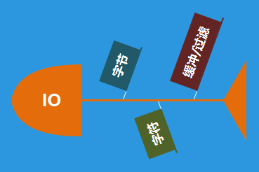
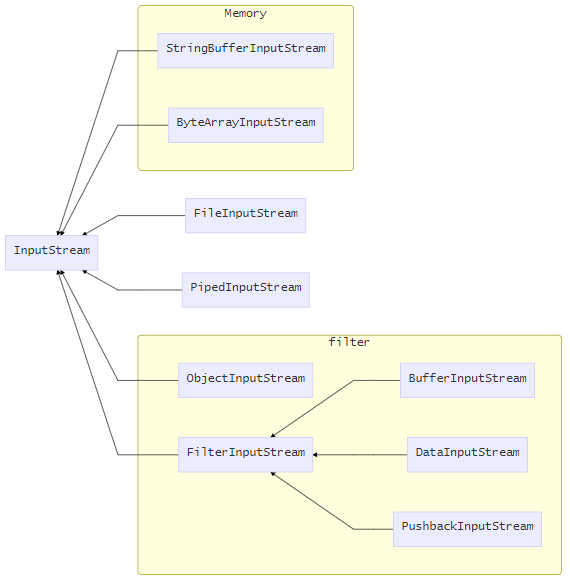
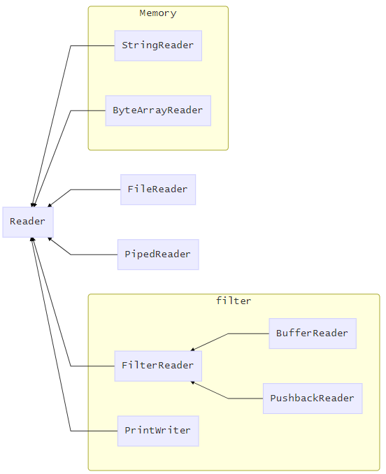
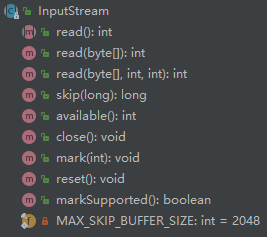
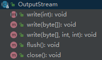
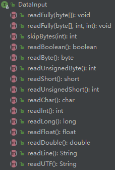
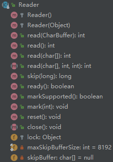
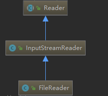
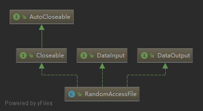

# java 输入输出流

[TOC]


文章还需修改，有些没有进行一个具体的分析。

到时可以把每个流进行一个具体的分析。


## 如何理解流的概念

说到这个，这个**流**说的我有点懵懂，

我的理解是，在计算机中数据的来源有两种：

- 磁盘
- 键盘(鼠标)

磁盘存储数据一般的原理，用计算机组成原理的一句话来说：

> 磁表面存储器通过磁头和记录介质的相对运动完成读写操作的

而可以控制磁性的变化就是电流；

同时我们通过敲击键盘或者鼠标，实际上也是对电流的属性进行的操作。

撇开，代码的底层实现，我们看到的是，**java代码对电流的操作**。

所以，可以形象的将数据称为流。


## JAVA的IO 架构

如何构建JAVAIO的架构。

### 先来几张图

#### 数据基本层次



画这幅图是可以发现，在java整个io在设置io类中对读取的量有一个层级。


#### IO整体的架构图

##### InputStream




##### Reader



### 如何分析JAVA IO架构

从三个角度来分析：这样的架构是如何来的，为了解决什么问题？这个要从历史的角度来分析。

- 采用了什么方式架构，基类的特性？ 
- 特殊类，常用类的分析


### JAVA IO 是如何搭建的

#### 逻辑上的思路

可以看到，不管是**InputStream**和**Reader**，都分为四大部分：

> 内存、文件、管道、过滤

内存和文件：是根据数据的存储位置来分析的。

管道：多线程的问题

过滤：是方便我们拿到数据源的时候，对数据再进行一个处理操作。

应该是这么一个思考过程：**数据源本身特点处理 --> cpu处理 --> 自定义处理**

数据处在与磁盘或者内存，经过cpu处理，之后到用户手上再进行一个处理，在这三个过程中做一个统一的规划。


#### 代码上的实现

根据上面的分析，java io的特点有两个：

- 数据处理过程：数据源本身特点处理 --> cpu处理 --> 自定义处理
- 数据量：字节 --> 字符 --> 过滤

数据处理过程中导致建立不同的类，来满足，每个过程中不同的需求。

而数据量的问题，也是建立了不同的类，来满足对数据源的需求，同时也实现了他们的互相转化。

而这个互相转化，使用的是**装饰者模式**，特别是过滤流这一块，根据不同的过滤需求，来实现我们的要求。


## IO基类的分析


### InputStream/OutputStream

先看一下类的结构



查看源码发现，InputStream是一个抽象类，不能够直接使用，需要子类实现read()

- 查看一下构造方法，最终都走向read(byte[], int, int) 方法

  ```java
  public int read(byte b[], int off, int len) throws IOException {
      // 数组边界错误处理
      ...
      // 判断是否可读了
      int c = read();
      if (c == -1) {
          return -1;
      }
      b[off] = (byte)c;
      // 进行存放
      int i = 1;
      try {
          for (; i < len ; i++) {
              c = read();
              if (c == -1) {
                  break;
              }
              b[off + i] = (byte)c;
          }
      } catch (IOException ee) {
      }
      return i;
  }
  ```

  可以很容易的看出，这里我们可以自行设置一个**数组**，每次读取可调整大小的数据，返回值是

  特别说明：**byte b[]，这个是为了减少读写操作**。

- 查看一下skip(long);

  需了解，这是一个读数据的指针跳转方法，可以单纯的理解为磁盘的旋转，要跳转还需要旋转

  而要跳转有一个需要注意的点就是，跳转的距离大于数据本身的长度。

  ```java
  // 返回偏移了多少
  public long skip(long n) throws IOException {
      // 设置跳转n个字节的
      long remaining = n;
      int nr;
  
      if (n <= 0) {
          return 0;
      }
      // 这里限定了每次最大跳多少
      int size = (int)Math.min(MAX_SKIP_BUFFER_SIZE, remaining);
      byte[] skipBuffer = new byte[size];
      while (remaining > 0) {
          // 注意这里每次remaining都会改变，也就是多每次读取的数据都会越来越少。
          // 这样的做的目的是为了不多读。
          nr = read(skipBuffer, 0, (int)Math.min(size, remaining));
          if (nr < 0) {
              break;
          }
          remaining -= nr;
      }
  
      return n - remaining;
  }
  ```

- 继续看其他相关的方法

  ```java
  public synchronized void mark(int readlimit)
  public synchronized void reset()
  public boolean markSupported() 
  ```

  这三个方法是用来对读取流手柄的标记，以及重新设定的实现。

  mark用来标记当前的位置，可以通过reset方法回到标记的位置，传入的餐宿表示，当回到被标记的位置的时候，还可以被允许被读取的数据(0表示没有限制)

- 看一下available()方法，注释上说，用来估计当前可读信息的大小

  ```java
  public int available() throws IOException {
      return 0;
  }
  ```

  查看源码发现，直接返回的是0，这个子类应该会复写

  它的作用，很好的提供了对可读数据源的属性描述，方便我们后面对读取要求的满足，

  比如对read方法中byte b[]的设定。

- 查看一下OutPutStream的方法，发现比较简单

  

  查看一下flush

  ```java
  public void flush() throws IOException {
  }
  ```

  发现需要子类自我实现，这应该是对于有缓存的类需要实现。将在内存中的数据刷新到磁盘里面。


总结一下，InputStream/OutputStream是一个抽象的方法，描述了**手柄的变化、数据吞吐量的设定、数据长度**

还原设计思想：**对我们生活中读取数据的模拟，想象一下你 读书 --> 理解 --> 组织语言 --> 写博客 的过程。**


#### ByteArrayInputStream

看一个用例就行了。

```java
ByteArrayOutputStream bOutput = new ByteArrayOutputStream(12);

while( bOutput.size()!= 10 ) {
    // 获取用户输入值
    bOutput.write(System.in.read());
}

byte b [] = bOutput.toByteArray();
System.out.println("Print the content");
for(int x= 0 ; x < b.length; x++) {
    // 打印字符
    System.out.print((char)b[x]  + "   ");
}
System.out.println("   ");
```


#### FileInputStream/FileOutputStream

这里没什么特别需要注意的，可以提示几个小点

- 相对路径/绝对路径：`./` 表示当前路径，在用idea做实验的是，发生了变化，估计是项目建立的主程序不是我们设置的程序开始的，但我们用命令行进行编译却可以实现。

- 追加输出：在输出的位置设置参数即可。

- 图片/mp3读取：和读取文本没有什么区别，底层都是电流表示的二进制数据，只是文件会更大一点，需要做一下缓冲处理。

- 加密

  其实就是，改变数据的值，那么我们只需要对我们读出的二进制数据进行改变就行了。


#### PipeInputStream

两个线程，之间的数据交互，如何保证数据同步以及，数据的安全，这类做了封装。

先看一下如何使用：

```java
public class Main {

    public static void main(String[] args) throws IOException {
    
        Th1 th1 = new Th1();
        Th2 th2 = new Th2();
        // 线程的获取与连接。
        PipedOutputStream pipedOutputStream = th1.getPipedOutputStream();
        PipedInputStream pipedInputStream = th2.getPipedInputStream();
        pipedOutputStream.connect(pipedInputStream);
        // 开启线程。
        th1.start();
        th2.start();

    }
    // 这里建立一个具有管道写入流的线程
    public static class Th1 extends Thread{
        PipedOutputStream pipedOutputStream = new PipedOutputStream();

        @Override
        public void run() {
            super.run();
            String path = System.getProperty("user.dir") + "/src/com/company/";
            try {
                FileInputStream fileInputStream = new FileInputStream(path + "kk1.txt");
                int soucre;
                while ((soucre = fileInputStream.read()) != -1){
                    pipedOutputStream.write(soucre);
                }
            } catch (IOException e) {
                e.printStackTrace();
            }
        }

        public PipedOutputStream getPipedOutputStream() {
            return pipedOutputStream;
        }
    }
    // 这里建立一个管道读取流的线程
    public static class Th2 extends Thread{
        PipedInputStream pipedInputStream = new PipedInputStream();
        @Override
        public void run() {
            super.run();
            try {
                System.out.println(pipedInputStream.read());
            } catch (IOException e) {
                e.printStackTrace();
            }
        }

        public PipedInputStream getPipedInputStream() {
            return pipedInputStream;
        }
    }
}
```

处于不同的线程，`pipedOutputStream`往管道写数据，`PipedInputStream`在管道里面读取数据

这个有点像Windows里面的剪切板。

解决了当不同的线程，同时操作一个资源的时候。


#### FilterInputStream

作为基类，他做了什么，奠定了什么基调。

这个查了一下源码，具体看一它的构造方法

```java
// 这里表示是线程安全的。
protected volatile InputStream in;
// 这里传进了InputStream类型的对象
protected FilterInputStream(InputStream in) {
	this.in = in;
}
```

而关于具体的读写操作都没有实现，应该是依靠子类去实现。

但FilterInputStream作为父类，奠定了一个装饰器的设计模式在里面

对于我们要进行缓存操作的流来说，这是一个**装饰器模式**，给自己增强功能

而对于，缓存流来说这是一个**策略模式**，选择合适的读取流。


##### BufferInputStream

这个应该就是前面我们说的：字节 --》字符 --》 缓存。

对数据的读取的大小设置，来满足减少操作和国际化(英文一个字节，中文两个字节)

实验源码：

```java
package com.company;

import java.io.*;

public class Main {
    public static void main(String[] args) throws IOException {
        String path = System.getProperty("user.dir") + "/src/com/company/";
        FileInputStream fileInputStream = new FileInputStream(path + "kk.txt");

        BufferedInputStream bufferedInputStream = new 
            							BufferedInputStream(fileInputStream);
        FileOutputStream fileOutputStream = new FileOutputStream(path + "kk1.txt");
        fileOutputStream.write(bufferedInputStream.read());
    }

}

```

主要看一下他的read方法是如何操作的

- read()

  ```java
  // 首先是线程安全的。
  public synchronized int read() throws IOException {
      // 初始化为 pos = 0, count = 0;
      if (pos >= count) {
          fill();
          if (pos >= count)
              return -1;
      }
      // 0x 表示16进制
      return getBufIfOpen()[pos++] & 0xff;
     
  }
  ```

  - 注意在填充完缓冲区之后，就不会再去读取数据，这时候每次取的的数据，都是缓冲区里面的， 这里pos被改变，直到 pos == count,再次填充数据

  - 注意一下 `& 0xff`这里是为了转化为int数据的时候，保存原始数据一致。

    比如说：255 byte 数据为：1111 1111，表现为 -1

    原本转化为int则为：11111111	11111111 	11111111	11111111

    则进行`0xff`二进制：00000000	00000000	00000000	11111111

    则进行 & 运算得到： 00000000	00000000	00000000	11111111

    保持了数据没有被改变。

  

- 查看一下fill()

  ```java
  private void fill() throws IOException {
      byte[] buffer = getBufIfOpen();
      // markpos 初始化为 -1，这里如果不执行mark()方法就不会改变。
      if (markpos < 0)
          pos = 0;            /* no mark: throw away the buffer */
      else if (pos >= buffer.length)  /* no room left in buffer */
          // 这里先不看，因为满足
          ...
      count = pos;
      int n = getInIfOpen().read(buffer, pos, buffer.length - pos);
      // 可以很容易发现 pos=0 在这种可能中不可能大于count
      // 但没有数据可读的时候，pos == count
      if (n > 0)
          count = n + pos;
  }
  ```

  这里在没有mark下，逻辑很清晰，就是按照自我设定的大小的缓冲区来进行读取就可以

- 看一下mark函数

  ```java
  public synchronized void mark(int readlimit) {
      marklimit = readlimit;
      // 发现这里改变了markpos
      markpos = pos;
  }
  ```

- 看一下有标记的fill()操作

  先明确，mark使用来做什么的，mark之后我们在填充数组的时候，要经历那些过程。

  先用一下mark

  ```java
  String path = System.getProperty("user.dir") + "/src/com/company/";
  FileInputStream fileInputStream = new FileInputStream(path + "kk.txt");
  FileOutputStream fileOutputStream = new FileOutputStream(path + "kk1.txt");
  BufferedInputStream bufferedInputStream = new BufferedInputStream(fileInputStream);
  // 标记 0位置
  bufferedInputStream.mark(1);
  fileOutputStream.write(bufferedInputStream.read());
  // 读取的手柄回到标记的位置
  bufferedInputStream.reset();
  // 这里读取发现只能读取一个数据
  fileOutputStream.write(bufferedInputStream.read());
  fileOutputStream.write(bufferedInputStream.read());
  fileOutputStream.write(bufferedInputStream.read());
  //标记当前位置，但可以无限制的读取数据
  bufferedInputStream.mark(0);
  fileOutputStream.write(bufferedInputStream.read());
  fileOutputStream.write(bufferedInputStream.read());
  ```

  实验证明是对的：mark用来标记当前的位置，可以通过reset方法回到标记的位置，传入的餐宿表示，当回到被标记的位置的时候，还可以被允许被读取的数据(0表示没有限制)

  

  这就很好理解了：

  假设我们标记了一个位置，

  fill()方法没有思考出来，先搁置吧。


##### DataInputStream

查看一下源码发现，他实现了`DataInput`的接口

看一下方法结构




至于 方法的具体实现，可以具体去看，这里不多追溯。


### Reader/Writer

先看一下方法层级



发现和InputStream没有多少差别。
看一下他的read方法

```java
public int read() throws IOException {
    char cb[] = new char[1];
    // read(cb, 0, 1)  是一个抽象方法
    if (read(cb, 0, 1) == -1)
        return -1;
    else
        return cb[0];
}
```

这里可以看出，read方法定的基调是，利用数组存储一个char字符。

还有一个要注意的是Reader带了一个锁，这是为什么？？查了一下InputStream并没有带锁

应该是因为，Reader，其实是字节拼接而成的，不是原子性操作，需要加锁，所在在Reader的skip方法中，进行了加锁操作。

就看一下FIleWriter的具体是实现操作


#### FileWriter/FileReader



这里发现有个层级基础问题

##### InputStreamReader——**字节与字符流转化**

看了一下源码发现很简单，就是实现了Reader的方法而已，但在具体的转化过程利用了另外一个类

看一下`InputStreamReader`的构造方法

```java
public InputStreamReader(InputStream in) {
    super(in);
    try {
        // 后面的读取数据操作全靠，sd的操作
        sd = StreamDecoder.forInputStreamReader(in, this, (String)null); 
    } catch (UnsupportedEncodingException e) {
        throw new Error(e);
    }
}
```

查看一下`StreamDecoder`类

发现比较麻烦，后面分析吧。


## 特殊常用的类


### System.in/System.out

这个类是我们常用的键盘以及显示屏之间的输入输出

看一下内部实现：

搜一下`In =` 发现没有，再搜一下`setIn`

发现在初始化系统类的时候调用了native的方法

```java
private static void initializeSystemClass() {
    ...
    // 看到这里FileDescriptor.in，这里应该是在找键盘输入的文件描述
    FileInputStream fdIn = new FileInputStream(FileDescriptor.in);
    FileOutputStream fdOut = new FileOutputStream(FileDescriptor.out);
    FileOutputStream fdErr = new FileOutputStream(FileDescriptor.err);
    // 文件流被装饰为缓冲流。
    setIn0(new BufferedInputStream(fdIn));
    // 将文件输出流装饰为打印流。
    setOut0(newPrintStream(fdOut, props.getProperty("sun.stdout.encoding")));
    setErr0(newPrintStream(fdErr, props.getProperty("sun.stderr.encoding")));
}
```

看一下打印流的结构。


#### PrintStream

附加了一下println的方法

这里要明白一个概念，cmd或者shell是什么？？？

理清一下我们在这两个软件执行程序的过程

如果把键盘当做一个文件，我们输入的信号都被存储在一个文件中。

而我们在cmd中运行一个文件，也就是执行命令(也是电信号与物理介质的变化），而图形化界面，就获取我们存在日志文件的信息并通过电信号与显示屏的物理模块，进行显示。

也就是说，我们设置的PrintStream流是将我们的信息打印了一个存储器的摸个位置，而这个位置与键盘输入时同一个位置。

PrintStream有两个输出方法

- write
- print

这两个方法，都是输出有什么不同

```java
System.out.write(109);
System.out.flush();
// 这两条语句和下面的这条效果是一样大的
System.out.print(109)；
```

也就是说，PrintStream是一个继承于FilterOutputStream类的一个装饰类，在System.out 中装饰了FileOutputStream这个类

实现了再cmd中打印数据的方式。


#### Scanner

这类不是java.io 包中的，它是`java.utils`里面的

也就是说是工具包，在这个包中还有collection和map包，但这个类经常配合System.in 使用

方法特别长，说个大概，官方的说明：**一个简单的文本扫描器，可以使用解析基本类型和字符串**

- 重载了很多构造方法，适配数据源：文本，键盘输入，路径
- 实现了迭代器`Iterator<String>`：对于文本和字符串，可以迭代查看
- 适配数据源的各种类型：int，char，String，double


### RandomAccessFile

看一下结构



这样一个类不是继承于InputStream或者Reader，但他具有读写功能，先简单实用一下：

```java
RandomAccessFile textRead = new RandomAccessFile(path + "kk.txt", "r");
System.out.println( textRead.read());
```

对象的构建的第二参数看源码就知道了，根据构造方法追踪下去

```java
public RandomAccessFile(File file, String mode) throws FileNotFoundException{
    String name = (file != null ? file.getPath() : null);
    int imode = -1;
    if (mode.equals("r"))
        imode = O_RDONLY;
    else if (mode.startsWith("rw")) {
        imode = O_RDWR;
        rw = true;
        if (mode.length() > 2) {
            if (mode.equals("rws"))
                imode |= O_SYNC;
            else if (mode.equals("rwd"))
                imode |= O_DSYNC;
            else
                imode = -1;
        }
        ...
        open(name, imode);
    }
}
```

**rws**的意思：reading writing device synchronously

里面有多方法不一一列举分析，知道这是一个可以随机存储读的io流即可。


## 如何区分使用


## 需要注意的点

### 数据的表现

我们一定要注意的就是数据的表现，当我们用字节流读取数据的时候，调用read()方法，发现读出来的是一个整形数据，这里有需要注意的两个点：

**为什么返回整形？为什么是数字？**

我们看到的是一个英文字符，读出来确实一个数字，为什么？？

还是要回到一开始说的，数据的存储，是磁盘的磁头变化，由电流控制，在数据在物理上表现为电流的状态。

而我们对电流的状态记为两种变化：0，1。

而我们读取的是一个字节也就是8位：0000 0000，1111 1111；也就是这么多电信号产生变化。

当屏幕输出的时候，我们通过ACSIIS码进行了一个映射。

如何read()方法返回的是byte，则 1111 1111 表示的就是 -1

而我们要以-1作为结束符，所以改为int作为放回的类型，也就是 0000 0000 0000 0000 0000 0000 1111 1111


 

