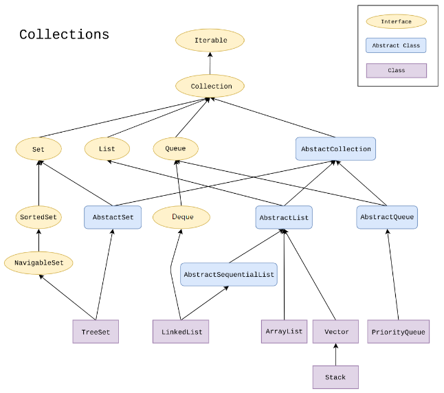
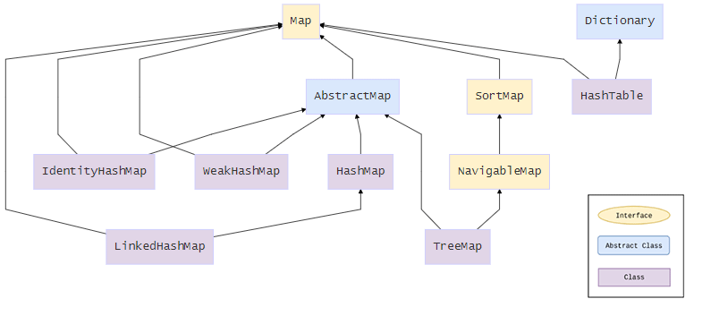
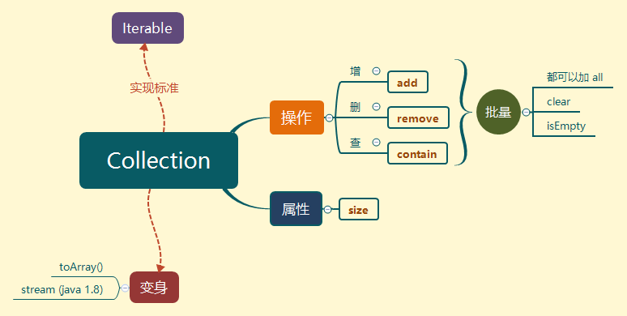
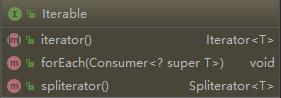
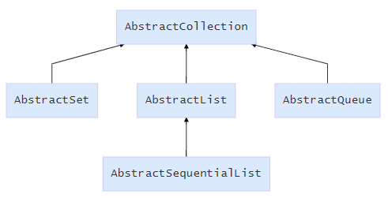
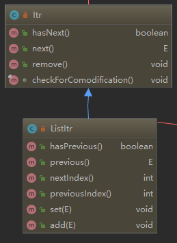
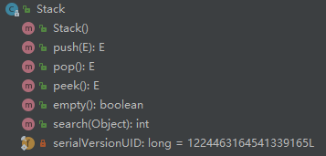
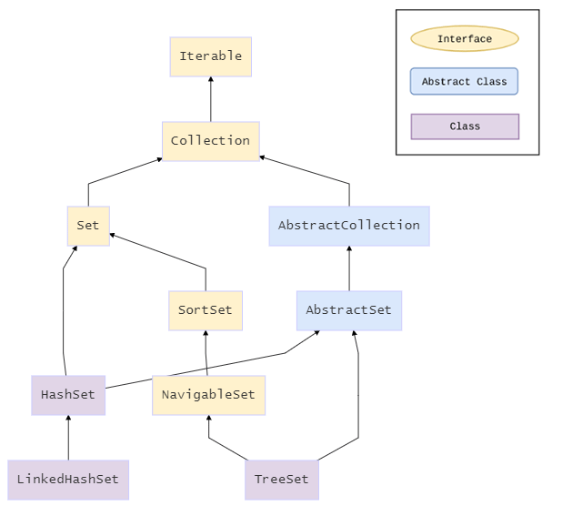

# 集合

[TOC]

## 架构图

### 一维单向

先看百度中的几张collection的架构图吧



这个图一共有5个层级，三大集合类型、分为三种类类型：

- 接口：定义基本的协议，set、list、queue，都有定义
- 抽象类：三大集合类型都有相应的抽象子类，继承于AbstractCollection
- 实体类：这个及时我们平常时候用到的类

### 二维Map

这只是单向集合，也就是一维的，二维映射就是map了



### 为什么要这么设计？？？

接口与具体实现分离，而且每一层都对接口进行一个扩展

而抽象类用来抽取共同的方法性质，留下必须要子类实现的方法，这样就简化了代码，同时也实现了基类的统一控制。


## 实验方式

先百度找图，看个大概的层级图，再利用Idea的diagram来看层级，然后一个个分析。

整体分析的一个脉络，这个是后面总结的，可以先看


## Collection

发现所有的集合对象都实现Collection接口， 也就是说collection是一个集合功能的协议。

先看一下Collection源码结构



集合这种数据结构，就是为了解决数组长度的限制出现的

既然是数组结构，就需要**操作句柄**、**对属性的修改**、以及**类型转换**

操作就分为三部分：增删查，当然可以批量操作。

而对于类型转换，一个是数组的转换，一个是流，流是为了处理大数据的问题，Java1.8新特性。

这个图用处是：快速使用，至于原来还需要一个分析层级结构。


## Iterable

先看一下结构图



定义了一下获取Iterable的标准，以及遍历方式

Iterator()是抽象方法，那么这里需要实现类去实现，也就是说像我们的ArrayList都是**自己建立一个内部类实现**Iterable接口，来处理迭代，因为迭代器还可能不一样，下面有分析。


## collection子类

对集合的子类，我们分层级来看，一共5层，对基类一个分析


### AbstractCollection

这个类是AbstractSet、AbstractList、AbstractQueue的父类，基类的统一控制



先看一下类的结构与类的实现，仔细看AbstractCollection的代码大多被子类重写了，所以这里先不做研究，先往下看。

### List

看第一张图可以知道List的最终实现子类有：ArrayList、Stack，Vector

先看一下层级图


第四层看起来会有点乱，实际是两个类都继承了第四层级的所有类。

比第一张图多出来的是，Cloneable、serializable、RandomAccess这个几个接口，因为后面的类也会用到

所以，放在文章后面做介绍，查看一下目录跳过去看，再回来。


#### ArrayList

如何来研究？？？如何来看源码？？

看一下ArrayList的**特性**以及他用来**解决什么问题**。

- 与父类的区别，这个需要关注，方便记忆

- ArrayList：数组集合，底层应该是数组有用集合的**动态扩展大小**的性质。

  那么从两个方法着手：add，remove，也可以看一下查询方法以及遍历

- 而ArrayList作为**资源文件**，还需要考虑线程安全性问题

- 以及序列化问题的处理是否是自定义，还是服从父类

##### 源码分析

1. **前提代码**：

   ```java
   ArrayList<String> arrayList = new ArrayList<>();
   arrayList.add("kk");
   System.out.println(arrayList.toString());
   ```

   先看一下初始化的源码,看源码可以知道，这里有三种初始化的方法，应该是针对情况进行复写

   - 不指定默认为0

     ```java
     private static final Object[] DEFAULTCAPACITY_EMPTY_ELEMENTDATA = {};
     public ArrayList() {
         // 初始化了一个为0的源码
         this.elementData = DEFAULTCAPACITY_EMPTY_ELEMENTDATA;
     }
     ```

   - 指定初始大小**initialCapacity**

   - 给定一个初始的集合对象

   这里的前提代码采用的是不指定，先不管其他

2. 那么我们先看add方法

   ```java
   public boolean add(E e) {
       // 这里确保内部容量足够
       ensureCapacityInternal(size + 1);  // Increments modCount!!
       elementData[size++] = e; // 这个size应该值得是当前数组的长度，默认为0
       return true;
   }
   // 走到这个方法， minCapacity = size + 1
   private void ensureExplicitCapacity(int minCapacity) {
       // 这个是用来记录当前ArrayList被修改的次数，用来处理迭代中的问题，先不管
       modCount++;
       // ArrrayList 设置了最小的容量
       // 如果当前的数组长度小于他最小的容量，就需要扩展
       // 我们跟踪下来，minCapacity = 1， elementData.length = 0，需要扩展
       if (minCapacity - elementData.length > 0)
           grow(minCapacity);
   }
   ```

3. 继续往下看

   ```java
   private void grow(int minCapacity) {
       // overflow-conscious code
       int oldCapacity = elementData.length;
       // 这个很闷逼？？为什么要右移一个单位？？？？？？？？？？  
       int newCapacity = oldCapacity + (oldCapacity >> 1);
       if (newCapacity - minCapacity < 0)
           // 跟下来走了这一步，当前新的容量应该是1
           newCapacity = minCapacity;
       if (newCapacity - MAX_ARRAY_SIZE > 0)
           newCapacity = hugeCapacity(minCapacity);
       // 数据复制同时扩容
       elementData = Arrays.copyOf(elementData, newCapacity);
   }
   ```

   到这里了，也就是出现了一种情况可以解决

   那么问题来了，还有其他情况？？？？

   是不是因为初始化的原因导致的？？回去看一下

   - 初始化容量，假设**初始化容量为1**；

     ```java
     // 这里附加一个设置初始容量的构造方法
     public ArrayList(int initialCapacity) {
         if (initialCapacity > 0) {
             // 创建了一个新的自定义容量的数组
             this.elementData = new Object[initialCapacity];
         } else if (initialCapacity == 0) {
             this.elementData = EMPTY_ELEMENTDATA;
         } else {
             throw new IllegalArgumentException("Illegal Capacity: "+
                                                initialCapacity);
         }
     }
     ```

     add两次后，需要扩容发现两个if语句没有走

     ```java
     private void grow(int minCapacity) {
         int oldCapacity = elementData.length;
         // 这个很闷逼？？为什么要右移一个单位？？？？？？？？？？  
         int newCapacity = oldCapacity + (oldCapacity >> 1);
         // 没有走
         ...
         // 这说明什么意思？？？扩容以前容量的一半
         elementData = Arrays.copyOf(elementData, newCapacity);
     }
     ```

   - 用一个集合对象初始化也不会有什么区别

     ```java
     public ArrayList(Collection<? extends E> c) {
         elementData = c.toArray();
         if ((size = elementData.length) != 0) {
             // c.toArray might (incorrectly) not return Object[] (see 6260652)
             if (elementData.getClass() != Object[].class)
                 elementData = Arrays.copyOf(elementData, size, Object[].class);
         } else {
             // replace with empty array.
             this.elementData = EMPTY_ELEMENTDATA;
         }
     }
     ```

   那么究竟为什么？？

   ```java
   // 这里两句用来干嘛？？
   if (newCapacity - MAX_ARRAY_SIZE > 0)
           newCapacity = hugeCapacity(minCapacity);
   ```

4. 查看一下

   ```java
   // 注释表名，因为有的会对虚拟机可开辟的内存进行限制，所以设置了可开辟内存空间的最大值
   private static final int MAX_ARRAY_SIZE = Integer.MAX_VALUE - 8;
   private static int hugeCapacity(int minCapacity) {
       if (minCapacity < 0) // overflow
           throw new OutOfMemoryError();
       // int   MAX_VALUE = 0x7fffffff;
       return (minCapacity > MAX_ARRAY_SIZE) ?
           Integer.MAX_VALUE : MAX_ARRAY_SIZE;
   }
   ```

   也就是说这两条语句其实是处理，内存空间开辟的问题

   当ArrayList扩展的时候，在以我们设置的每次扩容一半的时候，要判断当前虚拟机是否允许，来确定开辟的空间

5. 再看一下remove

   ```java
   public boolean remove(Object o) {
       if (o == null) {
           for (int index = 0; index < size; index++)
               if (elementData[index] == null) {
                   fastRemove(index);
                   return true;
               }
       } else {
           for (int index = 0; index < size; index++)
               if (o.equals(elementData[index])) {
                   fastRemove(index);
                   return true;
               }
       }
       return false;
   }
   
   private void fastRemove(int index) {
       modCount++;
       int numMoved = size - index - 1;
       if (numMoved > 0)
           System.arraycopy(elementData, index+1, elementData, index,
                            numMoved);
       elementData[--size] = null; // clear to let GC do its work
   }
   ```

   没什么特别的，contain也是没有什么特别的，只是循环找相同

6. 看一下迭代器，发现ArrayList有两个迭代器

   ```java
   // 两个语句分别获取，下面图的两个ArrayList的内部实现类
   arrayList.iterator();
   arrayList.listIterator();
   ```

   

   看到结构图可以知道，ListItr是继承Itr，使得迭代器可以利用**previous**查询前面的数据内容，同时还可以用**InextIndex**跳着检索，同时可以插入有增加内容。

   这个实现还是比较简单，看一下字段。

   ```java
   private class Itr implements Iterator<E> {
       int cursor;       // index of next element to return
       int lastRet = -1; // index of last element returned; -1 if no such
       int expectedModCount = modCount;
       ...
   }
   ```

   定义了一个游标，指定下一次要访问的元素；一个上一次的位置。

   就是cursor的加减而已，对于remove调用的是ArrayList的remove实现。


##### ArrayList的总结

- ArrayList顾名思义，底层是由Array实现，具有List的动态扩展性质，与数组存取的高效
- 对于扩容这一块：每次扩容原来容量的一半，且每次扩容需要检测是否超过虚拟机的限制
- 作为资源来说，线程不安全，并没有加锁
- 对于数据操作这一块：基本上是数组的操作，而remove是调用了**System.arraycopy**，应该是从内存直接改了。


#### Vector的代表Stack

栈结构，也是list集合体系中的一种，继承**Vector**(向量的意思)。

也就是说栈结构是一个有方向的的东西？？

嗯准确来说是：相当于手枪的弹夹，先进后出

##### 源码分析

先看一下方法结构



一般来说我们使用的方法：push、pop，就分析这两个。peek这个方法应该会被他们两者先不管

而**serialVisionUID**是用来对数据进行序列化用的，这个是因为为了更好的实现序列化stack的版本更新问题

1. 先从push开始

   ```java
   public E push(E item) {
       addElement(item);
       return item;
   }
   ```

   发现调用了**Vector**的方法

   ```java
   public synchronized void addElement(E obj) {
       // 修改操作的计数
       modCount++;
       // 扩容问题的处理
       ensureCapacityHelper(elementCount + 1);
       // 这里可以看出，这又是一个数组
       elementData[elementCount++] = obj;
   }
   ```

   从上面可以看出

   - elementData是一个数组，也就是说Stack的底层是数组。
   - 数据时安全的，加了同步锁

2. 追踪一下扩充方式，发现和ArrayList一样最终走到了这个方法

   ```java
   private void grow(int minCapacity) {
       // overflow-conscious code
       int oldCapacity = elementData.length;
       // 其他就不做分析了和ArrayList一样，主要看他是怎么扩容的
       int newCapacity = oldCapacity + ((capacityIncrement > 0) ?
                                        capacityIncrement : oldCapacity);
       if (newCapacity - minCapacity < 0)
           newCapacity = minCapacity;
       // 处理Java虚拟机对空间分配的限制
       if (newCapacity - MAX_ARRAY_SIZE > 0)
           newCapacity = hugeCapacity(minCapacity);
       elementData = Arrays.copyOf(elementData, newCapacity);
   }
   ```

   **capacityIncrement这个是什么？？**

   注释说：这个指定了一次性扩容多少，分为两种情况：小于0，成倍增长；大于0，就为指的数字

   **那怎么设置？？？**

   搜一下 `capacityIncrement =`

   发现都是在初始化Vector中设置，默认为0，stack就是默认为0；

   也就是说stack的是默认扩容当前的容量的一半

3. 查看一下pop方法

   ```java
   public synchronized E pop() {
       E obj;
       // 获取当前栈的有数据的长度
       int len = size();
       obj = peek();
       removeElementAt(len - 1);
       return obj;
   }
   ```

   `removeElementAt(len - 1);`和`ArrayList`的一样调用系统的**System.arraycopy**

4. 看一下 `peek();`

   ```java
   public synchronized E peek() {
       int len = size();
       if (len == 0)
           throw new EmptyStackException();
       // 这里应是获取了栈顶元素
       return elementAt(len - 1);
   }
   ```

##### stack总结

- 继承于Vector向量，具有先进后出的特性
- 作为资源来说：数据的安全的，加了同步锁，但同时造成了效率低下


#### List的总结

如果要分的就两类：线程是否安全

- ArrayList不安全，效率高，每次扩容不可指定，为当前容量的一半
- Vector线程安全，效率低，可以指定扩容大小，为默认扩容为当前容量的一倍
- 底层都是数组，需要扩容，作为数组，可以知道他是有序的


### Set



想这些Cloneable、serializable、RandomAccess都继承了，就不画了

有三个常用的子类：HashSet、TreeSet、LinkedHashSet一个个分析

#### HashSet

##### 实验代码

```java
HashSet<String> hashSet = new HashSet<>();
hashSet.add("kk");
```

##### 源码分析

1. 先大概看一下构造方法

   ```java
   public HashSet() {
       map = new HashMap<>();
   }
   ```

   发现这里用了一个HashMap，至于HashMap原理可以跳过去看下面的特性，这里做实验也是跳过去先研究一下HashMap

   

2. 


## Map的子类

### HashMap

#### 实验代码

```java
HashMap<Integer, String> map = new HashMap<>();
map.put(0, "kk");
```

#### 源码分析

1. 从构造函数看一下

   ```java
   public HashMap() {
       this.loadFactor = DEFAULT_LOAD_FACTOR; // all other fields defaulted
   }
   
   public HashMap(int initialCapacity) {
       this(initialCapacity, DEFAULT_LOAD_FACTOR);
   }
   
   public HashMap(int initialCapacity, float loadFactor) {
       if (initialCapacity < 0)
           throw new IllegalArgumentException("Illegal initial capacity: " +
                                              initialCapacity);
       if (initialCapacity > MAXIMUM_CAPACITY)
           initialCapacity = MAXIMUM_CAPACITY;
       if (loadFactor <= 0 || Float.isNaN(loadFactor))
           throw new IllegalArgumentException("Illegal load factor: " +
                                              loadFactor);
       this.loadFactor = loadFactor;
       this.threshold = tableSizeFor(initialCapacity);
   }
   ```

   复写了三个方法，用来对初始容量和负载系数，这个暂时不了解，估计和内存过关

2. 再看一下put方法，发现一大片代码，如何分析？？？，一个个分析什么？？

   要弄清楚他底层是什么实现，是不是Array还是其他，那么全局的存储的数据结构是什么？？

   要弄清楚他是如何实现的存储，先找到全局储存变量。

   ```java
   // 注意这里有一个transient这个是用来干嘛的？？？看下一附录基础
   transient Node<K,V>[] table;
   transient Set<Map.Entry<K,V>> entrySet;
   
   public V put(K key, V value) {
       return putVal(hash(key), key, value, false, true);
   }
   final V putVal(int hash, K key, V value, boolean onlyIfAbsent,
                  boolean evict) {
       Node<K,V>[] tab; Node<K,V> p; int n, i;
       if ((tab = table) == null || (n = tab.length) == 0)
           n = (tab = resize()).length;
       if ((p = tab[i = (n - 1) & hash]) == null)
           tab[i] = newNode(hash, key, value, null);
       else {
           Node<K,V> e; K k;
           if (p.hash == hash &&
               ((k = p.key) == key || (key != null && key.equals(k))))
               e = p;
           else if (p instanceof TreeNode)
               e = ((TreeNode<K,V>)p).putTreeVal(this, tab, hash, key, value);
           else {
               for (int binCount = 0; ; ++binCount) {
                   if ((e = p.next) == null) {
                       p.next = newNode(hash, key, value, null);
                       if (binCount >= TREEIFY_THRESHOLD - 1) // -1 for 1st
                           treeifyBin(tab, hash);
                       break;
                   }
                   if (e.hash == hash &&
                       ((k = e.key) == key || (key != null && key.equals(k))))
                       break;
                   p = e;
               }
           }
           if (e != null) { // existing mapping for key
               V oldValue = e.value;
               if (!onlyIfAbsent || oldValue == null)
                   e.value = value;
               afterNodeAccess(e);
               return oldValue;
           }
       }
       ++modCount;
       if (++size > threshold)
           resize();
       afterNodeInsertion(evict);
       return null;
   }
   ```

   看查询HashMap的成员变量发现两个可以用存储的变量：table、entrySet

   - table：名字表示的是表
   - entrySet：实体集合，也就应该是表项

   看到这里：`Node<K,V>[] tab; Node<K,V> p;`

   可以发现应该就是**链表的模式**实现的Map。

3. 


## 附录基础

### Cloneable、serializable、RandomAccess

- Cloneable：

  拷贝的意思，实现的类可以调用clone方法来进行拷贝，而拷贝又分为两种：

  - 深拷贝：
  - 浅拷贝：

- serializable

- RandomAccess


### transient

被修饰的属性不会被序列化

