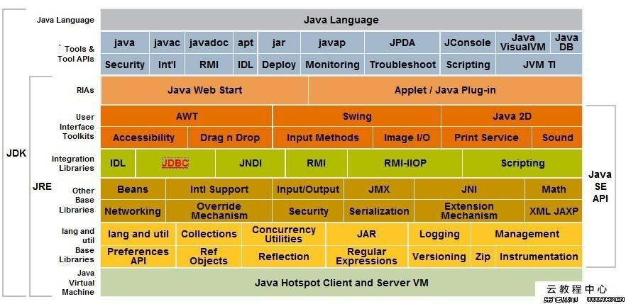

# 介绍

[TOC]

- jdk ：java development kit
- jre：java run environment

> groovy 属于java 技术体系中的一员，运行用于java 虚拟机上

## java 虚拟机的发展

### Sun Classic VM

- 只能使用纯解释器的方式来执行java代码
- 第一个商用的java 虚拟机

### Exact VM

exact memory managemnt

编译与解释混合使用

### HotSpot VM

### KVM

kilobyte 嵌入式的虚拟机，简单轻量可移植

### JRokit

- 世界上最快的虚拟机
- 专注服务器的应用

- 优势：
  - 垃圾回收组件
  - MIissonControl 组件

### J9

IBM  的一款java虚拟机

### Dalvik虚拟机

android 平台的一个虚拟机

https://blog.csdn.net/weixin_34128534/article/details/87236998

### Taobao VM

定制的分布式的java 虚拟机

## java 技术框图

### 技术发展方向

- java  card：小内存设备（智能卡片）
- java ME：java micro edition 移动小终端系统
- java SE：java standard edition 桌面版
- java EE：java enterprise edition 企业级开发

