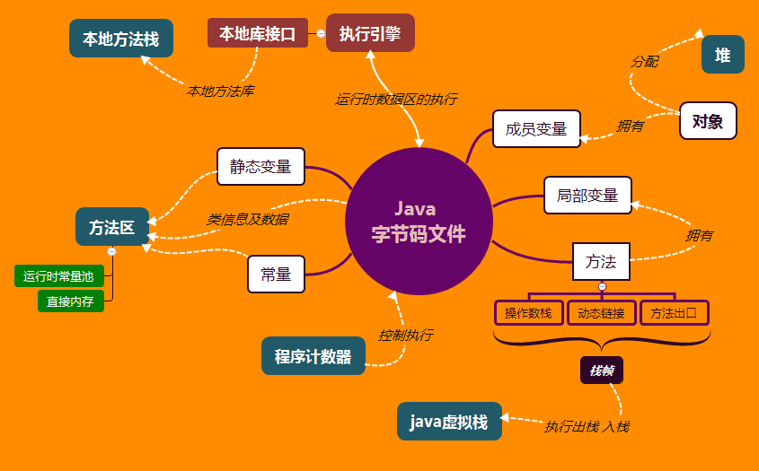

# java 虚拟机的内存分配

[TOC]

因为java要实现一个自动的垃圾回收机制，那么就要对字节码文件进行一个规划

一个类分为：成员变量，方法，类接班信息。

成员变量分为：常量，普通变量。

方法：成员方法，内嵌方法。

**Java内存模型的目的：** 屏蔽掉各种硬件和操作系统的内存访问差异，以实现让java程序在各种平台下都能达到一致的内存访问效果。

## java 运行时数据区图

