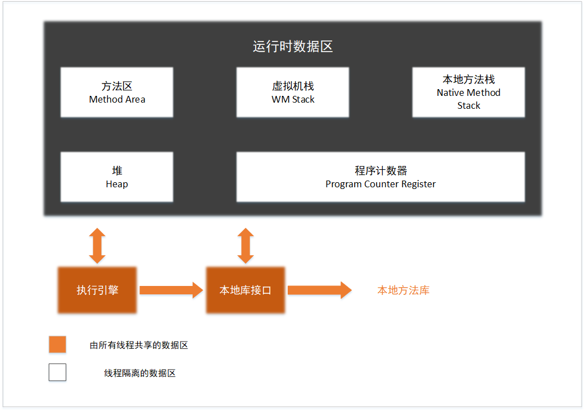

# java 虚拟机的内存分配

[TOC]

因为java要实现一个自动的垃圾回收机制，那么就要对字节码文件进行一个规划

## java 运行时数据区图

## 各个模块的作用

### 程序计数器（Program Counter Register)

- 当前字节码执行的行号指示器
- 为了保证线程切换后能恢复到正确的执行位置，每条线程都有一个独立的线程计数器
- 如果线程正在执行的java方法，则记录的是虚拟机字节码的地址；如果是native 方法，则这个计数器值为空。
- 没有规定内存溢出问题

### java虚拟机栈（java virtual machine Stacks)

