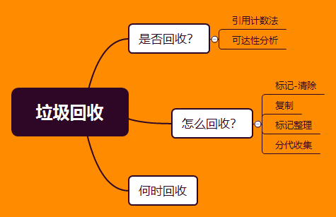

# 垃圾回收




对于内存管理，java和C++ 不一样，c++需要自己释放内存空间，而jvm有自己的实现的一套机制

为什么需要了解垃圾回收?

- 当需要排查各种内存溢出、内存泄漏问题时；

- 当垃圾收集成为系统达到更高并发量的瓶颈时；

- 我们就需要对这些"自动化"技术实话必要的监控和调节；

对象回收实现问题：

- 什么对象需要回收？**即如何判断对象已经死亡**
- 采取怎样的方式进行回收？**垃圾回收算法** 

判断方法： [Reference.md](5.Reference.md) 

- 引用计数法：根据引用次数来判断是否回收；

  ==计数只是数量关系，不能描述联系，无法解决引用环问题== （下文具体说环状源码分析）

- 可达性分析：以GC-Root规定的变量为树的根，如果可达，则不需回收。（下文具体说GC-Root）

  可达性分析算法中不可达的对象，也并非是“非死不可”的
  
  - **第一次标记**：如果对象在进行可达性分析后发现没有与GC Roots相连接的引用链，那它将会被第一次标记
  
  - **第二次标记**：第一次标记后接着会进行一次筛选，筛选的条件是此对象是否有必要执行`finalize()`方法。在`finalize()`方法中没有重新与引用链建立关联关系的，将被进行第二次标记。
  
    第二次标记成功的对象将真的会被回收，如果对象在`finalize()`方法中重新与引用链建立了关联关系，那么将会逃离本次回收，继续存活。

回收算法：

- 标记-清除：将要清除的对象标记，根据标记清除；==标记清除效率低，内存碎片化== 

- 复制：划分区域，需要回收的放一边；==内存减小==

- 标记—整理：就是上面的中和，不划分区域，而是选择一个方向，固定空间大小。

- 分代收集：目的减少频繁gc的数量。对gc对象分类：新生代、老生代、永久代

  - 新生代：Eden、Survivor（From 、To)，内存比例是8:1:1
  
    Eden是新产生的对象、From和TO角色轮替交换：承载Eden存活对象、以前存活对象达到阈值转到老生代
  
  - 永久代：存储类信息、常量、静态变量、即时编译器编译后的代码等数据


环状源码分析
------------

```java
public class Main {
    public static void main(String[] args) {
        MyObject object1 = new MyObject(); // 计数为1
        MyObject object2 = new MyObject(); // 计数为1
        object1.object = object2; // object2计数为2
        object2.object = object1; // object1计数为2
        object1 = null; // 需要被回收，但计数为1
        object2 = null; // 需要被回收，但计数为1
    }
}
class MyObject{
    public Object object = null;
}
```

- 引用计数法：当object1和object2被置空的时候，因为循环引用，两者的计数为1
- 可达性分析：GC Root 被置为null，可以被回收。


GC-Root
-------

在Java语言中，可作为GC Roots的对象包含以下几种：

1. 虚拟机栈(栈帧中的本地变量表)中引用的对象；
2. 方法区中静态属性引用的对象；
3. 方法区中常量引用的对象；
4. 本地方法栈中(Native方法)引用的对象

这些变量将会作为根节点，进行可达性分析。


finalize()
----------

finalize()是Object中的方法，当垃圾回收器将要回收对象所占内存之前被调用

它不是C/C++中的析构函数，而是Java刚诞生时为了使C/C++程序员更容易接受它所做出的一个妥协

需要注意

- 只会在对象内存回收前被调用一次
- 被调用但不一定会执行完，可能已经被kill

如果一个对象finalize（）方法中执行缓慢，或者发生死循环（更极端的情况），将很可能会导致F-Queue队列中的其他对象永久处于等待状态，甚至导致整个内存回收系统崩溃。


分代回收
--------

 Java虚拟机将堆内存划分为**新生代**、**老年代**和**永久代**

 Java虚拟机将堆内存划分为**新生代**、**老年代**和**永久代**，永久代是HotSpot虚拟机特有的概念，它采用永久代的方式来实现方法区，其他的虚拟机实现没有这一概念，而且HotSpot也有取消永久代的趋势，在JDK 1.7中HotSpot已经开始了“去永久化”，把原本放在永久代的字符串常量池移出。永久代主要存放常量、类信息、静态变量等数据，与垃圾回收关系不大，新生代和老年代是垃圾回收的主要区域。


Minor GC 和 Full GC
-------------------

Minor GC:指发生在新生代的垃圾收集动作，该动作非常频繁。

Full GC/Major GC:指发生在老年代的垃圾收集动作，出现了Major GC，经常会伴随至少一次的Minor GC。Major GC的速度一般会比Minor GC慢10倍以上


阅读
----

[JAVA垃圾回收-可达性分析算法](https://blog.csdn.net/luzhensmart/article/details/81431212) 

[扒一扒JVM的垃圾回收机制，下次面试你准备好了吗](https://www.cnblogs.com/1024Community/p/honery.html) 

[jvm垃圾收集算法☞ 终极解决方案-分代收集算法](https://www.jianshu.com/p/024f2065e68b) 