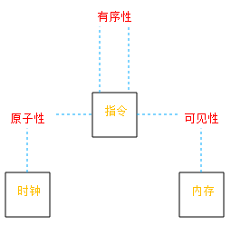
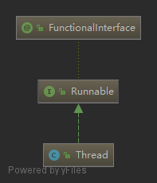
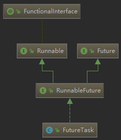
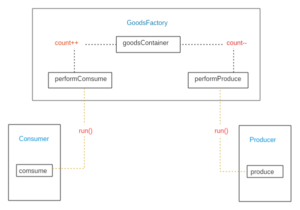
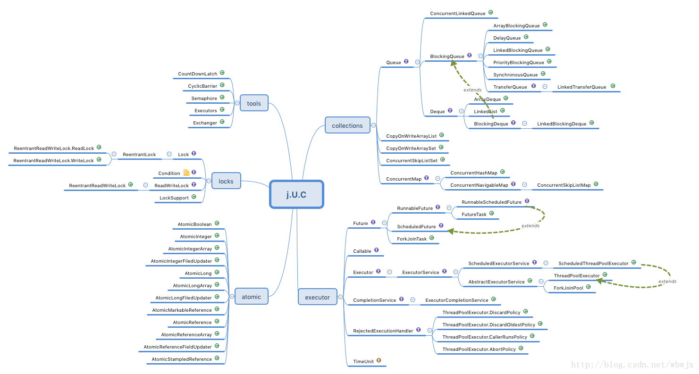

Thread
------

**应该从哪些方面分析来分析？？**

> 多线程的本质
>
> 生产者消费者模型
>
> 线程关键字的理解：volatile、synchronized
>
> 线程的实现方式与死锁
>
> 线程封装的使用类
>
> 开发中使用的线程：线程池

知识研究顺序：

FutureTask

CAS：LockSupport、AtomicReference

AQS：CountDownLatch、RecentWriteLock

synchronized、volatile

Collection：Queue、Map、List

Executor：AbstractExecutorService


概念：

- 阻塞：就是发起请求不会得到有效的回应，但是会不断的请求，请求间隔可自定义。
- 锁：就是一种标记，标记当前对象是否可被持有
- 原子操作：操作不可被打断，这里很模糊，怎么                                                                                                                                                                                                                                                                                                                                                                                                                                                                                                                                                                                                                                                                                                                                                                                                                                                                                                                                                                                                                                                                                                                                                                                                                                                                                                                                                                                                                                                                                                                                                                                                                                                                                                                                                                                                                                                                                                                                                                                                                                                                                                                                                                                                                                                                                                                                                                                                                                                                                                                                                                                                                                                                                                                                                                                                                                                                                                                                                                                                                                                                                                                                                                                                                                                                                                                                                                          

检索：

 [Unsafe](2. Unsafe.md) ：Undsafe源码分析，以及在SupportLock和Atomic包的分析

 [FutureTask](1. FutureTask.md) ：FutureTask源码分析，FutureTask使用场景的描述，CAS的应用以及Treiber stack的理解


#### 本质理解

线程在各个层次的体现：

- 微机：某几段时钟的持有者，执行多个部分的机械指令
- 操作系统：TCB的表现者，在多个时间周期轮转中执行操作，CPU调度的最小单位。
- java层面：Thread对象，异步执行一个任务

一句话从本质上来说：<span style="background-color: #F9B6E5; padding:0px 3px; margin:2px; border-radius:3px ">多线程就是拥有多个时钟周期(计算机执行的周期)的权利</span> 

在宏观上说，同一个任务分成多个部分交叉执行。

遇到问题是：<span style="background-color: #C6E2FF; padding:0px 3px; margin:2px; border-radius:3px ">共同需要的数据如何操作？</span> 

先看一张图：



总结写在前头：

- 原子性：在操作过程中，不可以在修饰的地方打断
- 有序性：保证修饰的代码块，不会被指令重排
- 可见性：保证各个操作的线程，可以立即知道被修饰的数据的变化。

计算机运算的时间与人们的感官时间差距很大，所以有了 **多线程** 的概念

计算机在每一次时钟心跳中，进行一次指令操作，在编程中有些编码是由多个指令组合才有意义，不可分割，这就是 **原子性**

```java
i++;	// 这个在机器指令中分为：根据i的地址从内存读取i的值，将i进行加法运算，再赋值给i
```

java一般因为优化操作而进行指令重排，这就涉及到当指令操作的不同的数据，如果不同数据块的操作有先后逻辑关系，要考虑到多线程带来的 **有序性**

```java
// 假如线程1先执行了语句2，此时线程2执行了，导致程序崩溃
//线程1:
context = loadContext();   //语句1
inited = true;             //语句2
//线程2:
while(!inited ){
  sleep()
}
doSomethingwithconfig(context);
```

程序的运行都是需要内存的，自然多线程的创建，必然每个线程都有自己的内存空间(栈空间)。

在java中，每一个线程都是拥有原有数据的副本，在同一块数据的操作，在其他线程中数据更新不及时，会带来数据运算不可靠，这就是 **可见性**（对于相同区域的数据操作，其他线程是可见的）

```java
// 多个线程同时进行这个操作
i++;
```


#### 同步修饰词与性质

|          |      synchronized      |     volatile     |
| :------: | :--------------------: | :--------------: |
| **使用** |   方法、变量、代码块   |       变量       |
| **作用** | 可见性、原子性、有序性 |  可见性、有序性  |
| **性能** |    可能造成线程阻塞    | 不会造成线程阻塞 |

如何验证？

- 有序性

  看字节码文件，执行的顺序；通常被synchronized和volatile修饰的代码，会有**内存屏障**来确保有序

- 可见性

  这个只能与没有被修饰的变量，做实验就行观察

- 原子性

  如果要保持代码块的原子性，通常可以用synchronized修饰，可以没有被修饰的进行对比


#### 常见开启方式

先看一下继承关系，FunctionalInterface限制接口只能有一个抽象方法



发现java.lang.Thread类是实现了Runnable类

```java
public interface Runnable {
    // 在线程执行的时候调用此方法
    public abstract void run();
}
```


##### 继承Thread

继承Thread类，复写run方法

```java
public class MyThread extends Thread {
    @Override
    public void run() {
        super.run();
    }
}
```


##### 实现runnable

实现runnable接口，创建对象的时候传入

```java
Thread t = new Thread(new Runnable() {
    @Override
    public void run() {
        // 这里用写需要跑的代码
    }
});
t.start();
```


##### 建立FutureTask

简单的进行了封装：





```java
FutureTask task = new FutureTask(() -> {
    try {
        Thread.sleep(1000);
        System.out.println("hello i am start;");
    } catch (InterruptedException e) {
        e.printStackTrace();
    }
}, "kevin fisrt thread");
ExecutorService executor = Executors.newFixedThreadPool(2);
// submit futureTask1 to ExecutorService
executor.submit(task);
while (true){
    if (task.isDone()) {
        executor.shutdown();
        break;
    }
}
```

从这个例子可以发现：这里我们可以获取到线程的转态，知道什么执行。

具体的分析看： [FutureTask\<V>分析](1. FutureTask.md) 

 

#### Thread源码分析

看一下Runnable的代码

```java
@FunctionalInterface
public interface Runnable {
    // 实现这个接口，必须重写这个方法，但线程被调用的时候，这个方法就会被运行
    public abstract void run();
}
```

从最简单的使用来分析Thread的源码：

```java
Thread t = new Thread(new Runnable() {
    @Override
    public void run() {
        // 这里用写需要跑的代码
    }
});
t.start();
```

##### Thread()

- 先看一下创建线程的过程

  ```java
  public Thread(Runnable target) {
      init(null, target, "Thread-" + nextThreadNum(), 0);
  }
  // 看到这个方法有很多参数，可以知道Thread的创建重写了很多方法
  private void init(ThreadGroup g, Runnable target, String name, long stackSize) {
      // 调用native的方法currentThread()获取当前的线程
      Thread parent = currentThread();
      if (g == null) {
          g = parent.getThreadGroup();
      }
      g.addUnstarted();
      this.group = g;
      this.target = target;
      this.priority = parent.getPriority();
      // 是否是父级线程的守护线程
      this.daemon = parent.isDaemon();
      setName(name);
      init2(parent);
      // 指定JVM要开辟的栈的大小
      this.stackSize = stackSize;
      // 计算出下一个ThreadID，同时放回当前Thread的ID
      tid = nextThreadID();
  }
  ```

  总结来说，<span style="background-color: #C6E2FF; padding:0px 3px; margin:2px; border-radius:3px ">Thread的初始化设置了属性：线程组，父级线程，优先级，名字与ID，栈空间</span> 

- 这里再看一下**init2(parent)**

  ```java
  private void init2(Thread parent) {
      this.contextClassLoader = parent.getContextClassLoader();
      this.inheritedAccessControlContext = AccessController.getContext();
      // 当父类有局部变量的时候
      if (parent.inheritableThreadLocals != null) {
          // 注意ThreadLocal，用来储存主线程的局部变量
          this.inheritableThreadLocals = ThreadLocal.createInheritedMap(
              parent.inheritableThreadLocals);
      }
  }
  ```

##### strat()

```java
public synchronized void start() {
    // Android-changed: throw if 'started' is true
    // 当状态为初始0状态，没有启动的是跳过执行
    if (threadStatus != 0 || started)
        throw new IllegalThreadStateException();
    // 每一个线程都可能是一个group，这步操作是将其加入上一个group数组中
    group.add(this);
    started = false;
    try {
        nativeCreate(this, stackSize, daemon);
        // 记录开启，标志不能重复开启
        started = true;
    } finally {
        try {
            if (!started) {
                // 在group数组进行移除当前线程，同时记录移除操作。
                group.threadStartFailed(this);
            }
        } catch (Throwable ignore) {
        }
    }
}
```

实际的创建时在c中，**nativeCreate()** ，用everthing软件搜索**java_lang_Thread.cc**(jdk中类，一般是以java_lang开头后面加类名)，我这边的路径是：<span style="display: inline-block;border:1px solid #dbdcdc; background:#f5f5f5; padding-right: 3px ; margin:3px; border-radius: 3px " >android-8.0.0_r1\art\runtime\native</span> 

```c++
// java_thread :java中的Thread对象
static void Thread_nativeCreate(JNIEnv* env, jclass, jobject java_thread, 
                                jlong stack_size,jboolean daemon) {
  // There are sections in the zygote that forbid thread creation.
  Runtime* runtime = Runtime::Current();
  if (runtime->IsZygote() && runtime->IsZygoteNoThreadSection()) {
    jclass internal_error = env->FindClass("java/lang/InternalError");
    CHECK(internal_error != nullptr);
    env->ThrowNew(internal_error, "Cannot create threads in zygote");
    return;
  }
  // 注意这里调用了thread.cc的代码
  Thread::CreateNativeThread(env, java_thread, stack_size, daemon == JNI_TRUE);
}
```

查看一下**thread.cc**，中的CreateNativeThread方法（thread.cc与java_lang_Thread.cc在同一个文件夹)

```c++
// java_peer：就是java的对象实例
void Thread::CreateNativeThread(JNIEnv* env, jobject java_peer, 
                                size_t stack_size, bool is_daemon) {
  CHECK(java_peer != nullptr);
  Thread* self = static_cast<JNIEnvExt*>(env)->self;
    ...
  Runtime* runtime = Runtime::Current();
  // Atomically start the birth of the thread ensuring the runtime isn't shutting down.
    ...
  Thread* child_thread = new Thread(is_daemon);
  // Use global JNI ref to hold peer live while child thread starts.
  child_thread->tlsPtr_.jpeer = env->NewGlobalRef(java_peer);
  stack_size = FixStackSize(stack_size);
  // Thread.start is synchronized, so we know that nativePeer is 0, and know that we're not racing to
  // assign it.
  env->SetLongField(java_peer, WellKnownClasses::java_lang_Thread_nativePeer,
                    reinterpret_cast<jlong>(child_thread));
  // Try to allocate a JNIEnvExt for the thread. We do this here as we might be out of memory and
  // do not have a good way to report this on the child's side.
    ...
  int pthread_create_result = 0;
  if (child_jni_env_ext.get() != nullptr) {
    pthread_t new_pthread;
    pthread_attr_t attr;
    child_thread->tlsPtr_.tmp_jni_env = child_jni_env_ext.get();
    CHECK_PTHREAD_CALL(pthread_attr_init, (&attr), "new thread");
    CHECK_PTHREAD_CALL(pthread_attr_setdetachstate, (&attr, PTHREAD_CREATE_DETACHED),
                       "PTHREAD_CREATE_DETACHED");
    CHECK_PTHREAD_CALL(pthread_attr_setstacksize, (&attr, stack_size), stack_size);
     // 注意看这里！！！！！！！！！！！！！！
    pthread_create_result = pthread_create(&new_pthread,
                                           &attr,
                                           Thread::CreateCallback,
                                           child_thread);
    CHECK_PTHREAD_CALL(pthread_attr_destroy, (&attr), "new thread");

    if (pthread_create_result == 0) {
      // pthread_create started the new thread. 
      // The child is now responsible for managing the
      // JNIEnvExt we created.
      // Note: we can't check for tmp_jni_env == nullptr, as that would require synchronization
      //       between the threads.
      child_jni_env_ext.release();
      return;
    }
  }

  // Either JNIEnvExt::Create or pthread_create(3) failed, so clean up.
    ...
  // Manually delete the global reference since Thread::Init will not have been run.
    ...
  // TODO: remove from thread group?
    ...
}
```

这里可以发现，最终调用的是**pthread**库中的方法，进行创建，这个是linux自带的


##### 其他方法

- jion：等待当前线程消失之后，再多少时间消失
- sleep：停止多长时间再运行

- yield：使当前线程从执行态变为可执行态
- interrupt：阻断当前线程


##### 源码总结


#### 辅助类

##### ThreadGroup

这个类，用来记录线程，形成**线程树**


##### ThreadLocal与Reference

线程内部的一个存储类，可以存储多个不同的线程数据，里面用的是map实现的，用来存储各个线程的局部变量

看一下set以及get

```java
public void set(T value) {
    Thread t = Thread.currentThread();
    ThreadLocalMap map = getMap(t);
    if (map != null)
        map.set(this, value);
    else
        createMap(t, value);
}
public T get() {
    Thread t = Thread.currentThread();
    ThreadLocalMap map = getMap(t);
    if (map != null) {
        // 注意这条语句，后面会提到
        ThreadLocalMap.Entry e = map.getEntry(this);
        if (e != null) {
            @SuppressWarnings("unchecked")
            T result = (T)e.value;
            return result;
        }
    }
    return setInitialValue();
}
```

可以发现实际实现存储的是ThreadLocalMap，键为当前线程，值为我们传入的值，且要属于ThreadLocal的泛型类型

看一下ThreadLocalMap

- 创建

  ```java
  ThreadLocalMap(ThreadLocal<?> firstKey, Object firstValue) {
      // 初始容量大小
      table = new Entry[INITIAL_CAPACITY];
      // 索引位置
      int i = firstKey.threadLocalHashCode & (INITIAL_CAPACITY - 1);
      // 被存储的实体
      table[i] = new Entry(firstKey, firstValue);
      size = 1;
      // 设置扩容的底
      setThreshold(INITIAL_CAPACITY);
  }
  ```

- 查看一下Entry

  ```java
  static class Entry extends WeakReference<ThreadLocal<?>> {
      /** The value associated with this ThreadLocal. */
      Object value;
      Entry(ThreadLocal<?> k, Object v) {
          super(k);
          value = v;
      }
  }
  ```

  发现继承了WeakReference<ThreadLocal<?>>，继续查看

  ```java
  public class WeakReference<T> extends Reference<T> {
      public WeakReference(T referent) {
          super(referent);
      }
      public WeakReference(T referent, ReferenceQueue<? super T> q) {
          super(referent, q);
      }
  }
  ```

  发现继承于**Reference**，这个类与java native的代码连接，都是 <span style="display: inline-block;border:1px solid #dbdcdc; background:#f5f5f5; padding-right: 3px ; padding-left: 3px ;margin:3px; border-radius: 3px " >java.lang.ref</span> 包下的类

- 看一下Reference中的构造方法

  ```java
  volatile T referent;
  final ReferenceQueue<? super T> queue;
  Reference(T referent, ReferenceQueue<? super T> queue) {
      this.referent = referent;
      this.queue = queue;
  }
  ```

  说明Entry的创建的时候，设置了引用对象，以及队列

  当ThreadLocal的get方法中使用：<span style="display: inline-block;border:1px solid #dbdcdc; background:#f5f5f5; padding-right: 3px ; padding-left: 3px ;margin:3px; border-radius: 3px " >map.getEntry(this);</span> 触发Entry的调用

  ```java
  private Entry getEntry(ThreadLocal<?> key) {
      int i = key.threadLocalHashCode & (table.length - 1);
      Entry e = table[i];
      if (e != null && e.get() == key)
          return e;
      else
          return getEntryAfterMiss(key, i, e);
  }
  ```

- 查看Entry类中的e.get()方法，最终调用**Reference**里面的getReferent()方法

  ```java
  private final native T getReferent();
  ```

<span style="background-color: #C6E2FF; padding:0px 3px; margin:2px; border-radius:3px ">问题是ReferenceQueue有什么用？</span>

弱引用一般会在System.gc()下被回收，在调用gc之后，被回收的引用会被存放在**ReferenceQueue** 

推荐一篇文章：[关于Java中的WeakReference](https://www.jianshu.com/p/964fbc30151a) 


##### Looper与MessageQueue

- Looper用于线程中消息通信
- looper.prepare()
  - 初始化Looper，建立自己的**MessageQueue**
  - ThreadLocal以当前线程为键，存储Looper
- looper.looper()
  - 通过当前的Looper对象，获取MessageQueue对象
  - 无限循环，通过MessageQueue对象获取Message对象，进行消息分发

**举一个例子**：

```java
// 实现在LooperThread线程中的无线分发
class LooperThread extends Thread {
    public Handler mHandler;
    public void run() {
        Looper.prepare();
        mHandler = new Handler() {
            public void handleMessage(Message msg) {
                // process incoming messages here
            }
        };
        Looper.loop();
    }
}
```

看一下**Looper.prepare();**的源码

```java
// 静态初始化，ThreadLocal存储局部变量Looper
static final ThreadLocal<Looper> sThreadLocal = new ThreadLocal<Looper>();
public static void prepare() {
    prepare(true);
}
private static void prepare(boolean quitAllowed) {
    // 获取当前线程的Looper
    if (sThreadLocal.get() != null) {
        // 每个线程只能绑定一个Looper
        throw new RuntimeException("Only one Looper may be created per thread");
    }
    // 如果没有设置Looper，这里就创建一个新的
    sThreadLocal.set(new Looper(quitAllowed));
}
```

查看一下Looper初始化

```java
private Looper(boolean quitAllowed) {
    // 初始化了一个消息队列，底层是现实是链表，并设置为成员变量
    mQueue = new MessageQueue(quitAllowed);
    mThread = Thread.currentThread()
}
```

这里观察一下Looper的属性

```java
// 类加载的时候获取和后来设置
static final ThreadLocal<Looper> sThreadLocal = new ThreadLocal<Looper>();
private static Looper sMainLooper;  // guarded by Looper.class，在SystemServer.java被设置

// 当前线程中获取
final MessageQueue mQueue;
final Thread mThread;
```

看一下looper()

```java
public static void loop() {
    final Looper me = myLooper();
    final MessageQueue queue = me.mQueue;
    ...
    // Make sure the identity of this thread is that of the local process,
    // and keep track of what that identity token actually is.
    Binder.clearCallingIdentity();
    final long ident = Binder.clearCallingIdentity();
    boolean slowDeliveryDetected = false;
    for (;;) {
        Message msg = queue.next(); // might block
        ...
        try {
            msg.target.dispatchMessage(msg);
            // 发送延迟操作
            dispatchEnd = needEndTime ? SystemClock.uptimeMillis() : 0;
        } finally {
            ...
        }
        // Make sure that during the course of dispatching the
        // identity of the thread wasn't corrupted.
        final long newIdent = Binder.clearCallingIdentity();
        msg.recycleUnchecked();
    }
}
```

作用是开启轮询，不断的质问是否有消息要回调发送


#### Thread设计总结


#### 生产者消费者模型



生产者和消费者都是一个线程，同时作用于产品

这里设立的是产品工厂，有消费者和生产者执行相关操作

- 消费者和生产者分别是不同的线程
- 生产者：在工作时间，进入到工厂内，执行生产操作
- 消费者：在工作时间，客户到工厂运走产品

##### 产品工厂

```java
public class GoodsFactory {

    // 产品
    private class Goods{ }
    
    private int count = 0;
    private static final int MAX_COUNT = 100;
    // 产品容器
    private Queue<Goods> vol goodsContainer = new ArrayDeque<>();

    /**
     * 保证产品的生产是原子性操作
     */
    private synchronized void performProduce() throws Exception{
        if (count >= MAX_COUNT){
            System.out.println("------生产仓库已经满-----");
            wait();
        }else {
            goodsContainer.add(new Goods());
            this.count ++;
            notifyAll();
        }
    }

    private synchronized void performConsume() throws Exception{
        while (count <= 0){
            System.out.println("-----已经没有存储的产品-----");
            wait();
        }
        goodsContainer.remove();
        this.count--;
        notifyAll();
    }
}
```

##### 生产者

```java
public class Producer extends  Thread{
    private GoodsFactory factory;

    public Producer(GoodsFactory factory){
        this.factory = factory;
    }
    
    public void produce(){
        start();
    }
    
    @Override
    public void run() {
        // 进入到工厂内，执行生产操作
        while (true)
        try {
            factory.performProduce();
        } catch (Exception e) {
            e.printStackTrace();
        }
    }
}
```

##### 消费者

```java
public class Consumer extends Thread {
    private GoodsFactory factory;

    public Consumer(GoodsFactory factory){
        this.factory = factory;
    }
    
    public void consume(){
        start();
    }

    @Override
    public void run() {
        // 客户到工厂运走产品
        while (true)
        try {
            factory.performConsume();
        } catch (Exception e) {
            e.printStackTrace();
        }
    }
}
```


阅读材料
--------

<span style="background-color: #F9B6E5; padding:0px 3px; margin:2px; border-radius:3px ">java.util.concurrent</span> 

[Java 线程池 8 大拒绝策略，面试必问！](https://cloud.tencent.com/developer/article/1520860) 

[什么导致线程阻塞-58-美团](http://www.jackywang.tech/AndroidInterview-Q-A/interview/线程 线程池原理-腾讯.html)

 [《java.util.concurrent 包源码阅读》 结束语](https://www.cnblogs.com/wanly3643/p/3992238.html) 

[Java并发编程 -- Concurrent包源码分析4 -- 各种锁与无锁](https://blog.51cto.com/12054307/1850902) 

[《Java concurrent包源码分析》一、源码结构](https://www.jianshu.com/p/bc39eb0b1461)  



