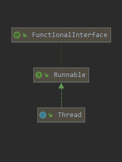

# Thread

[TOC]

## 如何研究？？？

看一下api，发现有很多关于Thread的类，接一个图出来


看一下**Thread**的层级结构



发现有很多与线程相关的类，但直接与线程相关的类就**Runnable**

**那么问题来了建立这么多类，用来处理什么问题？？？**

需要处理可见性 、 原子性 、 有序性的问题。

- **可见性**：一旦某个线程修改了该被volatile修饰的变量，它会保证修改的值会立即被更新到**主存**，当有其他线程需要读取时，可以立即获取修改之后的值。

  在Java中为了加快程序的运行效率，对一些变量的操作通常是在该线程的**寄存器**或是**CPU缓存**上进行的，之后才会同步到主存中，而加了volatile修饰符的变量则是直接读写主存。

- 

**Thread本身又应该具备什么性质与属性？？？**


## Thread本身性质

先看一下Thread的类结构，发现方法非常多。

一个个分析看看Thread需要具备哪些性质？？？

首先知道Thread是cpu的调度，执行的最小单位，为了配合进程执行我们设置的任务。

既然要执行任务，对于自身而言就有**状态**可言、**合作关系**以及对**资源的控制**功能

- 状态

  1. 控制：
     - 开启
     - 中断
     - 睡眠、等待
     - 停止
     - 重启
     - 挂起
  2. 获取

- 合作关系

  1. 规划：
     - 组别
  2. 竞争
     - 执行顺序
     - 执行时间
     - 优先级
     - 资源
  3. 守护

  


## 同步修饰词

```java
synchronized
volatile
```

两者比较：

- 使用

  - synchronized：可以修饰方法与变量

  - volatile：只能修饰变量

- 作用

  - synchronized：可以保证可见性，又能够保证原子性、有序性
  - volatile：能保证可见性，但不能保证原子性，但性能更优。
  - volatile不会造成线程阻塞。synchronized可能会造成线程阻塞。

可见性，比如volatile可以保证当在一个线程修改后，能保证所有的线程可以获取到最新的值