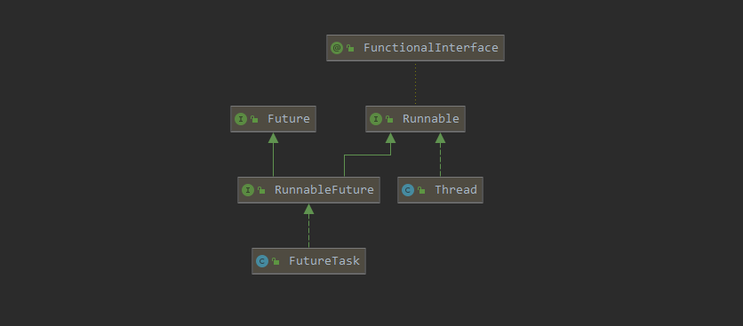

FutureTask\<V>分析
===============

> 实现什么接口，就是具备了什么能力，能力就得到扩展；
>
> 接口是对实体类的抽象，实现这个接口，则可被这个类的调度者调度

关键要弄明白

- 适用于什么场景？
- 封装成什么样子？
- 采用什么技术完成？精髓在哪？

<div style="background:#FCFAED; color:#1A0F05; border-left:5px solid #F2AA15; padding:15px; font-family:Arial,楷体; font-size:17px" >
    实现了RunnableFuture（继承了Runnable、Future接口)，可被Thread执行，具备future规定的能力<br/>
    适用于对子线程中任务的状态、结果(泛型)、异常有所依赖的场景，如AbstractExecutorService<br/>
    在建立时对象时，将Runnable参数转化为Callable对象，获取线程执行结果和异常的功能得到实现<br/>
    使用sun.misc.Unsafe类(CAS)，实现乐观锁，保证任务执行的状态、结果、异常、时延操作的正确性<br/>
    通过Treiber stack实现类WaitNode，实现多线程调用get()方法的任务时延机制。
</div>

需要注意的是：

- 状态切换的流程，什么时候在哪个成员方法进行切换？

- CAS是什么，达到什么效果？

  <div style="background:#FAFAFA; color:#1A0F05; border:1px solid #FAFAFA; padding:5px; font-family:楷体; font-size:17px;  border-radius:3px" >
      CAS：compareAndSet,这只是一个取名，代表着以硬件级别的比对。<br/>
      </div>

- Treiber stack的作用，WaitNode运作流程？

  <div style="background:#FAFAFA; color:#1A0F05; border:1px solid #FAFAFA; padding:5px; font-family:楷体; font-size:17px;  border-radius:3px" >
      WaitNode处理多次在不同线程调用get()的情况。通过LockSupport阻塞实现延时。<br/>
  	WaitNode是用来储存调用的线程，通过这个来记录，阻塞。
  </div>

<span style="background-color: #F7D181; padding:0px 3px; margin:2px; border-radius:3px ">要完成的效果</span>

加深CAS与Treiber stack的印象以及应用方式，熟记RunnableFuture的方法方便应用


使用场景与封装效果
------------------

一般来说，开启线程我们有三种方式：继承Thread，实现Runnable接口，建立FutureTask 对象

不管是实现Runnable，FutureTask都没有实际的执行方法，真正有调用native方法的在Thread中，linux底层是PThread，也就是说FutureTask与Runnable是暴露的接口用于扩展自己要执行的内容。



```java
public interface Runnable { public abstract void run(); }
public interface Future<V> {
    boolean cancel(boolean mayInterruptIfRunning); //mayInterruptIfRunning 是否打断正在运行的
    boolean isCancelled();
    boolean isDone();
    V get() throws InterruptedException, ExecutionException; // 阻塞等通知获取结果
    // 超时等待，如果timeout之后还没有获取结果，则停止获取
    V get(long timeout, TimeUnit unit) throws InterruptedException, 
    										ExecutionException, TimeoutException;
}
public interface RunnableFuture<V> extends Runnable, Future<V> { void run(); }
```

FutureTask 的封装就是Future的实现。

<span style="display: inline-block;border:1px solid #dbdcdc; background:#f5f5f5; padding: 3px ; margin:3px; border-radius: 3px " >FutureStack</span>实现了RunnableFuture，暴露了state状态，同时提供停止任务的方法，使得建立的子线程任务更好的调度和管理，FutureTask是出于<span style="display: inline-block;border:1px solid #dbdcdc; background:#f5f5f5; padding: 3px ; margin:3px; border-radius: 3px " >java.utils.concurrent</span>，同包下还有<span style="display: inline-block;border:1px solid #dbdcdc; background:#f5f5f5; padding: 3px ; margin:3px; border-radius: 3px " >Executor、Callable</span>。

在JDK的体现就是<span style="display: inline-block;border:1px solid #dbdcdc; background:#f5f5f5; padding: 3px ; margin:3px; border-radius: 3px " >AbstractExecutorService</span>中，调度任务都是RunnableFuture，也是实现了Future接口。

<div style="background:#ECF8F2; color:#777777; border-left:5px solid #42B983; padding:15px" >
    FutureTask 要完成的封装就是RunnableFuture的方法，对我们设置的任务的状态、结果和异常的暴露。<br/>
    也就是说，相对于普通的Thread建立的子线程任务，更适合需要子线状态、接口、是否异常的场景。<br/>
    就是要对子线程中任务进行管理的场景。
</div>


采用什么技术完成的？
--------------------

### 构造

有两种构造方式：

```java
public FutureTask(Callable<V> callable) {
    if (callable == null)
        throw new NullPointerException();
    this.callable = callable;
    this.state = NEW;       // ensure visibility of callable
}
public FutureTask(Runnable runnable, V result) {
    this.callable = Executors.callable(runnable, result);
    this.state = NEW;       // ensure visibility of callable
}
```

第二个构造函数的runnable被封装为：RunnableAdapter，设置了返回结果

```java
static final class RunnableAdapter<T> implements Callable<T> {
    final Runnable task;
    final T result;
    RunnableAdapter(Runnable task, T result) {
        this.task = task;
        this.result = result;
    }
    public T call() {
        task.run();
        return result;
    }
}
```

总结：所有任务都会以Callable建立，位的就是实现结果和异常的获取。


### state与Unsafe

先看到这部分：

```java
private volatile int state; // CAS操作进行控制
private static final int NEW          = 0;
private static final int COMPLETING   = 1;
private static final int NORMAL       = 2;
private static final int EXCEPTIONAL  = 3;
private static final int CANCELLED    = 4;
private static final int INTERRUPTING = 5;
private static final int INTERRUPTED  = 6;
// Unsafe mechanics
private static final sun.misc.Unsafe UNSAFE;
private static final long stateOffset;
static {
    try {
        UNSAFE = sun.misc.Unsafe.getUnsafe();
        Class<?> k = FutureTask.class;
        // FutureTask各个成员变量的内存偏移量
        stateOffset = UNSAFE.objectFieldOffset
            (k.getDeclaredField("state"));
    } catch (Exception e) {
        throw new Error(e);
    }
}
```

FutureTask 提供线程状态给其他线程，则必定要进行线程调度；

可以看的是：<span style="display: inline-block;border:1px solid #dbdcdc; background:#f5f5f5; padding: 3px ; margin:3px; border-radius: 3px " >sun.misc.Unsafe</span>在静态代码块初始化了，说明state都将通过CAS在线程中操作并修改值。

从注释可以了解到state的状态：


有时间的话，可以跟踪一下在各个方法中状态的修改，但这不是最主要的。


### get()与WaitNode

在具体分析它的源码之前，有一点我们先特别说明一下，FutureTask中会涉及到两类线程，一类是执行任务的线程，它只有一个，FutureTask的run方法就由该线程来执行；一类是获取任务执行结果的线程，它可以有多个，这些线程可以并发执行，每一个线程都是独立的，都可以调用get方法来获取任务的执行结果。如果任务还没有执行完，则这些线程就需要进入Treiber栈中挂起，直到任务执行结束，或者等待的线程自身被中断。

```java
/** Treiber stack of waiting threads */
private volatile WaitNode waiters;
static final class WaitNode {
    volatile Thread thread;
    volatile WaitNode next;
    WaitNode() { thread = Thread.currentThread(); }
}
private static final sun.misc.Unsafe UNSAFE;
private static final long waitersOffset;
static {
    try {
        UNSAFE = sun.misc.Unsafe.getUnsafe();
        waitersOffset = UNSAFE.objectFieldOffset
            (k.getDeclaredField("waiters"));
    } catch (Exception e) {
        throw new Error(e);
    }
}

public V get() throws InterruptedException, ExecutionException {
    int s = state;
    if (s <= COMPLETING)
        s = awaitDone(false, 0L);
    return report(s);
}
```

这里需要注意：

- waiters的值通过CAS来修改，且waiters是一个链表型栈
- WaitNode是建立的方法是，获取到当前线程，也就是调用get函数的线程。并不是处理run方法的线程。
- get()是个阻塞方法，具体实现是awaitDone()

看一下awaitDone(boolean timed, long nanos)：

```java
private int awaitDone(boolean timed, long nanos)
    throws InterruptedException {
    final long deadline = timed ? System.nanoTime() + nanos : 0L;
    WaitNode q = null;
    boolean queued = false;
    for (;;) {
        if (Thread.interrupted()) {
            removeWaiter(q);
            throw new InterruptedException();
        }
        int s = state;
        if (s > COMPLETING) {
            if (q != null)
                q.thread = null;
            return s;
        }
        else if (s == COMPLETING) // cannot time out yet
            Thread.yield();
        else if (q == null)
            q = new WaitNode();
        else if (!queued)
            queued = UNSAFE.compareAndSwapObject(this, waitersOffset,
                                                 q.next = waiters, q);
        else if (timed) {// 是否是超时等待
            nanos = deadline - System.nanoTime();
            if (nanos <= 0L) {
                removeWaiter(q);
                return state;
            }
            LockSupport.parkNanos(this, nanos);
        }
        else
            LockSupport.park(this);
    }
}
```

因为Thread和State随时会随着任务的完成度在子线程改变，所以需要不断的轮询：

- 如果线程被打断，返回异常
- 如果已经不是初始任务状态，返回状态
- 如果已经完成，返回状态
- 建立当前等待WaiteNode，添加到Head，等待超时移除，返回状态。

<span style="display: inline-block;border:1px solid #dbdcdc; background:#f5f5f5; padding: 3px ; margin:3px; border-radius: 3px " >LockSupport.parkNanos(this, nanos)</span> 与 <span style="display: inline-block;border:1px solid #dbdcdc; background:#f5f5f5; padding: 3px ; margin:3px; border-radius: 3px " >LockSupport.park(this)</span> 主要是起作用阻塞当前线程多少秒。


