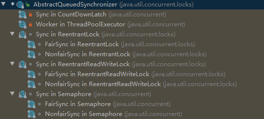
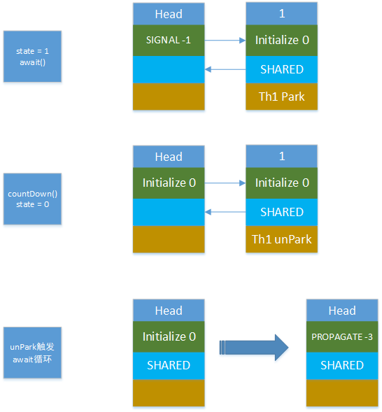
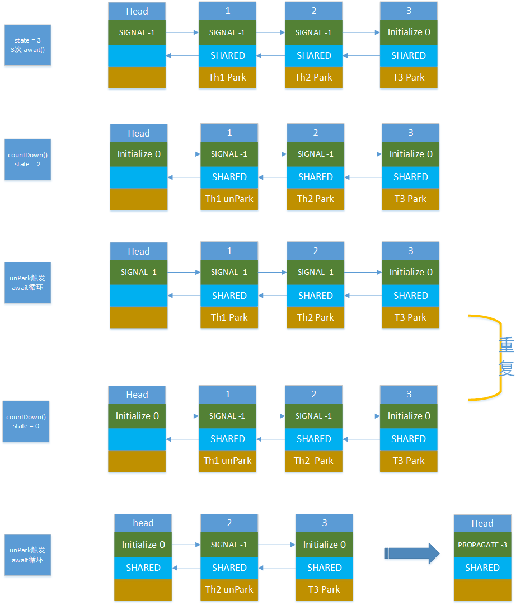

AQS
===

[toc]

> 直接看代码还是很吃力的，或者说是不对的
>
> 因为AQS是一个抽象类，更多的是为了适应子类的实现，所以会有很多干扰
>
> 最好先了解CLH算法是一个什么样子的
>
> 在利用一个子类，跟踪绘制一下，queue的变化。

这里先推荐三篇文章：

[并发之AQS原理(一)](https://www.cnblogs.com/yanlong300/p/9772271.html) 

[并发之AQS原理(二) CLH队列与Node解析](https://www.cnblogs.com/yanlong300/p/10953185.html) 

[并发之AQS原理(三) 如何保证并发](https://www.cnblogs.com/yanlong300/p/9791395.html) 

[AQS的基本原理]([https://monkeysayhi.github.io/2017/12/04/AQS%E7%9A%84%E5%9F%BA%E6%9C%AC%E5%8E%9F%E7%90%86/](https://monkeysayhi.github.io/2017/12/04/AQS的基本原理/)) 


预先了解
--------

 [AQS前篇CLH算法的解析](3. AQS_CLH.md)  

 [AQS关于NODE的描述](3. AQS_NODE.md) 

AQS是通过变化线程的状态来限制线程之间共有的资源的争夺。目的是为了解决因为并发带来的共享变量的读写同步的问题。

要处理的三个对象：共享资源、当前线程、下一个线程。三者为一个循环。


AQS继承归纳
-----------




jdk1.8 中AQS是一个抽象类，直接实现类有：

- CountDownLatch：Sync
- ThreadPoolExecutor：Worker
- ReentrantLock、Semaphore、ReentReadWriteLock：FairSync，NonFairSync

分类：

|     共享锁     |    独享锁     |
| :------------: | :-----------: |
| CountDownLatch | ReentrantLock |


CountDownLatch
--------------

CountDownLatch的作用是，是否有权限执行，还是等待，一个同步并行类。

用法两个例子：

- 起跑的枪声，await()在子线程内，cutdown控制
- 刻度桶，cutdown在子线程内，await()等待。


### 实验

#### wait数量为1

##### 代码

```java
CountDownLatch latch = new CountDownLatch(1); // state 为1
new Thread(()->{
    latch.countDown();// 图中第二列
    System.out.println("here to free lock");
}).start();
System.out.println("main thread wait");
latch.await(); // 图中第一列、第三列
System.out.println("main thread out");
```

##### 输出

```java
main thread wait
here to free lock
main thread out
```

##### 图解




#### 数量为3

##### 代码

```java
CountDownLatch latch = new CountDownLatch(1);
for (int i = 1; i <= 3; i++) {
    int finalI = i;
    new Thread(() -> {
        try {
            System.out.println("i am start");
            latch.await();
            System.out.println("i am : " + finalI);
        } catch (InterruptedException e) {
            e.printStackTrace();
        }
    }).start();
}
Thread.sleep(1000);
latch.countDown();
System.out.println("i am main");
```

##### 输出

```
i am start
i am start
i am start
i am main
i am : 3
i am : 2
i am : 1
```


##### 图解





### queue流程总结

state：CountDownLatch初始化设置的，倒计时间数。

await()

- 如果还满足共享条件，则添加Node到双向队列中，否则return

  要注意如果没有head则要建立一个空head

- 进入一个循环，判断state是否具有共享锁的状态，也就是state == 0.
  - 如果不能释放锁，则阻塞当前线程：LockSupport.pack(this)
  - 如果调用了coutDown()那么，就会unPack第一个node，重新进入循环
  - 如果达到了释放的状态

源码的话自己去看。


阅读材料
--------

[AQS(一) 对CLH队列的增强](https://blog.csdn.net/jiasanshou/article/details/76321691) 

[AQS源码分析-独占模式](https://mingshan.fun/2019/01/25/aqs-exclusive/) 

[J.U.C 同步框架(AQS 框架)](https://blog.biezhi.me/2018/12/the-juc-aqs-framework.html) 

 [Doug lea 的 AQS 论文](..\file\aqs.pdf) 

 [CLH.pdf](C:\Users\KevinLeak\Downloads\Documents\CLH.pdf) 

[JUC同步器框架AbstractQueuedSynchronizer源码图文分析](http://www.throwable.club/2019/04/07/java-juc-aqs-source-code/) 