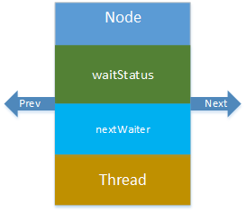

AQS—NODE
========

[toc]

源码总结
--------

Node结构简化为：




### waitStatus

- CANCELLED（1）：表示当前节点已取消调度。
- SIGNAL（-1）：等待触发状态，如果当前线程的前置节点状态为 SIGNAL，则表明当前线程需要阻塞。
- CONDITION（-2）：等待条件状态，表示当前节点在等待 condition，即在 condition 队列中。
- PROPAGATE（-3）：共享模式下，前驱节点不仅会唤醒其后继节点，同时也可能会唤醒后继的后继节点
- init（0）：新节点入队时的默认状态

**AQS运用该属性时的状态判断**

|     状态     |    判断结果    |                    说明                    |
| :----------: | :------------: | :----------------------------------------: |
| waitStatus=0 | 代表初始化状态 |           该节点尚未被初始化完成           |
| waitStatus>0 |    取消状态    | 说明该线程中断或者等待超时，需要移除该线程 |
| waitStatus<0 |    有效状态    |         该线程处于可以被唤醒的状态         |


源码阅读
--------

```java
static final class Node {
    static final Node SHARED = new Node();
    static final Node EXCLUSIVE = null;
    static final int CANCELLED =  1;
    static final int SIGNAL    = -1;
    static final int CONDITION = -2;
    volatile int waitStatus;
    volatile Node prev;
    volatile Node next;
    volatile Thread thread;
    Node nextWaiter;
    final boolean isShared() {
        return nextWaiter == SHARED;
    }
    final Node predecessor() throws NullPointerException {
        Node p = prev;
        if (p == null)
            throw new NullPointerException();
        else
            return p;
    }
    Node() {}
    Node(Thread thread, Node mode) {     // Used by addWaiter
        this.nextWaiter = mode;
        this.thread = thread;
    }
    Node(Thread thread, int waitStatus) { // Used by Condition
        this.waitStatus = waitStatus;
        this.thread = thread;
    }
}
```

