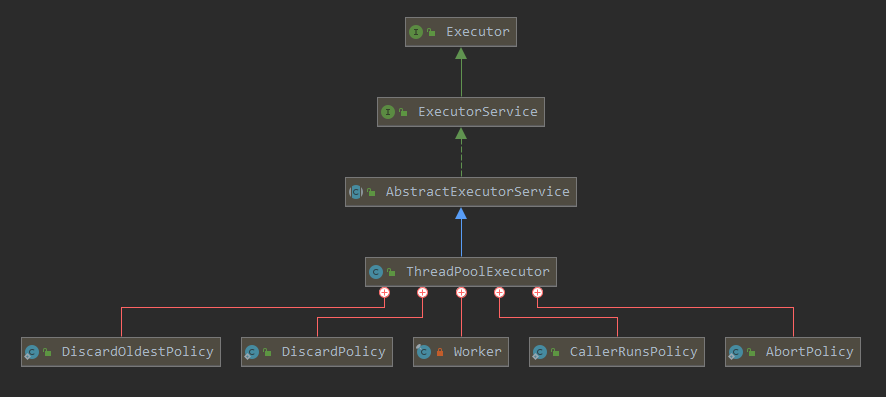
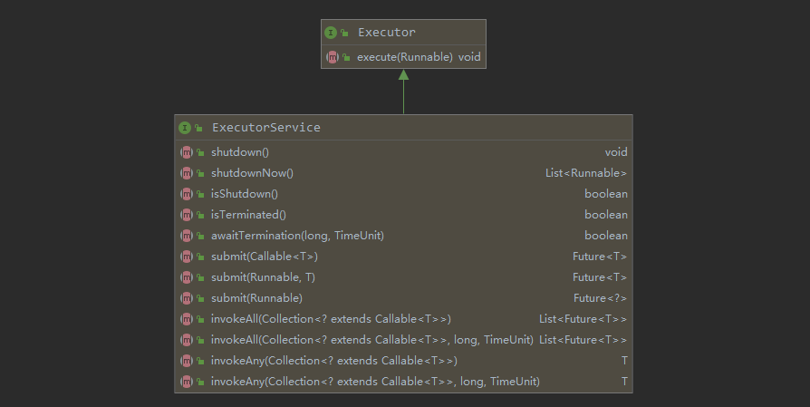
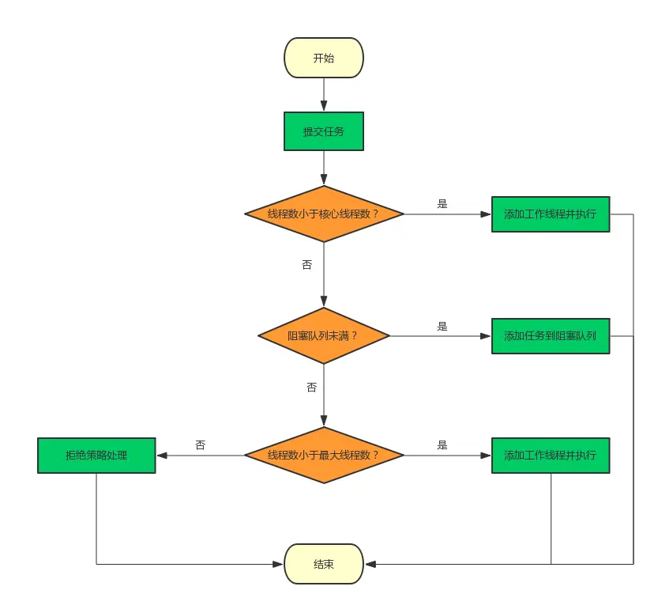
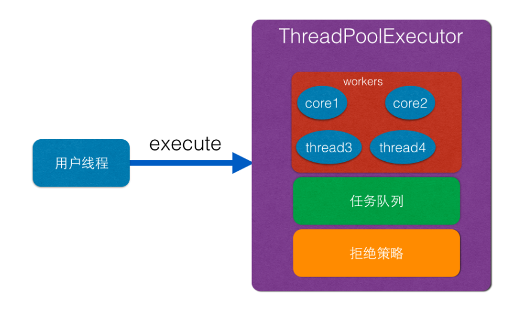
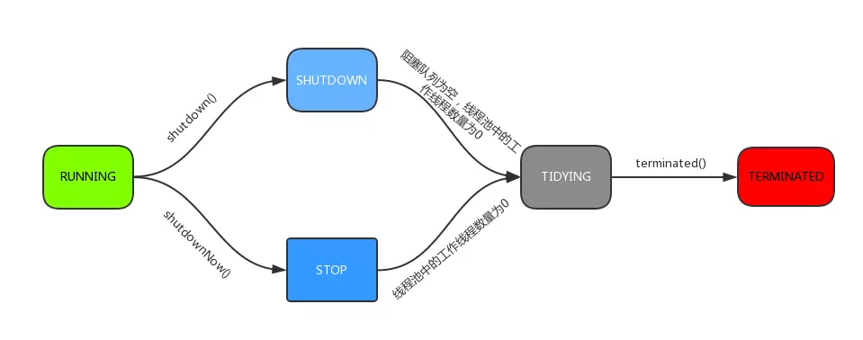
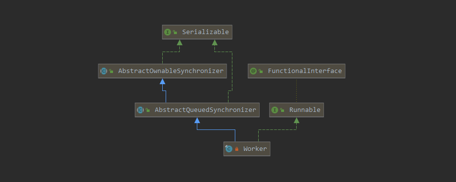
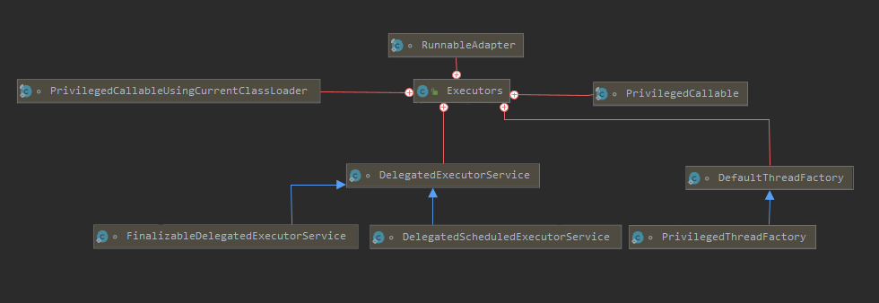

Excutor
=======

关键词：核心线程，拒绝策略，FutureRunable，CAS，Worker

线程池是将对任务与线程的维护转化为对线程池的维护。

带来的好处

- 线程重用，降低线程创建于销毁的系统消耗；
- 响应速度，当有任务到达时，无需等待新线程的创建便能立即执行；
- 避免线程过多的OOM情况，对任务管控、对线程管控，这是池化建立的目的。

问题：

- 将任务、线程以及线程与任务之间关系的管控，转化为线程池的管控。

  线程池状态与数量如管控？整形低29位为线程数量，高3位为线程状态，数量通过CAS(AtomicInterger)设置

- 动态化建立线程，线程数量范围限定

  如何建立与销毁线程？线程集合：HashSet\<Worker>，线程工厂(DefaultThreadFactory)

- 池化技术，池子的最大高度由线程的最大数量决定

  任务溢出怎么办？任务队列lBockingQueue\<Runnable> ，拒绝策略(AbortPolicy)

- 任务并行调度：ReentranLock，AQS

四种类别：

- newFixedThreadPool：固定线程池

  ```JAVA
  new ThreadPoolExecutor(nThreads, nThreads,0L, TimeUnit.MILLISECONDS,
          new LinkedBlockingQueue<Runnable>());
  ```

- newCachedThreadPool：缓存池

  ```JAVA
  new ThreadPoolExecutor(0, Integer.MAX_VALUE,60L, TimeUnit.SECONDS,
          new SynchronousQueue<Runnable>()
  ```

- newScheduledThreadPool：多用于定时任务

  ```java
  public static ScheduledExecutorService newScheduledThreadPool(int corePoolSize) {
      return new ScheduledThreadPoolExecutor(corePoolSize);
  }
  public ScheduledThreadPoolExecutor(int corePoolSize) {
      super(corePoolSize, Integer.MAX_VALUE, 0, NANOSECONDS,
            new DelayedWorkQueue());
  }
  ```

- newSingleThreadExecutor：相当于只是用了任务调度的能力

  ```java
  new ThreadPoolExecutor(1, 1,0L, TimeUnit.MILLISECONDS, 
                         new LinkedBlockingQueue<Runnable>())
  ```

  


ThreadPoolExecutor
----------------

### 构造函数

```java
public ThreadPoolExecutor(int corePoolSize, int maximumPoolSize,   // 线程构造范围
                          long keepAliveTime, TimeUnit unit,       // 非核心线程空闲存活时间
                          BlockingQueue<Runnable> workQueue, 	   // 任务存储队列
                          ThreadFactory threadFactory,		       // 线程制造工厂
                          RejectedExecutionHandler handler)        // 任务饱和，拒绝策略
{}
```


- 线程的数量为一个范围，减少线程的等待占用，分为核心线程和最大线程数量

  ==线程创建封装？==  threadFactory，默认是DefaultThreadFactory

  ==非核心线程空闲销毁时间？==   允许自定义当任务空闲，且线程数量大于核心线程时，线程最长等待销毁时间。

- 提供对线程池状态的管理：run、stop、shutdown、tidying、terminal

  ==状态如何维护状态？== ctl(AtomicInteger)进行设置

- RejectedExecutionHandler 默认是：AbortPolicy

-  Worker


### 层级结构



AbstractExecutor有五个内部类，四个是Policy类这个后面说。

AbstractExecutor主要是继承于AbstractExecutorSevice，ExecutorService主要是实现所规定的接口

看一下接口定义：



需要注意两点：

- 所有提交的任务都会被封装为：[FutureTask](1. FutureTask.md) 

- invokeAll ：执行所有任务

  处理逻辑：全部任务开启，全部任务结束等待，任务结果返回，操作抛出异常取消。

-  invokeAny：执行其中一个方法

  处理逻辑：任务顺序开启，任务执行成功返回，执行异常执行下一个，操作异常取消执行过的任务。


### execute()

AbstractExecutorSevice将任务添加已经实现了，ThreadPoolExecutor主要实现的是任务的执行、线程状态、任务状态、线程池状态的维护。

主要看一下execute()衍生出来的操作。



execute：

- 对添加的任务Runable，添加到BlockQueue中，处理溢出情况

- 根据线程数量方法，建立线程Worker，处理范围情况
- 最后开启线程，Worker实现了Runnable接口，在run方法中通过getTask方法获取任务。

两个情况：

- worker处于一直获取任务，完成任务的情况。
- worker一但空闲时间达到设置值且核心数量已满，则被销毁。



### 状态维护



```java
private final AtomicInteger ctl = new AtomicInteger(ctlOf(RUNNING, 0));
private static final int COUNT_BITS = Integer.SIZE - 3;
private static final int CAPACITY   = (1 << COUNT_BITS) - 1; // 左移29位,最大容量

// runState is stored in the high-order bits
private static final int RUNNING    = -1 << COUNT_BITS;
private static final int SHUTDOWN   =  0 << COUNT_BITS;
private static final int STOP       =  1 << COUNT_BITS;
private static final int TIDYING    =  2 << COUNT_BITS;// 过渡过程，线程和任务都为0
private static final int TERMINATED =  3 << COUNT_BITS;

// Packing and unpacking ctl
private static int runStateOf(int c)     { return c & ~CAPACITY; } // 获取运行状态
private static int workerCountOf(int c)  { return c & CAPACITY; } // 获取活动线程数
private static int ctlOf(int rs, int wc) { return rs | wc; }// 获取运行状态和活动线程数的值。
```

- ctl记录线程数量
- 32位整形：低29位表示线程数量，高3位保存线程池运行状态


### Worker与锁




Worker线程执行的相关方法：

```java
final Thread thread;
Runnable firstTask;
volatile long completedTasks;
Worker(Runnable firstTask) {
    setState(-1); // inhibit interrupts until runWorker
    this.firstTask = firstTask;
    this.thread = getThreadFactory().newThread(this);
}
public void run() { runWorker(this); }
```

主要是三个变量


### 四种拒绝策略

拒绝策略接口定义，在分析JDK自带的线程池拒绝策略前，先看下JDK定义的 拒绝策略接口，如下：

```javascript
public interface RejectedExecutionHandler {
    void rejectedExecution(Runnable r, ThreadPoolExecutor executor);
}
```

接口定义很明确，当触发拒绝策略时，线程池会调用你设置的具体的策略，将当前提交的任务以及线程池实例本身传递给你处理，具体作何处理，不同场景会有不同的考虑，下面看JDK为我们内置了哪些实现：

| 策略                | 说明                                       |
| :------------------ | :----------------------------------------- |
| CallerRunsPolicy    | 只用调用者所在线程来运行任务。             |
| AbortPolicy         | 直接抛出RejectedExecutionException异常。   |
| DiscardPolicy       | 丢弃掉该任务，不进行处理。                 |
| DiscardOldestPolicy | 丢弃队列里最近的一个任务，并执行当前任务。 |


Excutor
-------




阅读
----

[ThreadPoolExecutor源码解析](https://www.jianshu.com/p/a977ab6704d7) 

[ThreadPoolExecutor与ScheduledThreadPoolExecutor](https://blog.dreamtobe.cn/thread-pool/) 