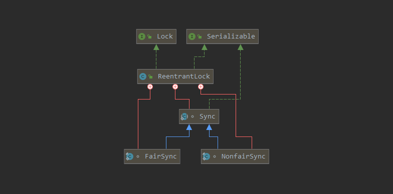
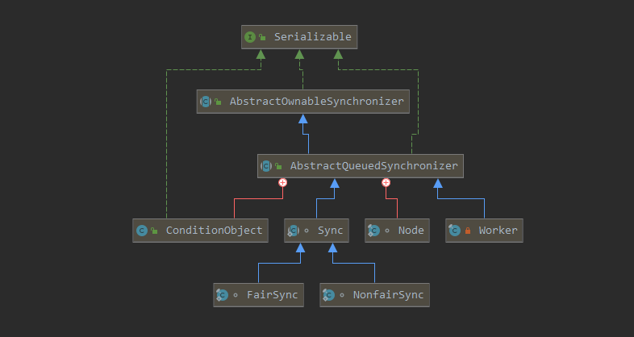

ReentrantLock
=============

描述：一个可重入的互斥锁(独占锁)，它具有与使用synchronized方法和语句所访问的隐式监视器锁相同的一些基本行为和语义，但功能更强大

问题：与synchronized的区别？

与synchronized的区别：

- 显式与隐式：

  reentrantlock更具有可控性，比如可以中断锁，锁获取状态。

  但有些善后操作同时需要自己做，比如释放锁。

- synchronized是非公平锁，ReentrantLock可以设置成公平锁。

- ReentrantLock子类可以实现读写锁分离，更高效。
-  一个ReentrantLock可以有多个Condition实例，所以更有扩展性

> 在java1.5中， 内置锁与ReentrantLock相比有例外一个优点：在线程转储中能给出在哪些调用帧中获得了哪些锁，并能够检测和识别发生死锁的线程。Reentrant的非块状特性任然意味着，获取锁的操作不能与特定的栈帧关联起来，而内置锁却可以。
>
> 因为内置锁时JVM的内置属性，所以未来更可能提升synchronized而不是ReentrantLock的性能。例如对线程封闭的锁对象消除优化，通过增加锁粒度来消除内置锁的同步。

实现：

- 可重入锁
- 公平与非公平锁
- Condition

**ReentrantLock用state表示“所有者线程已经重复获取该锁的次数”**

ReentrantLock结构图
-------------------



ReentrantLock内部实现了Sync，一个是公平锁，一个非公平锁

先说一下概念：

- 公平锁：线程的等待顺序或者说优先级作为，下次获取锁权值，会出现优先级高的一直占有锁
- 非公平锁：和等待顺序和优先级没有关系，谁抢到就是谁的，会出现每次都是同一个线程占有锁

看一下构造函数

```java
public ReentrantLock() {
    sync = new NonfairSync();
}
public ReentrantLock(boolean fair) {
    sync = fair ? new FairSync() : new NonfairSync();
}
```

说明：

- 默认是非公平锁
- 可自定义锁的公平性

这里先关注一下Sys的AQS的具体复写





阅读
----

[从ReentrantLock的实现看AQS的原理及应用](https://cloud.tencent.com/developer/news/492232) 

[JUC AQS ReentrantLock源码分析](https://www.bilibili.com/read/cv4020427/) 

[Java synchronized原理总结](https://zhuanlan.zhihu.com/p/29866981) 

