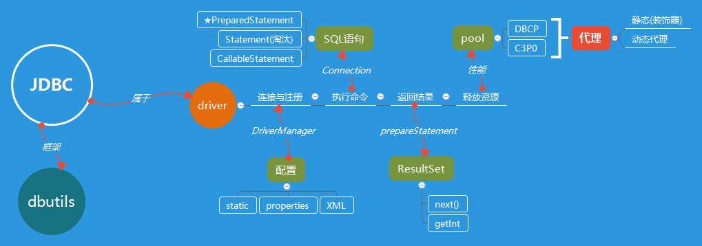
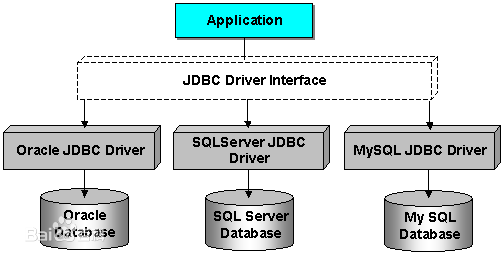

# JDBC

[TOC]

Java DataBase Connectivity

## 作用与目的

这也是jdbc作为驱动的特性

- 连接数据库
- 发送数据库操作命令
- 处理结果

## 层次

curd ： create update read delete

## 资料

内部结构：https://blog.csdn.net/luanlouis/article/details/30060755

自己搭建JDBC：https://www.cnblogs.com/jbelial/archive/2013/07/18/3199061.html

