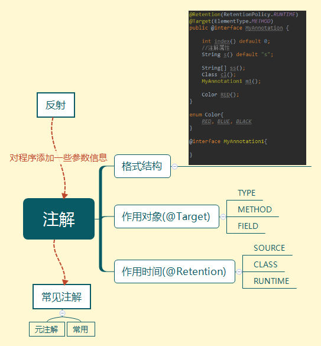

# annotation




[TOC]


## jdbc连接注解


### JdbcInfo注解

```java
@Retention(RetentionPolicy.RUNTIME)
@Target(ElementType.METHOD)
public @interface JdbcInfo {
	
	String driverClass() default "com.mysql.jdbc.Driver";
	String url();
	String user() default "root";
	String password() default "root";

}
```


### JdbcUtils 用来测试注解

```java
public class JdbcUtils {
	@JdbcInfo(url = "jdbc:mysql://localhost:3306/day16",password="1234")
	public static Connection getConnection() throws Exception{
		//1.获取字节码文件
		Class clazz=JdbcUtils.class;
		
		//2.获取getConnenction
		Method m = clazz.getMethod("getConnection");
		
		//3.判断该方法上是否有 jdbcinfo注解 若有的话获取
		if(m.isAnnotationPresent(JdbcInfo.class)){
			JdbcInfo info = m.getAnnotation(JdbcInfo.class);
			
			//4.获取注解四个属性
			String driverClass = info.driverClass();
			String url = info.url();
			String user = info.user();
			String password = info.password();
			
			//5.注册驱动
			Class.forName(driverClass);
			
			//6.获取连接
			return DriverManager.getConnection(url, user, password);
		}
		
		return null;
	}
	
	public static void main(String[] args) throws Exception {
		System.out.println(getConnection());;
	}
}

```

