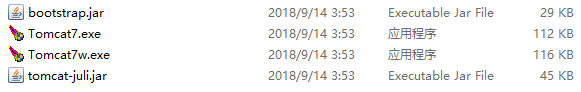

# jsp中Tomcat的配置

[TOC]

#### Tomcat 的启动 ——7.0 win版本

在安装路径 tomacat7.0/bin 可以看到



tomcat7.exe点击启动， Tomcat7w.exe  用来启动Tomcat服务

有的教程在 bin/ 有startapp.bat 文件， 点击启动


#### Tomcat配置

在tomcat7.0/config/server.xml 可以修改默认配置

```xml
    <!--默认的web的访问端口-->
    <Connector port="8080" protocol="HTTP/1.1"
               connectionTimeout="20000"
               redirectPort="8443" />
    <!--默认的启动的引擎-->
    <Engine name="Catalina" defaultHost="localhost">
```

1. port 指的是当前访问服务器的端口号，默认是8080， 我们可以用 http://127.0.0.1:8080 来访问， 同时可以用http://localhost:8080 , http://本机的ip:8080(win 用ipcofig 查看);

   在同一个局域网下，我们可以用手机  在浏览器中访问http://电脑的ip:8080

2. protocol 协议是 HTTP/1.1

   在server.xml 中我们可以看到这样的一个代码

   ```xml
    <Connector port="8009" protocol="AJP/1.3" redirectPort="8443" />
   ```

   protocol="AJP/1.3" 使用Apache JServ Protocol

   >AJP是定向包协议。因为性能原因，使用[二进制](https://baike.baidu.com/item/%E4%BA%8C%E8%BF%9B%E5%88%B6/361457)格式来传输可读性文本。[*WEB*服务器](https://baike.baidu.com/item/WEB%E6%9C%8D%E5%8A%A1%E5%99%A8/8390210)通过[*TCP*](https://baike.baidu.com/item/TCP/33012)连接和[*SERVLET*](https://baike.baidu.com/item/SERVLET/477555)容器连接。为了减少进程生成socket的花费，WEB服务器和SERVLET容器之间尝试保持持久性的TCP连接，对多个请求/回复循环重用一个连接。一旦连接分配给一个特定的请求，在请求处理循环结束之前不会再分配。换句话说，在连接上，请求不是多元的。这个使连接两端的编码变得容易，虽然这导致在一时刻会有很多连接。

3. connectionTimeout： 连接超时时间是20000毫秒

4. [ redirectPort解释](https://www.jb51.net/article/146819.htm)


#### server.xml 节点分析--未完善