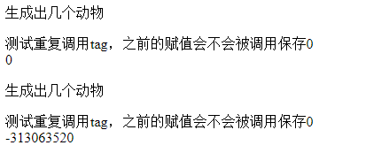

# Tag知识解析


[TOC]

------


#### tag 文件的结构

必须有标识：

```jsp
<%@ tag pageEncoding="gb2312" %>
```


#### tag 文件的存储目录

问了实现 jsp 的代码复用，我们单独建立一个tag类型的文件，进行复用；

储存位置 ：`项目名\WEB-INF\tags`

必须以 ANSI 编码保存


#### tag 标记 与 使用

```jsp
<%@ taglib tagdir="tag目录的相对路径" prefix="前缀" %>

<!--body-content--> 
<Tag的前缀: tag文件的名字 />

<Tag的前缀: tag文件的名字 >
    标记体
</Tag的前缀: tag文件的名字 >
```


jsp文件目录：`Tomcat 7.0\webapps\ROOT\second`

```jsp
<%@ page contentType="text/html, charset=GB2312" language="java" %>
<%@ taglib tagdir="/WEB-INF/tags" prefix="animal" %>
<!DOCTYPE html>
<html>
<head>
	<title>tag test</title>
</head>
<body>
	<animal:AddSum/>
    <animal:AddSum/>
</body>
</html>
```

tag 文件目录： `Tomcat 7.0\webapps\ROOT\second\WEB-INF\tags`

```jsp
<%@ tag pageEncoding="GB2312" import="java.util.*" %>
<p>生成出几个动物</p>
<%
	int sum = 0;
	int j = new Random().nextInt();
	for (int i = 0; i < j; i++){
		sum += i;
	}
	int testCommon = 0;
	testCommon += testCommon;
	out.println("测试重复调用tag，之前的赋值会不会被调用保存:   " + testCommon);
	out.print("<br/>");
	out.println(sum);
%>
```

实验结果：




**说明tag里面的变量都是局部变量, 每当tag 文件执行完之后都会释放所占用的内存空间**


#### tag标记的标记体

```jsp
<Tag的前缀: tag文件的名字 >
    标记体
</Tag的前缀: tag文件的名字 >

<!--tag中标记体的传入-->
<jsp: doBody/>
```

<jsp: doBody/> 在tag 文件中使用

```jsp
<!--jsp文件中-->
<%@ taglib tagdir="/WEB-INF/tags" prefix="animal" %>
<animal:AddSum>
        hello
</animal:AddSum>

<!--tag文件中-->
<%
	int j = new Random().nextInt();
%>
<font size=<%=j %>>
    <jsp:doBody/>
</font>
```


#### tag 文件中的常用指令

<table>
    <tr>
        <td>tag指令</td>
        <td>include</td>
        <td>attribute</td>
        <td>variable</td>
        <td>taglib</td>
    </tr>
</table>

##### tag指令

- body-content：

  empty，tagdependent（标记体按照纯文本处理）、**scriptless**(标记体不能有代码片，默认是这个)

- language：java

- pageEncoding: 默认是ISO-8859-1，单字节编码，向下兼容ASCII

- import：导入要用的java包


##### include

与jsp的用法及其作用一样


##### attribute

```jsp
<!-- jsp 文件中的代码-->
<前缀:Tag文件的名字 参数的名字="参数的值" 参数的名字="参数的值" />
<前缀:Tag文件的名字 参数的名字="参数的值" 参数的名字="参数的值" >
    标记体
</前缀:Tag文件的名字>

<!--tag 文件中对参数的限定-->
<%@ attribute name="参数的名字" required="true" | "false" type="对象的类型" %>
```

type  指定参数的类型，必须以完整的包名，默认为java.lang.string， required默认是false


##### variable

用来传递，tag 文件的**返回值**，tag 文件有点类似于函数，

上面 attribute 的用来**传值设置形参**

```jsp
<!--tag 文件设置返回的对象 -->
<%@ variable name-given="返回的对象名字" variable-class="对象类型的限制" scope="生命周期" %>
<%
	jspContext.setAttribute("返回对象的名字"， 返回对象);
%>

<!--jsp 文件获取对象 -->
直接用 返回的对象名字 调用方法
```

- variable-class 必须是完整的包名
- scope
  1. AT_BEGIN：一但初始化tag标记就可以使用variable中给出的对象
  2. NESTED：只可以在tag文件的标记体中使用
  3. AT_END：只有在tag标记结束后使用

例子

```

```


#### taglib

jsp页面可以嵌入tag，进行传参操作，tag中也可以

```jsp
<%@ taglib taglib="tag 文件的相对目录 " prefix="前缀" %>
```


